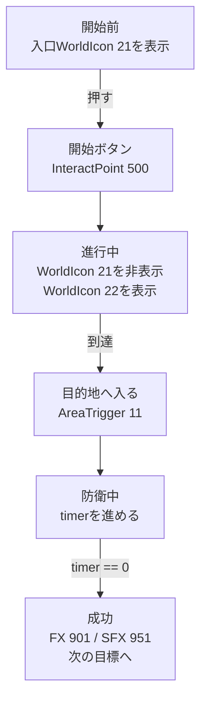

第4章でマップ上に置いたオブジェクトには、 **設置位置** と **呼び出すための住所（ID）** を付けました。けれど、 **誰が合図を出し、どの住所に、どんな用事を伝えるかは、まだ決まっていません。**
本章では、TypeScriptへ移す前に、 **合図 → 宛先（ID） → 反応を一本の道として設計する** 考え方を整理します。これさえ通れば、あなたのマップは「ただ置かれた模型」から、「プレイヤーが反応してくれる遊び」に変わります。

ここでは、ブロック式のビジュアルプログラミングやエディタ操作を詳しく扱うのではなく、後のTypeScript実装にそのまま写せる形で、イベント、ID、反応の関係を決めていきます。

## 合図 → 宛先 → 反応（言い換え）

* 合図：押した／入った／時間になった
* 宛先：InteractPoint 500、WorldIcon 21、AreaTrigger 11…（IDで指名）
* 反応：表示する／隠す／光らせる／鳴らす／湧かせる

合図とは、「イベントの受信」を指します。例えば、「Aという空間に入った」「100ポイントに達した」というものがあります。
宛先とは、「合図」に対して「何を動かすのか」という情報を決定したものです。
そして、反応とは、「宛先」に何をさせるのか？を決めます。

第5章は、第4章のIDに“行動”を通すための設計作業となります。

## まず表で整理する

コードを書く前に、最低限この表を埋めておくと迷いにくくなります。
ここで決めるのは、難しいロジックではありません。
「何が起きたら」「何を対象に」「何をするか」です。

| 合図 | 宛先 | 反応 | 確認方法 |
| ---- | ---- | ---- | ---- |
| InteractPoint 500 を押す | WorldIcon 21 / 22 | 入口を消し、目的地を出す | 押した直後に目印が変わる |
| AreaTrigger 11 に入る | FX 901 / SFX 951 | 光と音を出す | 到達時だけ鳴る |
| 防衛時間が0になる | Score / 次のWorldIcon | 成功扱いにして次へ進める | 2回発火しない |

流れだけを見ると、次のようになります。

この表と流れが説明できれば、第6章以降のコードは「この設計をTypeScriptへ写す作業」になります。
逆に、ここが曖昧なままコードを書くと、IDや条件が増えた瞬間に迷子になります。

# 1　5分で作る「最初の成功体験」

目標はシンプルです。
**「開始ボタン（InteractPoint 500）を押す → 目印（WorldIcon 21→22）が前へ進む → 目的地（AreaTrigger 11）に入ると、光（FX 901）と音（SFX 951）が出る」という形** にします。

## 手順

### 1. 初期状態を決める（ゲーム開始時）

* 初期位置のWorldIcon (ID:21) → 表示
* 目的位置のWorldIcon (ID:22) → 非表示

としておきます。最初に向かわせたいのは“入口手前（21）”だからです。

### 2. 開始ボタンを起点にする

イベント「InteractPoint を押した」を選び、対象IDに 500 を入れます。

反応として、

* メッセージ「作戦開始」を数秒だけ画面に出す
* 初期位置のWorldIcon (ID:21) → 非表示
* 目的位置のWorldIcon (ID:22) → 表示

を並べます。 **これで“押すと始まる”が見えます。**
WorldIconを目標先のものを表示させるように変更すると、プレイヤーは一目でどこに向かったらよいのか分かるようになります。

### 3. 目的地で演出を出す

イベント「AreaTrigger(ID:11) に入ったら」が発生したら、反応として、

* FX 901 を再生
* SFX 951 を再生

をつなぎます。ループ型の効果なら、同じく「AreaTrigger から出た」で停止も作っておくと便利です。

## 動かない時の見どころ

* IDの打ち間違い（500/21/22/11/901/951）
* WorldIcon の「表示／非表示」の入れ替え順（21を消して22を出す）
* オブジェクトの高さ（Y）不足で判定をすり抜けていないか

結論：押す→目印が前へ→着いたら光と音、まで動けば合格です。
次は、この芯を崩さず、「集合させる」「車両を出す」「AIを動かす」「時間で締める」を足していきます。

# 2　目的別レシピ：よく使う拡張はこの順で
## A. 集合させる（開始ボタンの直後）

> 「押したら、みんなを集合地点へ」。

方法は二つあります。

* リスポーンを使う：各チームの SpawnPoint（例：1001/1002）へ呼び戻す
* テレポートを使う：座標へ移動させる（演出は急、実装は速い）

どちらも InteractPoint ID:500 の直後に入れるのが分かりやすいです。

## B. 車両を出す（補給や演出の節目に）

VehicleSpawner のIDを、 **常設（2001）／イベント（2090台）** で分けてある前提で、

* 500の押下時に輸送車（ID:2001）を有効化／再出現
* 目的地到達（AreaTrigger ID:11）で戦車（ID:2090）を再出現

と結ぶだけで、遊びのリズムが生まれます。

## C. AIを湧かせ、進ませる

* 押下（InteractPoint ID:500）や侵入（AreaTrigger ID:11）を合図に AI_Spawner を起動。

## D. 時間で締める（10秒防衛 → 成功で次へ）

到達のあとにカウントダウンを置くと、ドラマが出ます。

* AreaTrigger(ID:11)に入ったらカウント「10」から表示を開始
* 1秒ごとにUI更新
* カウント0で **FX切替** ／ **WorldIconを次へ** ／ **スコア加算** ／ **フェーズフラグON**

多重発火を防ぐため、「防衛中」フラグを最初に立て、終わったら下ろすのがコツです。

拡張は「合図を増やす」「宛先を増やす」「反応を一つ足す」だけ。芯（押す→誘導→到達→演出）を崩さなければ、破綻しません。

**次は、表示と演出の順番を整え、“分かる→気持ちいい”の流れを作ります。**

# 3　表示と演出：順番を守るだけで伝わる

プレイヤーは、 **言葉→目印→音と光の順だと理解が速い** です。

1. 先に短い言葉で「次に何をしてほしいか」を出す。
2. つづけて WorldIcon を切り替えて矢印を前へ。
3. 成功時に FX(エフェクト)／SFX(音) を重ねる。

**逆順（いきなり光と音）だと、驚きはあるのに理由が伝わりません。** UIは基本“個別表示”、演出は“全体共有”と覚えておくと、スコープの取り違えも起きにくくなります。

**結論：ことば→目印→効果。たったこれだけで、プレイヤーの迷子が減ります。**
次は、最後に、止まったときの直し方と完成チェックをまとめます。

# 4　止まったら：直し方の型（3手で特定）

1. 単純化：押下→メッセージだけに戻す。動けば次へ。
2. 段戻し：WorldIcon の切替を戻す → それが通れば FX／SFX を戻す。
3. 見える化：フラグやカウントを小さくUI表示。分岐を通ったかを目で確認。

最後にもう一度、IDが -1 ではないか／同種で重複していないかを見ます。9割はここです。

**結論：単純化→段戻し→見える化で、必ず原因に辿りつけます。**
次は、最小ループが確実に動くか、短いチェックで締めます。

# 5　完成チェック（最小ループ）

* 押したら始まる（InteractPoint ID:500 が起点になっている）
* 目印が前へ進む（WorldIcon ID:21→ID:22 の順で切替）
* 着いたら光と音（AreaTrigger ID:11 で FX ID:901 / SFX ID:951 が出る）

ここまで安定したら、第5章の目的は達成です。次の章では、同じ考え方をTypeScriptに写して、再利用できる部品化へ進みます。

結論：第5章は“最初の成功体験”を保証するための章です。ここで芯が通れば、以降は足し算です。

---

📘 **次章「スクリプトで創る『自分だけのモード』」** では、文章で書いた「合図→宛先→反応」をプログラミングコードのイベント／関数／状態に置き換え、Portal SDKの `index.d.ts` に沿って `WorldIcon`・`FX`/`SFX`・`Spawner`・カウントを部品として実装します。
