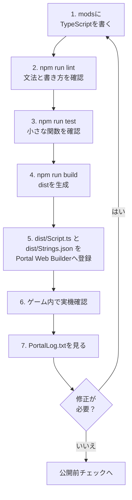

:::message alert

この章のコードは、Portal SDKのTypeScript APIを理解するための最小例です。実際に公開する前に、ローカルホストと実機プレイで必ず動作確認してください。

:::

:::message alert
ここからTypeScriptを使ったプログラミングが入りますが、プログラム中に **絶対に日本語を入れない** でください。
2025年11月1日時点では、PortalのScript機能は、日本語などのマルチバイト文字に対応していません。アルファベット・数字・一部の記号のみを使用してください。

本書では、コードのコメントアウトを使った説明に日本語の文を入れていません。本文の方をよく読んでご確認ください。
:::

# 0　スクリプトで創る「自分だけのモード」

> ―― 第4章（置く）と第5章（結ぶ）を、「書いて動かす」に写し替える

第4章でマップに必要なものを置き、 **ID（住所）** をつけました。
第5章で、合図→宛先（ID）→反応の流れを設計しました。

この章では、同じことを **コード（TypeScript）** でやります。理由は3つあります。

1. 大きくしても壊れにくい：
  Portal Web Builderへ直接書く方法は早く作れますが、複雑になると「どこが何をしているのか」が見えづらくなります。コードなら、名前と行で探しやすく、直しやすいです。

2. 同じ処理を何度も使い回せる：
  「アイコンの表示切替」「効果音を鳴らす」など、よく使う処理に名前をつけて部品化できます。

3. ミスに先回りできる：
  数値の打ち間違い（ID）、同じイベントが何度も発生する問題などを、最初から防ぐ仕組みを入れられます。

> 難しそうに見えるかもしれませんが、やることは第5章のままです。
> 「押した → 目印を前へ → 着いたら光と音」――これをまずコードで再現します。

# 0.1　コード章の読み方

第6章から第8章は、急にコード量が増えます。
最初から全部を理解しようとしなくて大丈夫です。
まずは「どのファイルを触ると、何が変わるのか」だけ掴んでください。

| まず触る場所 | 役割 | 最初にできれば十分なこと |
| ---- | ---- | ---- |
| `ids.ts` / `OBJECT_ID` | Godotで付けたObjIdをコードへ写す | `-1` や重複を残さない |
| `config.ts` | 秒数、距離、クールダウンなどの調整値 | 防衛秒や推奨人数を変えられる |
| `Strings.json` | 画面に出す文字の登録 | 表示したい文言を事前に用意する |
| `Script.ts` | Portalから呼ばれる入口 | イベント関数の場所だけ分かる |
| `PortalLog.txt` | 動作確認ログ | イベントが発火したか確認する |

コード本文は、最初は呪文に見えても構いません。
読む順番は、`ids.ts` で住所を見る、`config.ts` で数値を見る、`Strings.json` で表示文を見る、最後に `Script.ts` で流れを見る、です。
細かい関数の意味は、動いたあとで戻って読めば十分です。

# 0.5　`index.d.ts` を辞書として読む

Portal SDKのTypeScript APIは、SDK内の `code/types/mod/index.d.ts` にまとまっています。

このファイルにある `mod` namespaceが、Portalスクリプトから呼び出す関数と型の辞書です。分からない関数が出てきたら、まずこのファイルで検索してください。

| 見るもの | 意味 | 例 |
| ---- | ---- | ---- |
| `declare namespace mod` | Portal APIの置き場所 | `mod.Wait(...)` |
| opaque型 | Portal側の実体を直接触らせない型 | `mod.Player`, `mod.WorldIcon` |
| `export function On...` | イベントの入口 | `OnPlayerInteract` |
| `GetObjId` | Godot上のObjIdを読む | 押されたInteractPointのID確認 |
| `RuntimeSpawn_...` | `SpawnObject` で生成できるPrefab候補 | `mod.RuntimeSpawn_Common.AreaTrigger` |
| `Message` | 表示用文字列を作る | `mod.Message(mod.stringkeys.hello)` |
| `CreateVector` | 座標や色などの3要素を作る | `mod.CreateVector(1, 2, 3)` |

opaque型は、「中身を直接いじる箱」ではなく、「Portal側にある実体を指す札」だと思ってください。たとえば `mod.Player` を受け取ったら、そのままプロパティを見るのではなく、`mod.GetTeam(player)` や `mod.GetSoldierState(player, ...)` のようなAPIで情報を取り出します。

`RuntimeSpawn_Common` や `RuntimeSpawn_Abbasid` のような enum は、Godotで手置きするObject Libraryの説明ではなく、TypeScriptから `mod.SpawnObject(...)` で生成できる候補です。
手置きした配置物は `GetInteractPoint(500)` のように `ObjId` で拾い、コードから生成した配置物は `SpawnObject` の戻り値を変数に持って扱う、という違いを意識してください。

# 0.6　TypeScript初学者向けの読み替え表

| コード | 初学者向けの意味 |
| ---- | ---- |
| `export function On...` | Portalから呼ばれるイベントの入口 |
| `async function` | `await mod.Wait(...)` のように待てる関数 |
| `mod.Wait(1)` | 1秒待つ |
| `mod.GetXxx(id)` | GodotでObjIdを付けた配置物を取得する |
| `mod.GetObjId(obj)` | 受け取った配置物のObjIdを確認する |
| `mod.Message(...)` | 画面表示に使うメッセージを作る |
| `mod.CreateVector(x, y, z)` | 座標、向き、色などに使う3つの数値を作る |
| `const OBJECT_ID = ...` | ObjId台帳をコード側に写したもの |

コードを読むときは、英語の文として読む必要はありません。イベント、取得、待機、表示、状態更新のどれなのかを見分ければ十分です。

# 0.7　テンプレートを使った開発ループ

この章のコードは、テンプレートリポジトリの `mods` フォルダに書く前提で進めます。

Portal Web Builderに直接貼り付けながら書くのではなく、手元では次の流れで開発します。

1. `mods` 配下にTypeScriptを書く。
2. `npm run lint` で文法や書き方を確認する。
3. `npm run test` でテストできる部品を確認する。
4. `npm run build` で `dist/Script.ts` にまとめる。
5. `dist/Script.ts` と `dist/Strings.json` をPortal Web Builderに登録する。
6. ゲーム内で実機確認し、`PortalLog.txt` を見る。



このループの入口は `mods`、出口はPortal Web Builderです。
`mods` に分けて書いたコードは、`npm run build` によってPortalへ渡せる1つの `dist/Script.ts` にまとまります。
画面に表示する文字を使う場合は、`Strings.json` も一緒に確認してください。

ゲーム内で動かしたあとに見るべきものは、成功した画面だけではありません。
意図したイベントが発火したか、同じ処理が何度も走っていないか、変数やObjIdが想定どおりかを `PortalLog.txt` で確認します。
問題があればPortal上で直接直すのではなく、`mods` の元コードに戻って修正し、もう一度 `lint`、`test`、`build`、登録、実機確認の順に回します。

つまり、基本の戻り先は常に `mods` です。
Portal Web Builderは最終確認とアップロードの場所、`mods` は設計と修正の場所、と分けて考えると迷いません。

最初は `mods/Script.ts` だけで構いません。慣れてきたら、第7章のように `mods/ids.ts`、`mods/ui.ts`、`mods/game.ts` へ分けます。分けても、`npm run build` が最後に1つの `dist/Script.ts` へまとめてくれます。

## コマンドの使い分け

| タイミング | 実行するコマンド |
| ---- | ---- |
| コードを書いた直後 | `npm run lint` |
| 自動修正したい | `npm run lint:fix` |
| 関数の挙動を確認したい | `npm run test` |
| Portalに登録する前 | `npm run build` |

`npm run build` は「正しいか」を保証するコマンドではありません。複数ファイルを1つにまとめるコマンドです。公開前は必ず `lint`、`test`、`build` の順に通してください。横着すると、あとで見事に転びます。

## VitestでIDと小さな関数をテストする

Portalの全挙動を手元のテストだけで再現する必要はありません。Vitestでは、まず **自分で書いた小さな関数** を確認します。
`npm run test` はIDを追加した直後、条件関数を直した直後、Portalへ登録する前に実行してください。

たとえば次のようなものです。

* `ids.ts` に `-1` が混ざっていないか。
* 同じ分類内でIDが重複していないか。
* `IP_START`、`AREA_TARGET`、`ICON_TARGET` など必須IDが存在するか。
* `isStartInteract()` が開始できる条件だけで `true` になるか。
* `ConditionState` で同じイベントを2回通さないガードが効くか。
* ObjIdから処理を分岐する関数が、想定した分岐に入るか。
* メッセージ生成関数が、正しいキーと引数を渡すか。

テンプレートには `vitest` と `bfportal-vitest-mock` が入っています。`test/sample.test.ts` では、`setupBfPortalMock` でPortal APIの代わりを用意し、`DisplayNotificationMessage` が呼ばれたかを確認しています。

IDチェックは `test/ids.test.ts` のようなテストファイルを作り、`ids.ts` から定数を読み込んで確認します。
Vitestで確認できるのは「コード側に書いたID定義」です。Godot上に本当に同じIDを持つオブジェクトが置かれているかまでは保証できません。
そのため、Godot側の実配置は第4章の台帳やObjIdManagerで確認します。Vitestはコード側、ObjIdManagerはGodot側。ここを分けて考えると、確認漏れが減ります。

テスト対象にしやすいように、ゲーム本体の処理はなるべく関数に分けてください。イベント関数の中に全部を書くと、テストは一気に面倒になります。

# 1　最初の準備：IDに名前を付ける（ここが一番大事）

IDは数字のままだと、わかりにくいです。
たとえば 21 と書かれていても、「入口のアイコン」なのか「目的地のアイコン」なのか、一瞬で思い出せません。そこで、IDに名前をつけてあげます（定数化）。

### どう書く？
```ts
const OBJECT_ID = {
	// Team
	TEAM_A: 1,
	TEAM_B: 2,

	// WorldIcon
	ICON_ENTRANCE: 21,
	ICON_TARGET: 22,

	// InteractPoint
	IP_START: 500, // Start Button

	// AreaTrigger
	AREA_TARGET: 11, // destination

	// VFX
	VFX_GOAL: 901,
	// SFX
	SFX_GOAL: 951,

	// Team SpawnPoint
	SP_TEAM_A: 99,
	SP_TEAM_B: 99,
};
```

### なぜ必要？
* 読むだけで意味が分かるようになります。
* 打ち間違いが減る（21 と 22 を入れ替える事故が消える）。
* 後でIDを変えても、上の1行を直すだけで全体が直る。

### つまずき対策
* ここで **-1（未設定）** が紛れていないか、必ず見直してください。
* 同じ種類で重複していないかもチェック。
* 迷ったら第4章の台帳を横に置き、1つずつ声に出して確認しましょう。

# 2　“今どこ？”を覚えておく（状態の箱）

ゲーム進行には「はじまる前」「始まった」「着いた」などの段階があります。
これをコードでも覚えておくと、同じイベントを何度も通る事故を防げます。

## どう書く？

本書では、進捗管理や多重発火防止には `modlib.ConditionState` を優先して使います。

`type Phase = "Idle" | "Started"` のように段階名を持つ方法もありますが、Portalでは「条件が成立した瞬間に1回だけ処理したい」場面がとても多いです。
`ConditionState` は、その用途にちょうど合っています。

`ConditionState` は、前回の条件結果と今回の条件結果を覚えて比較します。
前回が `false`、今回が `true` になった瞬間だけ `true` を返し、それ以外は `false` を返します。

| 前回 | 今回 | `update()` の戻り値 | 意味 |
| ---- | ---- | ---- | ---- |
| `false` | `false` | `false` | まだ条件を満たしていない |
| `false` | `true` | `true` | 条件を満たした瞬間。ここだけ処理する |
| `true` | `true` | `false` | 条件は続いているが、二重実行しない |
| `true` | `false` | `false` | 条件が解除された。次の成立に備える |

つまり、`ConditionState` は「条件が成立している間ずっと処理する道具」ではなく、 **条件が成立した瞬間だけ処理する道具** です。
開始通知、到達判定、人数が揃った瞬間、カウント開始など多重発火すると困る場所で使います。

```ts
import * as modlib from "modlib";

const enoughPlayersState = new modlib.ConditionState();

/**
 * Returns true when the game can start.
 */
function hasEnoughPlayersToStart(): boolean {
	return mod.CountOf(mod.AllPlayers()) >= 2;
}

export function OngoingGlobal(): void {
	if (enoughPlayersState.update(hasEnoughPlayersToStart())) {
		modlib.ShowNotificationMessage(mod.Message(mod.stringkeys.ready));
	}
}
```

ポイントは、`state.update(mod.CountOf(mod.AllPlayers()) >= 2)` と直接書かないことです。
条件式を `hasEnoughPlayersToStart()` のような関数に分けると、英語が苦手でも「何を見ている条件か」が読みやすくなります。

## 何に使う？

* 「プレイヤーが2人以上になった瞬間だけ通知したい」 → `ConditionState` で1回だけ通す

* 「開始ボタンを2回押されたら困る」 → `isStartInteract()` を `ConditionState` に通す

* 「到着後に、もう一度“到着した”を通したら困る」 → `isTargetReached()` を `ConditionState` に通す

## つまずき対策

* 条件式は、必ず `has...` / `is...` / `can...` で始まる関数に分ける。
* `ConditionState` は条件ごとに1つ用意する。開始用と到着用を同じインスタンスにしない。
* デバッグ時は、条件関数の戻り値を `console.log` に出すと原因を追いやすいです。

# 3　はじめてのコード実行（「押す→目印→到着→光と音」を写す）

まずは第5章の最小ループを、そのままコードにします。
ここでは「書き方」よりも **“並び順と理由”** を大切にします。

## 3.0 最初に...

ファイルの一番上に、下記のようにコードを書いてください。
これは、公式がデフォルトで用意しているSDKを簡単に使えるようにするためのパッケージ(プログラム群)です。

```ts
import * as modlib from "modlib";
```

本書では、使える場面では `modlib` を優先して使います。
`modlib` は通知表示、チームID取得、Portal配列の変換、条件の一度だけ発火、UI生成などを扱いやすくする補助ライブラリです。
`modlib` にない処理や、Portal APIを細かく直接制御したい処理だけ `mod` を使います。
詳しくは付録C「modlib解説」を参照してください。

## 3.1 ゲーム開始時の初期化

「入口のアイコンを見せる」「目的地のアイコンは隠す」。“最初の姿勢”をはっきりさせます。

下記のコードでは、WorldIconの表示・非表示を行っています。

* VisibleWorldIcon関数は、アイコンの表示・非表示を行える関数です。
* SDKが提供しているmod.EnableWorldIconImageとmod.EnableWorldIconTextを呼び出すことで、WorldIconのアイコン・テキストの表示を切り替えています。
* ゲーム開始を示す、SDKのOnGameModeStartedイベントを引っかけて、 **「ゲームモードが始まったら、"現在のゲーム状態の設定"と"アイコンを表示/非表示"をする」** を行っています。

```ts
/**
 * Show/hide icons
 * @param id ObjectId
 * @param visible Show=true
 */
function VisibleWorldIcon(id: number, visible = true) {
	const icon = mod.GetWorldIcon(id);
	mod.EnableWorldIconImage(icon, visible);
	mod.EnableWorldIconText(icon, visible);
}

const startInteractState = new modlib.ConditionState();
const targetReachedState = new modlib.ConditionState();

let gameStarted = false;
let targetReached = false;

/**
 * Reset game progress flags.
 */
function resetGameProgress(): void {
	gameStarted = false;
	targetReached = false;
}

/**
 * Returns true when the start interact point can start the game.
 */
function isStartInteract(objectId: number): boolean {
	return !gameStarted && objectId === OBJECT_ID.IP_START;
}

/**
 * Returns true when the target area can complete the route.
 */
function isTargetReached(objectId: number): boolean {
	return gameStarted && !targetReached && objectId === OBJECT_ID.AREA_TARGET;
}

/**
 * Mark the game as started.
 */
function markGameStarted(): void {
	gameStarted = true;
}

/**
 * Mark the target as reached.
 */
function markTargetReached(): void {
	targetReached = true;
}

/**
 * Event: This will trigger at the start of the gamemode.
 */
export function OnGameModeStarted() {
	resetGameProgress();

	VisibleWorldIcon(OBJECT_ID.ICON_ENTRANCE, true);
	VisibleWorldIcon(OBJECT_ID.ICON_TARGET, false);
}
```


## 3.2 開始ボタンを“起点”にする

押したら、（1）短いメッセージ →（2）アイコン切替。
プレイヤーは「言葉 → 目印 → 効果」の順が理解しやすいです。

```ts
/**
 * Event: This will trigger when a Player interacts with InteractPoint.
 */
export async function OnPlayerInteract(eventPlayer: mod.Player, eventInteractPoint: mod.InteractPoint) {
	const eventObjectId = mod.GetObjId(eventInteractPoint);

	if (startInteractState.update(isStartInteract(eventObjectId))) {
		markGameStarted();

		// OFF IP
		mod.EnableInteractPoint(eventInteractPoint, false);

		// Message (All Player)
		modlib.ShowEventGameModeMessage(mod.Message(mod.stringkeys.start));

		await mod.Wait(0.5);

		// Change Icon
		VisibleWorldIcon(OBJECT_ID.ICON_ENTRANCE, false);
		VisibleWorldIcon(OBJECT_ID.ICON_TARGET, true);
	}
}
```

## 3.3 目的地へ入ったら、演出を出す

到着の合図は AreaTrigger。
入った瞬間に、 **光（FX）と音（SFX）** を鳴らします。

```ts
/**
 * Event: This will trigger when a Player enters an AreaTrigger.
 */
export function OnPlayerEnterAreaTrigger(eventPlayer: mod.Player, eventAreaTrigger: mod.AreaTrigger) {
	const eventObjectId = mod.GetObjId(eventAreaTrigger);

	if (targetReachedState.update(isTargetReached(eventObjectId))) {
		markTargetReached();

		// OFF Target
		VisibleWorldIcon(OBJECT_ID.ICON_TARGET, false);

		// RUN Sound
		mod.PlaySound(OBJECT_ID.SFX_GOAL, 1);

		// RUN Effect
		const vfx = mod.GetVFX(OBJECT_ID.VFX_GOAL);
		mod.EnableVFX(vfx, true);
	}
}
```

### うまくいかないとき

* IDの入力ミス（21/22/11/500/901/951）
* AreaTrigger の **高さ（Y）** が足りず、判定をすり抜けている
* 「2回押し」や「到着の多重」を `ConditionState` と `is...` 関数で止めているか確認

> ここまで動けば合格です。
> ここからは、少しずつ“足し算”していきます。

## 3.4　足し算その1：集合させる（押したら集まる）

よくある要望：「ボタンを押したら、みんな集合地点へ」。
方法は2つあります。

* リスポーン：指定SpawnPointへ呼び戻す
* 移動（テレポート）：座標へ動かす

### リスポーン：指定SpawnPointへ呼び戻す

下記のプログラムでは、特定のSpawnPointへ移動させています。
**SpawnPointをマップ上に設定してあれば、その場所へスポーンすることが可能** です。

ですが、 **動的に位置が変わるようなものの場合は、これでは難しい** です。
動的に変わるものと言えば、例えば"プレイヤーの位置"が挙げられます。

```ts
/**
 * Event: This will trigger when a Player interacts with InteractPoint.
 */
export function OnPlayerInteract(eventPlayer: mod.Player, eventInteractPoint: mod.InteractPoint) {
	const eventObjectId = mod.GetObjId(eventInteractPoint);

	if (startInteractState.update(isStartInteract(eventObjectId))) {
		markGameStarted();

		// OFF IP
		mod.EnableInteractPoint(eventInteractPoint, false);

		// Message (All Player)
		modlib.ShowEventGameModeMessage(mod.Message(mod.stringkeys.start));

		// Change Icon
		VisibleWorldIcon(OBJECT_ID.ICON_ENTRANCE, false);
		VisibleWorldIcon(OBJECT_ID.ICON_TARGET, true);

    // Spawn Player
		const eventTeam = mod.GetTeam(eventPlayer);
		const eventTeamId = modlib.getTeamId(eventTeam);
		const players = mod.AllPlayers();
		for (let index = 0; index < mod.CountOf(players); index++) {
			const player = mod.ValueInArray(players, index);
			const team = mod.GetTeam(player);
			const teamId = modlib.getTeamId(team);

			if (eventTeamId === teamId && eventObjectId === OBJECT_ID.TEAM_A) {
				mod.SpawnPlayerFromSpawnPoint(player, OBJECT_ID.SP_TEAM_A);
			}
		}
	}
}
```


### 移動（テレポート）：座標へ動かす（手軽）

下記のプログラムでは、特定のオブジェクトへ移動させています。
**何のオブジェクトでも良く、そのオブジェクトの場所へスポーンすることが可能** です。
「リスポーン：指定SpawnPointへ呼び戻す」では、SpawnPointオブジェクトへしか飛べませんが、この方法では事前にObj Idが指定してあれば、どこへも飛べます。
**例えば、動的に位置が変わるような"プレイヤーの位置"や、何の特徴もない静的オブジェクトである"花壇オブジェクトの位置"でも、飛ぶことが可能** です。

ですが、 **多少コードが長くなるので、いつも同じ位置へ瞬間移動する場合は「リスポーン：指定SpawnPointへ呼び戻す」を採用するべき** です。

```ts
/**
 * Event: This will trigger when a Player interacts with InteractPoint.
 */
export function OnPlayerInteract(eventPlayer: mod.Player, eventInteractPoint: mod.InteractPoint) {
	const eventObjectId = mod.GetObjId(eventInteractPoint);

	if (startInteractState.update(isStartInteract(eventObjectId))) {
		markGameStarted();

    // OFF IP
		mod.EnableInteractPoint(eventInteractPoint, false);

		// Message (All Player)
		modlib.ShowEventGameModeMessage(mod.Message(mod.stringkeys.start));

		// Change Icon
		VisibleWorldIcon(OBJECT_ID.ICON_ENTRANCE, false);
		VisibleWorldIcon(OBJECT_ID.ICON_TARGET, true);

		// Teleport
		const eventTeam = mod.GetTeam(eventPlayer);
		const eventTeamId = modlib.getTeamId(eventTeam);

		const spawnPointA = mod.GetSpawnPoint(OBJECT_ID.SP_TEAM_A);
		const teleportPointTeamA = mod.GetObjectPosition(spawnPointA);

		const players = mod.AllPlayers();
		for (let index = 0; index < mod.CountOf(players); index++) {
			const player = mod.ValueInArray(players, index);
			const team = mod.GetTeam(player);
			const teamId = modlib.getTeamId(team);

			if (eventTeamId === teamId && eventObjectId === OBJECT_ID.TEAM_A) {
				mod.Teleport(player, teleportPointTeamA, 0);
			}
		}
	}
}
```

### コツ：

* 移動が唐突に感じるときは、メッセージ→短い待ち→移動の順にすると自然です。
* 人によっては“今なにが起きたか”が分からなくなるので、集合後に **目的地のアイコン（ICON_TARGET）** をもう一度出すと親切です。

## 3.5　追加例：時間で締める（10秒防衛）

「到着 → 10秒守り切る → 成功」みたいなカウントダウンは、とても盛り上がります。
ただし、途中でキャンセル（エリアから出た）をきちんと扱うのがコツです。

### 例：到着で10秒カウント、防衛成功でメッセージ

```ts
let defending = false;
const defenseSec = 10;
async function startDefense(seconds: number) {
	if (defending) return; // Prevent double startup.
	defending = true;

	const team = mod.GetTeam(OBJECT_ID.TEAM_A);

	for (let t = seconds; t > 0; t--) {
		modlib.ShowEventGameModeMessage(mod.Message(mod.stringkeys.countdown), team);
		await mod.Wait(1);

		// Stop when the target state is canceled.
		if (!targetReached) {
			defending = false;
			return;
		}
	}

	defending = true;
	modlib.ShowEventGameModeMessage(mod.Message(mod.stringkeys.success), team);
}

// If you want to "Stop when it comes out"
export function OnPlayerExitAreaTrigger(eventPlayer: mod.Player, eventAreaTrigger: mod.AreaTrigger) {
	if (targetReached) {
		// Allow the target area to trigger again.
		targetReached = false;

		const team = mod.GetTeam(OBJECT_ID.TEAM_A);

		VisibleWorldIcon(OBJECT_ID.ICON_ENTRANCE, true);
		VisibleWorldIcon(OBJECT_ID.ICON_TARGET, false);
		modlib.ShowEventGameModeMessage(mod.Message(mod.stringkeys.failure), team);
  }
}
```

### コツ：

* 「カウント中かどうか」を表すフラグ（ここでは defending）を用意する。
* 途中で中断する条件（エリアから出た等）を最初に決めておくと、コードが迷子になりません。

## 3.6　“暴発”と“連打”を防ぐ（安全装置）

ユーザーは何かの誤操作や、面白半分でボタン連打を押すことがあります。
その際、特定の状況下では動かないようにするロック機能をつけることにより、何度も同じ処理を走らせないようにすることができます。

下記では、簡単に実装できるロック処理の例を挙げます。
あくまで一例なので、例が読みづらいと思ったり目的に合わないと感じたら、自分なりの実装試してみてください。

### 対策：同じイベントが何度走るのを阻止する

**モードによって変化するような処理を実装する場合**、下記のように実装することができます。

```ts
import * as modlib from "modlib";

const startInteractState = new modlib.ConditionState();
let gameStarted = false;

/**
 * Returns true when this interact event should start the game.
 */
function isStartInteract(objectId: number): boolean {
	return !gameStarted && objectId === OBJECT_ID.IP_START;
}

/**
 * Mark the game as started.
 */
function markGameStarted(): void {
	gameStarted = true;
}

/**
 * Event: This will trigger when a Player interacts with InteractPoint.
 */
// eslint-disable-next-line @typescript-eslint/no-unused-vars
export function OnPlayerInteract(eventPlayer: mod.Player, eventInteractPoint: mod.InteractPoint) {
	const objectId = mod.GetObjId(eventInteractPoint);

	if (startInteractState.update(isStartInteract(objectId))) {
		markGameStarted();
		modlib.ShowNotificationMessage(mod.Message(mod.stringkeys.hello, eventPlayer), eventPlayer);
	}
}
```

### 対策：短時間でイベントを連打されるのを阻止する

**ボタンが押されると何かの音が流れるなどの、短時間に流れると困るような場合** は、下記のように実装することができることができます。

```ts
import * as modlib from "modlib";

let lock = false;
async function throttle(seconds: number, fn: () => void) {
	if (!lock) {
		lock = true;
		fn();
		await mod.Wait(seconds);
		lock = false;
	}
}

/**
 * Event: This will trigger when a Player interacts with InteractPoint.
 */
// eslint-disable-next-line @typescript-eslint/no-unused-vars
export function OnPlayerInteract(eventPlayer: mod.Player, _eventInteractPoint: mod.InteractPoint) {
	//
	throttle(15, () => {
		modlib.ShowNotificationMessage(mod.Message(mod.stringkeys.hello, eventPlayer), eventPlayer);
	});
}
```

### コツ：

* 「一度しか通らない道」を作るだけで、多重バグの7割は勝手に消えます。
* さらに「n秒に1回だけ」のガードを足すと、連打でも壊れません。

## 3.7　見える化（デバッグ表示で“今”を知る）

**「押したのに動かない」** を早く直すには、今の状態と直近の出来事が見えると最強です。

### ログとして吐き出して確認したい場合

ローカルホストでエクスペリエンスを動かすと、`PortalLog.txt` が生成されます。標準的な場所は、Windowsでは `%LOCALAPPDATA%\Temp\Battlefieldâ„¢ 6` です。

環境やインストール状況によって場所が違うことがあります。見つからない場合は、`%LOCALAPPDATA%\Temp` の中で `PortalLog.txt` を検索してください。

下記のようなコードを書くと、このコードの文字列が `PortalLog.txt` に書かれ保存されます。
ゲーム内ではメッセージは出てこないですが、後述の`ShowNotificationMessage`と違い、文字列の事前登録が必要ないため、気楽に動作確認ができます。

```ts
console.log("message!");
```

### 画面上で確認したい場合

下記のように書くと、ゲーム画面内にメッセージが登場します。
`console.log`と違って、画面に見せる文字列は事前に `Strings.json` へ書いておく必要があります。
通知、WorldIconの文字、`AddUIText` / `SetUITextLabel`、`ParseUI` の `textLabel` など、プレイヤーの画面に出る文字はこのルールに従います。

画面へ渡すメッセージは、`mod.Message(...)` 関数で作ります。
`Strings.json` に `{}` を入れておくと、`mod.Message` の第二引数以降に渡した値をそこへ差し込めます。

```json
{
  "debugPlayer": "player:{}",
  "debugObjId": "obj:{}"
}
```

そして、コード側では `mod.stringkeys` からキーを参照し、変わる値だけを追加引数として渡します。

```ts
const objId = mod.GetObjId(eventInteractPoint);
modlib.ShowNotificationMessage(mod.Message(mod.stringkeys.debugPlayer, eventPlayer), eventPlayer);
modlib.ShowNotificationMessage(mod.Message(mod.stringkeys.debugObjId, objId), eventPlayer);
```

画面には `player:<プレイヤー名>` や `obj:500` のように表示されます。
`mod.Message` は、文字列キーだけでなく、追加の値を最大3つまで受け取れます。
プレイヤー名、残り秒数、スコアなどを表示したいときは、文言本体を `Strings.json` に置き、変わる値だけを `mod.Message` の引数で渡すと覚えてください。

### コツ：

* 動かないときは、まず `console.log` でイベント名、ObjId、`gameStarted`、`targetReached`、プレイヤー数を書きます。
* 例外や想定外の分岐は、ログに短い英数字で残します。
* 動かないときは、まず `isStartInteract()` や `isTargetReached()` の戻り値をログに出します。
* それで想定外の条件だったら、`ConditionState` のインスタンスと判定関数を見直します。
* そもそもイベントが来ていないなら、IDの打ち間違いを疑います。

## 3.8　“きれいに分ける”のは、あとからでOK

前半では「まず動かす」ことを最優先にしました。
慣れてきたら、表示（UI・効果）と状態（`gameStarted` や `targetReached` など）とSDK呼び出しを、小さく分けると修正が楽になります（難しいことはしていません。「名前を付けた箱にしまう(関数化)」だけです）。

例えば「3.1 ゲーム開始時の初期化」にあったような下記のような関数として処理を集めることにより、その後は `VisibleWorldIcon(**,**)` と書くだけで、3行のコードを1行にまとめることができます。

```ts
/**
 * Show/hide icons
 * @param id ObjectId
 * @param visible Show=true
 */
function VisibleWorldIcon(id: number, visible = true) {
	const icon = mod.GetWorldIcon(id);
	mod.EnableWorldIconImage(icon, visible);
	mod.EnableWorldIconText(icon, visible);
}

```

今回は3行をまとめただけでしたが、プログラミングを進めていくと、1つのやりたいことに対して10行...100行...と行数が増えていくことがあるため、まとめることに慣れておきましょう。


### コツ：

* 分ける順番は 「よく書くものから」。
* 無理に完全分離を目指さず、「読みやすくなったら勝ち」でOK。

## 3.9　よくある失敗と、かんたん対処表

* IDが -1 のままだった
  → プロパティ欄で数字を入れ直す。台帳と定数を一緒に更新。
* 同じIDが2つあった
  → 同じ種類の中で重複していないか見直し。台帳に〇印を付けていく。
* 押しても何も起きない
  → `OnPlayerInteract` が正しいIDか、`isStartInteract()` が `true` になるか、`ConditionState` のガードに引っかかっていないかを見る。
* 到着しても何も出ない
  → `AreaTrigger` の高さ（Y）不足が多い。
* 音や光が鳴りっぱなし
  → 退出で止める処理（`OnPlayerExitAreaTrigger`）を用意する。
* 連打でおかしくなる
  → `throttle`（間引き）や `ConditionState`（一度だけ）という制限を掛ける処理を足す。
* あとから読むと分からない
  → 「英語の短いメッセージ」「IDに名前」を最優先で整える。

# 結論

* **IDに名前を付ける（定数化）**
* 今どこかを持つ（`gameStarted` などの状態フラグと `ConditionState` で段階管理）。
* 押す → 目印 → 到着 → 光と音の最小ループを壊さない。
* 少しずつ足し算（集合／車両／AI／時間）。
* 慣れてきたら、 **よく使う処理に名前（小さい関数）** をつけて、読みやすく。

この流れさえ守れば、はじめての人でも **“自分のモード”を動かせます** 。
難しい最適化や大規模設計は、後からでOK。まずは「押したら始まり、着いたら気持ちよく光と音が出る」。ここを自分の手で作り切りましょう。

# 次節への案内

📘 **次章「“きれいに分ける”小さな設計」** では、プログラムを組み上でプログラムの処理群をどのように分ければ、プログラム開発後の将来で最小限の変更でプログラムを利用し続けることが出来るのか、考えてみましょう。
