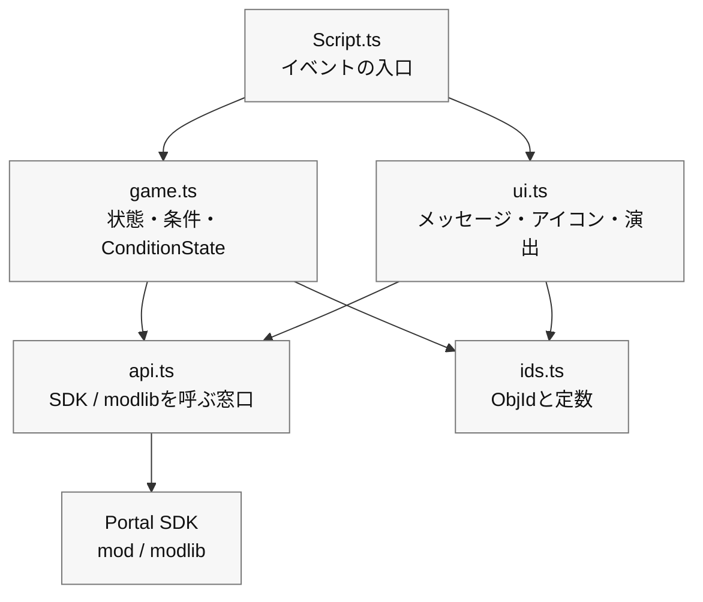

# 0　“きれいに分ける”小さな設計

> ―― 壊れにくく、直しやすく、あとから足せるコードへ

第6章で、あなたは **「押す → 目印 → 到着 → 光と音」** の最小ループをTypeScriptで動かせました。
ここから機能を足していくと、同じような処理（メッセージ表示、アイコンの切り替え、効果音の再生）があちこちに散らばり、少し直すだけのつもりが全体が壊れることが出てきます。

そこで本章では、難しい専門用語を極力使わずに、コードを三つの箱に分けるだけの **「小さな設計」** を導入します。
狙いはシンプルです。

* 壊れにくい（一箇所の変更が他へ波及しにくい）
* 直しやすい（どこを触ればよいかがすぐ分かる）
* 足しやすい（新機能の追加が怖くない）

> ここでやるのは「完全な本格設計」ではありません。
>
> **“第6章で作ったコードを、やさしく片づける”** だけです。

# 1　三つの箱に分ける（境界／状態／見せ方）

まずは役割で分けます。覚え方は次の三つだけ。

1. 境界（API）：Portal/SDKを呼ぶ窓口。

「実際にWorldIconをON/OFFする」「FXを再生する」など、ゲーム外界へ命令を出す関数だけを置く場所。

2. 状態（ドメイン）：ゲームの進行とルール。

「開始できるか」「目的地に到達できるか」「防衛中か」「カウントは何秒か」など、条件を表す小さな関数と、`modlib.ConditionState` による多重発火防止。

3. 見せ方（UI/演出）：メッセージとアイコン・音・光。

  「ことば → 目印 → 効果」の順をひとつの関数にまとめて、“見た目だけ”面倒を見る箱。

最初は、次の依存関係だけ守れば十分です。

| ファイル | 役割 | 呼んでよいもの |
| ---- | ---- | ---- |
| `Script.ts` | Portalイベントを受け、処理をつなぐ入口 | `game.ts`、`ui.ts` |
| `game.ts` | 進行状態、条件関数、`ConditionState` | `ids.ts`、必要なら `api.ts` |
| `ui.ts` | メッセージ、WorldIcon、FX/SFXなど見せ方 | `api.ts`、`ids.ts` |
| `api.ts` | Portal SDKやmodlibを直接呼ぶ薄い窓口 | `mod`、`modlib` |
| `ids.ts` | ObjIdや定数だけを置く | 何も呼ばない |

依存の向きは、`Script.ts` → `game.ts` / `ui.ts` → `api.ts` → Portal SDKです。
逆向きに呼び始めると、「表示を変えたいだけなのにゲーム進行まで壊れる」状態になります。
迷ったら、Portal SDKを直接触るコードは `api.ts` に寄せ、イベントの中では短い関数を呼ぶだけにしてください。

## ひな形（雰囲気をつかむ用）

```ts
// 1) API boundary
export const api = {
  showIcon: (id: number, on: boolean) => { /* SDK call */ },
  playFX:  (id: number) => { /* ... */ },
  stopFX:  (id: number) => { /* ... */ },
  playSfx:  (id: number) => { /* ... */ },
  vehicle: {
    enable: (id: number, on: boolean) => { /* ... */ },
    respawn: (id: number) => { /* ... */ },
  },
  time: { wait: async (ms: number) => { /* ... */ } },
};

// 2) Game progress gates and flags
import * as modlib from "modlib";

export const startGate = new modlib.ConditionState();
export const targetGate = new modlib.ConditionState();
export const state = { started: false, reached: false, defending: false };

export function canStart(): boolean { return !state.started; }
export function canReachTarget(): boolean { return state.started && !state.reached; }
export function markStarted(): void { state.started = true; }
export function markReached(): void { state.reached = true; }

// 3) UI and effects
export const ui = {
  say: (message: mod.Message, ms = 2000) => { /* Show to all players */ },
  guide: (hideId?: number, showId?: number) => {
    if (hideId !== undefined) api.showIcon(hideId, false);
    if (showId !== undefined) api.showIcon(showId, true);
  },
  celebrate: (FXId: number, sfxId: number) => {
    api.playFX(FXId); api.playSfx(sfxId);
  },
};
```

### ポイント

* Portalの仕様変更が来たら api だけ直せばOK。
* UIの文言や演出差し替えは ui だけ直せばOK。
* ゲームの進行仕様は `state`、`can...`、`mark...`、`ConditionState` で説明できる。

# 2　ファイルを分ける（テンプレート前提の小さなフォルダ構成）

初心者でも迷わない、4ファイルで十分です。

```
/mods
  ├─ ids.ts        // Object ID constants
  ├─ api.ts        // SDK boundary
  ├─ game.ts       // Progress flags, ConditionState, predicates
  ├─ ui.ts         // UI and effects
  └─ Script.ts     // Event wiring
```

* ids.ts：const ICON_TARGET = 22 のような名前付きIDだけを並べる。
* api.ts：SDK呼び出しを1行関数に包む（中身が複雑でも外からは1行で見える）。
* game.ts：`ConditionState`、state、`can...` / `mark...` を置く。
* ui.ts：say/guide/celebrate の3点セットから始め、必要に応じて増やす。
* Script.ts：第5章のロジック（押す→誘導→到達→光と音）を、上の箱を呼びながら書く。

> 分けることで、 **「どこに書けばいいか」** が固定され、迷いが減ります。

テンプレートの `npm run build` は、`mods` 配下の `.ts` ファイルを再帰的に集めて、Portalに登録するための `dist/Script.ts` にまとめます。Portal側は1ファイルしか受け取れませんが、開発中は遠慮なく分けて構いません。

# 3　依存の向き（“下り矢印”だけ）

main → ui → api のように、一方向にだけ矢印が流れるのが理想です。
`api` が `ui` を呼ぶ、`ui` が `main` を呼ぶ、といった逆流は混乱のもと。
「下へは呼ぶけど、上は呼ばない」を合い言葉にしておくと、雪だるま式の依存が止まります。



# 4　第6章のコードを「分ける」実演（小さな引っ越し）

第5章の最小ループを、いったんそのまま `mods/Script.ts` に置いてあるとします。
ここから 3ステップで片づけます。

## ステップ1：IDを引っ越す（ids.ts）

```ts
// ids.ts
export const IP_START = 500;
export const ICON_ENTRANCE = 21;
export const ICON_TARGET   = 22;
export const AREA_TARGET   = 11;
export const FX_GOAL      = 901;
export const SFX_GOAL      = 951;
```

`mods/Script.ts` で `import { ... } from "./ids"` に置き換え。
効果：数字が消えて、名前だけが残る（読みやすい）。

## ステップ2：見せ方を引っ越す（ui.ts）

```ts
// ui.ts
import { api } from "./api";
export const ui = {
  say: (message: mod.Message, ms = 2000) => { /* Show message */ },
  guide: (hideId?: number, showId?: number) => {
    if (hideId !== undefined) api.showIcon(hideId, false);
    if (showId !== undefined) api.showIcon(showId, true);
  },
  celebrate: (FXId: number, sfxId: number) => {
    api.playFX(FXId); api.playSfx(sfxId);
  },
};
```

`mods/Script.ts` 側の `showMessageAll` / `setIconVisible` / `playFX` / `playSfx` を、
`ui.say` / `ui.guide` / `ui.celebrate` に置き換え。
効果：ことば→目印→効果の順が1行で読める。

## ステップ3：条件と多重発火防止を引っ越す（game.ts）

```ts
// game.ts
import * as modlib from "modlib";

export const startGate = new modlib.ConditionState();
export const targetGate = new modlib.ConditionState();

export const state = {
  started: false,
  reached: false,
};

/**
 * Returns true when the game can start.
 */
export function canStart(): boolean {
  return !state.started;
}

/**
 * Returns true when the target area can be accepted.
 */
export function canReachTarget(): boolean {
  return state.started && !state.reached;
}

export function markStarted(): void {
  state.started = true;
}

export function markReached(): void {
  state.reached = true;
}
```

`mods/Script.ts` では、イベントごとの判定関数を作ってから `ConditionState` に通します。

```ts
import { startGate, targetGate, canStart, canReachTarget, markStarted, markReached } from "./game";
import { IP_START, AREA_TARGET } from "./ids";

/**
 * Returns true when this interact event should start the game.
 */
function isStartInteract(objectId: number): boolean {
  return canStart() && objectId === IP_START;
}

/**
 * Returns true when this area event should mark the target as reached.
 */
function isTargetArea(objectId: number): boolean {
  return canReachTarget() && objectId === AREA_TARGET;
}

export function OnPlayerInteract(eventPlayer: mod.Player, eventInteractPoint: mod.InteractPoint): void {
  const objectId = mod.GetObjId(eventInteractPoint);

  if (startGate.update(isStartInteract(objectId))) {
    markStarted();
    // Start game
  }
}

export function OnPlayerEnterAreaTrigger(eventPlayer: mod.Player, eventAreaTrigger: mod.AreaTrigger): void {
  const objectId = mod.GetObjId(eventAreaTrigger);

  if (targetGate.update(isTargetArea(objectId))) {
    markReached();
    // Play goal effects
  }
}
```

効果：多重防止が毎回同じ形になり、しかも `isStartInteract` / `isTargetArea` の名前で「何を判定しているか」も読める。
コメントはPortal向けに英語で短く書きます。日本語コメントはマルチバイト文字で問題になりやすいため避けてください。

# 5　“名付け”のルール（初心者が後から読める名前）

* 関数名は動詞＋対象：`guideIcon` より `guide`（見せ方の箱にあるので“アイコン”は暗黙）、`playGoalEffect` より `celebrate`（目的語を減らして“何のために”を表す）。
* 条件関数は `is...` / `has...` / `can...` で始める：`isStartInteract`、`canReachTarget` のように読む。
* ID定数は大文字スネーク：`ICON_TARGET` は **見た瞬間に“変わらない数字”** と分かる。
* ファイル名は短く用途直球：`ids` / `api` / `game` / `ui`。迷わせないことが正義。

# 6　設定をひと箱に（あとで数字をいじるために）

バランス調整（例：防衛10秒→15秒）はコードを書き換えずに済ませたい。
`config.ts` を一枚用意し、ゲーム中はここだけ見るようにします。

```ts
// config.ts
export const config = {
  balance: { defenseSeconds: 10, startThrottleMs: 1000 },
  messages: {
    start: mod.stringkeys.start,
    defendSeconds: mod.stringkeys.defendSeconds,
    success: mod.stringkeys.success,
  },
};
```

文言そのものは `Strings.json` に置き、コード側の設定には `mod.stringkeys...` のキーを置きます。
表示するときは `ui.say(mod.Message(config.messages.defendSeconds, t))` のように `mod.Message` で組み立てます。

> これで「数字だけ変えたい」「文言キーだけ直したい」に即応できます。

# 7　自己診断（VitestでID事故を先に見つける）

-1（未設定）や重複IDは、ゲーム起動後に気づくより、`npm run test` で先に見つけた方が楽です。
`assertIds()` のような確認関数は、`mods/Script.ts` の本番起動時に呼ぶより、Vitestの `test/ids.test.ts` 側に置きます。

```ts
// test/ids.test.ts
import { describe, expect, test } from "vitest";
import * as ids from "../mods/ids";

function assertIds() {
  const entries = Object.entries(ids) as [string, number][];
  const seen = new Map<number, string[]>();
  const errors: string[] = [];

  for (const [name, id] of entries) {
    if (id === -1) errors.push(`[ID unset] ${name}`);
    const arr = seen.get(id) || [];
    arr.push(name); seen.set(id, arr);
  }
  for (const [id, names] of seen) {
    if (names.length > 1) errors.push(`[ID duplicate] ${id}: ${names.join(", ")}`);
  }
  if (errors.length) throw new Error(errors.join("\n"));
}

describe("ids", () => {
  test("does not contain unset or duplicate ids", () => {
    expect(() => assertIds()).not.toThrow();
  });

  test("contains required ids", () => {
    expect(ids.IP_START).toBeGreaterThan(-1);
    expect(ids.AREA_TARGET).toBeGreaterThan(-1);
    expect(ids.ICON_TARGET).toBeGreaterThan(-1);
  });
});
```

これで `npm run test` を実行したときに、コード側の `ids.ts` に未設定や重複がないかを確認できます。
ただし、VitestはGodot上の実配置までは見られません。実際のSceneに同じObjIdが置かれているかは、第4章の台帳やObjIdManagerで確認してください。

# 8　イベントを“集約して流す”（小さなディスパッチ）

イベントが増えてきたら、「何が来たら、どの条件を見て、何を実行するか」を上の方に表で書くと、仕様が読めるコードになります。
ここでも段階名の `type` を増やすより、`ConditionState` と判定関数を組にしておくと分かりやすいです。

```ts
// flow.ts
import * as modlib from "modlib";
import { ui } from "./ui";
import { IP_START, AREA_TARGET, ICON_ENTRANCE, ICON_TARGET, FX_GOAL, SFX_GOAL } from "./ids";
import { startDefense } from "./defense";
import { canStart, canReachTarget, markStarted, markReached } from "./game";

type When = "interact"|"enter"|"leave";
type Row = {
  when: When;
  id: number;
  gate: modlib.ConditionState;
  test: () => boolean;
  do: () => void;
};

const startGate = new modlib.ConditionState();
const targetGate = new modlib.ConditionState();

export const flow: Row[] = [
  {
    when: "interact",
    id: IP_START,
    gate: startGate,
    test: canStart,
    do: () => {
      markStarted();
      ui.say(mod.Message(mod.stringkeys.start));
      ui.guide(ICON_ENTRANCE, ICON_TARGET);
    },
  },
  {
    when: "enter",
    id: AREA_TARGET,
    gate: targetGate,
    test: canReachTarget,
    do: () => {
      markReached();
      ui.celebrate(FX_GOAL, SFX_GOAL);
      startDefense(10);
    },
  },
];

export function dispatch(when: When, id: number) {
  const row = flow.find(r => r.when === when && r.id === id);
  if (!row) return;
  if (row.gate.update(row.test())) row.do();
}
```

`mods/Script.ts` では、SDKのイベントコールバックから dispatch("interact", IP_START) のように呼ぶだけ。
効果：挙動が上の表で読めます（初心者ほど安心）。
`gate` が多重発火を止め、`test` が「今その処理を通してよいか」を名前付き関数で説明します。

# 9　分けたコードを1つにまとめる

テンプレートを使う場合、開発中は `mods` 配下にファイルを分け、Portalへ登録するときだけ1ファイルにまとめます。

実行するコマンドはこれです。

```bash
npm run build
```

このコマンドは、`mods` 配下の `.ts` ファイルを集め、`import` 行を整理しながら `dist/Script.ts` を作ります。

Portal Web Builderに登録するのは、開発中の `mods/Script.ts` ではありません。 **`dist/Script.ts`** です。文字列定義を使う場合は、 **`dist/Strings.json`** も一緒に登録します。

## 登録前の確認順

Portalへ持ち込む前は、次の順で確認します。

```bash
npm run lint
npm run test
npm run build
```

* `lint`：文法や書き方の危ないところを先に見つける。
* `test`：状態遷移や小さな関数が想定どおり動くか確認する。
* `build`：Portalへ登録する1ファイルを生成する。

なお、`build` だけ通して安心しないください。ビルドは結合であって、ゲームとして正しいかの証明ではありません。

# 10　「分けた後」の直し方（実務の流れ）

見た目を変えたい → `ui.ts` を開く（文言・演出・順番）。

外に出す命令が変わった → `api.ts` を開く（SDKの差し替え）。

ゲームの段階を増やしたい → `game.ts` に状態フラグ、`ConditionState`、`can...` / `mark...` 関数を足し、`flow.ts` に行を足す。

IDが増えた → `ids.ts` に定数を足し、VitestとObjIdManagerで確認。

数値や文言の調整 → `config.ts` の値を変える。

触る場所が一意に決まるのが、分ける最大の効果です。

# 11　やりがちなNGと対策

NG：APIを直にあちこちから呼ぶ
→ 対策： 必ず `ui` か `api` を経由。`main` から `setIconVisible` を直で叩かない。

NG：数字をその場で書く（`setIconVisible(22, true)` など）
→ 対策： すべて `ids.ts` の定数に。数字を検索しない生活へ。

NG：多重発火防止のフラグを都度コピペ
→ 対策： `game.ts` に `ConditionState` と判定関数を寄せる。

NG：文言をコード中にバラバラ
→ 対策： `Strings.json` に文言を置き、`ui.say(mod.Message(mod.stringkeys.start))` のように `mod.Message` を経由。

# 12　段階的リファクタ（怖くない順）

「一気にやる」必要はありません。安全な順はこれです。

1. **IDを定数へ** （効果最大・リスク最小）
2. UIの3点セットを切り出す（`say` / `guide` / `celebrate`）
3.  **ConditionState と判定関数** を作る
4. APIの窓口を作る
5. （必要なら） **遷移表（flow）** へ

各ステップごとにビルド＆テストし、普段どおり遊べることを確かめてから次へ行けばOKです。

# 結論

* 三つの箱（api / game / ui）に分けるだけで、壊れにくく直しやすくなります。
*  **数字をやめて名前にする（ids.ts）** ことが、読みやすさの核心です。
* 多重発火は `ConditionState`、文言と数値は config、ID事故はVitestとObjIdManagerで減らします。
* 分ける順番はID → UI → 状態 → API → 遷移表。小さく刻めば怖くありません。

# 次節への案内

**第8章「ビジュアルと演出：UI・SFX・FXを使いこなす」** では、本章で作った ui の箱をさらに磨き、

* メッセージの出し方（個別／全体／重要度）
* WorldIcon の切り替えタイミング設計
* デバッグUIの配置と、プレイヤーに見せない工夫
