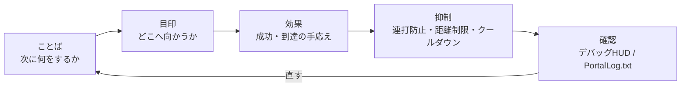

# 0　ビジュアルと演出：UI・SFX・FXを使いこなす

> ―― 伝わる→迷わない→気持ちいい、の順番で

* 伝える（短いメッセージ／WorldIconの切替）
* 導く（“ここへ行け”が一目で分かる配置と更新）
* 感じさせる（SFX・FXで手応えを足す。ただし“鳴らしすぎない”）
* 乱れない（スパム防止・距離／回数制限・クールダウン）
* 見直せる（デバッグHUDで“今なにが起きたか”が見える）

> 合言葉は 「ことば → 目印 → 効果」。
> まず短い文で要件を出し、次に WorldIcon で方向を示し、最後に SFX/FX で手応えを重ねます。



# 1　メッセージ：短い文で“次の一手”だけを出す
## なぜ

プレイヤーは数秒で判断します。長文は読まれません。「次に何をしてほしいか」 だけを5〜12文字程度で出すと、迷いが消えます。

## どう書く（型）

* 命令形＋目的語：

例）「入口へ向かえ」「端末Aを起動」「10秒防衛せよ」

* 時間／距離を入れると良い：

例）「10秒防衛せよ」「あと120m」

## 実装の型

画面に表示する文字は、コードへ直接書くのではなく `Strings.json` に登録してから使います。
通知、WorldIcon、UI Textの `textLabel` など、プレイヤーに見える文字はすべて同じ考え方です。

流れは、次の三段階です。

1. `Strings.json` に、表示したい文のキーと本文を登録する。
2. TypeScript側で `mod.Message(mod.stringkeys.キー名, 追加値...)` を作る。
3. `modlib.ShowNotificationMessage()` など、表示用の関数へ `Message` を渡す。

`Strings.json` は、画面に出す文の辞書です。
TypeScript側は、その辞書のキーを指定し、必要なら `{}` に入れる値だけを追加で渡します。
この分け方にすると、表示文を増やしたときに「コードに直書きした文字がPortalで壊れる」事故を避けられます。

```json
{
  "goEntrance": "go entrance",
  "defendSeconds": "defend:{}s",
  "testName": "test name:{}"
}
```

コード側では `mod.Message` で表示用の `Message` を作ります。
`{}` の位置には、第二引数以降に渡した値が入ります。

```ts
modlib.ShowEventGameModeMessage(mod.Message(mod.stringkeys.goEntrance));
modlib.ShowEventGameModeMessage(mod.Message(mod.stringkeys.defendSeconds, 10));
modlib.ShowNotificationMessage(mod.Message(mod.stringkeys.testName, "player1"));
```

最後の例は、画面では `test name:player1` のように表示されます。
`mod.Message` の追加引数は最大3つまで使えるので、残り秒数、スコア、プレイヤー名のような変わる値だけをコードから渡します。

```ts
// Important message
ui.say(mod.Message(mod.stringkeys.goEntrance));

// Updating message
ui.say(mod.Message(mod.stringkeys.defendSeconds, t));
```

## つまずき対策

* 画面に出す文字を追加したら、`Strings.json` にキーがあるか確認する。
* 同時に複数出さない（最後に出したものだけが残る設計に）。
* 通知頻度を絞る（毎秒新規通知は疲れます。上書きにしましょう）。
* 個別 vs 全体：個別の注意は“押した本人だけ”、合図は“全員”。最初に決めて統一。

# 2　WorldIcon：導線は“少し手前”に置き、段階で切り替える
## なぜ

目的地そのものに置くと、近づいた瞬間に壁や角で見失います。 **入口や角の“少し手前”** に置くと、曲がり角でも迷いません。

## どう置く／どう切り替える

* 段階分け：入口（ICON_ENTRANCE）→目的地（ICON_TARGET）→次の目的（ICON_NEXT…）
* 到達でOFF、次をON： **“二重に光らせない”** のが迷わないコツ。

## 実装の型

```ts
// 案内の基本（6章の guide を利用）
ui.guide(ICON_ENTRANCE, ICON_TARGET);  // 入口OFF → 目的地ON

// 到達時
ui.guide(ICON_TARGET, undefined);      // 目的地OFF（次があるならここでON）
```

## つまずき対策
* ONだけ増える事故：到達時に必ず前のICONをOFF。
* チーム別表示が必要な場合は、ui.guideForTeam(teamId, hide, show) のように関数を分けておくと、表示範囲ミスを防げます。

# 3　SFX：鳴らし過ぎは“疲れ”になる（クールダウンを必ず置く）
## なぜ

* 達成音は快感ですが、連続再生は疲労を生みます。クールダウン（一定時間は再生しない）で密度を抑えます。

## 実装の型：SFXクールダウン

```ts
const sfxCooldownMs = 1500;
let lastSfxAt = 0;

function playSfxCooled(id: number) {
  const now = Date.now();
  if (now - lastSfxAt < sfxCooldownMs) return;
  lastSfxAt = now;
  api.playSfx(id);
}
```

## つまずき対策

* イベントの多重発火と組み合わせると地獄に。6章の onceIn とセットで使う。
* 距離で音量を変えるAPIがあるなら、遠距離は鳴らさない設定を。なければ“遠距離イベントではそもそも鳴らさない”判断を。

# 4　FX：遠目の“灯台”、近場の“ご褒美”
## なぜ

FXは遠くから気づき、近くで納得が理想。遠距離には点滅・柱・矢印など視認性重視、近距離は爆発・火花・火柱など手応え重視。

## 実装の型：FXワンショット／ループ

```ts
function celebrate() {
  api.playFX(FX_GOAL);   // ワンショット想定
  playSfxCooled(SFX_GOAL); // 7.3のクールダウン版
}

// ループ物は必ず停止側も
onEnterArea(AREA_TARGET, () => api.playFX(FX_GOAL));
onLeaveArea(AREA_TARGET, () => api.stopFX(FX_GOAL));
```

## つまずき対策

* 止まらない煙：退出イベントで確実に停止を書く。
* 屋内で見えない：設置位置を少し手前にずらす。上方にオフセットを入れると解決することが多い。

# 5　距離と方向：案内を“あと◯◯m”で実感に変える
## なぜ

距離が見えると、「今進んでいる」の手応えが生まれます。数秒に一度の更新で十分です（毎フレーム更新は不要）。

## 実装の型（距離UIを上書き）

```ts
const updateDistance = debounce(500, (playerPos: Vector3, targetPos: Vector3) => {
  const d = Math.round(distance(playerPos, targetPos));
  ui.say(mod.Message(mod.stringkeys.distanceLeft, d));
});
```

この場合、`Strings.json` には `"distanceLeft": "{}m left"` のような文言を用意しておきます。

## つまずき対策
* 更新しすぎで通知がうるさい → debounceで間引く。
* 距離0mにならない → 目標位置はWorldIconと同じく少し手前に。

# 6　優先度：大事な音・光・文言から鳴らす／出す
## なぜ

同時に複数の演出を重ねると、弱い方が消えます。優先度を付け、高→中→低の順に処理し、低優先度は抑制します。

## 実装の型（優先度キューのイメージ）

```ts
type Prio = "high"|"mid"|"low";
function playSfxPrio(id: number, prio: Prio) {
  if (prio === "low" && Date.now() - lastSfxAt < 2000) return; // 直近に鳴ってたら抑制
  playSfxCooled(id);
}
```

## コツ

* 勝利・失敗のジングルは必ず high。
* 足音・環境音など地の音はゲーム側に任せ、独自SFXは節目だけ。

# 7　“やりすぎ”を防ぐ設計：1シーン1効果、1段落1メッセージ

* 1シーン1効果：同一イベントで FX を二つ三つ重ねない。主役をひとつ決める。
* 1段落1メッセージ：同時に「目的」「注意」「ヒント」を出さない。目的だけに絞る。
* 終了処理を必ず書く：ループFX/SFXの停止、メッセージの上書き、WorldIconのOFF。

# 8　デバッグHUD：自分だけに見える“耳と目”を持つ
## なぜ

演出は“感じるもの”ですが、設計は数値と状態です。自分にだけ見える小さなHUDで、phase・残り秒・直近イベントを出すと、直しが速い。

## 実装の型（例）
```
const debug = { on: true };
function dbg(line: string) { if (!debug.on) return; /* 画面端に小さく */ }

function dump() { dbg(`phase=${Phase[state.phase]} time=${remainSec}`); }

onInteract(IP_START, () => dbg("Interact:Start"));
onEnterArea(AREA_TARGET, () => dbg("Enter:Target"));
onLeaveArea(AREA_TARGET, () => dbg("Leave:Target"));
```

## コツ

* 本番公開時は debug.on=false に。
* 通知のスパム対策と同じく、HUDもデバウンスする（見やすさ維持）。

# 9　パフォーマンスと安定性：やらない勇気
* 毎フレーム判定は避ける（距離・方向は0.5〜1秒に1回で十分）。
* 無限ループ＋短い待機は封印。イベントとタイマーで待つ。
* 同時再生数を制限（同時にSFX 3つまで、など自分ルールで上限）。
* 演出は“見える人だけ”に：APIがあれば可聴圏／視認圏チェックを入れる。

公式SDKのTipsでも、負荷に直結するものとして車両数、Player走査、UI Widget管理が挙げられています。演出を増やす前に、次の3つを守ってください。

* 車両は同時に40台を超えないようにする。常設車両とイベント車両を足した合計で見る。
* 全プレイヤーを毎フレーム走査しない。`OnPlayerEnterCapturePoint` や `OnPlayerExitCapturePoint` などのイベントで状態を記録し、必要なときだけ読む。
* UI Widgetは毎回作り直さない。作成済みのWidgetを変数に保持し、表示内容の更新で済ませる。

派手な演出ほど、重くなる前に上限を決めます。見た目の量ではなく、プレイヤーが理解できる量を基準にしてください。

# 10　レシピ集（そのまま使える小部品）
## A）到達でカメラを揺らし、短い歓声を一度だけ

```ts
let cheered = false;
function celebrateOnce() {
  if (cheered) return; cheered = true;
  ui.celebrate(FX_GOAL, SFX_GOAL);    // 光と音
  api.shakeCameraAll?.(0.4, 600);      // APIがあれば：強さ0.4/600ms
  setTimeout(()=> cheered = false, 3000); // 3秒は再発しない
}
```

## B）段階メッセージ（短文3つで一本の物語に）

```ts
ui.say(mod.Message(mod.stringkeys.start));
ui.guide(ICON_ENTRANCE, ICON_TARGET);
ui.say(mod.Message(mod.stringkeys.goTerminalA));
// On reached
ui.say(mod.Message(mod.stringkeys.goodJob));
```

## C）“点滅アイコン”を擬似的に（ON/OFFを交互に）

```ts
let blinkOn = false, blinkH: any;
function startBlinkIcon(id: number, ms = 600) {
  stopBlinkIcon();
  blinkH = setInterval(()=> { blinkOn = !blinkOn; api.showIcon(id, blinkOn); }, ms);
}
function stopBlinkIcon() { if (blinkH) clearInterval(blinkH); api.showIcon(ICON_TARGET, true); }
```

> 使いすぎ注意。最初の“呼び込み”だけ点滅→到達が近づいたら常灯、が上品です。

# 結論

* ことば → 目印 → 効果の順を守るだけで、伝わり方が見違えます。
* WorldIconは“少し手前”、SFX/FXはクールダウン、UIは上書きで“うるささ”を防ぎます。
* デバッグHUDで“今”を見える化。直しが早く、演出の質も上がります。

# 次節への案内

続く 第9章「公開・ホスティング・運営」 では、ここまでの体験を **“遊ばれる状態”** にする実務へ進みます。

* 共有コード・256文字以内の説明文・サムネの書き方（目的／推奨人数／所要時間を短く伝える）
* サーバー運用（常設／イベント）と告知のテンプレ
* 更新頻度と“壊さず改良する”手順
* XP周りは状況により制限の可能性がある前提での、穏当な運営のコツ
