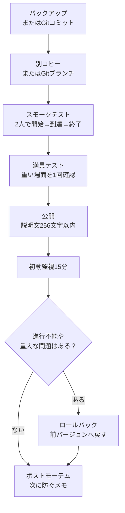

# 0　公開・ホスティング・運営

> ―― 遊ばれる設計・伝わる説明・壊さない更新

* 作ったモードを迷いなく公開し、少人数でも遊びやすい導線を整える。
* タイトル、256文字以内の説明文、サムネ、外部告知を定型化し、説明抜けを防ぐ。
* アップデート時に壊さず更新できる運営手順（バックアップ／検証／リリースノート／ロールバック）を持つ。

Portalで無名の個人モードに自然流入だけで人を集めるのは、かなり難しいです。
この章は大規模集客の方法ではなく、「来てくれた人が迷わず始められる」「遊んだあとに直す場所が分かる」ための運営メモとして読んでください。

# 1　公開前チェックリスト（30秒版）

* タイトル：短く固有名詞＋やること（例：Checkpoint Rush — 端末起動→10秒防衛）
* 説明文：256文字以内。できれば英語の短文で、目的・人数・時間だけを書く
* 推奨人数／時間：例「8–16人 / 10–15分」
* エリア・車両：出るか出ないかを明記
* サムネ：情報を詰め込まず、雰囲気と最初に向かう場所が分かるカット
* テスト：2人・満員の2パターンで開始→到達→終了を通す
* ログ：バージョン番号・変更点・公開日時をメモ

> 迷ったら「目的」「推奨人数」「所要時間」「最初に押すもの」だけに絞ります。説明文は256文字までなので、細かいFAQや更新履歴は外部告知へ逃がします。

## 公開前チェック（実務版）

30秒版を通したら、公開前に次の項目も確認します。

| 確認項目 | 見ること |
| ---- | ---- |
| 1人テスト | 開始、移動、到達、終了まで1人で通る |
| 2人テスト | 片方だけが押した場合、両方に必要な表示が出る |
| 途中参加 | 途中参加者が迷わずスポーンし、必要なUIを見られる |
| 離脱 | 参加者が抜けても進行不能にならない |
| 再デプロイ | 死亡後や再出撃後にUIとWorldIconが破綻しない |
| UI再表示 | メニューや通知が消えた後、必要な場面で再表示される |
| 長時間稼働 | 15分以上動かし、SFX/FXやUIが増え続けない |
| 車両数 | 同時に40台を超えない。常設車両とイベント車両を合算する |
| ログ確認 | `PortalLog.txt` にエラーや想定外の連打が出ていない |

「1人では動いたのに、公開したら壊れた」は、途中参加・離脱・再デプロイで起きがちです。ここだけは横着しないでください。あとで泣くより、今5分確認した方が安いです。

# 2　説明文テンプレ（256文字以内）

エクスペリエンス説明画面で作成者が自由に付けられるタグはありません。
また、説明文は256文字までです。
そのため、Portal内の説明文は「短い英語」を基本にして、詳しい日本語説明は外部告知に分けます。

## Portal内説明文の例

```text
Checkpoint Rush. Press the center terminal, follow the objective icons, then defend the final zone for 10 seconds. Recommended 8-16 players. 10-15 min. Transport vehicles only.
```

この例は約180文字です。
256文字に収まっていても、読ませたい情報を全部入れる場所ではありません。
Portal内では目的、人数、時間、最初の行動だけを伝えます。

## ポイント

* 「長所」ではなく「やること」を書く。
* プレイヤーの **最初の不安（どこ？何を押す？何分？）** を解消する。
* コミュニティ向けには、日本語だけの説明は避けた方が無難です。Portal内は英語の短文、詳しい日本語説明はX、Discord、Blog、Noteなど外部告知に分けます。
* タグで補足する前提にしない。作成者が自由に付けられるタグはないものとして、タイトル・説明文・サムネで伝えます。

# 3　ホスティング運用：常設とイベントの2本柱
## 常設（いつでも遊べる）
* 狙い：来てくれた人がすぐ試せる安心感。
* 設定：短め（10–15分）、待機短縮、マップ1〜2枚、夜中でもマッチングしやすい構成。

## イベント（時間を切って告知）

* 狙い：X / Discord等と連動し、少人数でも同じ時間に集まりやすくする。
* 設定：開始前ロビーでチュートリアル・デモを組み込む（入口アイコン→開始ボタン→1分体験）。
* テンプレ告知：

「今日21:00〜 Checkpoint Rush 初公開。8–16人 / 約12分。ロビーで開始ボタン→目印に沿って端末起動→目的地で10秒防衛。初見歓迎！」

# 4　サムネ・導線の“効く置き方”

* サムネ：小さい表示でも見えるように、情報を盛り込まない。
* 導線：256文字の説明文だけに頼らず、ゲーム開始時の `OnGameStart` や最初のInteractPointで短い案内を出す。画面に出す文言は `Strings.json` に登録し、`mod.Message(mod.stringkeys.xxx)` で呼び出す。

サムネは「説明書」ではありません。
画像サイズが小さい場所では、文字や細かい地図を入れても読まれません。
詳しい説明は外部告知やゲーム内の短い表示に回し、サムネは入口として割り切ります。

# 5　“壊さない更新”の基本手順（運営ランブック）

1. バックアップ：ids.ts / config.ts / Script.ts / ui.ts / game.ts を日付付きでコピー（例：2025-10-28_v1.2/）。Gitで管理している場合は、更新前にコミットを作る。
2. 検証ブランチ：新しい調整は必ず別コピー、またはGitの別ブランチで行う。
3. スモークテスト：2人で開始→到達→終了。
4. 満員テスト：AI/車両/FXが重なる場面を1回作る。
5. 公開：説明文が256文字以内に収まっているか確認し、バージョンや要約は必要最小限にする。
6. 初動監視15分：離脱率・ラグ・進行不能がないか。
7. ロールバック：異常が出たら前バージョンへ即復帰（サムネ・説明のバージョン表記も戻す）。
8. ポストモーテム（5分で良い）：何が起き、次にどう防ぐかをメモ。



> コツ：IDを触った更新は最優先で丁寧に検証。IDミスは「動かない」を産みやすい。

Gitを使えるなら、手作業のコピーよりも履歴管理が楽になります。
公開前の状態を `v1.2` のようなタグやコミットとして残しておけば、どのファイルを戻せばよいか迷いにくくなります。
ただし、Portal Web Builderへ登録した `dist/Script.ts` と `dist/Strings.json` も、どの元コードから作ったものか分かるようにしておきます。

# 6　変更の“安全地帯”：どこから直すと崩れないか

* 最優先で安全：config.ts の数値（防衛秒、クールダウン、推奨人数表示）
* 比較的安全：ui.ts の文言・順番（ことば→目印→効果の枠内で）
* 注意が必要：ids.ts の追加・変更（Vitestで検査→ObjIdManagerや台帳でGodot側も確認）
* 壊れやすい：Script.ts / flow.ts の分岐追加（onceInやPhase遷移の見直し必須）

# 7　プレイヤー向けFAQ（表示先を分ける）

Portal内に長い日本語FAQをそのまま置けるとは限りません。
FAQは「外部告知に書くもの」と「ゲーム内で短く表示するもの」に分けます。

| 表示先 | 向いている内容 | 書き方 |
| ---- | ---- | ---- |
| X / Discord / Blog / Note | 詳しいFAQ、更新理由、既知の問題 | 日本語でもよい |
| Portal内説明文 | 目的、所要時間、推奨人数 | 英語中心で256文字以内 |
| ゲーム内UI | 次に何をするか | `Strings.json` のキーを `mod.Message` で表示する |

ゲーム内で見せるなら、`OnGameStart` で最初の案内を1回だけ出すか、開始用InteractPointを押した直後に短く出すのが現実的です。
たとえば「中央の端末を押す」「目印へ向かう」「目的地で防衛する」のように、一度に一つだけ伝えます。

* Q：どうやって始めるの？
  * A：ロビー中央の **端末（E）** を押すと開始します。

* Q：目印が消えた
  * A：ひとつ前の目印をOFFにしながら進みます。表示がない場合は近くの看板をご確認ください。

* Q：何分くらい？
  * A：10〜15分で1周します。

# 8　フィードバックの集め方（最小セット）

人数が少ないうちは、フォームや集計表を用意するより、遊んだ直後の雑談で聞く方が現実的です。
手間が大きいほど、答えてもらえません。

まず聞くことは、次の3つで十分です。

* 迷った場所はどこか。
* 長すぎた、または短すぎた場面はどこか。
* もう一回遊びたいと思ったか。

人が増えてきたら、バグ報告テンプレとして「いつ」「どこ」「何をしたら」「何が起きた」を使います。
最初からフォーム運用を前提にしなくて構いません。

# 9　不具合・悪用対策のミニガイド

* 開始ボタンの連打：第6章の throttle を必ず適用（1秒に1回）。
* 到達演出の連打：onceIn で単一通行＋SFXクールダウン。
* 進行不能：緊急停止（開始を無効化→ロビー看板に“調整中”表示→旧版にロールバック）。
* 荒らし：キック・投票・チームロック等、Portal標準機能の範囲で明示（説明に1行）。

# 10　外部リリースノート（例）

Portal内に十分なリリースノートを書く場所がありません。
変更履歴は、X、Discord、Blog、Note、GitHub READMEなど、外部に残す前提にします。
Portal側には、必要ならバージョンや短い要約だけを書きます。ただし説明文は256文字までなので、無理に更新履歴を詰め込みません。

> v1.3（2025-10-28）
> * 目的地のWorldIconを入口寄りに再配置（見失い対策）
> * 防衛カウントを10→12秒に調整、SFXをクールダウン付きへ
> * Portal description updated to 8-16 players
> 既知の課題：満員時に輸送車が引っかかることがある（次版で改善予定）

# 11　公開後の“数字の見方”（カンタン版）

* 開始前離脱率：ロビーで落ちていないか → 説明と開始導線を見直す。
* 到達率：入口→目的地の到達割合 → アイコン位置とメッセージの順番。
* 完走率：最後まで行けたか → 防衛秒や敵密度をconfig.tsで微調整。
* 平均プレイ時間：長すぎ/短すぎを避ける（10–15分が目安）。

# 結論

* 公開は体験の完成工程。設計・説明・導線・告知・更新までが **作品** 。
* 256文字以内の英語短文＋30秒チェックで、伝わらない事故を防ぐ。
* 壊さない更新はバックアップ→検証→公開→監視→ロールバックの5手で固定化。
* 大規模集客を前提にせず、まずは少人数が迷わず遊べる状態を目指す。
* XPは状況により制限の可能性がある前提で、ふんわり表現に徹する。
