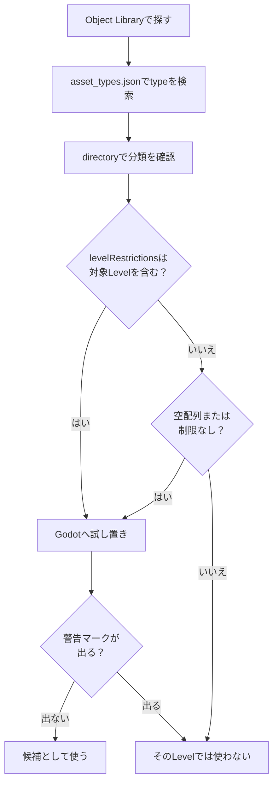

In this chapter, we will organize the questions ``Where do things that can be placed come from?'' ``What maps can you place what?'' and ``What are important objects related to operation?'' by matching the names of Godot's entity (`.tscn`) and Portal. Finally, we will prepare a form that can be referenced and controlled from the subsequent rule design and TypeScript implementation (= ID assigned and ledger state).

# 1 The true nature of “things that can be placed”: “res://objects” and map dependence

**Objects that can be placed on the map must be in Godot's file system `res://objects`**. Furthermore, there are limits to the range of objects that can be placed depending on which map you edit based on.** **As of April 21, 2026, the Portal SDK (version: 1.2.3.0) in hand is configured as follows**.

The configuration of the SDK may change due to updates. Before starting work, check `sdk.version.json` directly under the SDK, and if it is different from this document, give priority to `docs/pages/spatial_editor.html` and `code/types/mod/index.d.ts` in the SDK.

Godot real folder example:
`res://objects/entities`, `res://objects/gameplay`, `res://objects/fx`, `res://objects/props`, `res://objects/nature`, `res://objects/architecture`, `res://objects/roads`, etc.

In addition, a classification name mixed with uppercase letters such as `Gameplay/Common` may appear in `directory` of `asset_types.json`.
Read this as an asset classification, and when looking for the actual file in Godot, check it against the actual folder name, such as `res://objects/gameplay/common`.

The important point here is that ``the folder name alone does not determine whether or not it can be used.''
Check `asset_types.json` in the SDK and the warning on the editor to see if you can finally place the asset.
If a warning mark like the one below appears the moment you place it, consider that it cannot be used with that base map.


## Check the level limit at `asset_types.json`

You can check the map limits for your assets at `FbExportData/asset_types.json` in the SDK.
Don't judge only by whether or not it is visible in the Object Library; if in doubt, search for this file.

There are three areas to look at in each asset definition:

| Item | Meaning |
| ---- | ---- |
| `type` | Object name. Name when searching on Godot or in the Object Library |
| `directory` | Folder containing the asset |
| `levelRestrictions` | List of level names that can be installed |

For example, `AAGun_01` is defined as:

```json
{
  "type": "AAGun_01",
  "directory": "Props",
  "levelRestrictions": [
    "MP_Battery"
  ]
}
```

In this case, `AAGun_01` can be read as an asset under `Props` that is restricted to `MP_Battery`.
On the other hand, game rule assets such as `AI_Spawner`, `AreaTrigger`, `WorldIcon`, and `VehicleSpawner` are renamed to `levelRestrictions: []` in the SDK at hand.
Empty arrays and those without restricted items are commonly usable candidates, but SDK updates and editor-side warning display are given priority.

In practice, it is safe to check in the following order.

1. Search for the desired asset name in the Object Library.
2. Search `type` in `asset_types.json`.
3. Check the location at `directory`.
4. Check if `levelRestrictions` contains the Level name being edited.
5. Place it on Godot and check if a warning mark appears.



The folder name, official Level name, and Map ID may not match.
In the SDK `docs/pages/spatial_editor.html`, the available Levels are organized as follows (as of April 21, 2026, SDK 1.2.3.0).

| Official Level Name | Map ID |
| ---- | ---- |
| Siege of Cairo | MP_Abbasid |
| Empire State | MP_Aftermath |
| Blackwell Fields | MP_Badlands |
| Iberian Offensive | MP_Battery |
| Liberation Peak | MP_Capstone |
| Contaminated | MP_Contaminated |
| Manhattan Bridge | MP_Dumbo |
| Eastwood | MP_Eastwood |
| Operation Firestorm | MP_Firestorm |
| Golf Course | MP_Granite_ClubHouse_Portal |
| Downtown | MP_Granite_MainStreet_Portal |
| Marina | MP_Granite_Marina_Portal |
| Area 22B | MP_Granite_MilitaryRnD_Portal |
| Redline Storage | MP_Granite_MilitaryStorage_Portal |
| Defense Nexus | MP_Granite_TechCampus_Portal |
| Complex 3 | MP_Granite_Underground_Portal |
| Saint's Quarter | MP_Limestone |
| New Sobek City | MP_Outskirts |
| Portal Sandbox | MP_Portal_Sand |
| Hagental Base | MP_Subsurface |
| Mirak Valley | MP_Tungsten |

* In the Available Levels table of the official docs, it is written as `MP_Firestorm`, but in the local SDK `asset_types.json` and Godot's level file, `MP_FireStorm` is also used. When searching for `levelRestrictions`, give priority to the actual data notation in the SDK.
*`MP_Granite_ClubHouse_Portal` is the official Level Name `Golf Course`. When actually using it, please check `asset_types.json`, `levelRestrictions`, and the warning display on Godot.

For example, when editing based on "`MP_Aftermath` (Empire State)", assets that include `asset_types.json`, where `levelRestrictions` is empty, or `MP_Aftermath` are treated as candidates.
Even if it is visible in the Object Library or Godot, it cannot be used or displayed in the actual game unless there is a target level in `levelRestrictions`.

## `RuntimeSpawn_...` is a candidate that can be generated from code

If you look at `code/types/mod/index.d.ts`, you will see enums like `RuntimeSpawn_Common`, `RuntimeSpawn_Abbasid`, and `RuntimeSpawn_Aftermath`.
This is a Prefab candidate that can be generated at runtime from TypeScript's `mod.SpawnObject(...)`, rather than a list manually placed in Godot's Object Library.

```ts
const obj = mod.SpawnObject(
  mod.RuntimeSpawn_Common.AreaTrigger,
  mod.CreateVector(0, 0, 0),
  mod.CreateVector(0, 0, 0),
  mod.CreateVector(1, 1, 1)
);
```

`RuntimeSpawn_Common` is a common system that is easy to use with multiple Maps, and anything with a Map name such as `RuntimeSpawn_Abbasid` is read as a candidate derived from that Map.
However, the return value of `SpawnObject` may become `-1` if the target object does not support it.
Also, the ones generated by code are managed separately from the `ObjId` ledger kept manually on Godot, so if you use them, please note down the "manual ID" and "runtime generation" separately.

## Practical guidelines:

* First, search for objects related to game rules mainly in `res://objects/gameplay` and `res://objects/entities`.
* For appearance and accessory assets, check `levelRestrictions` on `asset_types.json` → Try it out → Check the warning mark → Keep only usable items.
* Assets found in the Object Library are matched against `type` in `asset_types.json`. If there is no Level name being edited in `levelRestrictions`, it cannot be used or displayed in the actual game, even if it is visible in Godot.
*Terrain and burned assets included in the `Static` layer are currently not subject to editing.
* Change the scale only to uniform scale. Non-uniform scales that stretch X/Y/Z separately are officially discouraged.

# 2 List of “gimmick” objects that are effective for movement

Unlike "accessories that are just for appearance", important objects that are involved in game behavior, events, scope, UI, etc. are mainly organized in `res://objects/entities` and `res://objects/gameplay`. We will cover the typical Godot paths, roles, and common combinations.

## SpawnPoint (key point for player appearance)

* Reality: `res://objects/entities/SpawnPoint.tscn`
* Role: Defines the player's spawn location.
* Frequently used combinations:
  `res://objects/gameplay/common/HQ_PlayerSpawner.tscn` (HQ sortie for each team)
  `res://objects/gameplay/common/PlayerSpawner.tscn` (direct sortie from script)
* Important: `SpawnPoint` does not create a range by itself. One or more links to `HQ_PlayerSpawner` / `PlayerSpawner` determines the actual location where the player can spawn.
* `PolygonVolume` is not used for SpawnPoint, but is used to specify the range of `CombatArea` or `AreaTrigger`.
* Practical key: Select `HQ_PlayerSpawner` / `PlayerSpawner` depending on whether it is team-specific or whether it can be dispatched directly from the script. ID is manually set in the property (initial -1). Separating the ID series for the SpawnPoint itself and the used objects (HQ/PlayerSpawner) will make the rules easier to read.

## AI spawn/path

* AI appearance: `res://objects/gameplay/ai/AI_Spawner.tscn`
* AI route: `res://objects/gameplay/ai/AI_WaypointPath.tscn`

## AreaTrigger (intrusion/exit detection)

* Reality: `res://objects/gameplay/common/AreaTrigger.tscn`
* Role: Turn entry/exit into an event.
* Combination: Define range with Godot `PolygonVolume`.
* Key point in practice: Insufficient height (Y) is a no-no. Thickness that you can jump through is not good. By linking the ID with the production (FX/SFX) and score addition on a 1:1 basis, and writing "AreaTrigger ID → person to call" in the ledger, you will not have to worry about implementing the rules.

## CapturePoint (target point that can be captured)

* Reality: `res://objects/gameplay/conquest/CapturePoint.tscn`
* Role: Base that teams compete for. You can handle the ownership team, occupation progress, and occupation start/completion/loss events.
* Combination: Godot `PolygonVolume` to `CaptureArea`. Also use `AdditionalCaptureArea` if necessary.
* Practical point: `AreaTrigger` is sufficient for simple intrusion detection. Use `CapturePoint` if you want to handle the ownership team, occupation time, occupation progress, and sorties from the base.

`CapturePoint` is a "game mode objective" rather than a range sensor.
On the TypeScript side, you can read and change the state at `mod.GetCapturePoint(id)`, `mod.GetCaptureProgress(...)`, `mod.GetCurrentOwnerTeam(...)`, `mod.SetCapturePointOwner(...)`, etc.

## VL7Cloud (Gas cloud/special effects area)

* Reality: `res://objects/gameplay/common/VL7Cloud.tscn`
* Role: Special effect area like gas cloud. You can switch screen effects, soldier effects, and VFX all at once.
* Combination: VL7Cloud itself is placed and used instead of the type that separately ties `PolygonVolume` like `AreaTrigger` or `CapturePoint`.
* Practical point: Used in expressions that have an effect on the location itself, such as poison gas, smoke, obstruction of visibility, and special areas. It is not used for simple goal judgment or switch range.

On the TypeScript side, retrieve it with `mod.GetVL7Cloud(id)` and switch the effect with `mod.SetVL7CloudEffects(cloud, screenEffect, soldierEffect, visualEffect)`.
Intrusion/exit information can be found at `OnPlayerEnterVL7Cloud` / `OnPlayerExitVL7Cloud`.

## How to use range objects

`AreaTrigger`, `CapturePoint`, `VL7Cloud` all relate to "players in range".
However, the purposes for which they are used are quite different.

| Purpose | What to use | Reason |
| ---- | ---- | ---- |
| Goal determination, shop range, traps, event start point | `AreaTrigger` | Just connect entry/exit to your own logic |
| Processing changes depending on base A, base B, position, and owning team | `CapturePoint` | Occupation progress, ownership team, and occupation event can be used |
| Areas with poison gas, special smoke, screen effects, and soldier effects | `VL7Cloud` | The area itself can have special effects |

If in doubt, consider `AreaTrigger` first.
If you need the words "occupation" or "owning team" go to `CapturePoint`, if you want to put in a gas cloud or special effect itself go to `VL7Cloud`.

## CombatArea (playable area)

* Reality: `res://objects/gameplay/common/CombatArea.tscn`
* Role: Specify the playable range and apply warnings, damage, etc. if you go outside.
* Combination: Define range with Godot `PolygonVolume`.
* Key point of practice: Expand the periphery and localize exceptions. During the test, we focused on checking cases where people could not return and become addicted.

## DeployCam (Overview of deployment screen)

* Reality: `res://objects/gameplay/common/DeployCam.tscn`
* Role: Adjust the bird's-eye view position and angle of the entire map.
* Practical key: If this is not set up, the map display before and after sortie will be incorrect, so be sure to set it.

## HQ / Player Spawner (differences in spawning rules)

* HQ only: `res://objects/gameplay/common/HQ_PlayerSpawner.tscn`
  A standard HQ spawner that can be assigned to a team. Use this if you want to create a sortie position for each team.
* For direct sortie: `res://objects/gameplay/common/PlayerSpawner.tscn`
  Alternative spawner without HQ. It is suitable for use when you want to dispatch any player from a script without assigning it to a team.
* Both Spawners only function as spawn locations when linked to one or more `SpawnPoint`.
*Practical point: If you want to avoid false appearances, use the HQ version. If you want to control arbitrary sorties with a script, use PlayerSpawner. During mixed operation, separate and clarify ID bands.

## InteractPoint (operation starting point)

* Reality: `res://objects/gameplay/common/InteractPoint.tscn`
* Role: Displays when approaching, event fires when button is pressed.
* Practical key: **"Press → What happens"** In order to directly connect it to the rules, use an ID that makes sense (e.g. Start=500 / Shop=501).

## Sector (breakthrough core)

* Reality: `res://objects/gameplay/common/Sector.tscn`
* Role: Added sector concept. Like a breakthrough, it consists of “push and pull stages”.
* Concepts included: `Advance Area` / `Retreat Area` / `Capture Points` / `Sector Area`
* The key to practical work: overlap multiple areas without contradiction. Organizing IDs by concept makes it easier to write phase control on the rule side.

## StationaryEmplacementSpawner (stationary weapon)

* Reality: `res://objects/gameplay/common/StationaryEmplacementSpawner.tscn`
* Role: Defines the location and content of fixed weapons.
* Practical key: Pay attention to physical interference in visibility, hit path, and shielding. Secure control room for “removal/relocation” with ID.

## SurroundingCombatArea (HQ breakwater)

* Reality: `res://objects/gameplay/common/SurroundingCombatArea.tscn`
* Role: Set a prohibited area around the HQ to prevent enemies from entering the HQ in Conquest games.
* Practical key: Strengthen only the area near HQ. If you spread it out too much, your attacker will suffocate.

## VehicleSpawner

* Reality: `res://objects/gameplay/common/VehicleSpawner.tscn`
* Role: Define the location and vehicle type of the weapon.
* Practical key points: No contact object immediately after appearance / Point in the direction of travel / Separate ID bands by permanent and event (e.g. 2001 = permanent, 2090 = event).

## WorldIcon (goal guide)

* Reality: `res://objects/gameplay/common/WorldIcon.tscn`
* Role: A landmark visible through the wall. Control explanatory text, ownership team, display/hide by rules.
*Practical key: **Place it “slightly before” the destination** and it will match the lead line. Decide on the ID early (e.g. 21, 22...).

## FX (visual effects)

* Entity: Exists in various folders as `FX_****.tscn`
* Role: Display effects such as fireworks and explosions
* Key point of implementation: Be careful not to cause the "Pokémon shock" phenomenon when using effects such as intense flashing or flashing lights.

## SFX (sound expression)

* Entity: Exists in various folders as `SFX_****.tscn`
* Role: Displays sound expressions such as fireworks sounds and explosion sounds
* Implementation key: It will be noisy if you put a lot of them.

# 3 Practical flow of placement (ID, ledger, compatibility check)

In the actual work, if you follow the steps below, mistakes will be drastically reduced.

1. Decide on the base level
As shown below, there is a list, so duplicate the base level that suits your purpose and double-click the duplicated level to expand the level.


*Level list*


*Created a level named "MP_Test_Granite_ClubHouse_Portal.tscn" after multiple creations*


*Double click to open level*

2. Extract possible placement candidates
  First, select the one related to game rules from `res://objects/gameplay` / `res://objects/entities`.
  If you see an asset you're interested in, search `FbExportData/asset_types.json` for `type` and check `directory` and `levelRestrictions`.
  For appearance and accessory assets, please check `levelRestrictions` Check → Trial → Warning mark to confirm compatibility before leaving.

3. Add ID at the same time as placement
  Manually input in **Obj Id field** as shown in the image. Do not duplicate IDs. Adhere to series classification (e.g. Spawn = 1000 units / Vehicle = 2000 units...).
  For objects that are not referenced or controlled by TypeScript implementation (environmental objects such as chairs), the initial value of -1 is fine.


*Set the object ID in the Obj ID field*

## ObjId ledger template

If you manage your ID only on Godot, you will definitely get confused later. At a minimum, please prepare the following ledger.

The ledger can be Excel, Google Sheets, Markdown table, or CSV.
The point is not the tools, but rather keeping `ObjId`, usage, Godot objects, TypeScript retrieval functions, and test results in the same place.

:::message
If manual ledger management becomes difficult, you can also use [hekaron/ObjIdManager](https://github.com/hekaron/ObjIdManager).
This is an ObjId management add-on made for the Battlefield Portal SDK's Godot environment that allows you to list Node3D's `ObjId`, highlight duplicate values, automatically number them, export to TypeScript format, and more.
In this book, we will first explain the concept using a ledger, but as the number of arranged objects increases, using these tools will make it easier to reduce confirmation errors and duplicate IDs.
It is safe to separate the roles by checking `ids.ts` on the code side with Vitest, and checking the actual placement on the Godot side with ObjIdManager or the ledger.
:::

| Usage | ObjId | Godot object | TypeScript acquisition function | Test result | Notes |
| ---- | ---- | ---- | ---- | ---- | ---- |
| Start button | 500 | InteractPoint | `mod.GetInteractPoint(500)` | Unconfirmed | Lobby center |
| Entrance information | 21 | WorldIcon | `mod.GetWorldIcon(21)` | Unconfirmed | Initial display |
| Destination Guide | 22 | WorldIcon | `mod.GetWorldIcon(22)` | Unconfirmed | Display after start |
| Destination determination | 11 | AreaTrigger | `mod.GetAreaTrigger(11)` | Unconfirmed | Ensure sufficient height |
| Success FX | 901 | VFX | `mod.GetVFX(901)` | Unconfirmed | Play when reached |
| Successful SFX | 951 | SFX | `mod.GetSFX(951)` | Unconfirmed | Be careful not to make too much noise |

The "test results" in the ledger start from "unconfirmed" immediately after placement. If it works in a test, you can just write "OK" and if it's broken, "needs fixing", which will reduce oversights.

4. Final confirmation of compatibility and success
  For objects with `levelRestrictions`, check again for warnings.
  Test to see if the height (Y) causes air bubbles or sinking into the ground, and whether there is enough space around the Spawn/Vehicle.

:::message
Practical Tip: Although it is not a required procedure specified in the official docs, checking the terrain, floor collision detection, and collision status before and after placing objects will reduce accidents such as objects sinking into the ground, floating slightly, and vehicles getting caught.
:::

5. Creating map data
  There is a BFPortal field at the bottom right, so click the "Portal Setup" button there. After a short wait, it will say "Completed setup".
  Next, click the "Export Current Level" button. When you do this, a file called `レベル名.spatial.json` will be created at `*Portal保存場所*\export\levels` from the folder hierarchy where the portal project is saved.
  *When you press the "Open Exports..." button, Explorer will open and guide you to the location.


*BFPortal column*


*Display after clicking the "Portal Setup" button*


*Display after clicking the "Export Current Level" button*


6. Register map data to Portal
  Register the created map data to the portal.
  As shown in the image below, go to the map rotation field on the portal creation screen and select the same map as the level you prepared. Register the data file you created.


*Portal creation screen (map rotation)*


*Map data settings*


*Check if map data is included*


Once this is done, you can immediately refer to and control the rules from the next chapter's rule design and subsequent TypeScript implementation. **90% of cases of “I placed it but it doesn’t work” are due to the ID being -1, or duplicates/missing ledgers. **


# 4 Minimum setup example (until operation confirmation)

We will show you the practical steps to create a minimal configuration that allows you to set it up and move it in the shortest possible time.
(Here, we will prepare only the “core” for the appearance of Team1/Team2, the start button, a landmark, and a simple production)

* Appearance point: Set `HQ_PlayerSpawner` or `PlayerSpawner` and link with one or more `SpawnPoint`.
* Start button: Place `InteractPoint` (ID:500) in the lobby. Height that makes it easy to push from the front.
* Landmark: 2 `WorldIcon` (ID:21 / 22). Before the entrance and before the destination.
* Production: Place `FX` (ID:901) and `SFX` (ID:951) at the destination.
* Detection: Pick up destination intrusion at `AreaTrigger` (ID:11). Full height at `PolygonVolume`.
* Ledger: 1001/1002=Spawn for each faction, 500=Start, 21/22=Landmark, 11=Intrusion detection → Activate 901/951

Save in this state, launch the test, and visually check the spawning → button press → intrusion → production.
In the next chapter, I would like to create a flow similar to the one below.

1. Trigger the press of `InteractPoint`(ID:500).
2. Switch the guidance from `WorldIcon`(ID:21) to `WorldIcon`(ID:22).
3. Operate `FX`(ID:901) and `SFX`(ID:951) with `AreaTrigger`(ID:11).

In your project, be sure to manage `.tscn` to be edited with Godot and `.spatial.json` to be registered to Portal Web Builder as a set.
If you use only `.tscn`, it will not be reflected on the Portal side, and if you use only `.spatial.json`, it will be difficult to follow the edited contents later.
By including the base Map ID, purpose, date, and version number in the file name, you can avoid confusion when redeploying.

# Conclusion: There are only 3 things to do!

There are three things you can do with the map editor:

(1) Correctly choose the “entity” that can be placed (base level + compatible common group)
(2) Manually assign an ID other than -1 immediately after placing (series division and ledger)
(3) Assemble a device object that uses Godot integration (`PolygonVolume`, etc.) according to the prescribed procedure.

Once these three points are in place, subsequent rule design and TypeScript implementation reference and control will proceed smoothly.

---

📘 **Next chapter: “Introduction to rule design (thinking before moving” placement) `SpawnPoint`／`AI_Spawner`／`AI_WaypointPath`／`AreaTrigger`／`CombatArea`／`DeployCam`／`HQ`/https://codex.l ocal/keep/7／`InteractPoint`／`Sector`／`AI_Spawner`0／`AI_Spawner`1／`AI_Spawner`2／`AI_Spawner`3／`AI_Spawner`4 are connected with events and conditions. At first, we will start with the minimum loop of **"Start button (InteractPoint 500) → Update landmark (WorldIcon 21 → 22) → Activate FX/SFX (901/951) on destination intrusion (AreaTrigger 11)"**, and gradually develop it into a complex event.
