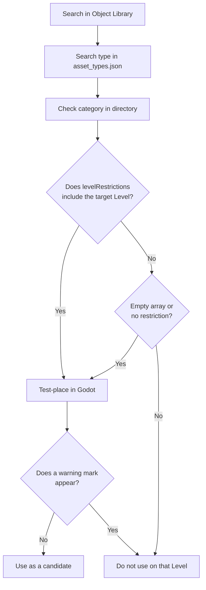

In this chapter, we will organize where placeable objects come from, what can be placed on each map, and which objects matter for gameplay. We will match the actual Godot entities (`.tscn`) with their Portal-side names. By the end, you will prepare everything in a form that later rule design and TypeScript implementation can reference and control: objects have IDs, and those IDs are recorded in a ledger.

# 1 What "Placeable Objects" Really Are: `res://objects` and Map Dependencies

**Objects you can place on a map are limited to files inside Godot's `res://objects` file system.** In addition, **the range of placeable objects depends on which map you use as the base for editing.** **As of April 21, 2026, the Portal SDK available here (version 1.2.3.0) is structured as follows.**

The SDK structure may change through updates. Before working, check `sdk.version.json` directly under the SDK. If it differs from this book, prioritize the SDK's `docs/pages/spatial_editor.html` and `code/types/mod/index.d.ts`.

Examples of actual Godot folders:
`res://objects/entities`, `res://objects/gameplay`, `res://objects/fx`, `res://objects/props`, `res://objects/nature`, `res://objects/architecture`, `res://objects/roads`, and so on.

In `asset_types.json`, the `directory` value may contain mixed-case category names such as `Gameplay/Common`.
Read these as asset categories. When looking for the actual file in Godot, check the real folder name, such as `res://objects/gameplay/common`.

The important point is this: do not decide usability from the folder name alone.
Whether an asset can actually be placed is ultimately checked through the SDK's `asset_types.json` and warnings in the editor.
If a warning mark like the one below appears the moment you place it, assume it cannot be used on that base map.


## Check Level Restrictions in `asset_types.json`

Map restrictions for assets can be checked in `FbExportData/asset_types.json` inside the SDK.
Do not judge only by whether the asset is visible in Object Library. If you are unsure, search this file.

Look at these three fields in each asset definition.

| Field | Meaning |
| ---- | ---- |
| `type` | Object name. The name used when searching in Godot or Object Library |
| `directory` | Folder containing the asset |
| `levelRestrictions` | List of Level names where it can be placed |

For example, `AAGun_01` is defined as follows.

```json
{
  "type": "AAGun_01",
  "directory": "Props",
  "levelRestrictions": [
    "MP_Battery"
  ]
}
```

In this case, `AAGun_01` is an asset under `Props` and is restricted to `MP_Battery`.
On the other hand, gameplay assets such as `AI_Spawner`, `AreaTrigger`, `WorldIcon`, and `VehicleSpawner` have `levelRestrictions: []` in the SDK available here.
Empty arrays, or entries with no restriction field, are candidates for common use. Still, SDK updates and editor warnings take priority.

In practice, check in this order.

1. Search for the asset name in Object Library.
2. Search for the `type` in `asset_types.json`.
3. Check its location with `directory`.
4. Check whether `levelRestrictions` includes the Level name you are editing.
5. Place it in Godot and check whether a warning mark appears.



Folder names, official Level names, and Map IDs do not always match.
In the SDK's `docs/pages/spatial_editor.html`, the available Levels are organized as follows (as of April 21, 2026, SDK 1.2.3.0).

| Official Level Name | Map ID |
| ---- | ---- |
| Siege of Cairo | MP_Abbasid |
| Empire State | MP_Aftermath |
| Blackwell Fields | MP_Badlands |
| Iberian Offensive | MP_Battery |
| Liberation Peak | MP_Capstone |
| Contaminated | MP_Contaminated |
| Manhattan Bridge | MP_Dumbo |
| Eastwood | MP_Eastwood |
| Operation Firestorm | MP_Firestorm |
| Golf Course | MP_Granite_ClubHouse_Portal |
| Downtown | MP_Granite_MainStreet_Portal |
| Marina | MP_Granite_Marina_Portal |
| Area 22B | MP_Granite_MilitaryRnD_Portal |
| Redline Storage | MP_Granite_MilitaryStorage_Portal |
| Defense Nexus | MP_Granite_TechCampus_Portal |
| Complex 3 | MP_Granite_Underground_Portal |
| Saint's Quarter | MP_Limestone |
| New Sobek City | MP_Outskirts |
| Portal Sandbox | MP_Portal_Sand |
| Hagental Base | MP_Subsurface |
| Mirak Valley | MP_Tungsten |

Note: The official docs' Available Levels table writes `MP_Firestorm`, but the local SDK's `asset_types.json` and Godot level files also use `MP_FireStorm`. When searching `levelRestrictions`, prioritize the notation used in the SDK's actual data.
Note: The official Level Name for `MP_Granite_ClubHouse_Portal` is `Golf Course`. When using it, check both `levelRestrictions` in `asset_types.json` and the warning display in Godot.

For example, when editing based on `MP_Aftermath` (Empire State), treat assets whose `levelRestrictions` are empty or include `MP_Aftermath` as candidates.
Even if an asset appears in Object Library or Godot, it cannot be used or displayed in the actual game unless `levelRestrictions` includes the target Level.

## `RuntimeSpawn_...` Means Candidates That Can Be Generated from Code

If you look at `code/types/mod/index.d.ts`, you will see enums such as `RuntimeSpawn_Common`, `RuntimeSpawn_Abbasid`, and `RuntimeSpawn_Aftermath`.
These are Prefab candidates that can be spawned at runtime from TypeScript with `mod.SpawnObject(...)`; they are not the same as the list you manually place from Godot's Object Library.

```ts
const obj = mod.SpawnObject(
  mod.RuntimeSpawn_Common.AreaTrigger,
  mod.CreateVector(0, 0, 0),
  mod.CreateVector(0, 0, 0),
  mod.CreateVector(1, 1, 1)
);
```

`RuntimeSpawn_Common` is a common set that is easier to use across multiple maps. Names such as `RuntimeSpawn_Abbasid` should be read as candidates derived from that map.
However, `SpawnObject` may return `-1` if the target object is not supported.
Also, objects generated by code are managed separately from the manually placed `ObjId` ledger in Godot. If you use both, keep separate notes for "manual IDs" and "runtime generation".

## Practical Guidelines

* For objects related to game rules, first look mainly in `res://objects/gameplay` and `res://objects/entities`.
* For visual props and decorative assets, check `levelRestrictions` in `asset_types.json`, test-place them, check for warning marks, and keep only the usable ones.
* Match assets found in Object Library with `type` in `asset_types.json`. If `levelRestrictions` does not include the Level you are editing, the asset cannot be used or displayed in the actual game even if it is visible in Godot.
* Terrain and baked assets included in the `Static` layer are not currently editing targets.
* Use only uniform scaling. Non-uniform scaling, where X/Y/Z are stretched separately, is not officially recommended.

# 2 Overview of Gameplay-Relevant Objects

Unlike props that are only visual, important objects involved in gameplay behavior, events, areas, UI, and similar systems are mainly collected under `res://objects/entities` and `res://objects/gameplay`. Here are representative objects, their Godot paths, their roles, and common combinations.

## SpawnPoint (Key Object for Player Spawning)

* Entity: `res://objects/entities/SpawnPoint.tscn`
* Role: Defines a player spawn position.
* Common combinations:
  `res://objects/gameplay/common/HQ_PlayerSpawner.tscn` (HQ deployment for each team)
  `res://objects/gameplay/common/PlayerSpawner.tscn` (direct deployment from script)
* Important: `SpawnPoint` does not create an area by itself. It determines where players can actually spawn only when linked to one or more `HQ_PlayerSpawner` / `PlayerSpawner` objects.
* `PolygonVolume` is not for SpawnPoint. It is used to specify areas for `CombatArea` or `AreaTrigger`.
* Practical point: Choose `HQ_PlayerSpawner` or `PlayerSpawner` depending on whether the spawn is team-specific or directly controlled from script. IDs are set manually in properties (initial value: -1). Separating the ID ranges for SpawnPoint itself and the paired objects (HQ/PlayerSpawner) makes the rule side easier to read.

## AI Spawn and Paths

* AI spawn: `res://objects/gameplay/ai/AI_Spawner.tscn`
* AI path: `res://objects/gameplay/ai/AI_WaypointPath.tscn`

## AreaTrigger (Entry and Exit Detection)

* Entity: `res://objects/gameplay/common/AreaTrigger.tscn`
* Role: Turns entering and exiting into events.
* Combination: Define the area with Godot `PolygonVolume`.
* Practical point: Do not make the height (Y) too small. A thickness that players can jump through is bad. Link IDs one-to-one with presentation (FX/SFX) or score changes, and write "AreaTrigger ID -> target to call" in the ledger. That prevents confusion during rule implementation.

## CapturePoint (Capturable Objective Point)

* Entity: `res://objects/gameplay/conquest/CapturePoint.tscn`
* Role: A base that teams fight over. It can handle owning team, capture progress, and capture start/completion/loss events.
* Combination: Set a Godot `PolygonVolume` as `CaptureArea`. Use `AdditionalCaptureArea` if needed.
* Practical point: If you only need simple entry detection, `AreaTrigger` is enough. Use `CapturePoint` when you want to handle owning team, capture time, capture progress, or spawning from a base.

`CapturePoint` is not just an area sensor; it is an objective in the game mode.
On the TypeScript side, you can read and change state with `mod.GetCapturePoint(id)`, `mod.GetCaptureProgress(...)`, `mod.GetCurrentOwnerTeam(...)`, `mod.SetCapturePointOwner(...)`, and similar functions.

## VL7Cloud (Gas Cloud / Special Effect Area)

* Entity: `res://objects/gameplay/common/VL7Cloud.tscn`
* Role: A special effect area like a gas cloud. It can switch screen effects, soldier effects, and VFX together.
* Combination: Unlike `AreaTrigger` or `CapturePoint`, it does not use a separate linked `PolygonVolume`; place and use the VL7Cloud itself.
* Practical point: Use it for expressions where the place itself has an effect, such as poison gas, smoke, visibility obstruction, or special zones. Do not use it for simple goal checks or switch areas.

On the TypeScript side, get it with `mod.GetVL7Cloud(id)` and switch effects with `mod.SetVL7CloudEffects(cloud, screenEffect, soldierEffect, visualEffect)`.
Entry and exit can be handled with `OnPlayerEnterVL7Cloud` / `OnPlayerExitVL7Cloud`.

## Choosing Between Area-Type Objects

`AreaTrigger`, `CapturePoint`, and `VL7Cloud` all relate to players entering an area.
However, their purposes are quite different.

| Purpose | Use | Reason |
| ---- | ---- | ---- |
| Goal checks, shop areas, traps, event start points | `AreaTrigger` | You only need to connect entry/exit to your own logic |
| A point, B point, territory control, processing that changes by owning team | `CapturePoint` | You can use capture progress, owning team, and capture events |
| Poison gas, special smoke, zones with screen or soldier effects | `VL7Cloud` | The area itself can have a dedicated effect |

When unsure, start with `AreaTrigger`.
If you need words like "capture" or "owning team", use `CapturePoint`. If you want to place a gas cloud or special effect itself, use `VL7Cloud`.

## CombatArea (Playable Area)

* Entity: `res://objects/gameplay/common/CombatArea.tscn`
* Role: Specifies the playable area and applies warnings, damage, and similar effects when players go outside it.
* Combination: Define the area with Godot `PolygonVolume`.
* Practical point: Keep outer boundaries generous and handle exceptions locally. During tests, focus on cases where players get stuck and cannot return.

## DeployCam (Overhead View on the Deploy Screen)

* Entity: `res://objects/gameplay/common/DeployCam.tscn`
* Role: Adjusts the position and angle of the map overview.
* Practical point: If this is not placed, the map display before and after deployment can look wrong, so make sure to set it.

## HQ / Player Spawner (Differences in Spawn Rules)

* HQ only: `res://objects/gameplay/common/HQ_PlayerSpawner.tscn`
  A standard HQ deployment Spawner assigned to a team. Use this when you want spawn positions for each team.
* Direct deployment: `res://objects/gameplay/common/PlayerSpawner.tscn`
  An alternative Spawner without HQ. It is suitable when you want to deploy any player from script without assigning the Spawner to a team.
* Both Spawners function as spawn locations only after they are linked to one or more `SpawnPoint` objects.
* Practical point: Use the HQ version if you want to avoid unexpected spawns. Use PlayerSpawner if you want to control arbitrary deployment through script. When using both, separate the ID ranges clearly.

## InteractPoint (Interaction Starting Point)

* Entity: `res://objects/gameplay/common/InteractPoint.tscn`
* Role: Displays when approached, and fires an event when the button is pressed.
* Practical point: Because **"press -> what happens"** connects directly to the rules, use meaningful IDs, such as Start=500 / Shop=501.

## Sector (Core Object for Breakthrough-Style Flow)

* Entity: `res://objects/gameplay/common/Sector.tscn`
* Role: Adds the sector concept. It can build stages of push and retreat like Breakthrough.
* Included concepts: `Advance Area` / `Retreat Area` / `Capture Points` / `Sector Area`
* Practical point: Overlap multiple areas without contradictions. Organizing IDs by concept makes phase control easier to write on the rule side.

## StationaryEmplacementSpawner (Fixed Weapons)

* Entity: `res://objects/gameplay/common/StationaryEmplacementSpawner.tscn`
* Role: Defines the spawn position and content of fixed weapons.
* Practical point: Watch physical interference with sight lines, incoming-fire paths, and cover. Keep room to control removal or relocation through IDs.

## SurroundingCombatArea (HQ Buffer)

* Entity: `res://objects/gameplay/common/SurroundingCombatArea.tscn`
* Role: Sets a restricted area around HQ in Conquest-style modes so enemies cannot enter the HQ.
* Practical point: Make it strong only near HQ. If it is too wide, attackers lose room to play.

## VehicleSpawner (Vehicle Spawning)

* Entity: `res://objects/gameplay/common/VehicleSpawner.tscn`
* Role: Defines the spawn position and vehicle type.
* Practical point: Make sure nothing touches the vehicle immediately after spawning, face it in the direction of travel, and separate ID ranges for permanent and event-based vehicles (for example, 2001=permanent, 2090s=event).

## WorldIcon (Objective Guide)

* Entity: `res://objects/gameplay/common/WorldIcon.tscn`
* Role: A marker visible through walls. Rules can control its description text, owning team, and visibility.
* Practical point: Place it **slightly before the destination** so it matches the route. Decide IDs early, such as 21, 22, and so on.

## FX (Visual Effects)

* Entity: Exists in various folders as `FX_****.tscn`
* Role: Displays effects such as fireworks and explosions
* Implementation point: Be careful with intense flashing or blinking effects so they do not create a strong photosensitive effect.

## SFX (Sound Effects)

* Entity: Exists in various folders as `SFX_****.tscn`
* Role: Plays sounds such as fireworks or explosions
* Implementation point: Too many of them will become noisy.

# 3 Practical Placement Flow (IDs, Ledger, Compatibility Checks)

In actual work, mistakes drop sharply if you reduce the process to the following flow.

1. Decide the base level
  As shown below, a list exists. Duplicate the base level that fits your goal, then double-click the duplicated level to open it.


*Level list*


*After duplication, a level named "MP_Test_Granite_ClubHouse_Portal.tscn" was created*


*Double-click to open the level*

2. Extract placeable candidates
  First, choose game-rule-related objects from `res://objects/gameplay` / `res://objects/entities`.
  If an asset interests you, search `FbExportData/asset_types.json` for its `type`, then check `directory` and `levelRestrictions`.
  For visual props and decorative assets, check compatibility by confirming `levelRestrictions`, test-placing the asset, and checking warning marks. Keep only what passes.

3. Assign IDs as you place objects
  As shown in the image, enter IDs manually in the **Obj Id field**. Do not duplicate IDs. Keep ID ranges separated, such as Spawn=1000s / Vehicle=2000s.
  Objects that TypeScript implementation will not reference or control, such as chairs and other environment objects, can remain at the initial value of -1.


*The object ID was set in the Obj ID field*

## ObjId Ledger Template

If you manage IDs only inside Godot, you will definitely get lost later. At minimum, prepare a ledger like the one below.

The ledger can be Excel, Google Sheets, a Markdown table, or CSV.
The important thing is not the tool; it is keeping `ObjId`, purpose, Godot object, TypeScript getter function, and test result in one place.

:::message
If manual ledger management becomes painful, [hekaron/ObjIdManager](https://github.com/hekaron/ObjIdManager) is also an option.
This is an ObjId management add-on for the Battlefield Portal SDK's Godot environment. It can list Node3D `ObjId` values, highlight duplicates, assign automatic serial numbers, export in TypeScript format, and more.
This book first uses a ledger to teach the idea, but as the number of placed objects grows, tools like this can reduce missed checks and duplicate IDs.
It is safer to split responsibilities: check code-side `ids.ts` with Vitest, and check the actual Godot placement with ObjIdManager or the ledger.
:::

| Purpose | ObjId | Godot object | TypeScript getter | Test result | Notes |
| ---- | ---- | ---- | ---- | ---- | ---- |
| Start button | 500 | InteractPoint | `mod.GetInteractPoint(500)` | Unchecked | Lobby center |
| Entrance guide | 21 | WorldIcon | `mod.GetWorldIcon(21)` | Unchecked | Initial display |
| Destination guide | 22 | WorldIcon | `mod.GetWorldIcon(22)` | Unchecked | Display after start |
| Destination check | 11 | AreaTrigger | `mod.GetAreaTrigger(11)` | Unchecked | Make the height sufficient |
| Success FX | 901 | VFX | `mod.GetVFX(901)` | Unchecked | Play on arrival |
| Success SFX | 951 | SFX | `mod.GetSFX(951)` | Unchecked | Avoid overuse |

For "test result" in the ledger, start with "Unchecked" immediately after placement. When it works in a test, change it to "OK"; when it is broken, change it to "Needs fix". That alone reduces missed checks.

4. Final compatibility and collision checks
  For objects with `levelRestrictions`, check again whether warnings appear.
  Test whether height (Y) causes floating spawns or sinking into the ground, and whether there is enough space around Spawn / Vehicle objects.

:::message
Practical tip: This is not a required step explicitly stated in the official docs, but checking terrain, floor collision, and collision state before and after object placement can reduce accidents such as placed objects sinking into the ground, floating slightly, or vehicles getting caught.
:::

5. Create map data
  There is a BFPortal panel at the lower right. Click the "Portal Setup" button in it. After a short wait, it will say "Completed setup".
  Next, click the "Export Current Level" button. This creates a file named `level-name.spatial.json` in `*Portal save location*\export\levels`, relative to the folder hierarchy where the Portal project is saved.
  Note: Pressing the "Open Exports..." button opens Explorer and shows the location.


*BFPortal panel*


*Display after clicking the "Portal Setup" button*


*Display after clicking the "Export Current Level" button*


6. Register the map data in Portal
  Register the map data you created in Portal.
  As shown below, go to the map rotation area on the Portal creation screen, select the same map as the Level you prepared, and register the data file you created.


*Portal creation screen (map rotation)*


*Map data settings*


*Check whether map data is attached*


Once you reach this point, the next chapter's rule design and later TypeScript implementation can reference and control the objects immediately. **In 90% of "I placed it, but it does not work" cases, the ID is -1, duplicated, or missing from the ledger.**


# 4 Minimal Setup Example (Up to Behavior Check)

Here is a tiny practical setup for the shortest path from "placed" to "working".
This example prepares only the core elements: Team1 / Team2 spawning, a start button, markers, and a simple presentation.

* Spawn points: Place `HQ_PlayerSpawner` or `PlayerSpawner`, then link it to one or more `SpawnPoint` objects.
* Start button: Place `InteractPoint` (ID:500) in the lobby at a height that is easy to press from the front.
* Markers: Place two `WorldIcon` objects (ID:21 / 22), one slightly before the entrance and one slightly before the destination.
* Presentation: Place `FX` (ID:901) and `SFX` (ID:951) at the destination.
* Detection: Use `AreaTrigger` (ID:11) to detect entry into the destination. Give the `PolygonVolume` enough height.
* Ledger: 1001/1002=spawns for each side, 500=start, 21/22=markers, 11=entry detection -> start 901/951

Save in this state, run a test, and visually confirm the flow: spawn -> press button -> enter area -> presentation.
In the next chapter, we will build a flow like this.

1. Trigger from pressing `InteractPoint` (ID:500).
2. Switch guidance from `WorldIcon` (ID:21) to `WorldIcon` (ID:22).
3. Use `AreaTrigger` (ID:11) to run `FX` (ID:901) and `SFX` (ID:951).

In your own project, always manage the `.tscn` edited in Godot and the `.spatial.json` registered in Portal Web Builder as a pair.
With only `.tscn`, the map cannot be reflected on the Portal side. With only `.spatial.json`, later edits become difficult to trace.
Put the base Map ID, purpose, date, or version number in the file name to prevent mix-ups during redeployment.

# Conclusion: Only Three Things Matter

The map editor work comes down to these three points.

(1) Choose the correct placeable entity (base level plus compatible common assets)
(2) Immediately after placement, manually assign an ID other than -1 (separate ranges and record them in a ledger)
(3) Assemble gameplay objects that use Godot links such as `PolygonVolume` in the correct procedure.

If these three points are done, later rule design and TypeScript reference/control will behave much more directly.

---

📘 **In the next chapter, "Introduction to Rule Design (Before Making Placements Move)",** we will connect the ID-assigned `SpawnPoint` / `AI_Spawner` / `AI_WaypointPath` / `AreaTrigger` / `CombatArea` / `DeployCam` / `HQ` / `PlayerSpawner` / `InteractPoint` / `Sector` / `StationaryEmplacementSpawner` / `VehicleSpawner` / `WorldIcon` / `FX` / `SFX` with events and conditions. We will start from the smallest loop: **"start button (InteractPoint 500) -> marker update (WorldIcon 21 -> 22) -> destination entry (AreaTrigger 11) triggers FX/SFX (901/951)"**, then gradually develop it into more complex events.
