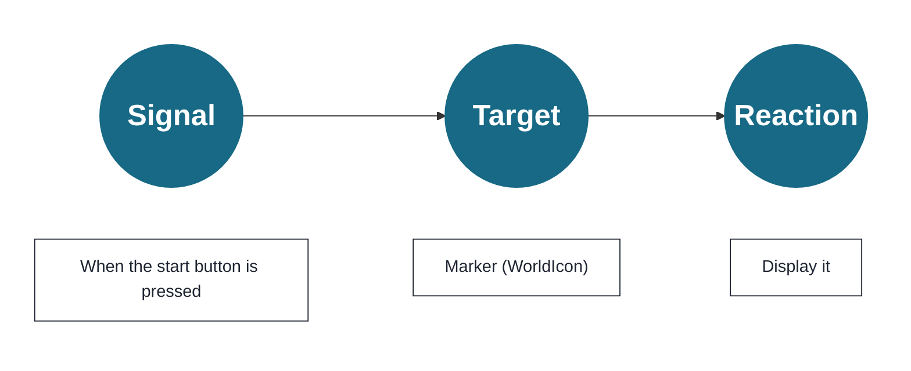
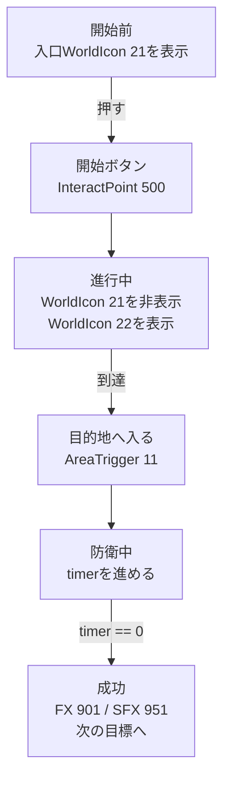

The objects placed on the map in Chapter 4 were given an **installation position** and an **address (ID) used to call them**. However, **who sends the signal, which address it is sent to, and what instruction is sent have not been decided yet.**
In this chapter, before moving to TypeScript, we will organize the idea of **designing signal → target (ID) → reaction as one continuous path**. Once this path is clear, your map changes from "a model that is merely placed there" into "gameplay that responds to the player."

Here, rather than dealing in detail with block-style visual programming and editor operations, we will determine the relationship between events, IDs, and reactions in a way that can be directly transferred to later TypeScript implementations.

## Signal → Target → Reaction (in other words)

* Signal: pressed / entered / time reached
* Target: InteractPoint 500, WorldIcon 21, AreaTrigger 11... (specified by ID)
* Reaction: show / hide / light up / play a sound / spawn

A signal means receiving an event. For example, "entered area A" or "reached 100 points."
The target decides what will be affected by that signal.
The reaction decides what the target should do.

Chapter 5 is the design work for connecting behavior to the IDs from Chapter 4.

## Organize in a table first

Before writing code, filling in at least this table will make it easier to stay oriented.
There is no complicated logic to decide here.
You are only deciding "what happens," "what is the target," and "what should it do."

| Signal | Target | Reaction | Confirmation method |
| ---- | ---- | ---- | ---- |
| Press InteractPoint 500 | WorldIcon 21 / 22 | Hide the entrance and show the destination | The marker changes immediately after pressing |
| Enter AreaTrigger 11 | FX 901 / SFX 951 | Play light and sound effects | They play only on arrival |
| Defense time reaches 0 | Score / next WorldIcon | Treat it as success and move to the next step | It does not fire twice |

If you look only at the flow, it looks like this:

If you can explain this table and flow, the code from Chapter 6 onwards will be ``copying this design to TypeScript''.
On the other hand, if you write code without this being ambiguous, you will get lost the moment the number of IDs and conditions increases.

# 1 “First success experience” in 5 minutes

The goal is simple.
**Create the following format: ``Press the start button (InteractPoint 500) → The landmark (WorldIcon 21→22) moves forward → When you enter the destination (AreaTrigger 11), light (FX 901) and sound (SFX 951) will be emitted.''**

## Procedure

### 1 . Determine the initial state (at the start of the game)

* Initial position WorldIcon (ID:21) → Display
* WorldIcon at target position (ID:22) → Hide

I'll leave it as. The first place you want to go to is "before the entrance (21)".

### 2 . Start from the start button

Select the event "InteractPoint pressed" and enter 500 in the target ID.

As a reaction,

* Display the message "Operation Start" on the screen for just a few seconds
* Initial position WorldIcon (ID:21) → Hide
* WorldIcon at destination position (ID:22) → Display

Arrange them. **You will now see “Press to start”. **
By changing the WorldIcon to display the destination, the player will know where to go at a glance.

### 3 . Create a performance at your destination

When the event "When entering AreaTrigger(ID:11)" occurs, as a reaction,

* Play FX 901
* Play SFX 951

Connect. If it is a loop type effect, it is also convenient to create a stop using ``Emitted from AreaTrigger''.

## Highlights when not moving

* ID typo (500/21/22/11/901/951)
* WorldIcon "display/hide" order (delete 21 and display 22)
* Isn't the object missing the judgment due to insufficient height (Y)?

Conclusion: If you press → the mark moves forward → when you arrive there is a light and sound, you will pass.
Next, without breaking this core, we will add ``assemble,'' ``send vehicles,'' ``move AI,'' and ``tighten with time.''

# 2 Recipes by purpose: Frequently used extensions in this order
## A. Gather (immediately after the start button)

> "Press it to send everyone to the meeting point."

There are two ways.

* Use respawn: call back to each team's SpawnPoint (e.g. 1001/1002)
* Use teleport: move to coordinates (sudden performance, fast implementation)

It is easy to understand if you insert both immediately after InteractPoint ID:500.

## B. Taking out a vehicle (at a turning point in supply or performance)

Assuming that the VehicleSpawner ID is divided into **permanent (2001)/event (2090 units)**,

* Activate/reappear transport vehicle (ID:2001) when pressing 500
* Tank (ID:2090) reappears upon reaching the destination (AreaTrigger ID:11)

Simply tie it to create a rhythm of play.

## C. Make AI spring up and advance

* Starts AI_Spawner when pressed (InteractPoint ID: 500) or intrusion (AreaTrigger ID: 11).

## D. Tighten with time (defense for 10 seconds → move on if successful)

Placing a countdown after the arrival creates drama.

* When entering AreaTrigger(ID:11), display starts from count "10"
* UI updates every 1 second
* At count 0, **FX switching** / **Next WorldIcon** / **Score addition** / **Phase flag ON**

To prevent multiple fires, the trick is to set the "defending" flag first and then take it down when you're done.

To expand, simply ``increase signals'', ``increase destinations'', and ``add one reaction''. Unless you break down the core (push → guidance → reach → performance), you won't go bankrupt.

**Next, we will arrange the display and presentation order to create a flow of “understand → feel good”. **

# 3 Display and presentation: Just follow the order to get the message across

Players will understand faster if the order is **Words → Landmarks → Sounds and Lights**.

1. First state in short words, ``What do you want me to do next?''
2. Next, switch WorldIcon and move the arrow forward.
3. Layer FX (effects)/SFX (sound) upon success.

**If the order is reversed (sudden light and sound), there will be a surprise, but the reason will not be conveyed. ** If you remember that the UI is basically “individual display” and the presentation is “shared throughout,” it will be less likely that you will mix up the scope.

**Conclusion: Words → Landmarks → Effects. This alone will reduce the chance of players getting lost. **
Next, finally, I will summarize how to fix it when it stops and check the completion.

# 4 If it stops: How to fix it (specify with 3 moves)

1. Simplify: Press and return to messages only. If you move, move on.
2. Backward: Return WorldIcon switching → If it passes, return FX/SFX.
3. Visualization: Small UI display of flags and counts. Visually check to see if you have passed the branch.

Finally, check again to see if the ID is -1 or if it is the same type and is not duplicated. 90% of it is here.

**Conclusion: By simplifying → going back a step → visualizing, you can always find the cause. **
Next, tighten with a short check to make sure the minimum loop is working properly.

# 5 Completion check (minimum loop)

* Starts when pressed (InteractPoint ID:500 is the starting point)
* The landmark moves forward (switches in the order of WorldIcon ID:21→ID:22)
* When you arrive, there will be light and sound (FX ID:901 / SFX ID:951 will appear with AreaTrigger ID:11)

Once things have stabilized to this point, the purpose of Chapter 5 has been achieved. In the next chapter, we will transfer the same idea to TypeScript and move on to reusable components.

Conclusion: Chapter 5 is the chapter to guarantee your “first successful experience”. If the core goes through here, the rest is addition.

---

📘 **In the next chapter "Create your own mode with scripts"**, we will replace the written "signal → destination → reaction" with events/functions/states in the programming code, and follow the Portal SDK's `index.d.ts`. Implement `WorldIcon`, `FX`/`SFX`, `Spawner`, and counting as components.
