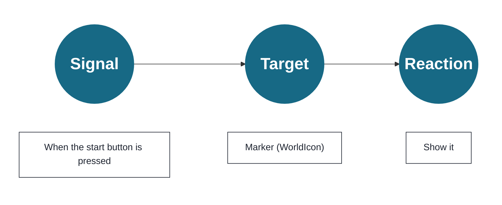
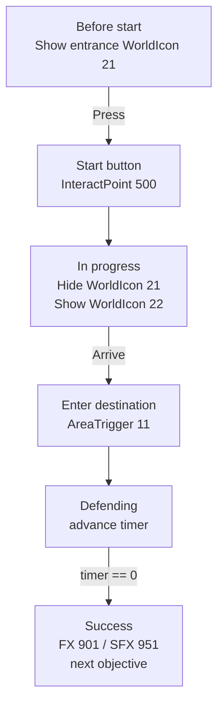

The objects placed on the map in Chapter 4 now have **placement positions** and **addresses for calling them (IDs)**. However, **who gives the signal, which address receives it, and what instruction is sent have not been decided yet.**
In this chapter, before moving to TypeScript, we will organize the idea of **designing signal -> target (ID) -> reaction as one continuous path**. Once this path works, your map changes from "a model that was merely placed there" into "play that responds to the player."

Here, we will not go deeply into block-style visual programming or editor operations. Instead, we will decide the relationships between events, IDs, and reactions in a form that can later be transferred directly into TypeScript implementation.

## Signal -> Target -> Reaction (Rephrased)

* Signal: pressed / entered / time reached
* Target: InteractPoint 500, WorldIcon 21, AreaTrigger 11, and so on (specified by ID)
* Reaction: show / hide / light up / play sound / spawn

A signal means receiving an event. For example, "entered area A" or "reached 100 points."
The target decides what will be moved or controlled in response to the signal.
The reaction decides what the target should do.

Chapter 5 is the design work for sending behavior through the IDs from Chapter 4.

## Organize It in a Table First

Before writing code, fill in at least this table so you do not lose your way.
You are not deciding complicated logic here.
You are deciding "what happens," "what it targets," and "what it does."

| Signal | Target | Reaction | How to confirm |
| ---- | ---- | ---- | ---- |
| Press InteractPoint 500 | WorldIcon 21 / 22 | Hide the entrance marker and show the destination marker | The marker changes immediately after pressing |
| Enter AreaTrigger 11 | FX 901 / SFX 951 | Play light and sound | Plays only on arrival |
| Defense time reaches 0 | Score / next WorldIcon | Treat as success and move on | Does not fire twice |

If we show only the flow, it looks like this.

If you can explain this table and flow, the code from Chapter 6 onward becomes the work of transferring this design into TypeScript.
If you start writing code while this is still vague, you will get lost the moment IDs and conditions increase.

# 1 The First Success Experience in 5 Minutes

The goal is simple.
**We will build this shape: press the start button (InteractPoint 500) -> the marker advances (WorldIcon 21 -> 22) -> when the player enters the destination (AreaTrigger 11), light (FX 901) and sound (SFX 951) play.**

## Steps

### 1. Decide the Initial State (at Game Start)

* Initial-position WorldIcon (ID:21) -> show
* Destination-position WorldIcon (ID:22) -> hide

This is because the first place you want players to head toward is the area just before the entrance (21).

### 2. Use the Start Button as the Starting Point

Choose the "InteractPoint pressed" event, and enter 500 as the target ID.

As reactions, line up the following.

* Show the message "Operation started" on screen for a few seconds
* Initial-position WorldIcon (ID:21) -> hide
* Destination-position WorldIcon (ID:22) -> show

**Now players can see that pressing the button starts the flow.**
When the WorldIcon switches to the destination marker, players can immediately understand where to go next.

### 3. Play Presentation at the Destination

When the event "entered AreaTrigger (ID:11)" occurs, connect these reactions.

* Play FX 901
* Play SFX 951

If the effect loops, it is useful to also create a stop action for "exited AreaTrigger".

## Where to Look When It Does Not Move

* Mistyped IDs (500/21/22/11/901/951)
* The order of WorldIcon show / hide (hide 21, then show 22)
* Whether insufficient object height (Y) lets the player slip through the detection area

Conclusion: if pressing the button moves the marker forward, and arrival plays light and sound, this step passes.
Next, without breaking this core, we will add gathering players, spawning vehicles, moving AI, and ending with time.

# 2 Recipes by Purpose: Add Common Extensions in This Order

## A. Gather Players (Immediately After the Start Button)

> "When pressed, send everyone to the meeting point."

There are two methods.

* Use respawn: send players back to each team's SpawnPoint (for example, 1001/1002)
* Use teleport: move players to coordinates (sudden as presentation, fast to implement)

Both are easiest to understand when placed immediately after InteractPoint ID:500.

## B. Spawn a Vehicle (at Supply or Presentation Beats)

Assuming VehicleSpawner IDs are split into **permanent (2001)** and **event-based (2090s)**:

* When 500 is pressed, enable or respawn the transport vehicle (ID:2001)
* When the destination is reached (AreaTrigger ID:11), respawn the tank (ID:2090)

Just connecting these creates a rhythm for play.

## C. Spawn AI and Make It Advance

* Use pressing the button (InteractPoint ID:500) or entering an area (AreaTrigger ID:11) as the signal to activate AI_Spawner.

## D. End with Time (Defend for 10 Seconds -> Success Moves On)

Putting a countdown after arrival creates drama.

* When the player enters AreaTrigger (ID:11), start displaying the count from "10"
* Update the UI every second
* At count 0, **switch FX** / **move to the next WorldIcon** / **add score** / **turn the phase flag ON**

To prevent repeated firing, the trick is to first raise a "defending" flag, then lower it when the sequence ends.

Extensions are only a matter of adding signals, adding targets, or adding one reaction. As long as you do not break the core flow (press -> guide -> arrive -> presentation), the design will hold.

**Next, we will arrange the display and presentation order to create the flow of "understand -> feels good."**

# 3 Display and Presentation: The Order Alone Makes It Understandable

Players understand faster when the order is **words -> marker -> sound and light**.

1. First, use short words to show what you want the player to do next.
2. Then switch the WorldIcon and move the guide forward.
3. On success, layer FX (effect) and SFX (sound).

**If the order is reversed and light/sound comes suddenly, it may surprise the player, but the reason will not be clear.** It also helps to remember that UI is basically individual display, while presentation is shared by everyone. That reduces scope mistakes.

**Conclusion: words -> marker -> effects. That alone reduces lost players.**
Next, we will summarize how to fix things when they stop, then finish with a completion check.

# 4 If It Stops: A Three-Step Debugging Pattern

1. Simplify: return to "press -> message only". If that works, move forward.
2. Step back: restore WorldIcon switching. If that works, restore FX / SFX.
3. Visualize: show flags and counts in a small UI. Check visually whether the branch was reached.

Finally, check one more time whether IDs are not -1 and are not duplicated within the same type. This is where 90% of problems are.

**Conclusion: simplify -> step back -> visualize. This will get you to the cause.**
Next, we finish with a short check that confirms the minimum loop is working.

# 5 Completion Check (Minimum Loop)

* It starts when pressed (InteractPoint ID:500 is the starting point)
* The marker moves forward (WorldIcon switches from ID:21 to ID:22)
* Light and sound play on arrival (AreaTrigger ID:11 triggers FX ID:901 / SFX ID:951)

Once this is stable, the goal of Chapter 5 is complete. In the next chapter, we will transfer the same idea to TypeScript and move toward reusable components.

Conclusion: Chapter 5 guarantees the first success experience. Once the core works here, everything after this is addition.

---

📘 **In the next chapter, "Creating Your Own Mode with Scripts",** we will replace the written "signal -> target -> reaction" with programming-code events, functions, and state, then implement `WorldIcon`, `FX` / `SFX`, `Spawner`, and counts as components according to the Portal SDK's `index.d.ts`.
