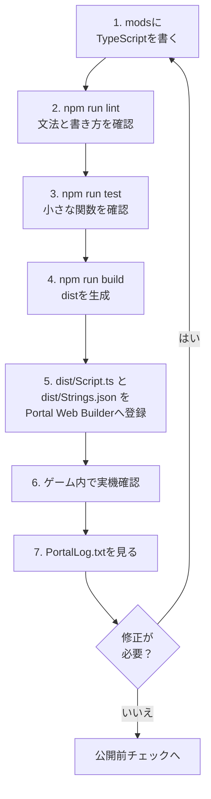

:::message alert

The code in this chapter is a minimal example to understand the Portal SDK's TypeScript API. Please be sure to check the operation on your local host and on a real device before actually publishing it.

:::

:::message alert
Programming using TypeScript begins here, but please **never include Japanese** in the program.
As of November 1, 2025, Portal's Script feature does not support multi-byte characters such as Japanese. Please use only alphabets, numbers, and some symbols.

In this book, Japanese text is not included in the explanations using code comments. Please read the main text carefully.
:::

# 0 “Your own mode” created with scripts

> --- Replace Chapters 4 (Place) and 5 (Connect) with "Write and Move"

In Chapter 4, we placed the necessary items on the map and added **ID (address)**.
In Chapter 5, we designed the flow of signal → destination (ID) → reaction.

In this chapter, we'll do the same thing in code (TypeScript). There are three reasons.

1. Hard to break even when enlarged:
  Writing directly to Portal Web Builder allows you to create things quickly, but when things get complicated, it becomes difficult to see what is being done. Code is easy to search by name and line, and easy to fix.

2. You can use the same process over and over again:
  Frequently used processes such as "switching icon display" and "playing sound effects" can be named and made into components.

3. Be able to anticipate mistakes:
  You can install a mechanism to prevent problems such as incorrect input of numbers (ID) and problems where the same event occurs over and over again from the beginning.

> It may seem difficult, but what you need to do is still the same as in Chapter 5.
> "Press → Move the landmark forward → Light and sound when you arrive" - First, we will reproduce this with a code.

# 0 .1 How to read the code chapter

From Chapters 6 to 8, the amount of code suddenly increases.
It's okay not to try to understand everything from the beginning.
First, just figure out what changes when you touch which file.

| Place to touch first | Role | What you can do first is enough |
| ---- | ---- | ---- |
| `ids.ts` / `OBJECT_ID` | Copy the ObjId added in Godot to the code | Do not leave `-1` or duplicates |
| `config.ts` | Adjustment values for seconds, distance, cooldown, etc. | You can change defense seconds and recommended number of people |
| `Strings.json` | Register the characters to be displayed on the screen | Prepare the text you want to display in advance |
| `Script.ts` | Entrance called from Portal | Only the location of the event function is known |
| `PortalLog.txt` | Operation confirmation log | Check if the event has been fired |

The code body can look like a spell at first.
The reading order is: `ids.ts` to view the address, `config.ts` to view the numerical value, `Strings.json` to view the displayed text, and finally `Script.ts` to view the flow.
It is enough to go back and read the detailed meanings of the functions after they have been executed.

# 0 .5 Read `index.d.ts` as a dictionary

The Portal SDK's TypeScript API is organized at `code/types/mod/index.d.ts` within the SDK.

The `mod` namespace in this file is a dictionary of functions and types to call from your portal script. If you come across a function that you don't understand, search this file first.

| What you see | Meaning | Examples |
| ---- | ---- | ---- |
| `declare namespace mod` | Portal API location | `mod.Wait(...)` |
| Opaque type | Type that does not allow you to directly touch the entity on the Portal side | `mod.Player`, `mod.WorldIcon` |
| `export function On...` | Event entrance | `OnPlayerInteract` |
| `GetObjId` | Read ObjId on Godot | Check ID of pressed InteractPoint |
| `RuntimeSpawn_...` | Prefab candidates that can be generated with `SpawnObject` | `mod.RuntimeSpawn_Common.AreaTrigger` |
| `Message` | Create display string | `mod.Message(mod.stringkeys.hello)` |
| `CreateVector` | Create three elements such as coordinates and color | `mod.CreateVector(1, 2, 3)` |

Think of the opaque type as a tag that points to an entity on the portal side, rather than a box whose contents can be directly manipulated. For example, if you receive `mod.Player`, instead of just looking at the properties, you can retrieve the information using APIs like `mod.GetTeam(player)` or `mod.GetSoldierState(player, ...)`.

Enums like `RuntimeSpawn_Common` and `RuntimeSpawn_Abbasid` are candidates that can be generated from TypeScript with `mod.SpawnObject(...)`, rather than explanations of the Object Library that you install manually in Godot.
Please be aware of the difference that hand-placed items are picked up at `ObjId` like `GetInteractPoint(500)`, and items generated from code are handled by holding the return value of `SpawnObject` in a variable.

# 0 .6　Reading table for TypeScript beginners

| Code | Meaning for beginners |
| ---- | ---- |
| `export function On...` | Entrance of event called from Portal |
Functions that can wait like | `async function` | `await mod.Wait(...)` |
| `mod.Wait(1)` | Wait 1 second |
| `mod.GetXxx(id)` | Get placed object with ObjId using Godot |
| `mod.GetObjId(obj)` | Check the ObjId of the received placement |
| `mod.Message(...)` | Create a message to be displayed on the screen |
| `mod.CreateVector(x, y, z)` | Create three numbers to use for coordinates, orientation, color, etc. |
| `const OBJECT_ID = ...` | A copy of the ObjId ledger on the code side |

When reading code, you don't have to read it as an English sentence. It is enough to distinguish between event, get, wait, display, and state update.

# 0 .7 Development loop using templates

The code in this chapter will be written in the `mods` folder of the template repository.

Rather than writing by pasting it directly into Portal Web Builder, I develop it using the following flow.

1. Write TypeScript under `mods`.
2. Check the grammar and writing style at `npm run lint`.
3. Check the parts that can be tested at `npm run test`.
4. Combine `npm run build` into `dist/Script.ts`.
5. Register `dist/Script.ts` and `dist/Strings.json` in Portal Web Builder.
6. Check the actual device in-game and view `PortalLog.txt`.



The entry point of this loop is `mods` and the exit point is Portal Web Builder.
The code written separately for `mods` is combined into one `dist/Script.ts` that can be passed to the portal using `npm run build`.
If you want to use the characters displayed on the screen, please also check `Strings.json`.

The success screen is not the only thing you should see after moving in-game.
Check at `PortalLog.txt` whether the intended event was fired, whether the same process is running over and over again, and whether the variables and ObjId are as expected.
If there is a problem, instead of fixing it directly on the portal, go back to the original code at `mods` and fix it, then go through `lint`, `test`, `build`, register, and check the actual device again.

That is, the default return destination is always `mods`.
Portal Web Builder is the place for final confirmation and uploading, and `mods` is the place for designing and modifying, so you won't get confused.

Initially, just `mods/Script.ts` is fine. Once you get used to it, divide it into `mods/ids.ts`, `mods/ui.ts`, and `mods/game.ts` as in Chapter 7. Even if you separate them, `npm run build` will be combined into one `dist/Script.ts` at the end.

## How to use commands

| Timing | Command to execute |
| ---- | ---- |
| Immediately after writing the code | `npm run lint` |
| I want to automatically correct | `npm run lint:fix` |
| I want to check the behavior of the function | `npm run test` |
| Before registering on Portal | `npm run build` |

`npm run build` is not a command that guarantees its correctness. This command combines multiple files into one. Before publishing, please be sure to pass through `lint`, `test`, and `build` in this order. If you land on your side, you'll fall spectacularly later.

## Test IDs and small functions with Vitest

It is not necessary to reproduce all of Portal's behavior in your own tests. In Vitest, we first look at the **small function we wrote**.
Execute `npm run test` immediately after adding the ID, immediately after correcting the condition function, and before registering to the portal.

For example:

* Is `-1` mixed with `ids.ts`?
* Are there any duplicate IDs within the same classification?
* Are there required IDs such as `IP_START`, `AREA_TARGET`, `ICON_TARGET`?
* Can `true` be created only under the conditions that allow `isStartInteract()` to start?
* Does `ConditionState` work as a guard to prevent the same event from passing twice?
* Does the function that branches processing from ObjId branch as expected?
* Does the message generation function pass the correct keys and arguments?

The template contains `vitest` and `bfportal-vitest-mock`. `test/sample.test.ts` provides an alternative to the Portal API at `setupBfPortalMock` and checks whether `DisplayNotificationMessage` is called.

To check the ID, create a test file like `test/ids.test.ts` and read the constants from `ids.ts` to check.
What you can check with Vitest is the "ID definition written on the code side." It cannot be guaranteed that objects with the same ID are actually placed on Godot.
Therefore, check the actual placement on the Godot side using the ledger and ObjIdManager in Chapter 4. Vitest is on the code side, ObjIdManager is on the Godot side. If you consider this separately, you will be able to reduce the number of omissions.

Please separate the processing of the game itself into functions as much as possible to make it easier to test. If you write everything inside the event function, testing will quickly become complicated.

# 1 First preparation: Name the ID (this is the most important)

If the ID is a number, it will be difficult to understand.
For example, even if it says 21, I can't immediately remember whether it's an "entrance icon" or a "destination icon." Therefore, give the ID a name (constant).

### How do you write it?
```ts
const OBJECT_ID = {
	// Team
	TEAM_A: 1,
	TEAM_B: 2,

	// WorldIcon
	ICON_ENTRANCE: 21,
	ICON_TARGET: 22,

	// InteractPoint
	IP_START: 500, // Start Button

	// AreaTrigger
	AREA_TARGET: 11, // destination

	// VFX
	VFX_GOAL: 901,
	// SFX
	SFX_GOAL: 951,

	// Team SpawnPoint
	SP_TEAM_A: 99,
	SP_TEAM_B: 99,
};
```

### Why is it necessary?
* You will understand the meaning just by reading it.
* Typing errors will be reduced (accidents of swapping 21 and 22 will disappear).
* Even if you change the ID later, just modifying the one line above will fix the whole thing.

### Stumble prevention
* Be sure to check that **-1 (unset)** is not confused here.
* Check that there are no duplicates of the same type.
* If you are unsure, put the ledger from Chapter 4 next to you and check it out loud one by one.

# 2 Remember “Where are you now?” (Status box)

There are stages in the game's progress, such as ``Before it begins,'' ``Beginning,'' and ``Arrived.''
Keeping this in mind in your code will prevent you from running through the same event over and over again.

## How do you write it?

In this document, `modlib.ConditionState` is used with priority for progress management and prevention of multiple firings.

There are ways to have a stage name like `type Phase = "Idle" | "Started"`, but in Portal there are many situations where you want to process something only once at the moment a condition is met.
`ConditionState` fits the bill perfectly.

`ConditionState` remembers and compares the previous condition result and the current condition result.
Returns `true` only when the previous time was `false` and the current time is `true`, otherwise it returns `false`.

| Last time | This time | Return value of `update()` | Meaning |
| ---- | ---- | ---- | ---- |
| `false` | `false` | `false` | Conditions not met yet |
| `false` | `true` | `true` | The moment the conditions are met. Process only here |
| `true` | `true` | `false` | Condition continues but no double execution |
| `true` | `false` | `false` | Condition has been removed. Prepare for the next establishment |

In other words, `ConditionState` is not a tool that processes as long as the condition is true, but a tool that processes only the moment the condition is met.
It is used in places where multiple firings would be a problem, such as start notification, arrival judgment, the moment when the number of people is gathered, and the start of counting.

```ts
import * as modlib from "modlib";

const enoughPlayersState = new modlib.ConditionState();

/**
 * Returns true when the game can start.
 */
function hasEnoughPlayersToStart(): boolean {
	return mod.CountOf(mod.AllPlayers()) >= 2;
}

export function OngoingGlobal(): void {
	if (enoughPlayersState.update(hasEnoughPlayersToStart())) {
		modlib.ShowNotificationMessage(mod.Message(mod.stringkeys.ready));
	}
}
```

The key is not to write `state.update(mod.CountOf(mod.AllPlayers()) >= 2)` directly.
By dividing the conditional expression into functions such as `hasEnoughPlayersToStart()`, it will be easier to read ``what condition you are looking at'' even if you are not good at English.

## What is it used for?

* "I want to be notified only when there are 2 or more players" → Pass only once at `ConditionState`

* "It's a problem if the start button is pressed twice" → Pass `isStartInteract()` to `ConditionState`

* “It would be a problem if you pass “arrived” again after arriving” → Pass `isTargetReached()` to `ConditionState`

## Stumble prevention

* Conditional expressions must be divided into functions starting with `has...` / `is...` / `can...`.
* Prepare one `ConditionState` for each condition. Do not use the same instance for start and arrival.
* When debugging, it is easier to trace the cause by posting the return value of the conditional function to `console.log`.

# 3 First code execution (copy "Press → Landmark → Arrival → Light and sound")

First, convert the minimal loop from Chapter 5 into code.
Here, we value **“order and reason”** more than “how to write”.

## 3 .0 First...

Write the code below at the top of the file.
This is a package (group of programs) that allows you to easily use the SDK provided by the official default.

```ts
import * as modlib from "modlib";
```

In this document, `modlib` will be used with priority in situations where it is available.
`modlib` is an auxiliary library that makes it easier to display notifications, obtain team IDs, convert Portal arrays, fire conditions only once, generate UI, etc.
Use `mod` only for processes that are not available in `modlib` or for processes that require detailed direct control over the Portal API.
For more information, see Appendix C "modlib Description".

## 3 .1 Initialization at game start

``Show the entrance icon'' ``Hide the destination icon.'' Make your “initial posture” clear.

The code below shows and hides WorldIcon.

* The VisibleWorldIcon function is a function that can display or hide the icon.
* The display of the WorldIcon icon and text is switched by calling mod.EnableWorldIconImage and mod.EnableWorldIconText provided by the SDK.
* Hooks the SDK's OnGameModeStarted event, which indicates the start of the game, and performs **``When the game mode starts, ``set the current game state'' and ``show/hide the icon.''**

```ts
/**
 * Show/hide icons
 * @param id ObjectId
 * @param visible Show=true
 */
function VisibleWorldIcon(id: number, visible = true) {
	const icon = mod.GetWorldIcon(id);
	mod.EnableWorldIconImage(icon, visible);
	mod.EnableWorldIconText(icon, visible);
}

const startInteractState = new modlib.ConditionState();
const targetReachedState = new modlib.ConditionState();

let gameStarted = false;
let targetReached = false;

/**
 * Reset game progress flags.
 */
function resetGameProgress(): void {
	gameStarted = false;
	targetReached = false;
}

/**
 * Returns true when the start interact point can start the game.
 */
function isStartInteract(objectId: number): boolean {
	return !gameStarted && objectId === OBJECT_ID.IP_START;
}

/**
 * Returns true when the target area can complete the route.
 */
function isTargetReached(objectId: number): boolean {
	return gameStarted && !targetReached && objectId === OBJECT_ID.AREA_TARGET;
}

/**
 * Mark the game as started.
 */
function markGameStarted(): void {
	gameStarted = true;
}

/**
 * Mark the target as reached.
 */
function markTargetReached(): void {
	targetReached = true;
}

/**
 * Event: This will trigger at the start of the gamemode.
 */
export function OnGameModeStarted() {
	resetGameProgress();

	VisibleWorldIcon(OBJECT_ID.ICON_ENTRANCE, true);
	VisibleWorldIcon(OBJECT_ID.ICON_TARGET, false);
}
```


## 3 .2 Make the start button the “starting point”

When pressed, (1) short message → (2) icon switching.
It is easy for players to understand the order of "words → landmarks → effects".

```ts
/**
 * Event: This will trigger when a Player interacts with InteractPoint.
 */
export async function OnPlayerInteract(eventPlayer: mod.Player, eventInteractPoint: mod.InteractPoint) {
	const eventObjectId = mod.GetObjId(eventInteractPoint);

	if (startInteractState.update(isStartInteract(eventObjectId))) {
		markGameStarted();

		// OFF IP
		mod.EnableInteractPoint(eventInteractPoint, false);

		// Message (All Player)
		modlib.ShowEventGameModeMessage(mod.Message(mod.stringkeys.start));

		await mod.Wait(0.5);

		// Change Icon
		VisibleWorldIcon(OBJECT_ID.ICON_ENTRANCE, false);
		VisibleWorldIcon(OBJECT_ID.ICON_TARGET, true);
	}
}
```

## 3 .3 When you enter the destination, send out the effect

The arrival signal is AreaTrigger.
The moment you enter, **Light (FX) and Sound (SFX)** will play.

```ts
/**
 * Event: This will trigger when a Player enters an AreaTrigger.
 */
export function OnPlayerEnterAreaTrigger(eventPlayer: mod.Player, eventAreaTrigger: mod.AreaTrigger) {
	const eventObjectId = mod.GetObjId(eventAreaTrigger);

	if (targetReachedState.update(isTargetReached(eventObjectId))) {
		markTargetReached();

		// OFF Target
		VisibleWorldIcon(OBJECT_ID.ICON_TARGET, false);

		// RUN Sound
		mod.PlaySound(OBJECT_ID.SFX_GOAL, 1);

		// RUN Effect
		const vfx = mod.GetVFX(OBJECT_ID.VFX_GOAL);
		mod.EnableVFX(vfx, true);
	}
}
```

### When things don't go well

* ID input error (21/22/11/500/901/951)
* AreaTrigger's **height (Y)** is insufficient and passes the judgment
* Check if "double press" and "multiple arrival" are stopped using `ConditionState` and `is...` functions

> If you can move up to this point, you will pass.
> From here, we will “add” little by little.

## 3 .4 Addition 1: Collect (Press to collect)

Frequently asked request: ``Press the button and everyone will go to the meeting point.''
There are two ways.

* Respawn: Call back to specified SpawnPoint
* Movement (teleport): move to coordinates

### Respawn: Call back to specified SpawnPoint

The program below moves to a specific SpawnPoint.
**If you set a SpawnPoint on the map, you can spawn at that location**.

However, this is difficult if the location changes dynamically.
An example of something that changes dynamically is the "player position."

```ts
/**
 * Event: This will trigger when a Player interacts with InteractPoint.
 */
export function OnPlayerInteract(eventPlayer: mod.Player, eventInteractPoint: mod.InteractPoint) {
	const eventObjectId = mod.GetObjId(eventInteractPoint);

	if (startInteractState.update(isStartInteract(eventObjectId))) {
		markGameStarted();

		// OFF IP
		mod.EnableInteractPoint(eventInteractPoint, false);

		// Message (All Player)
		modlib.ShowEventGameModeMessage(mod.Message(mod.stringkeys.start));

		// Change Icon
		VisibleWorldIcon(OBJECT_ID.ICON_ENTRANCE, false);
		VisibleWorldIcon(OBJECT_ID.ICON_TARGET, true);

    // Spawn Player
		const eventTeam = mod.GetTeam(eventPlayer);
		const eventTeamId = modlib.getTeamId(eventTeam);
		const players = mod.AllPlayers();
		for (let index = 0; index < mod.CountOf(players); index++) {
			const player = mod.ValueInArray(players, index);
			const team = mod.GetTeam(player);
			const teamId = modlib.getTeamId(team);

			if (eventTeamId === teamId && eventObjectId === OBJECT_ID.TEAM_A) {
				mod.SpawnPlayerFromSpawnPoint(player, OBJECT_ID.SP_TEAM_A);
			}
		}
	}
}
```


### Movement (teleport): Move to coordinates (easy)

The program below moves to a specific object.
**Can be any object and spawn at the location of that object**.
With "Respawn: Call back to specified SpawnPoint", you can only fly to the SpawnPoint object, but with this method you can fly anywhere as long as the Obj Id is specified in advance.
**For example, it is possible to fly even at the "player position" whose position changes dynamically, or the "position of a flower bed object" which is a static object with no characteristics.**

However, the code will be a bit long, so if you always want to teleport to the same location, you should use "Respawn: Call back to the specified SpawnPoint".

```ts
/**
 * Event: This will trigger when a Player interacts with InteractPoint.
 */
export function OnPlayerInteract(eventPlayer: mod.Player, eventInteractPoint: mod.InteractPoint) {
	const eventObjectId = mod.GetObjId(eventInteractPoint);

	if (startInteractState.update(isStartInteract(eventObjectId))) {
		markGameStarted();

    // OFF IP
		mod.EnableInteractPoint(eventInteractPoint, false);

		// Message (All Player)
		modlib.ShowEventGameModeMessage(mod.Message(mod.stringkeys.start));

		// Change Icon
		VisibleWorldIcon(OBJECT_ID.ICON_ENTRANCE, false);
		VisibleWorldIcon(OBJECT_ID.ICON_TARGET, true);

		// Teleport
		const eventTeam = mod.GetTeam(eventPlayer);
		const eventTeamId = modlib.getTeamId(eventTeam);

		const spawnPointA = mod.GetSpawnPoint(OBJECT_ID.SP_TEAM_A);
		const teleportPointTeamA = mod.GetObjectPosition(spawnPointA);

		const players = mod.AllPlayers();
		for (let index = 0; index < mod.CountOf(players); index++) {
			const player = mod.ValueInArray(players, index);
			const team = mod.GetTeam(player);
			const teamId = modlib.getTeamId(team);

			if (eventTeamId === teamId && eventObjectId === OBJECT_ID.TEAM_A) {
				mod.Teleport(player, teleportPointTeamA, 0);
			}
		}
	}
}
```

### Tips:

* If you feel that the move is sudden, it is natural to proceed in the following order: Message → Short Wait → Move.
* Some people may not know what just happened, so it is helpful to display the **destination icon (ICON_TARGET)** again after meeting.

## 3 .5 Additional example: Tighten with time (10 seconds defense)

A countdown like ``Arrival → Keep for 10 seconds → Success'' is very exciting.
However, the trick is to handle cancellations (leaving the area) properly.

### Example: 10 seconds count on arrival, message on successful defense

```ts
let defending = false;
const defenseSec = 10;
async function startDefense(seconds: number) {
	if (defending) return; // Prevent double startup.
	defending = true;

	const team = mod.GetTeam(OBJECT_ID.TEAM_A);

	for (let t = seconds; t > 0; t--) {
		modlib.ShowEventGameModeMessage(mod.Message(mod.stringkeys.countdown), team);
		await mod.Wait(1);

		// Stop when the target state is canceled.
		if (!targetReached) {
			defending = false;
			return;
		}
	}

	defending = true;
	modlib.ShowEventGameModeMessage(mod.Message(mod.stringkeys.success), team);
}

// If you want to "Stop when it comes out"
export function OnPlayerExitAreaTrigger(eventPlayer: mod.Player, eventAreaTrigger: mod.AreaTrigger) {
	if (targetReached) {
		// Allow the target area to trigger again.
		targetReached = false;

		const team = mod.GetTeam(OBJECT_ID.TEAM_A);

		VisibleWorldIcon(OBJECT_ID.ICON_ENTRANCE, true);
		VisibleWorldIcon(OBJECT_ID.ICON_TARGET, false);
		modlib.ShowEventGameModeMessage(mod.Message(mod.stringkeys.failure), team);
  }
}
```

### Tips:

* Prepare a flag (in this case, defense) that indicates whether the count is in progress or not.
* If you decide at the beginning the conditions for interrupting (such as leaving the area), the code will not get lost.

## 3 .6 Preventing “abrupt firing” and “repeated firing” (safety device)

Users may make a mistake or press a button repeatedly just for fun.
At that time, you can prevent the same process from running over and over again by adding a lock function that prevents it from running under certain conditions.

Below is an example of locking that can be easily implemented.
This is just an example, so if you find the example difficult to read or do not suit your purpose, please feel free to try your own implementation.

### Countermeasure: Prevent the same event from running multiple times

**When implementing processing that changes depending on the mode**, you can implement it as follows.

```ts
import * as modlib from "modlib";

const startInteractState = new modlib.ConditionState();
let gameStarted = false;

/**
 * Returns true when this interact event should start the game.
 */
function isStartInteract(objectId: number): boolean {
	return !gameStarted && objectId === OBJECT_ID.IP_START;
}

/**
 * Mark the game as started.
 */
function markGameStarted(): void {
	gameStarted = true;
}

/**
 * Event: This will trigger when a Player interacts with InteractPoint.
 */
// eslint-disable-next-line @typescript-eslint/no-unused-vars
export function OnPlayerInteract(eventPlayer: mod.Player, eventInteractPoint: mod.InteractPoint) {
	const objectId = mod.GetObjId(eventInteractPoint);

	if (startInteractState.update(isStartInteract(objectId))) {
		markGameStarted();
		modlib.ShowNotificationMessage(mod.Message(mod.stringkeys.hello, eventPlayer), eventPlayer);
	}
}
```

### Countermeasure: Prevent events from being hit repeatedly in a short period of time

**If you want to play some sound when a button is pressed, etc., and you don't want the sound to play for a short time**, you can implement it as shown below.

```ts
import * as modlib from "modlib";

let lock = false;
async function throttle(seconds: number, fn: () => void) {
	if (!lock) {
		lock = true;
		fn();
		await mod.Wait(seconds);
		lock = false;
	}
}

/**
 * Event: This will trigger when a Player interacts with InteractPoint.
 */
// eslint-disable-next-line @typescript-eslint/no-unused-vars
export function OnPlayerInteract(eventPlayer: mod.Player, _eventInteractPoint: mod.InteractPoint) {
	//
	throttle(15, () => {
		modlib.ShowNotificationMessage(mod.Message(mod.stringkeys.hello, eventPlayer), eventPlayer);
	});
}
```

### Tips:

* By simply creating a path that can only be taken once, 70% of multiple bugs will disappear automatically.
* Furthermore, if you add the "once every n seconds" guard, it will not break even if you hit it repeatedly.

## 3 .7 Visualization (knowing “now” with debug display)

**"It doesn't work when I press it"** The best way to quickly fix the issue is to be able to see the current status and recent events.

### If you want to output it as a log and check it

Running the experience on localhost will generate `PortalLog.txt`. The standard location is `%LOCALAPPDATA%\Temp\Battlefieldâ„¢ 6` on Windows.

The location may differ depending on the environment and installation status. If you can't find it, search for `PortalLog.txt` within `%LOCALAPPDATA%\Temp`.

If you write the code below, the string of this code will be written and saved in `PortalLog.txt`.
No message will appear in-game, but unlike `ShowNotificationMessage` described below, there is no need to pre-register the string, so you can easily check the operation.

```ts
console.log("message!");
```

### If you want to check on the screen

If you write the following, a message will appear on the game screen.
Unlike `console.log`, the string to be displayed on the screen must be written to `Strings.json` in advance.
Characters that appear on the player's screen, such as notifications, WorldIcon characters, `AddUIText` / `SetUITextLabel`, `ParseUI`, `textLabel`, etc., follow this rule.

The message to be passed to the screen is created using the `mod.Message(...)` function.
If you put `{}` in `Strings.json`, you can insert the values passed after the second argument of `mod.Message` there.

```json
{
  "debugPlayer": "player:{}",
  "debugObjId": "obj:{}"
}
```

Then, on the code side, refer to the key from `mod.stringkeys` and pass only the changing value as an additional argument.

```ts
const objId = mod.GetObjId(eventInteractPoint);
modlib.ShowNotificationMessage(mod.Message(mod.stringkeys.debugPlayer, eventPlayer), eventPlayer);
modlib.ShowNotificationMessage(mod.Message(mod.stringkeys.debugObjId, objId), eventPlayer);
```

The screen will display something like `player:<プレイヤー名>` or `obj:500`.
`mod.Message` accepts up to three additional values in addition to the string key.
If you want to display player name, remaining seconds, score, etc., remember to put the text in `Strings.json` and pass only the value that changes as an argument to `mod.Message`.

### Tips:

* If it doesn't work, first write the event name, ObjId, `gameStarted`, `targetReached`, and number of players in `console.log`.
* Exceptions and unexpected branches are recorded as short alphanumeric characters in the log.
* If it doesn't work, first log the return value of `isStartInteract()` or `isTargetReached()`.
* If the condition is unexpected, review the instance of `ConditionState` and the judgment function.
* If the event has not arrived in the first place, I suspect that you have typed the ID incorrectly.

## 3 .8 “Dividing neatly” can be done later

In the first half, we prioritized "getting things moving first."
Once you get used to it, it will be easier to modify it by dividing the display (UI/effects), state (`gameStarted`, `targetReached`, etc.) and SDK calls into smaller parts.

For example, by collecting the processing as a function like the one shown below in "3.1 Initialization at Game Start", you can combine three lines of code into one line by simply writing `VisibleWorldIcon(**,**)`.

```ts
/**
 * Show/hide icons
 * @param id ObjectId
 * @param visible Show=true
 */
function VisibleWorldIcon(id: number, visible = true) {
	const icon = mod.GetWorldIcon(id);
	mod.EnableWorldIconImage(icon, visible);
	mod.EnableWorldIconText(icon, visible);
}

```

This time, we only summarized three lines, but as you progress in programming, the number of lines may increase to 10 lines...100 lines...for one thing you want to do, so you should get used to grouping them together.


### Tips:

*The order of sorting is ``the ones that I write the most first''.
* Don't force yourself to aim for complete separation; just "win if it becomes easier to read" is OK.

## 3 .9 Common mistakes and easy countermeasures

* ID remained -1
  → Re-enter the numbers in the property field. Update ledger and constants together.
* There were two same IDs
  → Check whether there are any duplications within the same type. Mark the ledger with an ○.
* Nothing happens when I press it
  → Check whether `OnPlayerInteract` is the correct ID, whether `isStartInteract()` becomes `true`, and whether it is caught by the guard of `ConditionState`.
*Nothing comes out when I arrive
  → The height (Y) of `AreaTrigger` is often insufficient.
* Constant sound and light
  → Prepare a process to stop when exiting (`OnPlayerExitAreaTrigger`).
* Goes crazy with repeated hits
  → Add processing to apply restrictions such as `throttle` (thinning) and `ConditionState` (only once).
* You won't understand if you read it later
  → Prioritize “short English messages” and “name on ID”.

# Conclusion

* **Name the ID (constant)**
* Now have somewhere (staged with state flags like `gameStarted` and `ConditionState`).
* Press → Landmark → Arrival → Do not break the minimum loop of light and sound.
* Addition little by little (set/vehicle/AI/time).
* Once you get used to it, give **names (small functions)** to frequently used processes to make them easier to read.

As long as you follow this flow, even beginners can **run their own mode**.
Difficult optimization and large-scale design can be done later. First of all, "It starts when you press it, and when it arrives, it emits a pleasant light and sound." Let's create this with our own hands.

# Guide to the next section

📘 **Next chapter "Small design that neatly divides"** Now, let's build a program and think about how to divide the processing groups of the program so that it can continue to be used with minimal changes in the future after the program has been developed.
