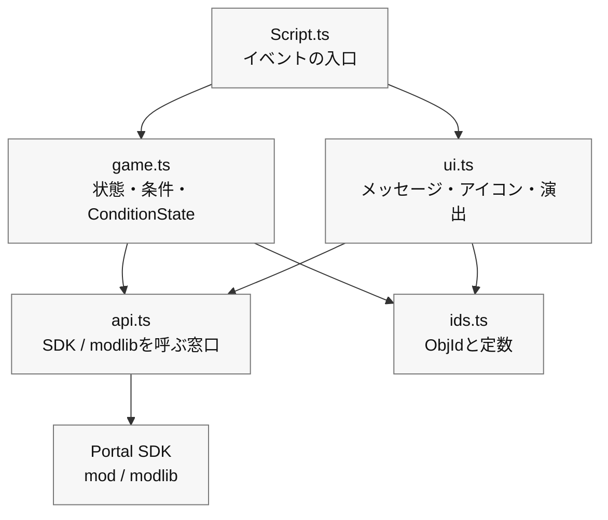

# 0 Small design that “separates neatly”

> --- To code that is hard to break, easy to fix, and can be added later.

In Chapter 6, you were able to run the minimal loop of ``Press → Landmark → Arrival → Light and Sound'' in TypeScript.
As you add more functions from here, similar processes (message display, icon switching, sound effect playback) are scattered all over the place, and even if you only intend to fix a few things, you end up breaking the whole thing.

Therefore, in this chapter, we will introduce ``Small Design'', which simply divides the code into three boxes, without using difficult technical terms as much as possible.
The aim is simple.

* Hard to break (changes in one place are hard to spread to other parts)
* Easy to fix (you know where to touch right away)
* Easy to add (don't be afraid to add new features)

> What we are doing here is not a "complete full-scale design."
>
> **“Easily clean up the code created in Chapter 6”** is all you need to do.

# 1 Divide into three boxes (boundary/state/how to present)

First, let's divide them by role. There are only three things to remember:

1. Boundary (API): Window that calls Portal/SDK.

A place to put only functions that issue commands to the outside world of the game, such as ``actually turn on/off the WorldIcon'' and ``play FX.''

2. State (domain): Game progress and rules.

Small functions that express conditions such as ``Can we start?'' ``Can we reach the destination?'' ``Are we defending?'' ``How many seconds is the count?'' and multiple firing prevention using `modlib.ConditionState`.

3. How to present (UI/direction): Message, icons, sound, and light.

  A box that combines the order of ``words → landmarks → effects'' into one function and takes care of ``just the appearance''.

Initially, it is sufficient to protect only the following dependencies:

| File | Role | What you can call |
| ---- | ---- | ---- |
| `Script.ts` | Entrance that receives Portal events and connects processing | `game.ts`, `ui.ts` |
| `game.ts` | progress state, conditional function, `ConditionState` | `ids.ts`, if necessary `api.ts` |
| `ui.ts` | How to display messages, WorldIcon, FX/SFX, etc. | `api.ts`, `ids.ts` |
| `api.ts` | A thin window to call Portal SDK and modlib directly | `mod`, `modlib` |
| `ids.ts` | Put only ObjId and constants | Don't call anything |

The dependency direction is `Script.ts` → `game.ts` / `ui.ts` → `api.ts` → Portal SDK.
If you start calling in the opposite direction, you will end up in a situation where you just want to change the display, but the game progress is broken.
If in doubt, please submit code that directly interacts with the Portal SDK to `api.ts` and only call short functions in events.

## Stationery (to get a feel for the atmosphere)

```ts
// 1) API boundary
export const api = {
  showIcon: (id: number, on: boolean) => { /* SDK call */ },
  playFX:  (id: number) => { /* ... */ },
  stopFX:  (id: number) => { /* ... */ },
  playSfx:  (id: number) => { /* ... */ },
  vehicle: {
    enable: (id: number, on: boolean) => { /* ... */ },
    respawn: (id: number) => { /* ... */ },
  },
  time: { wait: async (ms: number) => { /* ... */ } },
};

// 2) Game progress gates and flags
import * as modlib from "modlib";

export const startGate = new modlib.ConditionState();
export const targetGate = new modlib.ConditionState();
export const state = { started: false, reached: false, defending: false };

export function canStart(): boolean { return !state.started; }
export function canReachTarget(): boolean { return state.started && !state.reached; }
export function markStarted(): void { state.started = true; }
export function markReached(): void { state.reached = true; }

// 3) UI and effects
export const ui = {
  say: (message: mod.Message, ms = 2000) => { /* Show to all players */ },
  guide: (hideId?: number, showId?: number) => {
    if (hideId !== undefined) api.showIcon(hideId, false);
    if (showId !== undefined) api.showIcon(showId, true);
  },
  celebrate: (FXId: number, sfxId: number) => {
    api.playFX(FXId); api.playSfx(sfxId);
  },
};
```

### Points

* If Portal specifications change, just fix the API.
*If you want to replace the UI text or direction, just fix the UI.
* Game progress specifications can be explained at `state`, `can...`, `mark...`, `ConditionState`.

# 2 Separate files (small folder structure based on template)

4 files are enough for beginners.

```
/mods
  ├─ ids.ts        // Object ID constants
  ├─ api.ts        // SDK boundary
  ├─ game.ts       // Progress flags, ConditionState, predicates
  ├─ ui.ts         // UI and effects
  └─ Script.ts     // Event wiring
```

* ids.ts: List only named IDs like const ICON_TARGET = 22.
* api.ts: Wrap the SDK call into a one-line function (even if the contents are complex, it can be seen as one line from the outside).
* game.ts: `ConditionState`, state, put `can...` / `mark...`.
* ui.ts: Start with the 3-piece set of say/guide/celebrate and increase as needed.
* Script.ts: Write the logic of Chapter 5 (Push → Guidance → Arrival → Light and Sound) while calling the box above.

> By separating the information, ``where should I write it'' becomes fixed and reduces confusion.

The template `npm run build` recursively collects the `.ts` files under `mods` and compiles them into `dist/Script.ts` for registration in the portal. The Portal side can only receive one file, but feel free to divide it up during development.

# 3 Direction of dependence (“downward arrow” only)

Ideally, the arrows should only flow in one direction, like main → ui → api.
Reverse flows such as `api` calling `ui` and `ui` calling `main` cause confusion.
If you keep the mantra "I call you down, but I don't call you up," you will stop the snowball of dependence.



# 4 Demonstration of “separating” the codes in Chapter 6 (small move)

Assume that the minimal loop from Chapter 5 has been placed as is at `mods/Script.ts`.
Here's how to do it in 3 steps.

## Step 1: Move ID (ids.ts)

```ts
// ids.ts
export const IP_START = 500;
export const ICON_ENTRANCE = 21;
export const ICON_TARGET   = 22;
export const AREA_TARGET   = 11;
export const FX_GOAL      = 901;
export const SFX_GOAL      = 951;
```

Replace `mods/Script.ts` with `import { ... } from "./ids"`.
Effect: The numbers disappear and only the name remains (easy to read).

## Step 2: Move the presentation (ui.ts)

```ts
// ui.ts
import { api } from "./api";
export const ui = {
  say: (message: mod.Message, ms = 2000) => { /* Show message */ },
  guide: (hideId?: number, showId?: number) => {
    if (hideId !== undefined) api.showIcon(hideId, false);
    if (showId !== undefined) api.showIcon(showId, true);
  },
  celebrate: (FXId: number, sfxId: number) => {
    api.playFX(FXId); api.playSfx(sfxId);
  },
};
```

`showMessageAll` / `setIconVisible` / `playFX` / `playSfx` on the `mods/Script.ts` side,
Replaced with `ui.say` / `ui.guide` / `ui.celebrate`.
Effect: The order of words → landmark → effect can be read in one line.

## Step 3: Moving conditions and multiple firing prevention (game.ts)

```ts
// game.ts
import * as modlib from "modlib";

export const startGate = new modlib.ConditionState();
export const targetGate = new modlib.ConditionState();

export const state = {
  started: false,
  reached: false,
};

/**
 * Returns true when the game can start.
 */
export function canStart(): boolean {
  return !state.started;
}

/**
 * Returns true when the target area can be accepted.
 */
export function canReachTarget(): boolean {
  return state.started && !state.reached;
}

export function markStarted(): void {
  state.started = true;
}

export function markReached(): void {
  state.reached = true;
}
```

In `mods/Script.ts`, create a judgment function for each event and then pass it to `ConditionState`.

```ts
import { startGate, targetGate, canStart, canReachTarget, markStarted, markReached } from "./game";
import { IP_START, AREA_TARGET } from "./ids";

/**
 * Returns true when this interact event should start the game.
 */
function isStartInteract(objectId: number): boolean {
  return canStart() && objectId === IP_START;
}

/**
 * Returns true when this area event should mark the target as reached.
 */
function isTargetArea(objectId: number): boolean {
  return canReachTarget() && objectId === AREA_TARGET;
}

export function OnPlayerInteract(eventPlayer: mod.Player, eventInteractPoint: mod.InteractPoint): void {
  const objectId = mod.GetObjId(eventInteractPoint);

  if (startGate.update(isStartInteract(objectId))) {
    markStarted();
    // Start game
  }
}

export function OnPlayerEnterAreaTrigger(eventPlayer: mod.Player, eventAreaTrigger: mod.AreaTrigger): void {
  const objectId = mod.GetObjId(eventAreaTrigger);

  if (targetGate.update(isTargetArea(objectId))) {
    markReached();
    // Play goal effects
  }
}
```

Effect: Multiple prevention will be in the same form every time, and you can also read ``what is being determined'' using the names `isStartInteract` / `isTargetArea`.
Comments will be written briefly in English for the Portal. Please avoid Japanese comments as they can easily cause problems with multi-byte characters.

# 5 “Naming” rules (names that beginners can read later)

* Function name is verb + object: `guide` from `guideIcon` (“icon” is implicit because it is in the presentation box), `celebrate` from `playGoalEffect` (reducing the object to express “for what”).
* Conditional functions start with `is...` / `has...` / `can...`: read `isStartInteract`, `canReachTarget`, etc.
* The ID constant is an uppercase snake: `ICON_TARGET` is **as soon as you see it, you can tell that it is an “unchanging number”**.
* File names are short and straightforward: `ids` / `api` / `game` / `ui`. Justice is not to lead people astray.

# 6 Settings in one box (to edit numbers later)

I would like to make balance adjustments (e.g. defense 10 seconds → 15 seconds) without rewriting the code.
Prepare one copy of `config.ts` and only look at it during the game.

```ts
// config.ts
export const config = {
  balance: { defenseSeconds: 10, startThrottleMs: 1000 },
  messages: {
    start: mod.stringkeys.start,
    defendSeconds: mod.stringkeys.defendSeconds,
    success: mod.stringkeys.success,
  },
};
```

Put the text itself in `Strings.json`, and put the key in `mod.stringkeys...` for the code side settings.
When displaying, assemble `mod.Message` like `ui.say(mod.Message(config.messages.defendSeconds, t))`.

> Now you can immediately respond to "I want to change only the numbers" or "I want to change only the wording keys".

# 7　Self-diagnosis (find ID accidents first with Vitest)

-1 (not set) and duplicate IDs are easier to find at `npm run test` than to discover them after the game has started.
Confirmation functions like `assertIds()` should be placed on the `test/ids.test.ts` side of Vitest rather than being called during production startup of `mods/Script.ts`.

```ts
// test/ids.test.ts
import { describe, expect, test } from "vitest";
import * as ids from "../mods/ids";

function assertIds() {
  const entries = Object.entries(ids) as [string, number][];
  const seen = new Map<number, string[]>();
  const errors: string[] = [];

  for (const [name, id] of entries) {
    if (id === -1) errors.push(`[ID unset] ${name}`);
    const arr = seen.get(id) || [];
    arr.push(name); seen.set(id, arr);
  }
  for (const [id, names] of seen) {
    if (names.length > 1) errors.push(`[ID duplicate] ${id}: ${names.join(", ")}`);
  }
  if (errors.length) throw new Error(errors.join("\n"));
}

describe("ids", () => {
  test("does not contain unset or duplicate ids", () => {
    expect(() => assertIds()).not.toThrow();
  });

  test("contains required ids", () => {
    expect(ids.IP_START).toBeGreaterThan(-1);
    expect(ids.AREA_TARGET).toBeGreaterThan(-1);
    expect(ids.ICON_TARGET).toBeGreaterThan(-1);
  });
});
```

Now, when you run `npm run test`, you can check whether `ids.ts` on the code side is unset or duplicated.
However, Vitest cannot be seen until the actual deployment on Godot. Please check the ledger or ObjIdManager in Chapter 4 to see if the same ObjId is placed in the actual Scene.

# 8 “Aggregating and distributing” events (small dispatch)

When the number of events increases, you can write the specifications in a table at the top of the table that says, ``What should I do when it comes, what conditions should I look at, and what should I do?'' The code becomes a readable specification.
Here too, it is easier to understand by pairing `ConditionState` with the judgment function rather than increasing the stage name `type`.

```ts
// flow.ts
import * as modlib from "modlib";
import { ui } from "./ui";
import { IP_START, AREA_TARGET, ICON_ENTRANCE, ICON_TARGET, FX_GOAL, SFX_GOAL } from "./ids";
import { startDefense } from "./defense";
import { canStart, canReachTarget, markStarted, markReached } from "./game";

type When = "interact"|"enter"|"leave";
type Row = {
  when: When;
  id: number;
  gate: modlib.ConditionState;
  test: () => boolean;
  do: () => void;
};

const startGate = new modlib.ConditionState();
const targetGate = new modlib.ConditionState();

export const flow: Row[] = [
  {
    when: "interact",
    id: IP_START,
    gate: startGate,
    test: canStart,
    do: () => {
      markStarted();
      ui.say(mod.Message(mod.stringkeys.start));
      ui.guide(ICON_ENTRANCE, ICON_TARGET);
    },
  },
  {
    when: "enter",
    id: AREA_TARGET,
    gate: targetGate,
    test: canReachTarget,
    do: () => {
      markReached();
      ui.celebrate(FX_GOAL, SFX_GOAL);
      startDefense(10);
    },
  },
];

export function dispatch(when: When, id: number) {
  const row = flow.find(r => r.when === when && r.id === id);
  if (!row) return;
  if (row.gate.update(row.test())) row.do();
}
```

For `mods/Script.ts`, just call dispatch("interact", IP_START) from the SDK event callback.
Effect: You can read the behavior in the table above (more safe for beginners).
`gate` stops multiple firings, and `test` uses a named function to explain whether it is OK to proceed with the process now.

# 9 Combine separate codes into one

When using a template, separate the files under `mods` during development, and combine them into one file only when registering to the portal.

This is the command to run:

```bash
npm run build
```

This command collects the `.ts` files under `mods`, organizes the `import` lines, and creates `dist/Script.ts`.

What you register with Portal Web Builder is not `mods/Script.ts` during development. **`dist/Script.ts`**. If you use a string definition, also register **`dist/Strings.json`**.

## Check order before registration

Before bringing it to the portal, check the following in the following order.

```bash
npm run lint
npm run test
npm run build
```

* `lint`: Find any dangerous points in grammar or writing style first.
* `test`: Check if state transitions and small functions work as expected.
* `build`: Generate 1 file to be registered in Portal.

Please do not feel safe just passing through `build`. The build is a combination, not a proof of the correctness of the game.

# 10 How to fix “after separation” (practical flow)

I want to change the appearance → Open `ui.ts` (wording, direction, order).

The command to export has changed → Open `api.ts` (SDK replacement).

I want to increase the stage of the game → Add the state flag to `game.ts`, `ConditionState`, `can...` / `mark...` functions, and add the line to `flow.ts`.

ID has increased → Add a constant to `ids.ts` and check with Vitest and ObjIdManager.

Adjust numbers and wording → Change the value of `config.ts`.

The biggest effect of separating is that the place you touch is uniquely determined.

# 11 Common NGs and countermeasures

NG: Call API directly from various places
→ Countermeasure: Always go through `ui` or `api`. Do not directly access `setIconVisible` from `main`.

NG: Write numbers on the spot (e.g. `setIconVisible(22, true)`)
→ Countermeasure: Change everything to constant `ids.ts`. Toward a life without searching for numbers.

NG: Copy and paste the flag to prevent multiple firings each time.
→ Countermeasure: Post the judgment function as `ConditionState` to `game.ts`.

NG: Wording is scattered in the code
→ Countermeasure: Put the text in `Strings.json` and go through `mod.Message` like `ui.say(mod.Message(mod.stringkeys.start))`.

# 12 Gradual refactoring (in order of least scary)

There's no need to "do it all at once." This is the safe order.

1. **Convert ID to constant** (maximum effect/minimum risk)
2. Cut out the 3-point UI set (`say` / `guide` / `celebrate`)
3. Create **ConditionState and judgment function**
4. Create an API contact point
5. Go to **transition table (flow)** (if necessary)

Build and test each step, make sure you can play normally, and then move on to the next step.

# Conclusion

* Just dividing it into three boxes (api / game / ui) will make it less likely to break and easier to repair.
* **Stop numbers and use names (ids.ts)** is the core of readability.
* Reduce multiple firings with `ConditionState`, text and numbers with config, and ID accidents with Vitest and ObjIdManager.
* The order of division is ID → UI → Status → API → Transition table. It's not scary if you chop it into small pieces.

# Guide to the next section

**Chapter 8 "Visuals and Production: Mastering UI, SFX, and FX"** In this chapter, we will further refine the UI box created in this chapter,

* How to send messages (individual/overall/importance)
* WorldIcon switching timing design
* Placement of debug UI and ways to hide it from the player
