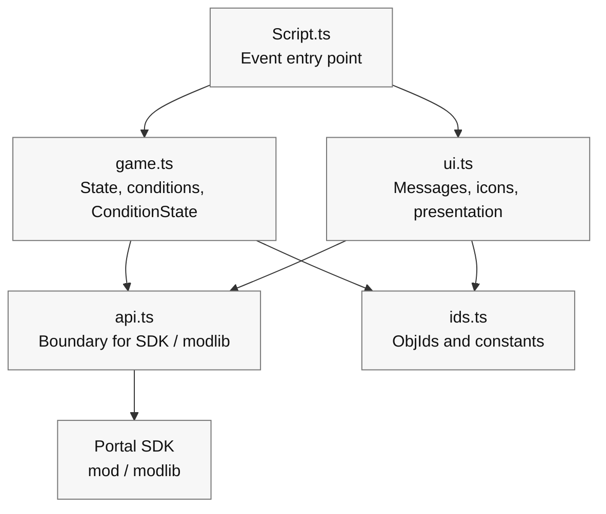

# 0 A Small Design for Keeping Things Tidy

> Turning your code into something that is harder to break, easier to fix, and easier to extend later

In Chapter 6, you got the minimum loop of **"press -> marker -> arrival -> light and sound"** running in TypeScript.
Once you start adding more features, similar pieces of logic such as showing messages, switching icons, and playing sound effects begin to scatter everywhere. Then a tiny change can unexpectedly break the whole thing.

So in this chapter, without leaning too hard on difficult technical terms, we will introduce a **small design** that simply splits the code into three boxes.
The goal is simple:

* Harder to break: a change in one place is less likely to spread elsewhere
* Easier to fix: you can quickly tell where to edit
* Easier to extend: adding a new feature stops feeling scary

> This is not a "complete full-scale architecture."
>
> We are only **gently tidying up the code you made in Chapter 6**.

# 1 Split It into Three Boxes (Boundary / State / Presentation)

First, split things by role. You only need to remember these three:

1. Boundary (`api`): the window that calls Portal / the SDK

A place for functions that send commands to the outside world of the game, such as "actually turn a WorldIcon on or off" or "play an FX."

2. State (`game`): game progress and rules

Small functions that express conditions such as "can the game start?", "can the target be reached?", "are we defending now?", and "how many seconds are left?", plus duplicate-trigger prevention with `modlib.ConditionState`.

3. Presentation (`ui`): messages, icons, sound, and light

A box that groups the flow of "words -> marker -> effect" into a single function and takes care of the visible side only.

At first, it is enough to protect only the following dependency structure:

| File | Role | What it may call |
| ---- | ---- | ---- |
| `Script.ts` | Entry point that receives Portal events and connects the flow | `game.ts`, `ui.ts` |
| `game.ts` | Progress state, condition functions, `ConditionState` | `ids.ts`, and `api.ts` if needed |
| `ui.ts` | Presentation such as messages, WorldIcons, and FX/SFX | `api.ts`, `ids.ts` |
| `api.ts` | Thin boundary that directly calls the Portal SDK and `modlib` | `mod`, `modlib` |
| `ids.ts` | ObjIds and constants only | Calls nothing |

The dependency direction should be `Script.ts` -> `game.ts` / `ui.ts` -> `api.ts` -> Portal SDK.
Once calls start flowing in reverse, you end up with situations like "I only wanted to change the display, but now the game flow is broken too."
When in doubt, push code that directly touches the Portal SDK into `api.ts`, and keep event handlers limited to calling short functions.

## Template Shape

```ts
// 1) API boundary
export const api = {
  showIcon: (id: number, on: boolean) => { /* SDK call */ },
  playFX:  (id: number) => { /* ... */ },
  stopFX:  (id: number) => { /* ... */ },
  playSfx:  (id: number) => { /* ... */ },
  vehicle: {
    enable: (id: number, on: boolean) => { /* ... */ },
    respawn: (id: number) => { /* ... */ },
  },
  time: { wait: async (ms: number) => { /* ... */ } },
};

// 2) Game progress gates and flags
import * as modlib from "modlib";

export const startGate = new modlib.ConditionState();
export const targetGate = new modlib.ConditionState();
export const state = { started: false, reached: false, defending: false };

export function canStart(): boolean { return !state.started; }
export function canReachTarget(): boolean { return state.started && !state.reached; }
export function markStarted(): void { state.started = true; }
export function markReached(): void { state.reached = true; }

// 3) UI and effects
export const ui = {
  say: (message: mod.Message, ms = 2000) => { /* Show to all players */ },
  guide: (hideId?: number, showId?: number) => {
    if (hideId !== undefined) api.showIcon(hideId, false);
    if (showId !== undefined) api.showIcon(showId, true);
  },
  celebrate: (FXId: number, sfxId: number) => {
    api.playFX(FXId); api.playSfx(sfxId);
  },
};
```

### Points

* If Portal specifications change, you only need to fix `api`.
* If you want to swap out wording or presentation, you only need to fix `ui`.
* Game progress can be explained with `state`, `can...`, `mark...`, and `ConditionState`.

# 2 Split the Files (A Small Folder Layout Based on the Template)

For beginners, four files are enough.

```
/mods
  ├─ ids.ts        // Object ID constants
  ├─ api.ts        // SDK boundary
  ├─ game.ts       // Progress flags, ConditionState, predicates
  ├─ ui.ts         // UI and effects
  └─ Script.ts     // Event wiring
```

* `ids.ts`: only named IDs such as `const ICON_TARGET = 22`
* `api.ts`: wrap SDK calls in one-line functions so they look simple from the outside
* `game.ts`: put `ConditionState`, state flags, and `can...` / `mark...`
* `ui.ts`: start with the three-piece set `say` / `guide` / `celebrate`, then grow it only when needed
* `Script.ts`: write the Chapter 5 logic there by calling the boxes above

> Splitting things up fixes the answer to "where should I write this?" and reduces hesitation.

The template's `npm run build` command recursively gathers `.ts` files under `mods` and merges them into `dist/Script.ts` for Portal registration.
Portal itself only accepts one file, but while developing, feel free to split things up.

# 3 Dependency Direction (Downward Arrows Only)

Ideally, arrows only flow one way, like `main -> ui -> api`.
Reverse calls such as `api` calling `ui`, or `ui` calling `main`, quickly create confusion.
A good rule of thumb is: "you may call downward, but not upward."



# 4 A Small Move: Splitting Up the Chapter 6 Code

Assume the minimum loop from Chapter 5 is still sitting in `mods/Script.ts` as-is.
From there, we clean it up in three steps.

## Step 1: Move the IDs (`ids.ts`)

```ts
// ids.ts
export const IP_START = 500;
export const ICON_ENTRANCE = 21;
export const ICON_TARGET   = 22;
export const AREA_TARGET   = 11;
export const FX_GOAL      = 901;
export const SFX_GOAL      = 951;
```

Then replace the hardcoded values in `mods/Script.ts` with `import { ... } from "./ids"`.

Effect: the raw numbers disappear, and only names remain. The code immediately becomes easier to read.

## Step 2: Move the Presentation (`ui.ts`)

```ts
// ui.ts
import { api } from "./api";
export const ui = {
  say: (message: mod.Message, ms = 2000) => { /* Show message */ },
  guide: (hideId?: number, showId?: number) => {
    if (hideId !== undefined) api.showIcon(hideId, false);
    if (showId !== undefined) api.showIcon(showId, true);
  },
  celebrate: (FXId: number, sfxId: number) => {
    api.playFX(FXId); api.playSfx(sfxId);
  },
};
```

Replace things like `showMessageAll`, `setIconVisible`, `playFX`, and `playSfx` in `mods/Script.ts` with `ui.say`, `ui.guide`, and `ui.celebrate`.

Effect: the order of "words -> marker -> effect" becomes readable in one line.

## Step 3: Move the Conditions and Duplicate-Trigger Prevention (`game.ts`)

```ts
// game.ts
import * as modlib from "modlib";

export const startGate = new modlib.ConditionState();
export const targetGate = new modlib.ConditionState();

export const state = {
  started: false,
  reached: false,
};

/**
 * Returns true when the game can start.
 */
export function canStart(): boolean {
  return !state.started;
}

/**
 * Returns true when the target area can be accepted.
 */
export function canReachTarget(): boolean {
  return state.started && !state.reached;
}

export function markStarted(): void {
  state.started = true;
}

export function markReached(): void {
  state.reached = true;
}
```

In `mods/Script.ts`, create small condition functions for each event, then pass them through `ConditionState`.

```ts
import { startGate, targetGate, canStart, canReachTarget, markStarted, markReached } from "./game";
import { IP_START, AREA_TARGET } from "./ids";

/**
 * Returns true when this interact event should start the game.
 */
function isStartInteract(objectId: number): boolean {
  return canStart() && objectId === IP_START;
}

/**
 * Returns true when this area event should mark the target as reached.
 */
function isTargetArea(objectId: number): boolean {
  return canReachTarget() && objectId === AREA_TARGET;
}

export function OnPlayerInteract(eventPlayer: mod.Player, eventInteractPoint: mod.InteractPoint): void {
  const objectId = mod.GetObjId(eventInteractPoint);

  if (startGate.update(isStartInteract(objectId))) {
    markStarted();
    // Start game
  }
}

export function OnPlayerEnterAreaTrigger(eventPlayer: mod.Player, eventAreaTrigger: mod.AreaTrigger): void {
  const objectId = mod.GetObjId(eventAreaTrigger);

  if (targetGate.update(isTargetArea(objectId))) {
    markReached();
    // Play goal effects
  }
}
```

Effect: duplicate-trigger prevention always takes the same shape, and names such as `isStartInteract` and `isTargetArea` clearly tell you what is being checked.
Comments should stay short and in English for Portal. Avoid Japanese comments, because multibyte characters can easily become a problem there.

# 5 Naming Rules (Names Beginners Can Still Read Later)

* Use verb + target for function names:
  `guide` instead of `guideIcon`, because "icon" is already implied by the presentation box.
  `celebrate` instead of `playGoalEffect`, because it explains the purpose rather than just the object.
* Start condition functions with `is...`, `has...`, or `can...`:
  names like `isStartInteract` and `canReachTarget` read naturally.
* Use uppercase snake case for ID constants:
  `ICON_TARGET` tells you at a glance that it is a fixed number.
* Keep file names short and blunt:
  `ids`, `api`, `game`, `ui`. The fewer naming puzzles, the better.

# 6 Put Settings into One Box (So You Can Tweak Numbers Later)

Balance tuning such as changing "defend for 10 seconds" to "defend for 15 seconds" should not require rewriting logic.
Prepare a single `config.ts` and make that the only place you look for these values.

```ts
// config.ts
export const config = {
  balance: { defenseSeconds: 10, startThrottleMs: 1000 },
  messages: {
    start: mod.stringkeys.start,
    defendSeconds: mod.stringkeys.defendSeconds,
    success: mod.stringkeys.success,
  },
};
```

Put the actual text in `Strings.json`, and keep only `mod.stringkeys...` keys in the code-side config.
When displaying it, assemble the message with `mod.Message`, like `ui.say(mod.Message(config.messages.defendSeconds, t))`.

> This lets you respond quickly to "I only want to change the number" or "I only want to change the wording key."

# 7 Self-Checks (Catch ID Accidents Early with Vitest)

It is much easier to catch `-1` (unset) IDs and duplicates with `npm run test` than to discover them after starting the game.
Functions like `assertIds()` belong on the Vitest side in `test/ids.test.ts`, not in production startup logic inside `mods/Script.ts`.

```ts
// test/ids.test.ts
import { describe, expect, test } from "vitest";
import * as ids from "../mods/ids";

function assertIds() {
  const entries = Object.entries(ids) as [string, number][];
  const seen = new Map<number, string[]>();
  const errors: string[] = [];

  for (const [name, id] of entries) {
    if (id === -1) errors.push(`[ID unset] ${name}`);
    const arr = seen.get(id) || [];
    arr.push(name); seen.set(id, arr);
  }
  for (const [id, names] of seen) {
    if (names.length > 1) errors.push(`[ID duplicate] ${id}: ${names.join(", ")}`);
  }
  if (errors.length) throw new Error(errors.join("\n"));
}

describe("ids", () => {
  test("does not contain unset or duplicate ids", () => {
    expect(() => assertIds()).not.toThrow();
  });

  test("contains required ids", () => {
    expect(ids.IP_START).toBeGreaterThan(-1);
    expect(ids.AREA_TARGET).toBeGreaterThan(-1);
    expect(ids.ICON_TARGET).toBeGreaterThan(-1);
  });
});
```

With this in place, `npm run test` can tell you whether `ids.ts` on the code side contains unset or duplicate IDs.
Vitest still cannot verify the actual object placement in Godot, though. To check whether the same ObjId was placed in the actual scene, use the Chapter 4 ledger or ObjIdManager.

# 8 Aggregate and Route Events (A Small Dispatch Table)

As the number of events grows, it helps to write the rules near the top in a small table-like structure:
"when this happens, check this condition, then run this action."
That turns the code into something you can read almost like a spec.

Here too, pairing `ConditionState` with named condition functions is easier to follow than introducing a long list of phase types.

```ts
// flow.ts
import * as modlib from "modlib";
import { ui } from "./ui";
import { IP_START, AREA_TARGET, ICON_ENTRANCE, ICON_TARGET, FX_GOAL, SFX_GOAL } from "./ids";
import { startDefense } from "./defense";
import { canStart, canReachTarget, markStarted, markReached } from "./game";

type When = "interact"|"enter"|"leave";
type Row = {
  when: When;
  id: number;
  gate: modlib.ConditionState;
  test: () => boolean;
  do: () => void;
};

const startGate = new modlib.ConditionState();
const targetGate = new modlib.ConditionState();

export const flow: Row[] = [
  {
    when: "interact",
    id: IP_START,
    gate: startGate,
    test: canStart,
    do: () => {
      markStarted();
      ui.say(mod.Message(mod.stringkeys.start));
      ui.guide(ICON_ENTRANCE, ICON_TARGET);
    },
  },
  {
    when: "enter",
    id: AREA_TARGET,
    gate: targetGate,
    test: canReachTarget,
    do: () => {
      markReached();
      ui.celebrate(FX_GOAL, SFX_GOAL);
      startDefense(10);
    },
  },
];

export function dispatch(when: When, id: number) {
  const row = flow.find(r => r.when === when && r.id === id);
  if (!row) return;
  if (row.gate.update(row.test())) row.do();
}
```

Then in `mods/Script.ts`, the SDK event callbacks only need to call something like `dispatch("interact", IP_START)`.

Effect: you can read the behavior from the table at the top, which is especially reassuring for beginners.
`gate` stops duplicate firing, and `test` explains with a named function whether the action is allowed right now.

# 9 Merge the Split Code Back into One File

When using the template, you split files under `mods` while developing, and merge them into one only when registering them with Portal.

The command is:

```bash
npm run build
```

This command gathers the `.ts` files under `mods`, organizes the `import` lines, and creates `dist/Script.ts`.

What you register in Portal Web Builder is not the in-progress `mods/Script.ts`.
It is **`dist/Script.ts`**.
If you use string definitions, register **`dist/Strings.json`** as well.

## What to Check Before Registering

Before bringing it into Portal, check things in this order:

```bash
npm run lint
npm run test
npm run build
```

* `lint`: catch risky syntax or style issues first
* `test`: confirm state transitions and small functions behave as expected
* `build`: generate the single file you will register in Portal

Do not feel safe just because `build` passed. A build only proves the files were combined successfully. It does not prove the game logic is correct.

# 10 How to Make Changes After Splitting

Want to change the look and feel?
Open `ui.ts` for wording, presentation, and order.

Want to change the command being sent outward?
Open `api.ts` for SDK-side changes.

Want to add a new stage to the game?
Add state flags, `ConditionState`, and `can...` / `mark...` functions in `game.ts`, then add a row in `flow.ts`.

Added more IDs?
Add constants in `ids.ts`, then verify them with Vitest and ObjIdManager.

Need to tweak numbers or wording?
Change the values in `config.ts`.

The biggest advantage of splitting is that the place you need to touch becomes obvious.

# 11 Common Bad Patterns and Countermeasures

Bad: calling the API directly from many places
-> Countermeasure: always go through `ui` or `api`. Do not hit `setIconVisible` directly from `main`.

Bad: writing numbers inline, such as `setIconVisible(22, true)`
-> Countermeasure: move everything into constants in `ids.ts`. Aim for a life where you do not have to search for raw numbers.

Bad: copy-pasting duplicate-trigger flags everywhere
-> Countermeasure: gather `ConditionState` and the condition functions in `game.ts`.

Bad: scattering wording through the code
-> Countermeasure: put the text in `Strings.json`, and go through `mod.Message`, like `ui.say(mod.Message(mod.stringkeys.start))`.

# 12 Gradual Refactoring (In the Least Scary Order)

There is no need to do everything at once.
This is the safe order:

1. Move IDs to constants
2. Cut out the three-piece UI set: `say`, `guide`, `celebrate`
3. Create `ConditionState` and condition functions
4. Create the API boundary
5. Move to a transition table (`flow`) if needed

At each step, build and test, confirm the game still behaves normally, and only then move on.

# Conclusion

* Just splitting things into three boxes, `api`, `game`, and `ui`, already makes the code harder to break and easier to fix.
* Replacing raw numbers with names in `ids.ts` is the core of readability.
* Use `ConditionState` to reduce duplicate firing, `config` to manage text and numbers, and Vitest plus ObjIdManager to reduce ID accidents.
* The safe split order is ID -> UI -> state -> API -> transition table. Small steps keep it manageable.

# Next Chapter

In **Chapter 8, "Visuals and Presentation: Mastering UI, SFX, and FX,"** we will polish the `ui` box we created here even further:

* how to show messages (individual / global / by importance)
* how to design the timing of WorldIcon switching
* how to place debug UI and keep it hidden from players
