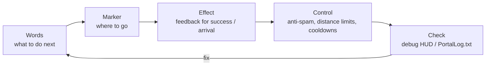

# 0 Visuals and Presentation: Mastering UI, SFX, and FX

> Communicate -> guide -> make it feel good, in that order

* Communicate: short messages and WorldIcon switching
* Guide: placement and updates that make "go here" obvious at a glance
* Make it feel good: add feedback with SFX and FX, without overplaying them
* Keep it controlled: prevent spam, limit distance / repeat count, and use cooldowns
* Make it reviewable: use a debug HUD to see what just happened

> The rule of thumb is "words -> marker -> effect."
> Start with a short instruction, show the direction with a WorldIcon, then add feedback with SFX / FX.



# 1 Messages: Show Only the Next Move in a Short Sentence
## Why

Players decide within seconds. Long text will not be read. If you show only "what you want them to do next" in a short phrase, the confusion disappears.

## How to Write It

* Use an imperative phrase plus an object:

Examples: "go entrance", "start terminal A", "defend 10s"

* Time and distance are useful:

Examples: "defend 10s", "120m left"

## Implementation Pattern

Text displayed on screen should not be written directly in code. Register it in `Strings.json` first.
The same rule applies to all player-visible text, such as notifications, WorldIcon text, and UI Text `textLabel`.

The flow has three steps.

1. Register the key and body text in `Strings.json`.
2. Create `mod.Message(mod.stringkeys.keyName, extraValues...)` on the TypeScript side.
3. Pass the `Message` to a display function such as `modlib.ShowNotificationMessage()`.

`Strings.json` is a dictionary for text shown on screen.
TypeScript specifies a key in that dictionary, and passes only the values that should be inserted into `{}`.
This keeps display text out of the code and avoids accidents where directly written text breaks in Portal.

```json
{
  "goEntrance": "go entrance",
  "defendSeconds": "defend:{}s",
  "testName": "test name:{}"
}
```

In code, use `mod.Message` to create the display `Message`.
Values passed after the first argument are inserted into `{}`.

```ts
modlib.ShowEventGameModeMessage(mod.Message(mod.stringkeys.goEntrance));
modlib.ShowEventGameModeMessage(mod.Message(mod.stringkeys.defendSeconds, 10));
modlib.ShowNotificationMessage(mod.Message(mod.stringkeys.testName, "player1"));
```

The last example appears as `test name:player1` on screen.
`mod.Message` can take up to three extra values, so pass only values that change from code, such as remaining seconds, score, or player name.

```ts
// Important message
ui.say(mod.Message(mod.stringkeys.goEntrance));

// Updating message
ui.say(mod.Message(mod.stringkeys.defendSeconds, t));
```

## Avoiding Common Problems

* When you add text shown on screen, confirm the key exists in `Strings.json`.
* Do not show several messages at once. Design it so the newest one replaces the previous one.
* Reduce notification frequency. A new notification every second is tiring, so overwrite instead.
* Decide individual vs. global early. Personal warnings go only to the player who triggered them; signals go to everyone.

# 2 WorldIcon: Place Guidance Slightly Before the Destination and Switch by Stage
## Why

If the icon is directly on the destination, players can lose sight of it behind a wall or corner right as they approach.
Placing it **slightly before an entrance or corner** makes the route easier to follow.

## How to Place and Switch

* Split by stage: entrance (`ICON_ENTRANCE`) -> target (`ICON_TARGET`) -> next objective (`ICON_NEXT...`)
* Turn the current icon off on arrival, then turn the next one on. The trick is **not lighting two icons at once**.

## Implementation Pattern

```ts
// Basic guidance using the Chapter 6 guide helper
ui.guide(ICON_ENTRANCE, ICON_TARGET);  // entrance OFF -> target ON

// On arrival
ui.guide(ICON_TARGET, undefined);      // target OFF (turn the next one ON here if needed)
```

## Avoiding Common Problems

* Icons only ever turn on: always turn the previous icon off on arrival.
* If team-specific display is needed, prepare a separate function such as `ui.guideForTeam(teamId, hide, show)` to avoid display-range mistakes.

# 3 SFX: Too Much Sound Becomes Fatigue, So Always Add Cooldown
## Why

Achievement sounds feel good, but repeated playback becomes tiring.
A cooldown, meaning "do not play again for a short time," keeps the density under control.

## Implementation Pattern: SFX Cooldown

```ts
const sfxCooldownMs = 1500;
let lastSfxAt = 0;

function playSfxCooled(id: number) {
  const now = Date.now();
  if (now - lastSfxAt < sfxCooldownMs) return;
  lastSfxAt = now;
  api.playSfx(id);
}
```

## Avoiding Common Problems

* If this combines with duplicate event firing, it becomes noisy very quickly. Use it together with the one-time guards from Chapter 6.
* If the API can adjust volume by distance, avoid playing sounds for far-away events. If not, decide not to play SFX for distant events in the first place.

# 4 FX: A Distant Lighthouse, a Nearby Reward
## Why

FX works best when players notice it from far away and understand it up close.
For long distance, prioritize visibility with blinking, pillars, or arrows. For close range, prioritize feedback with explosions, sparks, or flame columns.

## Implementation Pattern: One-Shot and Looping FX

```ts
function celebrate() {
  api.playFX(FX_GOAL);   // Assume one-shot FX
  playSfxCooled(SFX_GOAL); // Cooldown version from 8.3
}

// Looping effects must also have a stop path
onEnterArea(AREA_TARGET, () => api.playFX(FX_GOAL));
onLeaveArea(AREA_TARGET, () => api.stopFX(FX_GOAL));
```

## Avoiding Common Problems

* Smoke that never stops: always write the stop logic on the exit event.
* Invisible indoors: move the placement slightly forward. Adding an upward offset often helps.

# 5 Distance and Direction: Turn Guidance into Progress with "About XXm Left"
## Why

When players can see distance, they feel they are moving forward.
Updating once every few seconds is enough. Updating every frame is unnecessary.

## Implementation Pattern: Overwrite Distance UI

```ts
const updateDistance = debounce(500, (playerPos: Vector3, targetPos: Vector3) => {
  const d = Math.round(distance(playerPos, targetPos));
  ui.say(mod.Message(mod.stringkeys.distanceLeft, d));
});
```

In this case, prepare text such as `"distanceLeft": "{}m left"` in `Strings.json`.

## Avoiding Common Problems

* Notifications get noisy because they update too often: thin them out with debounce.
* Distance never reaches 0m: place the target point slightly before the real destination, like with WorldIcon.

# 6 Priority: Play or Show the Most Important Sound, Light, and Text First
## Why

When several effects overlap at once, weaker ones disappear.
Set priority and process high -> mid -> low. Suppress low-priority effects when needed.

## Implementation Pattern: Priority Queue Idea

```ts
type Prio = "high"|"mid"|"low";
function playSfxPrio(id: number, prio: Prio) {
  if (prio === "low" && Date.now() - lastSfxAt < 2000) return; // Suppress if something played recently
  playSfxCooled(id);
}
```

## Tips

* Victory and failure jingles should always be `high`.
* Leave baseline sounds such as footsteps and ambience to the game. Use custom SFX only at important beats.

# 7 Prevent Overdoing It: One Effect per Scene, One Message per Moment

* One scene, one effect: do not stack two or three FX on the same event. Pick one star.
* One moment, one message: do not show the goal, warning, and hint all at once. Focus on the goal.
* Always write cleanup logic: stop looping FX/SFX, overwrite messages, and turn WorldIcons off.

# 8 Debug HUD: Give Yourself Private Eyes and Ears
## Why

Presentation is felt, but design is built from numbers and state.
A small HUD only you can see, showing phase, remaining seconds, and the latest event, makes fixing things much faster.

## Implementation Pattern
```
const debug = { on: true };
function dbg(line: string) { if (!debug.on) return; /* small text at screen edge */ }

function dump() { dbg(`phase=${Phase[state.phase]} time=${remainSec}`); }

onInteract(IP_START, () => dbg("Interact:Start"));
onEnterArea(AREA_TARGET, () => dbg("Enter:Target"));
onLeaveArea(AREA_TARGET, () => dbg("Leave:Target"));
```

## Tips

* Set `debug.on = false` before publishing.
* Debounce the HUD just like notifications, so it stays readable.

# 9 Performance and Stability: The Courage Not to Do Things

* Avoid checking every frame. Distance and direction checks every 0.5 to 1 second are enough.
* Avoid infinite loops with short waits. Use events and timers.
* Limit simultaneous playback, such as no more than three SFX at once.
* Show presentation only to people who can perceive it. If the API allows it, check audible or visible range.

The official SDK tips also mention vehicle count, player scanning, and UI Widget management as load-sensitive areas.
Before adding more presentation, keep these three rules:

* Keep vehicles at 40 or fewer at the same time. Count both permanent and event vehicles.
* Do not scan all players every frame. Record state with events such as `OnPlayerEnterCapturePoint` and `OnPlayerExitCapturePoint`, then read it only when needed.
* Do not recreate UI Widgets every time. Store the created widget in a variable and update its content.

The flashier the presentation, the earlier you should set limits.
Base the amount on what players can understand, not on how much you can display.

# 10 Recipes: Small Parts You Can Reuse
## A) Shake the Camera and Play a Short Cheer Once on Arrival

```ts
let cheered = false;
function celebrateOnce() {
  if (cheered) return; cheered = true;
  ui.celebrate(FX_GOAL, SFX_GOAL);    // Light and sound
  api.shakeCameraAll?.(0.4, 600);      // If available: strength 0.4 / 600ms
  setTimeout(()=> cheered = false, 3000); // Do not trigger again for 3 seconds
}
```

## B) Step Messages: Three Short Lines Make One Story

```ts
ui.say(mod.Message(mod.stringkeys.start));
ui.guide(ICON_ENTRANCE, ICON_TARGET);
ui.say(mod.Message(mod.stringkeys.goTerminalA));
// On reached
ui.say(mod.Message(mod.stringkeys.goodJob));
```

## C) Pseudo Blinking Icon: Alternate ON and OFF

```ts
let blinkOn = false, blinkH: any;
function startBlinkIcon(id: number, ms = 600) {
  stopBlinkIcon();
  blinkH = setInterval(()=> { blinkOn = !blinkOn; api.showIcon(id, blinkOn); }, ms);
}
function stopBlinkIcon() { if (blinkH) clearInterval(blinkH); api.showIcon(ICON_TARGET, true); }
```

> Be careful not to overuse it. A clean pattern is: blink only for the first call for attention, then keep it steadily lit as arrival gets closer.

# Conclusion

* Keeping the order words -> marker -> effect already changes how clearly the experience communicates.
* Place WorldIcons slightly before the destination, add cooldowns to SFX / FX, and overwrite UI to prevent noise.
* Visualize "now" with a debug HUD. Fixes become faster, and the presentation quality improves.

# Next Chapter

In Chapter 9, "Publishing, Hosting, and Operations," we will move from the experience we have built so far into the practical work of making it playable by others.

* How to write share codes, descriptions under 256 characters, and thumbnails that briefly communicate purpose / recommended player count / play time
* Server operation patterns, permanent or event-based, and announcement templates
* Update frequency and a process for improving without breaking
* Practical operation tips, assuming XP-related restrictions may apply depending on the situation
