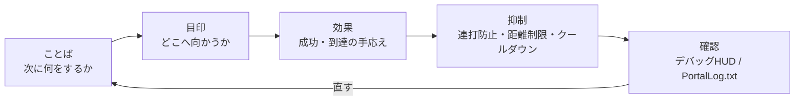

# 0 Visuals and production: mastering UI, SFX, and FX

> ―― In the following order: get it across → don't hesitate → feel good

* Send (short message/switch WorldIcon)
* Guide (placement and updates that let you know “go here” at a glance)
* Make it feel (Add a feeling with SFX/FX. However, do not make it “too loud”)
* Undisturbed (spam prevention, distance/number of times limit, cooldown)
* Can be reviewed (see “what just happened” on the debug HUD)

> The password is "Words → Signs → Effects".
> First, state the requirements in a short sentence, then show the direction with WorldIcon, and finally repeat the response with SFX/FX.



# 1　Message: Give just the “next move” in a short sentence
## Why

Players decide in seconds. Long texts will not be read. If you just say ``What do you want me to do next'' in 5 to 12 characters, your hesitation will disappear.

## How to write (type)

* Imperative + object:

Example) "Head to the entrance" "Start terminal A" "Defend for 10 seconds"

* It is recommended to include time/distance:

Example) “Defend for 10 seconds” “120m left”

## Implementation type

The characters to be displayed on the screen are not written directly in the code, but are registered in `Strings.json` before use.
All characters visible to the player, such as notifications, WorldIcon, and UI Text `textLabel`, have the same idea.

The flow consists of the following three stages.

1. Register the key and body of the sentence you want to display in `Strings.json`.
2. Create `mod.Message(mod.stringkeys.キー名, 追加値...)` on the TypeScript side.
3. Pass `Message` to a display function such as `modlib.ShowNotificationMessage()`.

`Strings.json` is a dictionary of sentences to display on the screen.
On the TypeScript side, specify the key of the dictionary and pass only additional values to be placed in `{}` if necessary.
By using this method of division, you can avoid accidents where characters written directly in the code are corrupted in the portal when you increase the number of displayed sentences.

```json
{
  "goEntrance": "go entrance",
  "defendSeconds": "defend:{}s",
  "testName": "test name:{}"
}
```

On the code side, `mod.Message` creates `Message` for display.
The value passed after the second argument will be placed in the position of `{}`.

```ts
modlib.ShowEventGameModeMessage(mod.Message(mod.stringkeys.goEntrance));
modlib.ShowEventGameModeMessage(mod.Message(mod.stringkeys.defendSeconds, 10));
modlib.ShowNotificationMessage(mod.Message(mod.stringkeys.testName, "player1"));
```

The last example would appear on your screen as `test name:player1`.
You can use up to three additional arguments for `mod.Message`, so your code should only pass values that change, such as seconds left, score, and player name.

```ts
// Important message
ui.say(mod.Message(mod.stringkeys.goEntrance));

// Updating message
ui.say(mod.Message(mod.stringkeys.defendSeconds, t));
```

## Stumble prevention

* After adding the characters to be displayed on the screen, check if the key exists in `Strings.json`.
* Do not release multiple items at the same time (designed so that only the last item will remain).
* Reduce notification frequency (new notifications every second are tiring. Let's overwrite them).
* Individual vs. overall: Individual attention is “only for the person who pressed the button”, and signal is “for everyone”. Decide and unify first.

# 2　WorldIcon: Place the conductor “slightly in front” and switch in stages
## Why

If you place it on the destination itself, you'll lose it around a wall or corner the moment you approach it. **If you place it "slightly in front" of an entrance or corner**, you won't get lost even when turning a corner.

## How to place/switch

* Stage division: Entrance (ICON_ENTRANCE) → Destination (ICON_TARGET) → Next objective (ICON_NEXT…)
* Turn OFF when you reach it, then turn it on: **“Do not make it shine twice”** This is the trick to not getting lost.

## Implementation type

```ts
// 案内の基本（6章の guide を利用）
ui.guide(ICON_ENTRANCE, ICON_TARGET);  // 入口OFF → 目的地ON

// 到達時
ui.guide(ICON_TARGET, undefined);      // 目的地OFF（次があるならここでON）
```

## Stumble prevention
* Accidents that increase by ON: Always turn off the previous ICON when reaching the destination.
* If you need to display by team, separate functions like ui.guideForTeam(teamId, hide, show) will prevent mistakes in the display range.

# 3　SFX: Excessive ringing will cause “tiring” (be sure to put a cooldown)
## Why

* Achievement sounds are a pleasure, but continuous playback can cause fatigue. Cooldown (does not play for a certain period of time) reduces density.

## Implementation type: SFX cooldown

```ts
const sfxCooldownMs = 1500;
let lastSfxAt = 0;

function playSfxCooled(id: number) {
  const now = Date.now();
  if (now - lastSfxAt < sfxCooldownMs) return;
  lastSfxAt = now;
  api.playSfx(id);
}
```

## Stumble prevention

* Combined with multiple event firings, it becomes hell. Used in conjunction with onceIn in Chapter 6.
* If there is an API that changes the volume depending on distance, set it so that it does not play at long distances. If not, we decided not to play it in the first place at long-distance events.

# 4　FX: “Lighthouse” in the distance, “Reward” in the vicinity
## Why

Ideally, you should notice FX from a distance and understand it up close. At long distances, focus on visibility such as flashing lights, pillars, and arrows, and at short distances, focus on responsiveness such as explosions, sparks, and pillars of fire.

## Implementation type: FX one-shot/loop

```ts
function celebrate() {
  api.playFX(FX_GOAL);   // ワンショット想定
  playSfxCooled(SFX_GOAL); // 7.3のクールダウン版
}

// ループ物は必ず停止側も
onEnterArea(AREA_TARGET, () => api.playFX(FX_GOAL));
onLeaveArea(AREA_TARGET, () => api.stopFX(FX_GOAL));
```

## Stumble prevention

* Non-stop smoke: Write a stop reliably on the exit event.
* Cannot be seen indoors: Move the installation position slightly towards you. Inserting an upward offset often solves the problem.

# 5　Distance and direction: Turn guidance into reality with “just ◯◯m”
## Why

When you can see the distance, you will feel that you are making progress. It is sufficient to update once every few seconds (no need to update every frame).

## Implementation type (override distance UI)

```ts
const updateDistance = debounce(500, (playerPos: Vector3, targetPos: Vector3) => {
  const d = Math.round(distance(playerPos, targetPos));
  ui.say(mod.Message(mod.stringkeys.distanceLeft, d));
});
```

In this case, prepare a phrase like `"distanceLeft": "{}m left"` for `Strings.json`.

## Stumble prevention
* Notifications are noisy due to too many updates → Thin out with debounce.
* Distance does not become 0m → Target position is a little closer to you like WorldIcon.

# 6 Priority: Play/release important sounds, lights, and words first
## Why

If you stack multiple effects at the same time, the weaker one will disappear. Assign priorities and process in the order of high → medium → low, and suppress low priority.

## Implementation type (priority queue image)

```ts
type Prio = "high"|"mid"|"low";
function playSfxPrio(id: number, prio: Prio) {
  if (prio === "low" && Date.now() - lastSfxAt < 2000) return; // 直近に鳴ってたら抑制
  playSfxCooled(id);
}
```

## Tips

* The jingle of victory and failure is always high.
* Ground sounds such as footsteps and environmental sounds are left to the game, and the only original SFX are at milestones.

# 7 Design to prevent “overdoing”: 1 scene, 1 effect, 1 paragraph, 1 message

* 1 scene 1 effect: Do not overlap two or three FX in the same event. Decide on one main character.
*One paragraph, one message: Do not give "purpose", "warning", and "hint" at the same time. Focus only on the purpose.
* Be sure to write termination processing: stop loop FX/SFX, overwrite messages, turn off WorldIcon.

# 8 Debug HUD: Have “ears and eyes” that only you can see
## Why

Direction is something you can feel, but design is about numbers and conditions. A small HUD that only you can see shows the phase, remaining seconds, and recent events, making it quick to fix.

## Implementation type (example)
```
const debug = { on: true };
function dbg(line: string) { if (!debug.on) return; /* 画面端に小さく */ }

function dump() { dbg(`phase=${Phase[state.phase]} time=${remainSec}`); }

onInteract(IP_START, () => dbg("Interact:Start"));
onEnterArea(AREA_TARGET, () => dbg("Enter:Target"));
onLeaveArea(AREA_TARGET, () => dbg("Leave:Target"));
```

## Tips

* Set debug.on=false during production release.
* Similar to spam prevention for notifications, HUD is also debounced (maintains visibility).

# 9　Performance and stability: The courage not to do it
* Avoid checking every frame (distance/direction once every 0.5 to 1 second is sufficient).
* Infinite loop + short wait is sealed. Wait for events and timers.
* Limit the number of simultaneous playbacks (up to 3 SFX at the same time, etc., depending on your own rules).
* Make the presentation “only for those who can see it”: If you have an API, check the audible range/visual range checkbox.

The tips of the official SDK also mention the number of vehicles, player scanning, and UI widget management as things that are directly related to the load. Before increasing your production, please keep the following three things in mind.

* No more than 40 vehicles at a time. View the total of permanent vehicles and event vehicles.
* Don't scan all players every frame. Record the state with events such as `OnPlayerEnterCapturePoint` and `OnPlayerExitCapturePoint` and read it only when needed.
* UI widgets are not recreated every time. Save the created widget in a variable and update the display content.

The more flashy the production, the more you decide on the upper limit before it gets too heavy. Don't base it on how much it looks, but on how much the players can understand.

# 10 Recipe collection (small parts that can be used as is)
## A) Shake the camera and give a short cheer once on arrival

```ts
let cheered = false;
function celebrateOnce() {
  if (cheered) return; cheered = true;
  ui.celebrate(FX_GOAL, SFX_GOAL);    // 光と音
  api.shakeCameraAll?.(0.4, 600);      // APIがあれば：強さ0.4/600ms
  setTimeout(()=> cheered = false, 3000); // 3秒は再発しない
}
```

## B) Step-by-step messages (3 short sentences in one story)

```ts
ui.say(mod.Message(mod.stringkeys.start));
ui.guide(ICON_ENTRANCE, ICON_TARGET);
ui.say(mod.Message(mod.stringkeys.goTerminalA));
// On reached
ui.say(mod.Message(mod.stringkeys.goodJob));
```

## C) Pseudo “blinking icon” (ON/OFF alternately)

```ts
let blinkOn = false, blinkH: any;
function startBlinkIcon(id: number, ms = 600) {
  stopBlinkIcon();
  blinkH = setInterval(()=> { blinkOn = !blinkOn; api.showIcon(id, blinkOn); }, ms);
}
function stopBlinkIcon() { if (blinkH) clearInterval(blinkH); api.showIcon(ICON_TARGET, true); }
```

> Be careful not to overuse it. It is elegant to blink only at the first "call" → to stay lit when the arrival is near.

# Conclusion

* Just by following the order of words → landmarks → effects, you can make a difference in how your message is conveyed.
* WorldIcon is “slightly closer”, SFX/FX is cooled down, and UI is overwritten to prevent “noisyness”.
* Visualize the “now” with the debug HUD. Repairs are faster and the quality of the production is improved.

# Guide to the next section

In the next Chapter 9, "Publishing, Hosting, and Management," we will move on to the practical aspects of turning the experience we have gained so far into a state where it can be played.

* How to write a shared code, explanatory text within 256 characters, and thumbnail (concisely convey the purpose/recommended number of people/required time)
* Server operation (permanent/event) and announcement template
* Update frequency and “improvement without breaking” procedures
* Tips for moderate operation based on the premise that there may be restrictions around XP depending on the situation
