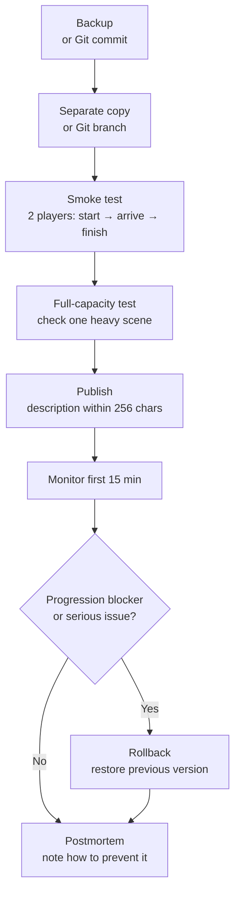

In Chapter 8, we organized how to use messages, WorldIcon, SFX, and FX so players can understand the next action and feel successful feedback. But even if the experience communicates well in-game, it is not yet ready to be played after publication.
This chapter organizes how to **publish a Portal experience in a playable state and operate it without breaking it**. We treat the title, description, thumbnail, announcements, tests, and update procedure as one flow, making the work after creation visible.

This is not a chapter about large-scale promotion. Instead, we decide how pre-publish checks, descriptions, small-group operation, updates, and rollback should relate to each other so people who arrive can start without confusion and you can see what to fix after they play.

# 0 Publishing, Hosting, and Operations

* Publish your mode with confidence, and prepare a path that stays easy to play even with a small group.
* Standardize the title, description within 256 characters, thumbnail, and external announcements so important details are not missed.
* Keep an operations procedure for updating without breaking the mode: backups, verification, release notes, and rollback.

In Portal, it is very hard for an unknown personal mode to gather players through organic traffic alone.
Read this chapter not as a guide to large-scale promotion, but as an operations note for making sure people who show up can start without getting lost, and for knowing what to fix after they play.

# 1 Pre-Publish Checklist (30-Second Version)

* Title: short proper name + what players do, for example: Checkpoint Rush — Start terminal → defend for 10 seconds
* Description: 256 characters or fewer. If possible, write a short English description that covers only the goal, player count, and time.
* Recommended players / time: for example, "8-16 players / 10-15 min"
* Area / vehicles: clearly state whether they appear or not
* Thumbnail: do not pack in information; use a shot that shows the mood and the first place to go
* Test: run start → arrival → finish in two patterns, with 2 players and at full capacity
* Log: note the version number, changes, and publish date/time

> When in doubt, narrow the description to the goal, recommended player count, required time, and the first thing to press. The description is limited to 256 characters, so move detailed FAQs and update history to an external announcement.

## Pre-Publish Check (Practical Version)

After the 30-second version passes, check the following items before publishing.

| Check Item | What to Check |
| ---- | ---- |
| Solo test | One player can start, move, arrive, and finish |
| Two-player test | If only one player presses the button, both players still see the necessary display |
| Join in progress | Late joiners spawn without getting lost and can see the required UI |
| Leaving | Progress does not become impossible when a participant leaves |
| Redeploy | UI and WorldIcon do not break after death or redeploy |
| UI redisplay | Menus and notifications reappear at the required moments after disappearing |
| Long run | Run for at least 15 minutes and confirm SFX/FX and UI do not keep accumulating |
| Vehicle count | Do not exceed 40 vehicles at the same time. Count permanent vehicles and event vehicles together |
| Log check | `PortalLog.txt` has no errors or unexpected repeated inputs |

"It worked alone, but broke after publishing" often comes from join-in-progress, leaving, or redeploy cases. Do not cut corners here. Five minutes of checking now is cheaper than crying about it later.

# 2 Description Template (Within 256 Characters)

Creators cannot freely add their own tags on the experience description screen.
The description is also limited to 256 characters.
Because of that, use short English for the Portal description, and put detailed Japanese explanations in external announcements.

## Example Portal Description

```text
Checkpoint Rush. Press the center terminal, follow the objective icons, then defend the final zone for 10 seconds. Recommended 8-16 players. 10-15 min. Transport vehicles only.
```

This example is about 180 characters.
Even if you still fit within 256 characters, the Portal description is not the place to put every detail you want players to read.
Inside Portal, communicate only the goal, player count, time, and first action.

## Points

* Write what players do, not the mode's selling points.
* Resolve the player's first worries: where to go, what to press, and how long it takes.
* For a community audience, it is safer to avoid Japanese-only explanations. Use short English inside Portal, and put detailed Japanese explanations on X, Discord, a blog, Note, or another external place.
* Do not assume tags will fill in the gaps. Treat creator-defined tags as unavailable, and communicate through the title, description, and thumbnail.

# 3 Hosting Operations: Two Pillars, Permanent and Event
## Permanent (Always Playable)
* Goal: give visitors the reassurance that they can try it immediately.
* Settings: short duration (10-15 min), reduced waiting, 1-2 maps, and a setup that can match even late at night.

## Event (Announce a Specific Time)

* Goal: connect with X / Discord and make it easier for even a small number of people to gather at the same time.
* Settings: add a tutorial or demo in the pre-start lobby: entrance icon → start button → 1-minute trial.
* Announcement template:

"Today at 21:00, Checkpoint Rush launches for the first time. 8-16 players / about 12 min. In the lobby, press the start button → follow the markers to start the terminal → defend the objective for 10 seconds. First-time players welcome!"

# 4 Effective Thumbnail and Route Placement

* Thumbnail: keep it readable even at a small size by not packing it with information.
* Route guidance: do not rely only on the 256-character description. Show a short guide at `OnGameStart` or at the first InteractPoint. Register the on-screen text in `Strings.json`, then call it with `mod.Message(mod.stringkeys.xxx)`.

A thumbnail is not an instruction manual.
When the image is shown small, text and detailed maps will not be read.
Move detailed explanations to external announcements or short in-game messages, and treat the thumbnail as an entrance.

# 5 Basic Procedure for Updates That Do Not Break the Mode (Operations Runbook)

1. Backup: copy ids.ts / config.ts / Script.ts / ui.ts / game.ts with a date, for example `2025-10-28_v1.2/`. If you use Git, make a commit before updating.
2. Verification branch: make new adjustments in a separate copy or a separate Git branch.
3. Smoke test: with 2 players, run start → arrival → finish.
4. Full-capacity test: create one scene where AI / vehicles / FX overlap.
5. Publish: confirm the description is within 256 characters, and keep the version and summary to the minimum needed.
6. First 15 minutes monitoring: watch for leaving rate, lag, and progression blockers.
7. Rollback: if something is wrong, immediately restore the previous version, including the version text in the thumbnail and description.
8. Postmortem, even 5 minutes is enough: note what happened and how to prevent it next time.



> Tip: verify updates that touch IDs with extra care. ID mistakes easily create "it does not work" failures.

If you can use Git, history management is easier than copying files by hand.
If you leave the pre-publish state as a tag or commit such as `v1.2`, it becomes easier to know which files to restore.
However, also make sure you can tell which source code produced the `dist/Script.ts` and `dist/Strings.json` registered in Portal Web Builder.

# 6 Safe Areas for Changes: Where to Start Fixing Without Breaking Things

* Safest: values in config.ts, such as defense seconds, cooldowns, and recommended player count text
* Relatively safe: text and order in ui.ts, within the words → markers → effects frame
* Requires care: additions or changes in ids.ts, checked with Vitest and then confirmed on the Godot side with ObjIdManager and the ledger
* Easy to break: adding branches in Script.ts / flow.ts, which requires reviewing onceIn and Phase transitions

# 7 Player FAQ (Separate Where It Is Shown)

You cannot always place a long Japanese FAQ directly inside Portal.
Separate the FAQ into things to write in external announcements and things to show briefly in-game.

| Where | Suitable Content | How to Write |
| ---- | ---- | ---- |
| X / Discord / Blog / Note | Detailed FAQ, reasons for updates, known issues | Japanese is fine |
| Portal description | Goal, required time, recommended player count | Mainly English, within 256 characters |
| In-game UI | What to do next | Display `Strings.json` keys with `mod.Message` |

For in-game display, it is realistic to show the first guide once at `OnGameStart`, or show a short message right after the start InteractPoint is pressed.
For example, tell players only one thing at a time: "press the center terminal", "go to the marker", or "defend at the objective".

* Q: How do I start?
  * A: Press the **terminal (E)** in the center of the lobby.

* Q: The marker disappeared.
  * A: The previous marker turns off as you move forward. If nothing is displayed, check the nearby signboard.

* Q: How long does it take?
  * A: One run takes about 10-15 minutes.

# 8 How to Collect Feedback (Minimum Set)

While the player count is small, it is more practical to ask during casual conversation right after play than to prepare forms or spreadsheets.
The more work it takes to answer, the fewer answers you will get.

Start with these three questions.

* Where did you get lost?
* Which parts felt too long or too short?
* Did you want to play it again?

When more people start playing, use a bug report template with "when", "where", "what you did", and "what happened".
You do not need to assume form-based operations from the beginning.

# 9 Mini Guide for Bugs and Abuse Prevention

* Start button spam: always apply the Chapter 6 throttle, once per second.
* Repeated arrival effects: use onceIn for one-way passage plus an SFX cooldown.
* Progression blocker: emergency stop, disable start → show "under adjustment" on the lobby sign → roll back to the old version.
* Disruptive behavior: clearly state the scope of Portal's standard features, such as kick, vote, and team lock, in one line of the description.

# 10 External Release Notes (Example)

Portal does not provide enough room for detailed release notes.
Keep the change history externally, such as on X, Discord, a blog, Note, or a GitHub README.
On the Portal side, write only the version or a short summary when needed. The description is limited to 256 characters, so do not force the update history into it.

> v1.3 (2025-10-28)
> * Moved the destination WorldIcon closer to the entrance to prevent players from losing it
> * Adjusted the defense count from 10 to 12 seconds, and added cooldown to SFX
> * Portal description updated to 8-16 players
> Known issue: transport vehicles can get stuck when the server is full; planned for improvement in the next version

# 11 How to Read Numbers After Publishing (Simple Version)

* Pre-start leave rate: are players dropping in the lobby? → Review the explanation and start route.
* Arrival rate: ratio from entrance to objective arrival → Review icon placement and message order.
* Completion rate: did players reach the end? → Fine-tune defense seconds and enemy density in config.ts.
* Average play time: avoid too long or too short; 10-15 minutes is a good guide.

# Conclusion

* Publishing is the final step of the experience. Design, explanation, route guidance, announcements, and updates are all part of the work.
* Short English within 256 characters plus a 30-second check prevents failures where the message does not reach players.
* Fix the update process into five steps: backup → verification → publish → monitor → rollback.
* Do not assume large-scale promotion. First, aim for a state where a small group can play without getting lost.
* For XP, assume restrictions may apply depending on the situation, and keep wording intentionally soft.
