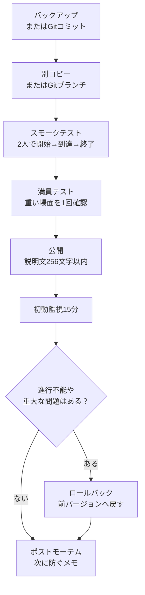

# 0 Publication/hosting/operation

> ―― Design that can be played, explanations that can be conveyed, and updates that do not break anything

* Publish the created modes without hesitation and create a path that makes it easy to play even with a small number of people.
* Standardize the title, description within 256 characters, thumbnail, and external announcements to prevent omissions in the explanation.
* Have operational procedures (backup/verification/release notes/rollback) that allow updates without breaking anything.

It is quite difficult to gather people just by natural flow into anonymous personal mode in Portal.
Please read this chapter not as a method for attracting large-scale customers, but as a management memo to help visitors get started without hesitation and to know where to fix things after playing.

# 1 Pre-publication checklist (30 seconds version)

* Title: Short proper noun + something to do (Example: Checkpoint Rush — Terminal startup → 10 seconds defense)
*Description: 256 characters or less. If possible, write only the purpose, number of people, and time in a short sentence in English.
* Recommended number of people/time: e.g. “8–16 people / 10–15 minutes”
* Area/vehicle: Specify whether to exit or not
* Thumbnail: A cut that shows the atmosphere and the first place to go without cramming in information.
* Test: Start → Reach → Finish in 2 patterns: 2 people and full
* Log: Note the version number, changes, and release date and time.

> If you are unsure, narrow it down to ``purpose,'' ``recommended number of people,'' ``required time,'' and ``the first thing to press.'' Explanations can be up to 256 characters, so detailed FAQs and update history will be posted to external announcements.

## Pre-publication check (practical version)

Once you have passed the 30 second version, check the following items before publishing.

| Items to check | Things to see |
| ---- | ---- |
| Single person test | Start, move, reach, and finish by yourself |
| Two-person test | If only one presses the button, the required display appears on both parties |
| Late participation | Late participants can spawn without hesitation and see the necessary UI |
| Leaving | Even if a participant leaves, it will not be impossible to proceed |
| Redeployment | UI and WorldIcon do not collapse after death or respawning |
| UI redisplay | After menus and notifications disappear, they reappear when necessary |
| Long-time operation | Runs for more than 15 minutes, SFX/FX and UI do not continue to increase |
| Number of vehicles | Not exceeding 40 vehicles at the same time. Combine permanent vehicles and event vehicles |
| Check the log | There are no errors or unexpected hits in `PortalLog.txt` |

``It worked by myself, but broke when I published it'' tends to happen when joining, leaving, or redeploying midway. Please don't settle for anything here. It's cheaper to check for 5 minutes now than to cry later.

# 2 Explanation template (up to 256 characters)

There are no tags that creators can freely add on the experience description screen.
Also, the description can be up to 256 characters.
Therefore, the explanations in the Portal are basically in "short English", and detailed Japanese explanations are divided into external announcements.

## Portal description example

```text
Checkpoint Rush. Press the center terminal, follow the objective icons, then defend the final zone for 10 seconds. Recommended 8-16 players. 10-15 min. Transport vehicles only.
```

This example is approximately 180 characters.
Even if it fits within 256 characters, it's not the place to put all the information you want people to read.
In the portal, only communicate the purpose, number of people, time, and first action.

## Points

*Write ``things to do'' instead of ``strengths.''
* Eliminate players' **initial concerns (where? What to press? How many minutes?)**.
* For the community, it is best to avoid explanations that are only in Japanese. Short texts in English are provided within the portal, while detailed Japanese explanations are posted in external announcements such as X, Discord, Blog, and Note.
* Do not assume that it will be supplemented with tags. Assuming that there are no tags that the creator can freely add, we will communicate this through the title, description, and thumbnail.

# 3 Hosting operation: two pillars: permanent and event
## Permanent (play anytime)
* Aim: To give visitors a sense of security that they can try it right away.
* Settings: Short (10-15 minutes), short waiting time, 1-2 maps, easy to match even at night.

## Event (announced in time)

* Aim: Links with X/Discord, etc. to make it easier for even a small number of people to gather at the same time.
* Settings: Incorporate a tutorial/demo in the pre-start lobby (entrance icon → start button → 1 minute trial).
* Template announcement:

"Today 21:00 ~ Checkpoint Rush will be released for the first time. 8-16 people / about 12 minutes. In the lobby, press the start button → follow the signs to activate the terminal → defend for 10 seconds at the destination. Welcome to the first viewing!"

# 4 “Effective placement” of thumbnails and conductors

* Thumbnail: Do not include information so that it can be seen even on a small display.
* Guidance: Instead of relying solely on 256-character descriptions, provide a short guide at `OnGameStart` at the start of the game or at the first InteractPoint. The text to be displayed on the screen is registered at `Strings.json` and called at `mod.Message(mod.stringkeys.xxx)`.

Thumbnails are not "instructions".
If the image size is small, even if you include text or a detailed map, it will not be read.
Detailed explanations will be posted in external announcements or short in-game displays, and thumbnails will be used as an introduction.

# 5 Basic procedures for “non-destructive updates” (operation runbook)

1. Backup: Copy ids.ts / config.ts / Script.ts / ui.ts / game.ts with date (e.g. 2025-10-28_v1.2/). If you are managing with Git, make a commit before updating.
2. Validation branch: Always make new adjustments in a separate copy or Git branch.
3. Smoke test: 2 people start → reach → finish.
4. Crowded test: Create one scene where AI/vehicle/FX overlap.
5. Publishing: Make sure the description is within 256 characters, and keep the version and summary to the minimum necessary.
6. Initial monitoring for 15 minutes: Are there any withdrawal rates, lags, or inability to progress?
7. Rollback: Immediately revert to the previous version if an error occurs (returns the version notation in thumbnails and descriptions as well).
8. Postmortem (5 minutes is fine): Note what happened and how to prevent it next time.



> Tip: Give top priority and carefully verify updates that touch the ID. ID errors tend to result in "not working".

If you can use Git, history management will be easier than manual copying.
If you leave the pre-publication state as a tag or commit like `v1.2`, you will be less confused about which files to restore.
However, make sure that you can also see which source code `dist/Script.ts` and `dist/Strings.json` registered in Portal Web Builder were created from.

# 6 “Safe zone” for change: Where to start to fix it so it doesn’t collapse?

* Safety first: config.ts numbers (defense seconds, cooldown, recommended number of people display)
* Relatively safe: ui.ts wording/order (within the frame of words → landmarks → effects)
* Caution required: Addition/modification of ids.ts (inspect with Vitest → also check on Godot side with ObjIdManager and ledger)
* Easy to break: Add branch to Script.ts / flow.ts (need to review onceIn and Phase transitions)

# 7 FAQ for players (separate display destinations)

It is not always possible to put a long Japanese FAQ in the portal.
The FAQ is divided into ``things written in external announcements'' and ``things briefly displayed in-game.''

| Display location | Suitable content | How to write |
| ---- | ---- | ---- |
| X / Discord / Blog / Note | Detailed FAQ, reason for update, known issues | Japanese is fine |
| Portal description | Purpose, time required, recommended number of people | Up to 256 characters, mainly in English |
| In-game UI | What to do next | Display the key in `Strings.json` as `mod.Message` |

If you want to show it in-game, it would be realistic to display the initial guidance only once at `OnGameStart`, or to display it briefly immediately after pressing the start InteractPoint.
For example, only say one thing at a time, such as ``Press the center terminal,'' ``Go to the landmark,'' or ``Defend at the destination.''

* Q: How do I get started?
  * A: Press **Terminal (E)** in the center of the lobby to start.

* Q: The landmark has disappeared.
  * A: Proceed while turning off the previous landmark. If there is no sign, please check the nearby signboard.

* Q: How many minutes?
  * A: It takes 10 to 15 minutes to complete one rotation.

# 8 How to collect feedback (minimum set)

While the number of people is small, it is more practical to ask questions during a chat right after playing than to prepare a form or tally sheet.
The more effort you put into it, the less you'll get an answer.

The following three things are enough to ask first.

*Where are you lost?
* What scenes were too long or too short?
* Did you want to play again?

As the number of people increases, I use "when", "where", "what to do", and "what happened" as bug report templates.
There is no need to assume form operation from the beginning.

# 9 Mini guide to prevent bugs and abuses

* Pressing the start button repeatedly: Always apply the throttle in Chapter 6 (once per second).
* Repeated hit of arrival effect: single pass + SFX cooldown in onceIn.
* Unable to progress: Emergency stop (disable start → "Adjusting" displayed on lobby sign → rollback to old version).
* Vandalism: Clarified within the scope of Portal standard functions such as kicks, votes, team locks, etc. (1 line in the description).

# 10 External release notes (example)

There is no place in Portal to write adequate release notes.
The change history will be left externally, such as in X, Discord, Blog, Note, GitHub README, etc.
On the Portal side, I only write the version and a short summary if necessary. However, the description can be up to 256 characters, so don't overcrowd the update history.

> v1.3 (2025-10-28)
> * Relocate the destination WorldIcon closer to the entrance (to prevent losing sight)
> * Adjusted defense count from 10 to 12 seconds, SFX now has cooldown
> * Portal description updated to 8-16 players
> Known issue: Transport vehicles may get stuck when full (scheduled for improvement in next version)

# 11 “How to read numbers” after publication (easy version)

* Pre-start withdrawal rate: Are there any dropouts in the lobby? → Review the explanation and start guidance.
*Achievement rate: Entrance → destination arrival rate → icon position and message order.
* Completion rate: Did you make it to the end? → Fine-tune defense seconds and enemy density with config.ts.
* Average play time: Avoid too long/short (10–15 minutes is a good guide).

# Conclusion

*Publication is the completion process of the experience. The design, explanation, guidance, announcements, and updates are all **works**.
* Short English sentences of up to 256 characters + 30 seconds check to prevent accidents that don't get the message across.
* Non-destructive updates can be fixed in five steps: backup -> verification -> publication -> monitoring -> rollback.
* Rather than assuming a large number of customers, we aim to create a situation where a small number of people can play without hesitation.
* For XP, there may be restrictions depending on the situation, and I will try to express it in a soft manner.
