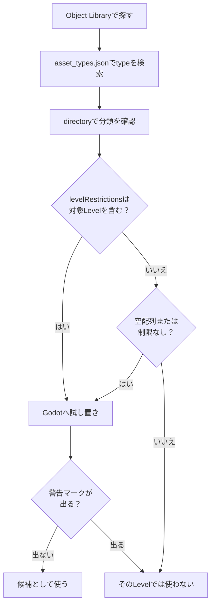

この章では、「置けるものはどこから来ているのか」「どのマップで何が置けるのか」「動作に関わる重要オブジェクトは何か」をGodotの実体（`.tscn`）とPortal側の名称を一致させて整理します。最終的に、 **後続のルール設計とTypeScript実装から参照・制御できる形（＝IDが付与され、台帳化された状態）** まで準備します。

:::message
設置できるオブジェクトを探すときは、[BF6 Object Guide](https://bf6-book.orizika.com/) も併用してください。
マップ別・タグ別・キーワード検索で候補を絞り込める、設置可能オブジェクトの一覧Webサイトです。
Godotや `asset_types.json` で最終確認する前の「候補探し」に使うと、Object Libraryを手探りで眺め続ける時間を減らせます。
:::

# 1　“置けるもの”の正体：“res://objects”とマップ依存

**マップ上に配置できるオブジェクトは、 Godotのファイルシステム `res://objects` 内にあるものに限られます** 。さらに、 **「どのマップをベースに編集するか」によって置けるオブジェクトの範囲に制限があります** 。 **2026年7月1日時点で手元にあるPortal SDK(バージョン：1.3.3.0)は次のように構成** されています。

SDKは更新で構成が変わることがあります。作業前にSDK直下の `sdk.version.json` を確認し、本書と違う場合はSDK内の `docs/pages/spatial_editor.html` と `code/types/mod/index.d.ts` を優先してください。

Godotの実フォルダ例：
`res://objects/entities`、`res://objects/gameplay`、`res://objects/fx`、`res://objects/props`、`res://objects/nature`、`res://objects/architecture`、`res://objects/roads` など。

なお `asset_types.json` の `directory` には `Gameplay/Common` のような大文字混じりの分類名が出ることがあります。
これはアセット分類として読み、Godotで実ファイルを探すときは `res://objects/gameplay/common` のように、実際のフォルダ名に合わせて確認してください。

ここで重要なのは、「フォルダ名だけで使用可否を決めない」という点です。
最終的にそのアセットを置けるかどうかは、SDK内の `asset_types.json` とエディタ上の警告で確認します。
配置した瞬間に下記のように警告マークが出たら、そのベースマップでは使えないと考えてください。


## `asset_types.json` でレベル制限を確認する

アセットのマップ制限は、SDK内の `FbExportData/asset_types.json` から確認できます。
Object Libraryで見えているかどうかだけで判断せず、迷ったらこのファイルを検索してください。

見る場所は、各アセット定義の次の3項目です。

| 項目 | 意味 |
| ---- | ---- |
| `type` | オブジェクト名。Godot上やObject Libraryで探すときの名前 |
| `directory` | そのアセットが入っているフォルダ |
| `levelRestrictions` | 設置できるLevel名の一覧 |

たとえば、`AAGun_01` は次のように定義されています。

```json
{
  "type": "AAGun_01",
  "directory": "Props",
  "levelRestrictions": [
    "MP_Battery"
  ]
}
```

この場合、`AAGun_01` は `Props` 配下のアセットで、`MP_Battery` 向けに制限されていると読めます。
一方で、`AI_Spawner`、`AreaTrigger`、`WorldIcon`、`VehicleSpawner` のようなゲームルール用アセットは手元のSDKでは `levelRestrictions: []` になっています。
SDK 1.3.1.0では、`VehicleSpawner` 系のプロパティ名が `DisableRespawn` から `EnableRespawn` に変わり、初期値も `true` になっています。古いメモやテンプレートから移植するときは、「リスポーンを無効にする」フラグではなく「リスポーンを有効にする」フラグとして読み替えてください。
空配列や制限項目がないものは共通的に使える候補ですが、SDK更新やエディタ側の警告表示が優先です。

実務では、次の順で確認すると安全です。

1. Object Libraryで目的のアセット名を探す。
2. `asset_types.json` で `type` を検索する。
3. `directory` で置き場所を確認する。
4. `levelRestrictions` に編集中のLevel名が含まれるか確認する。
5. Godotに配置し、警告マークが出ないか確認する。



フォルダ名と公式のLevel名、Map IDは一致しない場合があります。
SDKの `docs/pages/spatial_editor.html` と `FbExportData/level_info.json` では、利用できるLevelは次のように整理されています（2026年7月1日時点、SDK 1.3.3.0）。

| 公式Level Name | Map ID |
| ---- | ---- |
| Siege of Cairo | MP_Abbasid |
| Empire State | MP_Aftermath |
| Bellum1988's Operation Metro | MP_Aftermath_Portal |
| Blackwell Fields | MP_Badlands |
| Iberian Offensive | MP_Battery |
| Liberation Peak | MP_Capstone |
| Contaminated | MP_Contaminated |
| Manhattan Bridge | MP_Dumbo |
| Eastwood | MP_Eastwood |
| Operation Firestorm | MP_Firestorm |
| Golf Course | MP_Granite_ClubHouse_Portal |
| Downtown | MP_Granite_MainStreet_Portal |
| Marina | MP_Granite_Marina_Portal |
| Area 22B | MP_Granite_MilitaryRnD_Portal |
| Redline Storage | MP_Granite_MilitaryStorage_Portal |
| Defense Nexus | MP_Granite_TechCampus_Portal |
| Complex 3 | MP_Granite_Underground_Portal |
| Saint's Quarter | MP_Limestone |
| New Sobek City | MP_Outskirts |
| Cairo Bazaar | MP_Plaza |
| Portal Sandbox | MP_Portal_Sand |
| Hagental Base | MP_Subsurface |
| Railway to Golmud | MP_GolmudRailway |
| Mirak Valley | MP_Tungsten |

※ 公式docsのAvailable Levels表では `MP_Firestorm` と表記されていますが、手元SDKの `asset_types.json` とGodotのレベルファイルでは `MP_FireStorm` の表記も使われています。`levelRestrictions` を検索するときは、SDK内の実データ側の表記を優先してください。
※ `MP_Granite_ClubHouse_Portal` は公式Level Nameでは `Golf Course` です。実際に使う場合は、`asset_types.json` の `levelRestrictions` と、Godot上の警告表示を確認してください。
※ SDK 1.3.3.0では、コミュニティマップの `MP_Aftermath_Portal` と、Spatial Editor用の `MP_Plaza` が追加されています。`MP_Plaza` 由来のランタイム生成候補は `RuntimeSpawn_Plaza` として型定義にも追加されています。

例えば 「`MP_Aftermath`（Empire State）」をベースに編集する場合は、`asset_types.json` の `levelRestrictions` が空、または `MP_Aftermath` を含むアセットを候補として扱います。
Object LibraryやGodot上で見えていても、`levelRestrictions` に対象Levelがなければ実際のゲーム内では使用・表示できません。

## `RuntimeSpawn_...` はコードから生成できる候補

`code/types/mod/index.d.ts` を見ると、`RuntimeSpawn_Common`、`RuntimeSpawn_Abbasid`、`RuntimeSpawn_Aftermath` のような enum が並んでいます。
これは、GodotのObject Libraryで手置きする一覧ではなく、TypeScriptの `mod.SpawnObject(...)` からランタイム生成できるPrefab候補です。

```ts
const obj = mod.SpawnObject(
  mod.RuntimeSpawn_Common.AreaTrigger,
  mod.CreateVector(0, 0, 0),
  mod.CreateVector(0, 0, 0),
  mod.CreateVector(1, 1, 1)
);
```

`RuntimeSpawn_Common` は複数Mapで使いやすい共通系、`RuntimeSpawn_Abbasid` や `RuntimeSpawn_Plaza` などMap名付きのものは、そのMap由来の候補として読みます。
ただし、`SpawnObject` の戻り値は、対象オブジェクトが対応していない場合 `-1` になることがあります。
また、コードで生成したものはGodot上で手置きした `ObjId` 台帳とは別管理になるため、使う場合は「手置きID」と「ランタイム生成」を分けてメモしてください。
SDK 1.3.3.0では `EnableSpatialObject` は削除されています。配置物を途中で出したり消したりしたい場合は、`SpawnObject` と `UnspawnObject` を使う前提で設計してください。

##  実務の目安：

* ゲームルールに関するオブジェクトは、まず `res://objects/gameplay` と `res://objects/entities` を中心に探す。
* 見た目や小物のアセットは、`asset_types.json` の `levelRestrictions` 確認→試し置き→警告マーク確認→使えるものだけ残すようにして使用する。
* Object Libraryで見つけたアセットは、`asset_types.json` の `type` と照合する。`levelRestrictions` に編集中のLevel名がないものは、Godotでは見えていても実際のゲーム内では使用・表示できない。
* `Static` layerに含まれる地形や焼き込み済みアセットは、現在は編集対象ではありません。
* スケール変更は均一スケールだけにします。X/Y/Zを別々に伸ばす非均一スケールは公式に推奨されていません。

# 2　動作に効く“仕掛け系”オブジェクト総覧

「見た目だけの小物」と違い、ゲームの挙動・イベント・範囲・UI等に関与する重要オブジェクトは、主に `res://objects/entities` と `res://objects/gameplay` にまとまっています。代表的なものを、Godotパスと役割、よくある組み合わせで押さえます。

## SpawnPoint（プレイヤー出現の要）

* 実体：`res://objects/entities/SpawnPoint.tscn`
* 役割：プレイヤーのスポーン位置を定義。
* よく使う組み合わせ：
  `res://objects/gameplay/common/HQ_PlayerSpawner.tscn`（チームごとのHQ出撃）
  `res://objects/gameplay/common/PlayerSpawner.tscn`（スクリプトからの直接出撃）
* 重要：`SpawnPoint` は単体で範囲を作るものではありません。`HQ_PlayerSpawner` / `PlayerSpawner` に1つ以上リンクされることで、実際にプレイヤーが出現できる位置を決めます。
* `PolygonVolume` はSpawnPoint用ではなく、`CombatArea` や `AreaTrigger` の範囲指定に使います。
* 実務の肝：チーム固有か、スクリプトから直接出撃させるかで `HQ_PlayerSpawner` / `PlayerSpawner` を選別。IDはプロパティで手動設定（初期 -1）。SpawnPoint 本体と併用オブジェクト（HQ/PlayerSpawner）の ID系列を分けると、ルール側が読みやすくなります。

## AI スポーン・経路

* AI 出現：`res://objects/gameplay/ai/AI_Spawner.tscn`
* AI 経路：`res://objects/gameplay/ai/AI_WaypointPath.tscn`

## AreaTrigger（侵入・退出検知）

* 実体：`res://objects/gameplay/common/AreaTrigger.tscn`
* 役割：入った／出たをイベント化。
* 組み合わせ：Godot `PolygonVolume` で範囲を定義。
* 実務の肝：高さ（Y）不足は禁物。ジャンプで抜ける厚みはNG。演出（FX/SFX）やスコア加算と1:1でIDをひも付け、台帳に「AreaTrigger ID → 呼ぶ相手」を書いておくと、ルール実装が迷いません。

## CapturePoint（占領できる目標地点）

* 実体：`res://objects/gameplay/conquest/CapturePoint.tscn`
* 役割：チームが奪い合う拠点。所有チーム、占領進行度、占領開始・完了・喪失イベントを扱える。
* 組み合わせ：Godot `PolygonVolume` を `CaptureArea` に設定する。必要なら `AdditionalCaptureArea` も使う。
* 実務の肝：単なる侵入判定なら `AreaTrigger` で十分。所有チーム、占領時間、占領進行度、拠点からの出撃を扱いたい場合に `CapturePoint` を使います。

`CapturePoint` は、範囲センサーではなく「ゲームモード上の目標」です。
TypeScript側では `mod.GetCapturePoint(id)`、`mod.GetCaptureProgress(...)`、`mod.GetCurrentOwnerTeam(...)`、`mod.SetCapturePointOwner(...)` などで状態を読んだり変更したりできます。

## Bomb / MCOM（Obliteration系の爆弾目標）

SDK 1.3.3.0では、Obliteration向けに `Bomb` 型とM-COMの爆弾連動設定が追加されています。
BombはSpatial Editorに配置するか、`mod.SpawnObject(mod.RuntimeSpawn_Common.Bomb, ...)` で生成して使います。

TypeScript側では `mod.GetBomb(id)` で取得し、`mod.GiveBombToPlayer(...)`、`mod.ForceBombDrop(...)`、`mod.ForceBombReset(...)`、`mod.SetBombTeam(...)`、`mod.SetBombDropFuseTime(...)` などで制御します。
M-COM側は `mod.SetMCOMArmType(mod.GetMCOM(id), mod.MCOMArmType.Bomb)` にすると、Bomb所持者だけがアームできる目標として扱えます。

## MovingPlatform（動く足場）

SDK 1.3.3.0では、移動する足場向けの `MovingPlatform` アセットが追加されています。
サンプルでは `BarrierStoneBlock_01_H_PortalPlatform` を `SpawnObject` で生成するか、Godot上に配置してObjIdを付け、`MoveObjectOverTime` や `OrbitObjectOverTime` で動かしています。

プレイヤーが乗る前提の足場は、見た目の移動だけでなく接触・同期が重要です。
通常の飾りオブジェクトを無理に動かすより、MovingPlatform対応アセットを選び、移動距離、周期、反転、停止タイミングを台帳に書いておく方が安全です。

## VL7Cloud（ガス雲・特殊効果エリア）

* 実体：`res://objects/gameplay/common/VL7Cloud.tscn`
* 役割：ガス雲のような特殊効果エリア。画面効果、兵士効果、VFXをまとめて切り替えられる。
* 組み合わせ：`AreaTrigger` や `CapturePoint` のように `PolygonVolume` を別途ひも付けるタイプではなく、VL7Cloudそのものを配置して使う。
* 実務の肝：毒ガス、煙、視界妨害、特殊区域のように「その場所自体に効果がある」表現で使います。単なるゴール判定やスイッチ範囲には使いません。

TypeScript側では `mod.GetVL7Cloud(id)` で取得し、`mod.SetVL7CloudEffects(cloud, screenEffect, soldierEffect, visualEffect)` で効果を切り替えます。
侵入・退出は `OnPlayerEnterVL7Cloud` / `OnPlayerExitVL7Cloud` で拾えます。

## 範囲系オブジェクトの使い分け

`AreaTrigger`、`CapturePoint`、`VL7Cloud` はどれも「範囲に入ったプレイヤー」に関係します。
ただし、使う目的はかなり違います。

| 目的 | 使うもの | 理由 |
| ---- | ---- | ---- |
| ゴール判定、ショップ範囲、罠、イベント開始地点 | `AreaTrigger` | 入った／出たを自分のロジックにつなげるだけでよい |
| A拠点、B拠点、陣取り、所有チームで処理を変える | `CapturePoint` | 占領進行度、所有チーム、占領イベントを使える |
| 毒ガス、特殊な煙、画面効果や兵士効果のある区域 | `VL7Cloud` | 範囲そのものに専用の効果を持たせられる |

迷ったら、まず `AreaTrigger` から考えてください。
「占領」や「所有チーム」という言葉が必要になったら `CapturePoint`、ガス雲や特殊効果そのものを置きたいなら `VL7Cloud` です。

## CombatArea（プレイ可能領域）

* 実体：`res://objects/gameplay/common/CombatArea.tscn`
* 役割：プレイ可能範囲を指定し、外側に出たら警告・ダメージ等を適用。
* 組み合わせ：Godot `PolygonVolume` で範囲を定義。
* 実務の肝：外周は広め、例外は局所的に。テスト時に「復帰できずハマる」ケースを重点チェック。

## DeployCam（デプロイ画面の俯瞰）

* 実体：`res://objects/gameplay/common/DeployCam.tscn`
* 役割：マップ全体の俯瞰表示位置・角度を調整。
* 実務の肝：これを設置しないと、出撃前・出撃後のマップ表示がおかしくなるので、必ず設定する。

## HQ / Player Spawner（出現ルールの違い）

* HQ 専用：`res://objects/gameplay/common/HQ_PlayerSpawner.tscn`
  チームに割り当てて使う、標準的なHQ出撃用のSpawnerです。チームごとの出撃位置を作りたい場合はこちらを使います。
* 直接出撃用：`res://objects/gameplay/common/PlayerSpawner.tscn`
  HQを持たない代替Spawnerです。チームには割り当てず、スクリプトから任意のプレイヤーを出撃させる用途に向いています。
* どちらのSpawnerも、1つ以上の `SpawnPoint` とリンクして初めて出撃位置として機能します。
* 実務の肝：誤出現を避けたいなら HQ 用を採用。スクリプトで任意の出撃を制御したいなら PlayerSpawner を採用。混在運用時は ID帯を分けて明確に。

## InteractPoint（操作起点）

* 実体：`res://objects/gameplay/common/InteractPoint.tscn`
* 役割：近づくと表示、ボタン押下でイベント発火。
* 実務の肝： **「押す→何が起こるか」** をルールに直結させるため、意味の分かるID（例：Start=500 / Shop=501）に。

## Sector（ブレイクスルー系の核）

* 実体：`res://objects/gameplay/common/Sector.tscn`
* 役割：セクター概念を追加。ブレイクスルーのように「押し引きの段階」を構成。
* 含まれる概念：`Advance Area` / `Retreat Area` / `Capture Points` / `Sector Area`
* 実務の肝：複数エリアを矛盾なく重ねる。IDを概念ごとに整理しておくとルール側のフェーズ制御が書きやすくなります。

## StationaryEmplacementSpawner（固定武器）

* 実体：`res://objects/gameplay/common/StationaryEmplacementSpawner.tscn`
* 役割：固定武器の出現位置・内容を定義。
* 実務の肝：視界・被弾通路・遮蔽の物理干渉に注意。IDで“撤去／再配置”の制御余地を確保。

## CombatArea の SurroundingVolume（HQの防波堤）

* 実体：`res://objects/gameplay/common/CombatArea.tscn`
* 役割：`CombatArea` の `SurroundingVolume` で、コンクエスト系のHQ周囲に敵が侵入しにくい周辺エリアを設定。
* 補足：`SurroundingCombatArea.tscn` という独立した設置オブジェクトではありません。`CombatArea` に `CombatVolume` / `ExclusionVolume` / `SurroundingVolume` を設定して使います。
* 実務の肝：HQ近傍だけを強めに。広げすぎると攻め手が窒息します。

## VehicleSpawner（車両出現）

* 実体：`res://objects/gameplay/common/VehicleSpawner.tscn`
* 役割：兵器の出現位置と車種を定義。
* 実務の肝：出現直後の接触物なし／進行方向に向ける／常設とイベントでID帯を分ける（例：2001=常設、2090番台=イベント）。

## VehicleResupplyStation（車両補給）

SDK 1.3.3.0では、車両向けの `VehicleResupplyStation` アセットも追加されています。
配置候補として扱うときは、車両の進入経路、補給中に詰まらない余白、周辺の戦闘圧を合わせて確認してください。

## WorldIcon（目標の道しるべ）

* 実体：`res://objects/gameplay/common/WorldIcon.tscn`
* 役割：壁越しに見える目印。説明文・所有チーム・表示/非表示をルールで制御。
* 実務の肝： **目的地の“少し手前”** に置くと導線と一致。IDは早めに固める（例：21,22…）。

## FX（ビジュアルエフェクト）

* 実体：様々なフォルダに`FX_****.tscn`という形で存在
* 役割：花火や爆発などのエフェクト表現を表示
* 実装の肝：光が激しく出たり点滅するようなエフェクトは、「ポケモンショック」現象が起きないように注意。

## SFX（サウンド表現）

* 実体：様々なフォルダに`SFX_****.tscn`という形で存在
* 役割：花火音や爆発音などの音の表現を表示
* 実装の肝：たくさん置くとうるさい

# 3 配置の実務フロー（ID・台帳・互換チェック）

実際の作業は、次の流れに落とすとミスが激減します。

1. ベースレベルを決める
  下記のように、一覧が存在しているので、目的に合ったベースレベルを複製・複製したレベルをダブルクリックしてレベルを展開する。


*レベル一覧*


*複数作成後、「MP_Test_Granite_ClubHouse_Portal.tscn」という名前のレベルを作成した*


*ダブルクリックして、レベルを開く*

2. 置ける候補を抽出する
  まずは `res://objects/gameplay` / `res://objects/entities` からゲームルールに関するものを選びます。
  気になるアセットがあれば、`FbExportData/asset_types.json` で `type` を検索し、`directory` と `levelRestrictions` を確認します。
  見た目や小物のアセットは、`levelRestrictions` 確認→試し置き→警告マークで互換を確認してから残します。

3. 配置と同時にIDを付ける
  画像のように **Obj Id欄** で手動入力。IDは、重複させない。系列分け（例：Spawn=1000台 / Vehicle=2000台 …）を守る。
  TypeScript実装で参照・制御しないオブジェクト(椅子などの環境オブジェクト)は、初期値の-1で問題ない。


*Obj ID欄で、オブジェクトのIDを設定した*

## ObjId台帳テンプレ

IDはGodot上だけで管理すると、あとで必ず迷います。最低限、下記のような台帳を用意してください。

台帳はExcel、Google Sheets、Markdown表、CSVのどれでも構いません。
重要なのはツールではなく、`ObjId`、用途、Godotオブジェクト、TypeScript取得関数、テスト結果を同じ場所で管理することです。

:::message
手作業の台帳管理がつらくなってきたら、[hekaron/ObjIdManager](https://github.com/hekaron/ObjIdManager) を使うのも候補になります。
これはBattlefield Portal SDKのGodot環境向けに作られたObjId管理アドオンで、Node3Dの `ObjId` 一覧表示、重複値のハイライト、自動連番付与、TypeScript形式へのエクスポートなどができます。
本書ではまず台帳で考え方を押さえますが、配置オブジェクトが増えてきたら、こうしたツールを使うと確認漏れや重複IDを減らしやすくなります。
コード側の `ids.ts` はVitestで確認し、Godot側の実配置はObjIdManagerや台帳で確認する、と役割を分けると安全です。
:::

| 用途 | ObjId | Godotオブジェクト | TypeScript取得関数 | テスト結果 | 備考 |
| ---- | ---- | ---- | ---- | ---- | ---- |
| 開始ボタン | 500 | InteractPoint | `mod.GetInteractPoint(500)` | 未確認 | ロビー中央 |
| 入口案内 | 21 | WorldIcon | `mod.GetWorldIcon(21)` | 未確認 | 初期表示 |
| 目的地案内 | 22 | WorldIcon | `mod.GetWorldIcon(22)` | 未確認 | 開始後表示 |
| 目的地判定 | 11 | AreaTrigger | `mod.GetAreaTrigger(11)` | 未確認 | 高さを十分に取る |
| 成功FX | 901 | VFX | `mod.GetVFX(901)` | 未確認 | 到達時に再生 |
| 成功SFX | 951 | SFX | `mod.GetSFX(951)` | 未確認 | 鳴らし過ぎ注意 |

台帳の「テスト結果」は、配置直後に「未確認」から始めます。テストで動いたら「OK」、壊れていたら「要修正」と書き換えるだけで、見落としが減ります。

4. 互換と当たりの最終確認
  `levelRestrictions` があるオブジェクトは警告の有無を再確認。
  高さ（Y）で空中湧き・地中めり込みが起きないか、Spawn／Vehicle 周辺の余白は十分かをテスト。

:::message
実務Tips：公式docsに明記された必須手順ではありませんが、オブジェクト配置前後に地形や床の当たり判定、コリジョン状態を確認しておくと、配置物が地面に潜る、少し浮く、車両が引っかかる、といった事故を減らせます。
:::

5. マップデータの作成
  右下にBFPortal欄があるので、その中の「Portal Setup」ボタンをクリック。少し待つと、「Completed setup」と言われます。
  次に、「Export Current Level」ボタンをクリックする。これをすると、`レベル名.spatial.json`というファイルが、ポータルのプロジェクトが保存されているフォルダ階層から見て、`*Portal保存場所*\export\levels`に、出来ます。
  ※「Open Exports...」ボタンを押すと、エクスプローラーが開いて場所を案内してくれます。


*BFPortalの欄*


*「Portal Setup」をボタンをクリック後の表示*


*「Export Current Level」をボタンをクリック後の表示*


6. マップデータをPortalに登録する
  作ったマップデータをPortalに登録します。
  下記の画像のように、Portal作成画面のマップローテーション欄に移動し、用意したLevelと同じマップを選択。作ったデータファイルを、登録します。


*Portal作成画面(マップローテーション)*


*マップデータ設定*


*マップデータが付いているか確認*


ここまで終われば、次章のルール設計と後続のTypeScript実装から即参照・即制御できます。 **“置いたけど動かない”の9割は IDが -1、または重複／台帳漏れです。**


# 4 最小セットアップ例（動作確認まで）

最短で「置いて動かす」ための極小構成を、実務手順で示します。
（ここでは Team1/Team2 の出現、開始ボタン、目印、単純な演出の“芯”だけ用意します）

* 出現点：`HQ_PlayerSpawner`や`PlayerSpawner`を設置し、1つ以上の `SpawnPoint` とリンクする。
* 開始ボタン：`InteractPoint`（ID:500）をロビーに置く。正面から押しやすい高さ。
* 目印：`WorldIcon` を2つ（ID:21 / 22）。入口手前と目的地手前。
* 演出：`FX`（ID:901）と `SFX`（ID:951）を目的地に配置。
* 検知：`AreaTrigger`（ID:11）で目的地侵入を拾う。`PolygonVolume` で高さを十分に。
* 台帳：1001/1002=各陣営スポーン、500=開始、21/22=目印、11=侵入検知→901/951 を起動

この状態で保存し、テスト起動してスポーン → ボタン押下 → 侵入 → 演出までを目視確認します。
以降は次章で、下記のような流れを、組んでみたいと思います。

1. `InteractPoint`(ID:500) の押下をトリガー。
2. `WorldIcon`(ID:21) → `WorldIcon`(ID:22) へ誘導を切り替える。
3. `AreaTrigger`(ID:11) で、`FX`(ID:901) と `SFX`(ID:951)を動作させる。

自分のプロジェクトでは、Godotで編集する `.tscn` と、Portal Web Builderへ登録する `.spatial.json` を必ずセットで管理してください。
`.tscn` だけではPortal側に反映できず、`.spatial.json` だけでは後から編集内容を追いにくくなります。
ファイル名にはベースMap ID、用途、日付や版番号を入れておくと、再デプロイ時の取り違えを防げます。

# 結論：やるべきことは3つだけ！

マップエディタでやることは、次の三点に尽きます。

(1) 置ける“実体”を正しく選ぶ（ベースレベル＋互換のある共通群）
(2) 置いた直後に -1 ではないIDを手動で付与する（系列分けと台帳化）
(3) Godot連携（`PolygonVolume` 等）を使う仕掛け系オブジェクトを所定の手順で組む。

この三点ができていれば、後続のルール設計とTypeScript実装での参照・制御は素直に動きます。

---

📘 **次章「ルール設計入門（配置を“動かす”前に考える）」** では、いまIDを付けた `SpawnPoint`／`AI_Spawner`／`AI_WaypointPath`／`AreaTrigger`／`CombatArea`／`DeployCam`／`HQ`/`PlayerSpawner`／`InteractPoint`／`Sector`／`StationaryEmplacementSpawner`／`VehicleSpawner`／`WorldIcon`／`FX`／`SFX` を、イベントと条件で結びます。最初は、 **「開始ボタン（InteractPoint 500）→目印更新（WorldIcon 21→22）→目的地侵入（AreaTrigger 11）でFX/SFX起動（901/951）」** という最小ループから始め、段階的に複合イベントへ発展させます。
