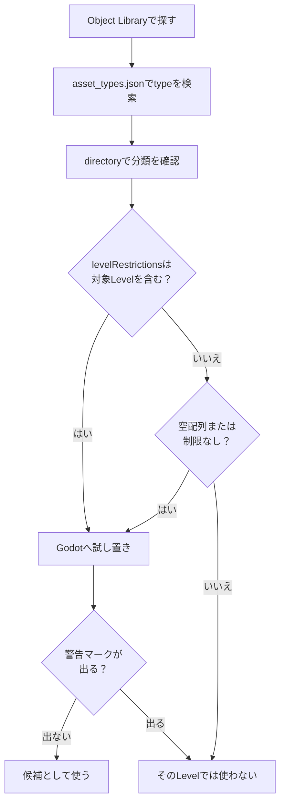

在本章中，我们将通过匹配 Godot 实体（`.tscn`）和 Portal 的名称来组织“可以放置的东西从哪里来？”“什么地图可以放置什么？”和“与操作相关的重要物体有哪些？”等问题。最后，我们将准备一个可以从后续规则设计和TypeScript实现中引用和控制的表单（=分配的ID和账本状态）。

# 1 “可以放置的东西”的真正本质：“res://objects”和地图依赖

**可以放置在地图上的对象必须位于 Godot 的文件系统 `res://objects`** 中。此外，根据您编辑的地图，可放置的对象范围也有限制。 ** **截至2026年4月21日，现有的Portal SDK（版本：1.2.3.0）配置如下**。

SDK的配置可能会因更新而改变。开始工作之前，先查看SDK下的`sdk.version.json`，如果与本文档不同，优先考虑SDK中的`docs/pages/spatial_editor.html`和`code/types/mod/index.d.ts`。

Godot真实文件夹示例：
`res://objects/entities`、`res://objects/gameplay`、`res://objects/fx`、`res://objects/props`、`res://objects/nature`、`res://objects/architecture`、`res://objects/roads` 等。

另外，`Gameplay/Common`等大写字母混合的分类名称可能会出现在`asset_types.json`的`directory`中。
将其视为资产分类，并在 Godot 中查找实际文件时，根据实际文件夹名称进行检查，例如 `res://objects/gameplay/common`。

这里重要的一点是“文件夹名称本身并不能决定它是否可以使用。”
检查 SDK 中的 `asset_types.json` 以及编辑器上的警告，看看是否最终可以放置资源。
如果在放置时出现如下所示的警告标记，请考虑它不能与该底图一起使用。


## 检查级别限制 `asset_types.json`

您可以在 SDK 中的 `FbExportData/asset_types.json` 查看资产的地图限制。
不要仅根据对象库中是否可见来判断；如果有疑问，请搜索该文件。

每个资产定义中需要考虑三个方面：

|项目 |意义|
| ---- | ---- |
| `type` | `type` |对象名称。在 Godot 或对象库中搜索时的名称 |
| `directory` | `directory` |包含资产的文件夹 |
| `levelRestrictions` | `levelRestrictions` |可安装的关卡名称列表 |

例如，`AAGun_01` 定义为：

```json
{
  "type": "AAGun_01",
  "directory": "Props",
  "levelRestrictions": [
    "MP_Battery"
  ]
}
```

在这种情况下，`AAGun_01` 可以被读取为 `Props` 下的资产，该资产仅限于 `MP_Battery`。
另一方面，游戏规则资源（例如 `AI_Spawner`、`AreaTrigger`、`WorldIcon` 和 `VehicleSpawner`）在 SDK 中被重命名为 `levelRestrictions: []`。
空数组和没有限制项的数组是通常可用的候选数组，但优先考虑 SDK 更新和编辑器端警告显示。

实际上，按以下顺序检查是安全的。

1. 在对象库中搜索所需的资源名称。
2. 在 `asset_types.json` 中搜索 `type`。
3. 检查 `directory` 的位置。
4. 检查 `levelRestrictions` 是否包含正在编辑的 Level 名称。
5. 将其放在Godot 上，检查是否出现警告标记。



文件夹名称、官方关卡名称和地图 ID 可能不匹配。
在 SDK `docs/pages/spatial_editor.html` 中，可用级别的组织如下（截至 2026 年 4 月 21 日，SDK 1.2.3.0）。

|官方级别名称 |地图ID |
| ---- | ---- |
|开罗围城| MP_阿拔斯 |
|帝国大厦 | MP_后果|
|布莱克威尔场| MP_荒地 |
|伊比利亚攻势 | MP_电池|
|解放峰| MP_Capstone |
|污染| MP_污染 |
|曼哈顿大桥| MP_小飞象 |
|伊斯特伍德 | MP_伊斯特伍德 |
|火焰风暴行动 | MP_Firestorm |
|高尔夫球场 | MP_Granite_ClubHouse_Portal |
|市中心 | MP_Granite_MainStreet_Portal |
|码头 | MP_Granite_Marina_Portal | MP_Granite_Marina_Portal |
| 22B区| MP_Granite_MilitaryRnD_Portal | MP_Granite_MilitaryRnD_Portal |
|红线存储| MP_Granite_MilitaryStorage_Portal | MP_Granite_MilitaryStorage_Portal |
|国防关系| MP_Granite_TechCampus_Portal |
|综合体 3 | MP_Granite_Underground_Portal | MP_Granite_Underground_Portal |
|圣区 | MP_石灰石 |
|新索贝克市| MP_郊区 |
|门户沙盒 | MP_Portal_Sand | MP_传送门_沙子
|哈根塔尔基地 | MP_地下 |
|米拉克谷| MP_钨 |

* 在官方文档的Available Levels表中，写为`MP_Firestorm`，但在本地SDK中`asset_types.json`和Godot的level文件中，也使用`MP_FireStorm`。搜索`levelRestrictions`时，优先考虑SDK中的实际数据表示法。
*`MP_Granite_ClubHouse_Portal` 是官方级别名称 `Golf Course`。实际使用时请查看`asset_types.json`、`levelRestrictions`以及Godot上的警告显示。

例如，当基于“`MP_Aftermath` (Empire State)”进行编辑时，包含 `asset_types.json`（其中 `levelRestrictions` 为空）或 `MP_Aftermath` 的资源将被视为候选资源。
即使它在对象库或Godot中可见，也无法在实际游戏中使用或显示，除非`levelRestrictions`中有目标级别。

## `RuntimeSpawn_...` 是可以从代码生成的候选者

如果您查看 `code/types/mod/index.d.ts`，您将看到类似 `RuntimeSpawn_Common`、`RuntimeSpawn_Abbasid` 和 `RuntimeSpawn_Aftermath` 的枚举。
这是一个预制候选，可以在运行时从 TypeScript 的 `mod.SpawnObject(...)` 生成，而不是手动放置在 Godot 对象库中的列表。

```ts
const obj = mod.SpawnObject(
  mod.RuntimeSpawn_Common.AreaTrigger,
  mod.CreateVector(0, 0, 0),
  mod.CreateVector(0, 0, 0),
  mod.CreateVector(1, 1, 1)
);
```

`RuntimeSpawn_Common` 是一个通用系统，易于与多个 Map 一起使用，任何具有 Map 名称（例如 `RuntimeSpawn_Abbasid`）的内容都会被读取为从该 Map 派生的候选。
但是，如果目标对象不支持，`SpawnObject`的返回值可能会变成`-1`。
另外，代码生成的账本与 Godot 上手动保存的 `ObjId` 账本是分开管理的，所以如果您使用它们，请分别记下“手动 ID”和“运行时生成”。

## 实用指南：

* 首先，主要在`res://objects/gameplay`和`res://objects/entities`中搜索游戏规则相关的对象。
* 对于外观和配件资产，请检查 `asset_types.json` 上的 `levelRestrictions` → 尝试一下 → 检查警告标记 → 仅保留可用的物品。
* 在对象库中找到的资源与 `asset_types.json` 中的 `type` 进行匹配。如果 `levelRestrictions` 中没有正在编辑的关卡名称，则即使在 Godot 中可见，也无法在实际游戏中使用或显示。
* `Static` 图层中包含的地形和烧毁资产目前无法编辑。
* 仅将比例更改为统一比例。官方不鼓励使用单独拉伸 X/Y/Z 的非均匀比例。

#2 对移动有效的“噱头”物体列表

与“仅用于外观的配件”不同，涉及游戏行为、事件、范围、UI 等的重要对象主要组织在 `res://objects/entities` 和 `res://objects/gameplay` 中。我们将介绍典型的戈多路径、角色和常见组合。

## SpawnPoint（玩家外观的关键点）

*现实：`res://objects/entities/SpawnPoint.tscn`
* 角色：定义玩家的重生位置。
* 常用组合：
  `res://objects/gameplay/common/HQ_PlayerSpawner.tscn`（每个团队的总部出击）
  `res://objects/gameplay/common/PlayerSpawner.tscn`（从脚本直接出击）
* 重要提示：`SpawnPoint` 本身不会创建范围。 `HQ_PlayerSpawner` / `PlayerSpawner` 的一个或多个链接决定了玩家可以生成的实际位置。
* `PolygonVolume` 不用于 SpawnPoint，而是用于指定 `CombatArea` 或 `AreaTrigger` 的范围。
* 实用关键：根据是否是团队特定的或者是否可以直接从脚本调度来选择 `HQ_PlayerSpawner` / `PlayerSpawner`。 ID是在属性中手动设置的（初始-1）。将 SpawnPoint 本身和所使用的对象（HQ/PlayerSpawner）的 ID 系列分开将使规则更易于阅读。

## AI 生成/路径

* AI外观：`res://objects/gameplay/ai/AI_Spawner.tscn`
* AI路线：`res://objects/gameplay/ai/AI_WaypointPath.tscn`

## AreaTrigger（入侵/退出检测）

*现实：`res://objects/gameplay/common/AreaTrigger.tscn`
* 作用：将进入/退出变成一个事件。
* 组合：使用 Godot `PolygonVolume` 定义范围。
* 实践要点：高度（Y）不足是禁忌。能跳过去的厚度不太好。通过将ID与制作（FX/SFX）和分数加算以1:1的方式链接，并在账本中写入“AreaTrigger ID → 呼叫人员”，您将不必担心执行规则。

## CapturePoint（可捕获的目标点）

*现实：`res://objects/gameplay/conquest/CapturePoint.tscn`
* 角色：队伍争夺的基地。您可以处理所有权团队、占领进度以及占领开始/完成/损失事件。
* 组合：Godot `PolygonVolume` 到 `CaptureArea`。如有必要，还可以使用 `AdditionalCaptureArea`。
* 实用点：`AreaTrigger` 对于简单的入侵检测来说已经足够了。如果你想处理归属团队、占领时间、占领进度和基地出动架次，请使用`CapturePoint`。

`CapturePoint` 是“游戏模式目标”而不是距离传感器。
在 TypeScript 端，您可以在 `mod.GetCapturePoint(id)`、`mod.GetCaptureProgress(...)`、`mod.GetCurrentOwnerTeam(...)`、`mod.SetCapturePointOwner(...)` 等处读取和更改状态。

## VL7Cloud（气云/特效区）

*现实：`res://objects/gameplay/common/VL7Cloud.tscn`
* 作用：气云等特效区域。您可以同时切换屏幕效果、士兵效果和视觉特效。
* 组合：VL7Cloud本身被放置和使用，而不是像`AreaTrigger`或`CapturePoint`那样单独绑定`PolygonVolume`的类型。
*实用点：用于对地点本身有影响的表达方式，例如毒气、烟雾、视线障碍和特殊区域。不用于简单的目标判断或切换范围。

在 TypeScript 端，使用 `mod.GetVL7Cloud(id)` 检索它并使用 `mod.SetVL7CloudEffects(cloud, screenEffect, soldierEffect, visualEffect)` 切换效果。
入侵/退出信息可以在 `OnPlayerEnterVL7Cloud` / `OnPlayerExitVL7Cloud` 找到。

## 如何使用范围对象

`AreaTrigger`、`CapturePoint`、`VL7Cloud` 都与“范围内的玩家”相关。
然而，它们的使用目的却截然不同。

|目的|使用什么 |原因 |
| ---- | ---- | ---- |
|目标确定、店铺范围、陷阱、事件起点 | `AreaTrigger` | `AreaTrigger` |只需将入口/出口连接到您自己的逻辑 |
|处理方式的变化取决于基地 A、基地 B、位置和所属球队 | `CapturePoint` | `CapturePoint` |职业进度、归属团队、职业事件均可使用|
|有毒气、特殊烟雾、屏幕效果和士兵效果的区域 | `VL7Cloud` | `VL7Cloud` |该区域本身可以有特殊效果|

如果有疑问，请首先考虑 `AreaTrigger`。
如果您需要“职业”或“拥有团队”一词，请访问 `CapturePoint`，如果您想添加气体云或特效本身，请访问 `VL7Cloud`。

## CombatArea（可玩区域）

*现实：`res://objects/gameplay/common/CombatArea.tscn`
* 作用：指定可玩范围，如果外出则施加警告、伤害等。
* 组合：使用 Godot `PolygonVolume` 定义范围。
* 实践要点：拓展外围，局部化异常。在测试过程中，我们重点检查了人们无法返回并上瘾的情况。

## DeployCam（部署屏幕概述）

*现实：`res://objects/gameplay/common/DeployCam.tscn`
* 作用：调整整个地图的鸟瞰位置和角度。
* 实用键：如果不设置，出击前后的地图显示会不正确，所以一定要设置。

## HQ / 玩家生成器（生成规则的差异）

* 仅限总部：`res://objects/gameplay/common/HQ_PlayerSpawner.tscn`
  可以分配给团队的标准总部生成器。如果您想为每个团队创建出击位置，请使用此选项。
* 直接出击：`res://objects/gameplay/common/PlayerSpawner.tscn`
  没有总部的替代刷怪笼。当您想要从脚本中派遣任何玩家而不将其分配给团队时，它适合使用。
* 两个生成器仅在链接到一个或多个 `SpawnPoint` 时充当生成位置。
*实用点：如果你想避免假象，请使用HQ版本。如果您想使用脚本控制任意出击次数，请使用 PlayerSpawner。混合操作时，分离并澄清ID带。

## InteractPoint（操作起点）

*现实：`res://objects/gameplay/common/InteractPoint.tscn`
* 作用：接近时显示，按下按钮时触发事件。
* 实用键：**“按 → 会发生什么”** 为了将其直接连接到规则，请使用有意义的 ID（例如 Start=500 / Shop=501）。

## 扇区（突破核心）

*现实：`res://objects/gameplay/common/Sector.tscn`
* 作用：添加扇区概念。就像突破一样，它由“推阶段和拉阶段”组成。
* 包括的概念：`Advance Area` / `Retreat Area` / `Capture Points` / `Sector Area`
* 实际工作的关键：多个领域重叠且不矛盾。按概念组织 ID 可以更轻松地在规则端编写阶段控制。

## StationaryEmplacementSpawner（固定武器）

*现实：`res://objects/gameplay/common/StationaryEmplacementSpawner.tscn`
* 作用：定义固定武器的位置和内容。
*实用重点：注意可见性、命中路径、屏蔽等方面的物理干扰。带有 ID 的安全控制室，用于“搬迁/搬迁”。

## 周围战斗区域（总部防波堤）

*现实：`res://objects/gameplay/common/SurroundingCombatArea.tscn`
* 作用：在征服游戏中，在总部周围设置禁区，防止敌人进入总部。
* 实用重点：只强化总部附近的区域。如果你把它分散得太多，你的攻击者就会窒息。

## 车辆生成器

*现实：`res://objects/gameplay/common/VehicleSpawner.tscn`
* 作用：定义武器的位置和车辆类型。
*实用要点：出现后不要立即接触物体/指向行进方向/按永久物和事件分开ID带（例如2001 =永久，2090 =事件）。

## WorldIcon（目标指南）

*现实：`res://objects/gameplay/common/WorldIcon.tscn`
* 作用：透过墙壁可见的地标。按规则控制说明文本、所有权团队、显示/隐藏。
*实用关键：**将其放置在目的地“稍前”**，它将与引导线相匹配。尽早决定 ID（例如 21、22...）。

## FX（视觉效果）

* 实体：存在于各种文件夹中，如 `FX_****.tscn`
* 作用：烟花、爆炸等展示效果
* 实现要点：使用强烈闪光或闪烁灯光等效果时，注意不要造成“神奇宝贝休克”现象。

## SFX（声音表达）

* 实体：存在于各种文件夹中，如 `SFX_****.tscn`
* 作用：显示烟花声、爆炸声等声音表现
* 实现关键：放多了会很吵。

# 3 实际放置流程（ID、账本、兼容性检查）

在实际工作中，如果按照以下步骤操作，错误将会大大减少。

1.确定基础水平
如下所示，有一个列表，因此复制适合您目的的基本级别，然后双击复制的级别以展开该级别。


*级别列表*


*经过多次创建，创建了一个名为“MP_Test_Granite_ClubHouse_Portal.tscn”的关卡*


*双击打开关卡*

2. 提取可能的安置候选人
  首先，从 `res://objects/gameplay` / `res://objects/entities` 中选择与游戏规则相关的规则。
  如果您看到感兴趣的资产，请在 `FbExportData/asset_types.json` 中搜索 `type` 并检查 `directory` 和 `levelRestrictions`。
  外观及配件资产请查看 `levelRestrictions` 检查 → 试用 → 警告标记以确认兼容性后再离开。

3. 投放的同时添加ID
  如图所示，在 **Obj Id 字段** 中手动输入。请勿重复 ID。遵守系列分类（例如 Spawn = 1000 单位/车辆 = 2000 单位...）。
  对于不被 TypeScript 实现引用或控制的对象（环境对象，例如椅子），初始值 -1 就可以了。


*在 Obj ID 字段中设置对象 ID*

## ObjId 账本模板

如果你只在Godot上管理你的ID，以后你肯定会感到困惑。请至少准备以下账本。

账本可以是 Excel、Google Sheets、Markdown 表或 CSV。
重点不在于工具，而在于将 `ObjId`、用法、Godot 对象、TypeScript 检索函数和测试结果保留在同一位置。

:::留言
如果手动账本管理变得困难，您还可以使用 [hekaron/ObjIdManager](https://github.com/hekaron/ObjIdManager)。
这是一个为 Battlefield Portal SDK 的 Godot 环境制作的 ObjId 管理插件，允许您列出 Node3D 的 `ObjId`、突出显示重复值、自动编号、导出为 TypeScript 格式等等。
在本书中，我们将首先使用分类账来解释这个概念，但随着排列对象数量的增加，使用这些工具将更容易减少确认错误和重复ID。
通过使用 Vitest 在代码端检查 `ids.ts` 并使用 ObjIdManager 或分类帐检查 Godot 端的实际位置，可以安全地分离角色。
:::

|用途 |对象 ID |戈多对象| TypeScript 获取函数 |测试结果 |笔记|
| ---- | ---- | ---- | ---- | ---- | ---- |
|开始按钮| 500 | 500互动点 | `mod.GetInteractPoint(500)` | `mod.GetInteractPoint(500)` |未经证实 |大堂中心|
|入学信息| 21 | 21世界图标 | `mod.GetWorldIcon(21)` | `mod.GetWorldIcon(21)` |未经证实 |初始显示|
|目的地指南 | 22 | 22世界图标 | `mod.GetWorldIcon(22)` | `mod.GetWorldIcon(22)` |未经证实 |启动后显示|
|目的地确定 | 11 | 11区域触发 | `mod.GetAreaTrigger(11)` | `mod.GetAreaTrigger(11)` |未经证实 |保证足够的高度|
|成功外汇 | 901 | 901视觉特效 | `mod.GetVFX(901)` | `mod.GetVFX(901)` |未经证实 |到达时播放 |
|成功的特效 | 951 | 951音效 | `mod.GetSFX(951)` | `mod.GetSFX(951)` |未经证实 |注意不要发出太大的噪音 |

账本中的“测试结果”从放置后立即从“未确认”开始。如果它在测试中有效，你可以只写“OK”，如果它坏了，“需要修复”，这将减少疏忽。

4.最终确认兼容性并成功
  对于 `levelRestrictions` 的对象，请再次检查是否有警告。
  测试高度 (Y) 是否会导致气泡或沉入地面，以及 Spawn/Vehicle 周围是否有足够的空间。

:::留言
实用提示：虽然不是官方文档中规定的必填程序，但在放置物体之前和之后检查地形、地面碰撞检测和碰撞状态，可以减少物体沉入地面、轻微漂浮、车辆被夹住等事故。
:::

5. 创建地图数据
  右下角有一个 BFPortal 字段，因此单击那里的“门户设置”按钮。稍等片刻后，它会显示“设置完成”。
  接下来，单击“导出当前级别”按钮。执行此操作时，将从保存门户项目的文件夹层次结构中的 `*Portal保存場所*\export\levels` 创建一个名为 `レベル名.spatial.json` 的文件。
  *当您按下“打开导出...”按钮时，资源管理器将打开并引导您到达该位置。


*BF门户专栏*


*点击“门户设置”按钮后显示*


*点击“导出当前级别”按钮后显示*


6. 将地图数据注册到Portal
  将创建的地图数据注册到门户。
  如下图所示，转到门户创建屏幕上的地图旋转字段，然后选择与您准备的关卡相同的地图。注册您创建的数据文件。


*门户创建屏幕（地图旋转）*


*地图数据设置*


*检查是否包含地图数据*


完成此操作后，您可以立即参考并控制下一章的规则设计和后续 TypeScript 实现中的规则。 **90%的“我放置了它但不起作用”的情况是由于ID为-1，或重复/丢失账本造成的。 **


# 4 最小设置示例（直到操作确认）

我们将向您展示创建最小配置的实际步骤，使您可以在最短的时间内进行设置和移动。
（这里，我们只准备Team1/Team2外观的“核心”，开始按钮，地标，以及简单的制作）

* 出现点：设置`HQ_PlayerSpawner`或`PlayerSpawner`并链接一个或多个`SpawnPoint`。
* 开始按钮：将 `InteractPoint` (ID:500) 放在大厅中。高度便于从前面推动。
* 地标：2 `WorldIcon` (ID:21 / 22)。入口前和目的地前。
* 生产：将 `FX` (ID:901) 和 `SFX` (ID:951) 放置在目的地。
* 检测：在 `AreaTrigger` (ID:11) 处拾取目标入侵。完整高度位于 `PolygonVolume`。
* Ledger：1001/1002=每个派系的生成，500=开始，21/22=地标，11=入侵检测→激活901/951

在此状态下保存，启动测试，目视检查生成→按钮按下→入侵→生产。
在下一章中，我想创建一个类似于下面的流程。

1. 触发按下`InteractPoint`(ID:500)。
2. 将指南从 `WorldIcon`(ID:21) 切换到 `WorldIcon`(ID:22)。
3. 使用 `AreaTrigger`(ID:11) 操作 `FX`(ID:901) 和 `SFX`(ID:951)。

在您的项目中，请确保将要使用 Godot 编辑的 `.tscn` 和要注册到 Portal Web Builder 的 `.spatial.json` 作为一组进行管理。
如果只使用`.tscn`，则不会反映在Portal端，如果只使用`.spatial.json`，则后面编辑的内容将很难跟上。
通过在文件名中包含基本地图 ID、用途、日期和版本号，可以避免重新部署时出现混乱。

# 结论：只有 3 件事要做！

您可以使用地图编辑器执行三件事：

（1）正确选择可以放置的“实体”（基础等级+兼容的普通群体）
(2) 放置后立即手动分配除-1之外的ID（系列划分和分类帐）
（3）按照规定的流程组装使用Godot集成的设备对象（`PolygonVolume`等）。

一旦这三点到位，后续的规则设计和TypeScript实现参考和控制就会顺利进行。

---

📘 **下一章：《规则设计简介（搬家前三思而行）放置》`SpawnPoint`／`AI_Spawner`／`AI_WaypointPath`／`AreaTrigger`／`CombatArea`／`DeployCam`／`HQ`/https://codex.l ocal/keep/7／`InteractPoint`／`Sector`／`AI_Spawner`0／`AI_Spawner`1／`AI_Spawner`2／`AI_Spawner`3／`AI_Spawner`4与事件和条件相关。首先，我们将从**“开始按钮（InteractPoint 500）→更新地标（WorldIcon 21→22）→在目的地入侵时激活FX/SFX（901/951）（AreaTrigger 11）”**的最小循环开始，逐步将其发展为复杂的事件。
