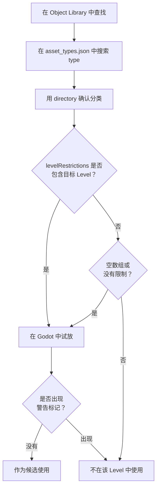

本章会整理“可以放置的东西来自哪里”“哪些地图可以放哪些东西”“哪些对象会影响游戏行为”等问题，并把 Godot 中的实际实体（`.tscn`）和 Portal 侧的名称对应起来。最终目标是准备到这样一种状态：后续的规则设计和 TypeScript 实现可以引用和控制这些对象，也就是已经赋予 ID，并整理成台账。

:::message
查找可放置对象时，也可以配合使用 [BF6 Object Guide](https://link1345.github.io/bf6-object-website/)。
这是一个可放置对象列表网站，可以按地图、标签和关键词搜索来筛选候选对象。
在 Godot 或 `asset_types.json` 中做最终确认之前，先用它来寻找候选对象，可以减少手动翻找 Object Library 的时间。
:::

# 1 “可以放置的东西”的本质：`res://objects` 与地图依赖

**地图上可以放置的对象，仅限于 Godot 文件系统 `res://objects` 内的对象。** 此外，**根据以哪张地图为基础进行编辑，可放置对象的范围也会受到限制。** **截至 2026 年 5 月 13 日，手头的 Portal SDK（版本：1.3.1.0）结构如下。**

SDK 可能会随着更新而改变结构。开始作业前，请确认 SDK 根目录下的 `sdk.version.json`。如果与本书不同，请优先参考 SDK 内的 `docs/pages/spatial_editor.html` 和 `code/types/mod/index.d.ts`。

Godot 的实际文件夹示例：
`res://objects/entities`、`res://objects/gameplay`、`res://objects/fx`、`res://objects/props`、`res://objects/nature`、`res://objects/architecture`、`res://objects/roads` 等。

另外，`asset_types.json` 的 `directory` 中可能会出现 `Gameplay/Common` 这样混有大写字母的分类名。
请把它理解为资产分类。实际在 Godot 中查找文件时，要按照实际文件夹名确认，例如 `res://objects/gameplay/common`。

这里最重要的是，不要只根据文件夹名判断能不能使用。
某个资产最终能不能放置，要通过 SDK 内的 `asset_types.json` 和编辑器上的警告来确认。
如果放置瞬间出现如下警告标记，就应认为它不能在当前基础地图中使用。


## 用 `asset_types.json` 确认 Level 限制

资产的地图限制可以从 SDK 内的 `FbExportData/asset_types.json` 确认。
不要只根据 Object Library 中是否看得到来判断。拿不准时，请搜索这个文件。

需要看的，是各资产定义中的以下 3 项。

| 项目 | 含义 |
| ---- | ---- |
| `type` | 对象名。在 Godot 或 Object Library 中查找时使用的名称 |
| `directory` | 该资产所在的文件夹 |
| `levelRestrictions` | 可以设置的 Level 名称列表 |

例如，`AAGun_01` 的定义如下。

```json
{
  "type": "AAGun_01",
  "directory": "Props",
  "levelRestrictions": [
    "MP_Battery"
  ]
}
```

这种情况下，可以理解为 `AAGun_01` 是 `Props` 下的资产，并且被限制为面向 `MP_Battery`。
另一方面，`AI_Spawner`、`AreaTrigger`、`WorldIcon`、`VehicleSpawner` 等游戏规则用资产，在手头 SDK 中是 `levelRestrictions: []`。
SDK 1.3.1.0 中，`VehicleSpawner` 相关属性名从 `DisableRespawn` 变为 `EnableRespawn`，默认值也变为 `true`。从旧笔记或模板移植时，请把它理解为“启用重生”的标志，而不是“禁用重生”的标志。
空数组或没有限制项的对象，可以作为通用候选，但仍以 SDK 更新后的内容和编辑器侧警告为准。

实务中，按下面顺序确认比较安全。

1. 在 Object Library 中查找目标资产名。
2. 在 `asset_types.json` 中搜索 `type`。
3. 用 `directory` 确认放置位置。
4. 确认 `levelRestrictions` 中是否包含正在编辑的 Level 名称。
5. 放到 Godot 中试放，确认是否出现警告标记。



文件夹名、官方 Level Name、Map ID 可能并不一致。
SDK 的 `docs/pages/spatial_editor.html` 和 `FbExportData/level_info.json` 中，可用 Level 整理如下（截至 2026 年 5 月 13 日，SDK 1.3.1.0）。

| 官方 Level Name | Map ID |
| ---- | ---- |
| Siege of Cairo | MP_Abbasid |
| Empire State | MP_Aftermath |
| Blackwell Fields | MP_Badlands |
| Iberian Offensive | MP_Battery |
| Liberation Peak | MP_Capstone |
| Contaminated | MP_Contaminated |
| Manhattan Bridge | MP_Dumbo |
| Eastwood | MP_Eastwood |
| Operation Firestorm | MP_Firestorm |
| Golf Course | MP_Granite_ClubHouse_Portal |
| Downtown | MP_Granite_MainStreet_Portal |
| Marina | MP_Granite_Marina_Portal |
| Area 22B | MP_Granite_MilitaryRnD_Portal |
| Redline Storage | MP_Granite_MilitaryStorage_Portal |
| Defense Nexus | MP_Granite_TechCampus_Portal |
| Complex 3 | MP_Granite_Underground_Portal |
| Saint's Quarter | MP_Limestone |
| New Sobek City | MP_Outskirts |
| Portal Sandbox | MP_Portal_Sand |
| Hagental Base | MP_Subsurface |
| Mirak Valley | MP_Tungsten |

注：官方 docs 的 Available Levels 表中写作 `MP_Firestorm`，但手头 SDK 的 `asset_types.json` 和 Godot 的 level 文件中也使用 `MP_FireStorm`。搜索 `levelRestrictions` 时，请优先使用 SDK 实际数据中的写法。
注：`MP_Granite_ClubHouse_Portal` 的官方 Level Name 是 `Golf Course`。实际使用时，请确认 `asset_types.json` 的 `levelRestrictions` 和 Godot 上的警告显示。

例如，以 `MP_Aftermath`（Empire State）为基础进行编辑时，可以把 `asset_types.json` 中 `levelRestrictions` 为空，或包含 `MP_Aftermath` 的资产作为候选。
即使在 Object Library 或 Godot 上看得到，如果 `levelRestrictions` 中没有目标 Level，也无法在实际游戏内使用或显示。

## `RuntimeSpawn_...` 是可以从代码生成的候选

查看 `code/types/mod/index.d.ts`，会看到 `RuntimeSpawn_Common`、`RuntimeSpawn_Abbasid`、`RuntimeSpawn_Aftermath` 等 enum。
这些不是在 Godot 的 Object Library 中手动放置的列表，而是可以通过 TypeScript 的 `mod.SpawnObject(...)` 在运行时生成的 Prefab 候选。

```ts
const obj = mod.SpawnObject(
  mod.RuntimeSpawn_Common.AreaTrigger,
  mod.CreateVector(0, 0, 0),
  mod.CreateVector(0, 0, 0),
  mod.CreateVector(1, 1, 1)
);
```

`RuntimeSpawn_Common` 是较容易在多个 Map 中使用的通用类，`RuntimeSpawn_Abbasid` 等带有 Map 名称的内容，则理解为来自该 Map 的候选。
不过，如果目标对象不支持，`SpawnObject` 的返回值可能会变成 `-1`。
另外，由代码生成的对象和 Godot 中手动放置的 `ObjId` 台账是分开管理的。使用时，请分别记录“手动 ID”和“运行时生成”。

## 实务上的判断标准

* 与游戏规则相关的对象，优先在 `res://objects/gameplay` 和 `res://objects/entities` 中查找。
* 外观和小道具类资产，要先确认 `asset_types.json` 的 `levelRestrictions`，再试放，确认警告标记，只保留可用的对象。
* 在 Object Library 中找到的资产，要和 `asset_types.json` 的 `type` 对照。`levelRestrictions` 中没有正在编辑的 Level 名称时，即使在 Godot 中可见，也无法在实际游戏内使用或显示。
* `Static` layer 中包含的地形和烘焙好的资产，目前不是编辑对象。
* 缩放只使用统一缩放。分别拉伸 X/Y/Z 的非统一缩放并不被官方推荐。

# 2 会影响行为的“机关类”对象总览

不同于只影响外观的小道具，参与游戏行为、事件、范围、UI 等的重要对象，主要集中在 `res://objects/entities` 和 `res://objects/gameplay` 中。下面按 Godot 路径、作用和常见组合整理代表性对象。

## SpawnPoint（玩家出生点的关键）

* 实体：`res://objects/entities/SpawnPoint.tscn`
* 作用：定义玩家的出生位置。
* 常用组合：
  `res://objects/gameplay/common/HQ_PlayerSpawner.tscn`（各队的 HQ 出击）
  `res://objects/gameplay/common/PlayerSpawner.tscn`（从脚本直接出击）
* 重要：`SpawnPoint` 单独不会形成范围。它需要被 1 个以上的 `HQ_PlayerSpawner` / `PlayerSpawner` 关联，才会决定玩家实际可以出生的位置。
* `PolygonVolume` 不是给 SpawnPoint 用的，而是用于指定 `CombatArea` 或 `AreaTrigger` 的范围。
* 实务要点：根据是队伍专用，还是从脚本直接出击，选择 `HQ_PlayerSpawner` / `PlayerSpawner`。ID 在属性中手动设置（初始值 -1）。把 SpawnPoint 本体和配套对象（HQ/PlayerSpawner）的 ID 系列分开，规则侧会更容易阅读。

## AI 生成与路径

* AI 生成：`res://objects/gameplay/ai/AI_Spawner.tscn`
* AI 路径：`res://objects/gameplay/ai/AI_WaypointPath.tscn`

## AreaTrigger（进入与退出检测）

* 实体：`res://objects/gameplay/common/AreaTrigger.tscn`
* 作用：把进入 / 离开事件化。
* 组合：用 Godot `PolygonVolume` 定义范围。
* 实务要点：高度（Y）不足是禁忌。玩家能跳出厚度的范围不合格。把 ID 与演出（FX/SFX）或得分加算一对一关联，并在台账中写上“AreaTrigger ID -> 调用对象”，规则实现时就不会迷路。

## CapturePoint（可以占领的目标点）

* 实体：`res://objects/gameplay/conquest/CapturePoint.tscn`
* 作用：队伍争夺的据点。可以处理拥有队伍、占领进度、占领开始 / 完成 / 丢失事件。
* 组合：把 Godot `PolygonVolume` 设置为 `CaptureArea`。需要时也可以使用 `AdditionalCaptureArea`。
* 实务要点：如果只是单纯进入判定，`AreaTrigger` 就足够。需要处理拥有队伍、占领时间、占领进度、从据点出击时，使用 `CapturePoint`。

`CapturePoint` 不是范围传感器，而是“游戏模式上的目标”。
TypeScript 侧可以用 `mod.GetCapturePoint(id)`、`mod.GetCaptureProgress(...)`、`mod.GetCurrentOwnerTeam(...)`、`mod.SetCapturePointOwner(...)` 等读取或修改状态。

## VL7Cloud（毒气云 / 特殊效果区域）

* 实体：`res://objects/gameplay/common/VL7Cloud.tscn`
* 作用：类似毒气云的特殊效果区域。可以统一切换画面效果、士兵效果、VFX。
* 组合：它不像 `AreaTrigger` 或 `CapturePoint` 那样另行关联 `PolygonVolume`，而是放置 VL7Cloud 本身来使用。
* 实务要点：用于毒气、烟雾、视野妨碍、特殊区域等“地点本身带有效果”的表现。不要用于单纯的目标判定或开关范围。

TypeScript 侧用 `mod.GetVL7Cloud(id)` 获取，并用 `mod.SetVL7CloudEffects(cloud, screenEffect, soldierEffect, visualEffect)` 切换效果。
进入 / 离开可以用 `OnPlayerEnterVL7Cloud` / `OnPlayerExitVL7Cloud` 接收。

## 范围类对象的区分

`AreaTrigger`、`CapturePoint`、`VL7Cloud` 都与“进入范围的玩家”有关。
不过，它们的用途相当不同。

| 目的 | 使用对象 | 理由 |
| ---- | ---- | ---- |
| 终点判定、商店范围、陷阱、事件开始地点 | `AreaTrigger` | 只需要把进入 / 离开连接到自己的逻辑 |
| A 据点、B 据点、占地、按拥有队伍改变处理 | `CapturePoint` | 可以使用占领进度、拥有队伍、占领事件 |
| 毒气、特殊烟雾、带有画面效果或士兵效果的区域 | `VL7Cloud` | 范围本身可以带专用效果 |

拿不准时，先从 `AreaTrigger` 考虑。
如果需要“占领”或“拥有队伍”这些概念，就用 `CapturePoint`；如果想放置毒气云或特殊效果本身，就用 `VL7Cloud`。

## CombatArea（可游玩区域）

* 实体：`res://objects/gameplay/common/CombatArea.tscn`
* 作用：指定可游玩范围，离开范围时应用警告、伤害等。
* 组合：用 Godot `PolygonVolume` 定义范围。
* 实务要点：外围要稍微放宽，例外区域局部处理。测试时重点检查“无法返回而卡住”的情况。

## DeployCam（部署画面的俯瞰）

* 实体：`res://objects/gameplay/common/DeployCam.tscn`
* 作用：调整整张地图俯瞰显示的位置和角度。
* 实务要点：不设置它的话，出击前后的地图显示会不正常，所以一定要设置。

## HQ / Player Spawner（出生规则的差异）

* HQ 专用：`res://objects/gameplay/common/HQ_PlayerSpawner.tscn`
  分配给队伍使用的标准 HQ 出击用 Spawner。想为各队创建出击位置时使用它。
* 直接出击用：`res://objects/gameplay/common/PlayerSpawner.tscn`
  不带 HQ 的替代 Spawner。不分配给队伍，适合从脚本让任意玩家出击。
* 两种 Spawner 都必须关联 1 个以上 `SpawnPoint` 后，才会作为出生位置发挥作用。
* 实务要点：想避免误出生就采用 HQ 用。想用脚本控制任意出击就采用 PlayerSpawner。混用时要明确分开 ID 段。

## InteractPoint（操作起点）

* 实体：`res://objects/gameplay/common/InteractPoint.tscn`
* 作用：靠近时显示，按下按钮时触发事件。
* 实务要点：为了让 **“按下 -> 发生什么”** 直接连接到规则，请使用有意义的 ID，例如 Start=500 / Shop=501。

## Sector（突破类玩法的核心）

* 实体：`res://objects/gameplay/common/Sector.tscn`
* 作用：追加扇区概念。像突破模式那样构成“推进与后退的阶段”。
* 包含概念：`Advance Area` / `Retreat Area` / `Capture Points` / `Sector Area`
* 实务要点：多个区域要无矛盾地重叠。按概念整理 ID，规则侧的阶段控制会更容易写。

## StationaryEmplacementSpawner（固定武器）

* 实体：`res://objects/gameplay/common/StationaryEmplacementSpawner.tscn`
* 作用：定义固定武器的出现位置和内容。
* 实务要点：注意视野、受击路线、掩体的物理干涉。用 ID 保留“撤去 / 重新配置”的控制空间。

## CombatArea 的 SurroundingVolume（HQ 的防线）

* 实体：`res://objects/gameplay/common/CombatArea.tscn`
* 作用：通过 `CombatArea` 的 `SurroundingVolume`，在征服类玩法中设置 HQ 周围的周边区域，限制敌人进入。
* 补充：这不是名为 `SurroundingCombatArea.tscn` 的独立可放置对象。请配置 `CombatArea` 的 `CombatVolume` / `ExclusionVolume` / `SurroundingVolume` 使用。
* 实务要点：只在 HQ 附近加强。扩得太大，进攻方会失去行动空间。

## VehicleSpawner（载具生成）

* 实体：`res://objects/gameplay/common/VehicleSpawner.tscn`
* 作用：定义载具的出现位置和种类。
* 实务要点：出现后不要立刻接触物体，要朝向前进方向，并按常设与事件分开 ID 段（例：2001=常设，2090 段=事件）。

## WorldIcon（目标路标）

* 实体：`res://objects/gameplay/common/WorldIcon.tscn`
* 作用：隔墙也能看到的标记。说明文本、拥有队伍、显示 / 隐藏都可以由规则控制。
* 实务要点：放在 **目的地的稍前方**，就会和动线一致。ID 要尽早确定（例：21、22……）。

## FX（视觉效果）

* 实体：以 `FX_****.tscn` 的形式存在于多个文件夹中
* 作用：显示烟花、爆炸等效果表现
* 实现要点：使用强光或闪烁类效果时，要注意避免造成强烈的光敏刺激。

## SFX（声音效果）

* 实体：以 `SFX_****.tscn` 的形式存在于多个文件夹中
* 作用：播放烟花声、爆炸声等声音表现
* 实现要点：放太多会很吵。

# 3 放置的实务流程（ID、台账、兼容检查）

实际作业如果落到下面流程，失误会大幅减少。

1. 决定基础 Level
  如下图所示，存在 Level 列表。复制符合目的的基础 Level，然后双击复制后的 Level 展开它。


*Level 列表*


*复制后，创建了名为“MP_Test_Granite_ClubHouse_Portal.tscn”的 Level*


*双击打开 Level*

2. 提取可放置候选
  首先，从 `res://objects/gameplay` / `res://objects/entities` 中选择与游戏规则相关的对象。
  如果有在意的资产，请在 `FbExportData/asset_types.json` 中搜索 `type`，确认 `directory` 和 `levelRestrictions`。
  外观和小道具类资产，要先确认 `levelRestrictions`，再试放，通过警告标记确认兼容性后再保留。

3. 放置的同时赋予 ID
  像图中一样，在 **Obj Id 栏** 中手动输入。ID 不要重复。遵守系列划分（例：Spawn=1000 段 / Vehicle=2000 段……）。
  TypeScript 实现不会引用或控制的对象（椅子等环境对象），保持初始值 -1 即可。


*在 Obj ID 栏中设置对象 ID*

## ObjId 台账模板

ID 如果只在 Godot 上管理，之后一定会迷路。至少请准备如下台账。

台账可以是 Excel、Google Sheets、Markdown 表、CSV，哪种都可以。
重要的不是工具，而是把 `ObjId`、用途、Godot 对象、TypeScript 获取函数、测试结果放在同一个地方管理。

:::message
如果手动管理台账变得辛苦，也可以考虑使用 [hekaron/ObjIdManager](https://github.com/hekaron/ObjIdManager)。
这是面向 Battlefield Portal SDK 的 Godot 环境制作的 ObjId 管理插件，可以显示 Node3D 的 `ObjId` 列表、高亮重复值、自动连续编号、导出为 TypeScript 格式等。
本书先用台账掌握思路，但当放置对象增加时，使用这类工具会更容易减少确认遗漏和重复 ID。
代码侧的 `ids.ts` 用 Vitest 确认，Godot 侧的实际放置用 ObjIdManager 或台账确认，这样分工会更安全。
:::

| 用途 | ObjId | Godot 对象 | TypeScript 获取函数 | 测试结果 | 备注 |
| ---- | ---- | ---- | ---- | ---- | ---- |
| 开始按钮 | 500 | InteractPoint | `mod.GetInteractPoint(500)` | 未确认 | 大厅中央 |
| 入口引导 | 21 | WorldIcon | `mod.GetWorldIcon(21)` | 未确认 | 初始显示 |
| 目的地引导 | 22 | WorldIcon | `mod.GetWorldIcon(22)` | 未确认 | 开始后显示 |
| 目的地判定 | 11 | AreaTrigger | `mod.GetAreaTrigger(11)` | 未确认 | 高度要足够 |
| 成功 FX | 901 | VFX | `mod.GetVFX(901)` | 未确认 | 到达时播放 |
| 成功 SFX | 951 | SFX | `mod.GetSFX(951)` | 未确认 | 注意不要播放过多 |

台账中的“测试结果”在刚放置后先写“未确认”。测试能运行就改成“OK”，坏了就改成“需修正”。只做这件事，也能减少遗漏。

4. 最终确认兼容性和碰撞
  有 `levelRestrictions` 的对象，要再次确认是否出现警告。
  测试高度（Y）是否导致空中出生或陷入地面，Spawn / Vehicle 周围是否有足够余地。

:::message
实务 Tips：这不是官方 docs 明确写出的必需步骤，但在对象放置前后确认地形、地板碰撞、碰撞状态，可以减少放置物陷入地面、略微浮起、载具卡住等事故。
:::

5. 创建地图数据
  右下角有 BFPortal 栏，点击其中的“Portal Setup”按钮。稍等后，会显示“Completed setup”。
  接着点击“Export Current Level”按钮。这样会生成名为 `Level名.spatial.json` 的文件。生成位置是从 Portal 项目保存文件夹层级来看，位于 `*Portal保存位置*\export\levels`。
  注：点击“Open Exports...”按钮，会打开资源管理器并显示位置。


*BFPortal 栏*


*点击“Portal Setup”按钮后的显示*


*点击“Export Current Level”按钮后的显示*


6. 将地图数据注册到 Portal
  将制作好的地图数据注册到 Portal。
  如下图所示，移动到 Portal 创建画面的地图轮换栏，选择与准备好的 Level 相同的地图。然后注册制作好的数据文件。


*Portal 创建画面（地图轮换）*


*地图数据设置*


*确认是否附加地图数据*


到这里完成后，下一章的规则设计和后续 TypeScript 实现就能立刻引用、立刻控制。**“放了但不动”的 9 成原因，是 ID 仍为 -1、ID 重复，或台账遗漏。**


# 4 最小设置示例（到动作确认为止）

下面用实务步骤，给出最短“放置并让它动起来”的极小构成。
这里先只准备 Team1 / Team2 的出生、开始按钮、标记、简单演出的核心。

* 出生点：设置 `HQ_PlayerSpawner` 或 `PlayerSpawner`，并关联 1 个以上 `SpawnPoint`。
* 开始按钮：把 `InteractPoint`（ID:500）放在大厅中。高度要便于从正面按下。
* 标记：放置 2 个 `WorldIcon`（ID:21 / 22）。分别放在入口稍前方和目的地稍前方。
* 演出：把 `FX`（ID:901）和 `SFX`（ID:951）放在目的地。
* 检测：用 `AreaTrigger`（ID:11）检测进入目的地。`PolygonVolume` 要给足高度。
* 台账：1001/1002=各阵营出生，500=开始，21/22=标记，11=进入检测 -> 启动 901/951

以这个状态保存，启动测试，目视确认出生 -> 按下按钮 -> 进入范围 -> 演出这一串流程。
下一章会尝试组合下面这样的流程。

1. 以按下 `InteractPoint`（ID:500）为触发。
2. 将引导从 `WorldIcon`（ID:21）切换到 `WorldIcon`（ID:22）。
3. 用 `AreaTrigger`（ID:11）让 `FX`（ID:901）和 `SFX`（ID:951）动作。

在自己的项目中，请务必把 Godot 中编辑的 `.tscn` 和注册到 Portal Web Builder 的 `.spatial.json` 成套管理。
只有 `.tscn` 无法反映到 Portal 侧，只有 `.spatial.json` 又很难追踪之后的编辑内容。
文件名中加入基础 Map ID、用途、日期或版本号，可以防止重新部署时拿错。

# 结论：要做的只有三件事

地图编辑器中要做的事，归根结底就是下面三点。

(1) 正确选择可以放置的“实体”（基础 Level + 兼容的通用对象）
(2) 放置后立刻手动赋予不是 -1 的 ID（系列划分并整理成台账）
(3) 按规定步骤组合使用 Godot 关联（`PolygonVolume` 等）的机关类对象。

只要这三点做好，后续规则设计和 TypeScript 实现中的引用、控制就会比较顺利地动作。

---

📘 **下一章“规则设计入门（让配置‘动起来’之前先思考）”** 会把刚才赋予 ID 的 `SpawnPoint` / `AI_Spawner` / `AI_WaypointPath` / `AreaTrigger` / `CombatArea` / `DeployCam` / `HQ` / `PlayerSpawner` / `InteractPoint` / `Sector` / `StationaryEmplacementSpawner` / `VehicleSpawner` / `WorldIcon` / `FX` / `SFX`，用事件和条件连接起来。一开始会从 **“开始按钮（InteractPoint 500）-> 更新标记（WorldIcon 21 -> 22）-> 进入目的地（AreaTrigger 11）时启动 FX/SFX（901/951）”** 这个最小循环开始，再逐步发展成复合事件。
