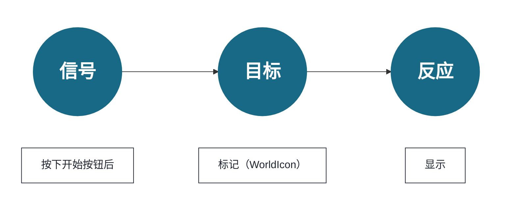
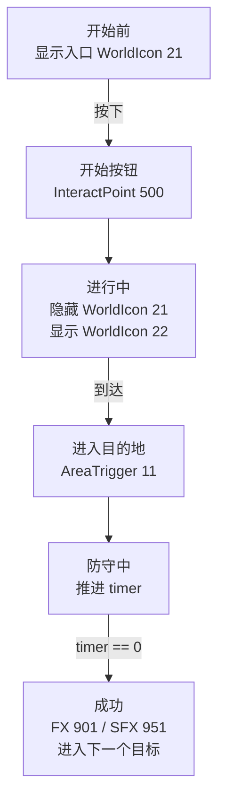

第 4 章中放在地图上的对象，已经有了 **放置位置** 和 **用于调用的地址（ID）**。但是，**谁发出信号、发到哪个地址、传达什么事情，还没有决定。**
本章会在转向 TypeScript 之前，整理 **把信号 -> 目标（ID）-> 反应设计成一条路径** 的思路。只要这条路径打通，你的地图就会从“只是摆好的模型”，变成“会对玩家产生反应的玩法”。

这里不会详细讲解块式可视化编程或编辑器操作，而是会以之后能直接转写到 TypeScript 实现中的形式，决定事件、ID、反应之间的关系。

## 信号 -> 目标 -> 反应（换一种说法）

* 信号：按下 / 进入 / 到时间
* 目标：InteractPoint 500、WorldIcon 21、AreaTrigger 11……（用 ID 指定）
* 反应：显示 / 隐藏 / 发光 / 播放声音 / 生成

信号指的是“接收到事件”。例如“进入了 A 空间”“达到了 100 分”。
目标指的是，针对这个信号要让什么东西动作。
反应指的是，要让目标做什么。

第 5 章就是为了给第 4 章的 ID 接上“行为”的设计工作。

## 先用表格整理

写代码之前，至少先把这张表填好，就不容易迷路。
这里要决定的不是复杂逻辑。
只是“发生了什么”“以什么为对象”“要做什么”。

| 信号 | 目标 | 反应 | 确认方法 |
| ---- | ---- | ---- | ---- |
| 按下 InteractPoint 500 | WorldIcon 21 / 22 | 隐藏入口，显示目的地 | 按下后标记立即变化 |
| 进入 AreaTrigger 11 | FX 901 / SFX 951 | 发出光和声音 | 只在到达时播放 |
| 防守时间变为 0 | Score / 下一个 WorldIcon | 判定为成功并进入下一步 | 不会触发两次 |

只看流程的话，会是这样。

如果能说明这张表和流程，第 6 章以后的代码就是“把这个设计转写成 TypeScript”的工作。
反过来，如果这里还很模糊就开始写代码，ID 和条件一增加，马上就会迷路。

# 1 5 分钟做出“第一次成功体验”

目标很简单。
**做成“按下开始按钮（InteractPoint 500）-> 标记（WorldIcon 21 -> 22）向前推进 -> 进入目的地（AreaTrigger 11）后，光（FX 901）和声音（SFX 951）播放”的形态。**

## 步骤

### 1. 决定初始状态（游戏开始时）

* 初始位置的 WorldIcon（ID:21）-> 显示
* 目的位置的 WorldIcon（ID:22）-> 隐藏

这样设置，是因为最开始想让玩家前往的是“入口前方（21）”。

### 2. 以开始按钮为起点

选择“按下 InteractPoint”这个事件，并把目标 ID 设为 500。

反应按下面排列。

* 在画面上显示几秒“作战开始”
* 初始位置的 WorldIcon（ID:21）-> 隐藏
* 目的位置的 WorldIcon（ID:22）-> 显示

**这样就能看出“按下后开始”。**
WorldIcon 切换为目的地标记后，玩家一眼就能知道接下来该去哪里。

### 3. 在目的地播放演出

当发生“进入 AreaTrigger（ID:11）”这个事件时，连接下面的反应。

* 播放 FX 901
* 播放 SFX 951

如果是循环型效果，也可以同时制作“离开 AreaTrigger 时停止”，会更方便。

## 不动时该看哪里

* ID 是否打错（500/21/22/11/901/951）
* WorldIcon 的“显示 / 隐藏”顺序（隐藏 21，再显示 22）
* 对象高度（Y）不足，是否导致判定被穿过去

结论：按下 -> 标记前进 -> 到达后有光和声音，能做到这里就合格。
接下来，在不破坏这个核心的前提下，继续追加“集合”“出载具”“移动 AI”“用时间收尾”。

# 2 按目的整理：常用扩展按这个顺序

## A. 集合玩家（开始按钮之后立刻执行）

> “按下后，把所有人送到集合点。”

方法有两种。

* 使用重生：把玩家送回各队的 SpawnPoint（例：1001/1002）
* 使用传送：移动到坐标（演出很突然，但实现很快）

两者都放在 InteractPoint ID:500 之后，最容易理解。

## B. 出载具（补给或演出的节点）

假设 VehicleSpawner 的 ID 已经分成 **常设（2001）** 和 **事件用（2090 段）**：

* 按下 500 时启用 / 再生成运输车（ID:2001）
* 到达目的地（AreaTrigger ID:11）时再生成坦克（ID:2090）

只要这样连接，就能产生玩法节奏。

## C. 生成 AI 并让它前进

* 以按下（InteractPoint ID:500）或进入（AreaTrigger ID:11）为信号，启动 AI_Spawner。

## D. 用时间收尾（防守 10 秒 -> 成功后进入下一步）

到达之后放一个倒计时，会产生戏剧感。

* 进入 AreaTrigger（ID:11）后，从“10”开始显示倒计时
* 每 1 秒更新 UI
* 计数到 0 时，**切换 FX** / **切到下一个 WorldIcon** / **加分** / **打开阶段标志**

为了防止重复触发，诀窍是一开始先立起“防守中”标志，结束后再放下。

扩展只是“增加信号”“增加目标”“增加一个反应”。只要不破坏核心（按下 -> 引导 -> 到达 -> 演出），设计就不会崩。

**接下来整理显示和演出的顺序，做出“看得懂 -> 感觉舒服”的流程。**

# 3 显示与演出：只要遵守顺序就能传达

玩家在 **文字 -> 标记 -> 声音和光** 的顺序下理解最快。

1. 先用简短文字告诉玩家“接下来希望你做什么”。
2. 接着切换 WorldIcon，把引导往前推进。
3. 成功时叠加 FX（效果）/ SFX（声音）。

**如果顺序反过来，一上来就光和声音，虽然会让人惊讶，但理由传达不出去。** 记住 UI 基本是“个别显示”，演出是“整体共享”，也比较不容易搞错作用范围。

**结论：文字 -> 标记 -> 效果。只靠这一点，就能减少玩家迷路。**
接下来，最后整理停止时的修法和完成检查。

# 4 停住时：修正方式的模板（3 步定位）

1. 简化：退回到“按下 -> 只显示消息”。能动再继续。
2. 分步恢复：恢复 WorldIcon 切换 -> 通过后再恢复 FX / SFX。
3. 可视化：把标志或计数用小 UI 显示。用眼睛确认是否通过了分支。

最后再确认一次 ID 不是 -1，且同类对象没有重复。九成问题都在这里。

**结论：简化 -> 分步恢复 -> 可视化，一定能追到原因。**
接下来，用短检查确认最小循环能稳定动作。

# 5 完成检查（最小循环）

* 按下后开始（InteractPoint ID:500 是起点）
* 标记向前推进（WorldIcon ID:21 -> ID:22 按顺序切换）
* 到达后有光和声音（AreaTrigger ID:11 触发 FX ID:901 / SFX ID:951）

到这里稳定之后，第 5 章的目的就完成了。下一章会把同样的思路转写到 TypeScript 中，并进入可复用的部件化。

结论：第 5 章是为了保证“第一次成功体验”的章节。这里的核心通了，之后就是在上面继续加东西。

---

📘 **下一章“用脚本创建‘只属于自己的模式’”** 会把文字写出的“信号 -> 目标 -> 反应”替换成程序代码中的事件 / 函数 / 状态，并沿着 Portal SDK 的 `index.d.ts`，把 `WorldIcon`、`FX` / `SFX`、`Spawner`、计数实现为部件。
