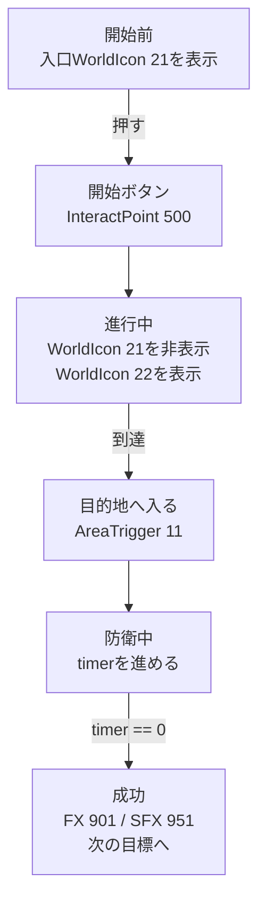

第 4 章中放置在地图上的物体都被赋予了**安装位置**和**调用地址（ID）**。不过，**谁来发出信号，发送什么地址，发送什么业务，目前还没有决定。 **
在本章中，我们将在转向 TypeScript 之前组织一下**设计信号→目的地（ID）→反应作为一条路径**的想法。如果你能做到这一点，你的地图将从“只是放置在那里的模型”变成“玩家可以做出反应的游戏”。

在这里，我们不会详细处理块式可视化编程和编辑器操作，而是以一种可以直接转移到后续 TypeScript 实现的方式确定事件、ID 和反应之间的关系。

## 信号→收件人→反应（释义）

* 信号：按下/输入/时间已到
* 目的地：InteractPoint 500、WorldIcon 21、AreaTrigger 11…（按 ID 提名）
* 反应：显示/隐藏/点亮/声音/火花

信号是指“事件的接收”。例如，有“我进入了A空间”和“我达到了100分”之类的内容。
目的地是确定响应“信号”而“应该移动什么”的信息。
这种反应会导致“收件人”做什么？决定。

第5章是第4章中将“行为”传递给ID的设计工作。

## 首先整理成表格

至少在编写代码之前填写此表将更容易迷失方向。
这里没有复杂的逻辑需要决定。
“应该发生什么？”“我们应该瞄准什么？”和“我们应该做什么？”

|信号|地址 |反应|确认方法 |
| ---- | ---- | ---- | ---- |
|按 InteractPoint 500 |世界图标 21 / 22 |删除入口并显示目的地 |按 | 后地标立即发生变化
|输入区域触发器 11 | FX 901 / SFX 951 | FX 901 / SFX 951发出光和声音|仅在到达时发出声音 |
|防御时间变为0 |分数/下一个世界图标 |将其视为成功并继续下一步 |请勿开火两次 |

如果你只看流程，它会是这样的：

如果你能解释这个表和流程，从第 6 章开始的代码将是“将此设计复制到 TypeScript”。
另一方面，如果你编写的代码没有含糊不清，那么当 ID 和条件的数量增加时，你就会迷失方向。

#1 5 分钟内的“第一次成功经历”

目标很简单。
**创建以下格式：``按下开始按钮（InteractPoint 500）→地标（WorldIcon 21→22）向前移动→当您输入目的地（AreaTrigger 11）时，将发出灯光（FX 901）和声音（SFX 951）。''**

## 程序

### 1.确定初始状态（游戏开始时）

* 初始位置 WorldIcon (ID:21) → 显示
* 目标位置的世界图标 (ID:22) → 隐藏

我将其保留为。第一个想去的地方是“入口前（21）”。

### 2.从开始按钮开始

选择事件“InteractPoint Pressed”并在目标 ID 中输入 500。

作为反应，

* 在屏幕上显示“操作开始”消息几秒钟
* 初始位置 WorldIcon (ID:21) → 隐藏
* 目标位置的世界图标 (ID:22) → 显示

安排他们。 **您现在将看到“按开始”。 **
通过改变世界图标来显示目的地，玩家一眼就知道要去哪里。

### 3. 在目的地进行表演

当事件“进入AreaTrigger(ID:11)”发生时，作为反应，

* 播放 FX 901
* 播放 SFX 951

连接。如果是循环类型的效果，使用“从 AreaTrigger 发出”创建停止也很方便。

## 不动时的亮点

* ID 拼写错误 (500/21/22/11/901/951)
* WorldIcon“显示/隐藏”顺序（删除21并显示22）
* 物体是否会因高度（Y）不足而导致漏判？

结论：如果你按→标记向前移动→当你到达时有光和声音，你就通过了。
接下来，在不破坏这个核心的情况下，我们将添加“组装”、“发送车辆”、“移动人工智能”和“随着时间的推移而收紧”。

# 2 按用途分类：按此顺序常用的扩展
## A. 聚集（紧接在开始按钮之后）

> “按下它可以将所有人送往集合点。”

有两种方法。

* 使用respawn：回调每个队伍的SpawnPoint（例如1001/1002）
* 使用瞬移：移动到坐标（突然表现，快速实施）

如果将两者都紧接在 InteractPoint ID:500 之后插入，则很容易理解。

## B. 取出车辆（在供应或性能的转折点）

假设VehicleSpawner ID分为**永久（2001）/事件（2090个）**，

* 按500时激活/重新出现运输车辆（ID：2001）
* 坦克（ID：2090）到达目的地后重新出现（AreaTrigger ID：11）

只需将其系紧即可创造游戏节奏。

## C. 让AI蓬勃发展

* 当按下（InteractPoint ID：500）或入侵（AreaTrigger ID：11）时启动 AI_Spawner。

## D. 随着时间的推移收紧（防御10秒→成功则继续）

抵达后倒计时会产生戏剧性效果。

* 进入AreaTrigger(ID:11)时，从计数“10”开始显示
* UI每1秒更新一次
* 在计数 0 时，**FX 切换** / **下一个世界图标** / **分数相加** / **相位标志打开**

为了防止多次火灾，诀窍是先设置“防御”标志，然后在完成后将其取下。

要扩展，只需“增加信号”、“增加目的地”和“添加一个反应”。除非你打破核心（推动→指导→达到→绩效），你就不会破产。

**接下来，我们会安排展示和呈现的顺序，营造“理解→感觉良好”的流程。 **

# 3 显示和演示：只需按照顺序即可传达信息

如果顺序是**文字→地标→声音和灯光**，玩家会更快地理解。

1. 首先用简短的话表述：“接下来你想让我做什么？”
2.接下来，切换WorldIcon并将箭头向前移动。
3.成功后分层FX（效果）/SFX（声音）。

**如果顺序颠倒（突然的光和声音），会有惊喜，但不会传达原因。 ** 如果您还记得 UI 基本上是“单独显示”，而演示文稿是“整个共享”，那么您就不太可能混淆范围。

**结论：文字→地标→效果。仅此一点就可以减少玩家迷路的机会。 **
接下来，最后总结一下停止时如何修复并检查完成情况。

# 4 如果停止：如何修复（指定 3 步）

1. 简化：按 并仅返回消息。如果你移动，就继续前进。
2. 向后：返回WorldIcon切换→如果通过，则返回FX/SFX。
3. 可视化：小型 UI 显示标志和计数。目视检查您是否已通过分支。

最后再检查一下ID是否为-1或者是否是同一类型且不重复。 90%都在这里。

**结论：通过简化→退一步→形象化，总能找到原因。 **
接下来，通过短暂检查拧紧以确保最小环路正常工作。

# 5 完成检查（最小循环）

* 按下时启动（InteractPoint ID:500 为起点）
* 地标向前移动（按照WorldIcon ID:21→ID:22的顺序切换）
* 当你到达时，会有灯光和声音（FX ID：901 / SFX ID：951将出现，AreaTrigger ID：11）

一旦事情稳定到这个地步，第五章的目的就达到了。在下一章中，我们将把同样的想法转移到 TypeScript 中，并继续讨论可重用的组件。

结论：第五章是保证你“第一次成功体验”的章节。如果核心经过这里，剩下的就是加法了。

---

📘 **在下一章“用脚本创建你自己的模式”**中，我们将把编程代码中写的“信号→目的地→反应”替换为事件/函数/状态，并遵循Portal SDK的`index.d.ts`。实现 `WorldIcon`、`FX`/`SFX`、`Spawner`，并计为组件。
