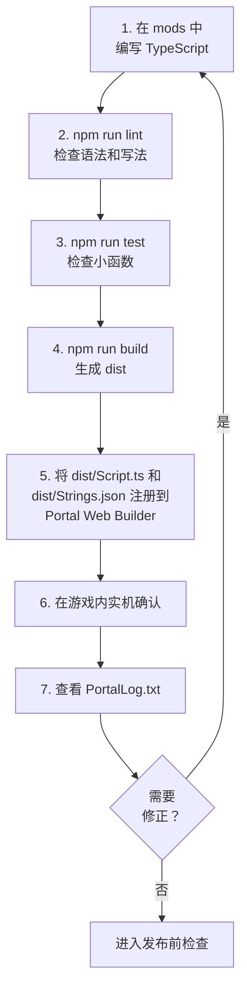

:::message alert

本章中的代码，是用于理解 Portal SDK TypeScript API 的最小示例。实际发布之前，请务必在 localhost 和实际游戏中确认动作。

:::

:::message alert
从这里开始会进入使用 TypeScript 的编程，但请**绝对不要在程序中写入日语**。
截至 2025 年 11 月 1 日，Portal 的 Script 功能不支持日语等多字节字符。请只使用字母、数字和一部分符号。

本书不会在代码注释中放入日语说明。请阅读正文中的解释。
:::

# 0 用脚本创建“只属于自己的模式”

> 把第 4 章（放置）和第 5 章（连接）转写成“写出来并让它动作”

在第 4 章中，我们把必要对象放到地图上，并赋予了 **ID（地址）**。
在第 5 章中，我们设计了信号 -> 目标（ID）-> 反应的流程。

本章会用 **代码（TypeScript）** 做同样的事。理由有 3 个。

1. 规模变大后也不容易坏：
  直接写进 Portal Web Builder 可以很快做出东西，但复杂后就很难看清“哪里在做什么”。代码可以按名称和行数查找，也更容易修改。

2. 同样的处理可以重复使用：
  “切换图标显示”“播放音效”等常用处理，可以命名并部件化。

3. 可以提前防止错误：
  可以从一开始就加入机制，避免数字（ID）打错、同一事件重复发生等问题。

> 看起来可能有点难，但要做的事仍然和第 5 章一样。
> “按下 -> 标记向前 -> 到达后播放光和声音”。先用代码重现这个流程。

# 0.1 代码章节的阅读方式

从第 6 章到第 8 章，代码量会一下子增加。
不要试图从一开始就理解一切，这也没关系。
首先，弄清楚改哪个文件会发生什么变化。

| 最先查看的位置 | 作用 | 一开始做到这样就够了 |
| ---- | ---- | ---- |
| `ids.ts` / `OBJECT_ID` | 把 Godot 中设置的 ObjId 转写到代码中 | 不留下 `-1` 或重复 |
| `config.ts` | 秒数、距离、冷却时间等调整值 | 可以修改防守秒数和推荐人数 |
| `Strings.json` | 注册显示在画面上的文字 | 预先准备要显示的文案 |
| `Script.ts` | Portal 调用的入口 | 知道事件函数的位置 |
| `PortalLog.txt` | 动作确认日志 | 确认事件是否触发 |

代码正文一开始看起来像看不懂的符号也没关系。
阅读顺序是：先在 `ids.ts` 看地址，在 `config.ts` 看数值，在 `Strings.json` 看显示文字，最后在 `Script.ts` 看流程。
函数的详细含义，可以等跑起来之后再回来读。

# 0.5 把 `index.d.ts` 当作字典阅读

Portal SDK 的 TypeScript API 组织在 SDK 内的 `code/types/mod/index.d.ts` 处。

这个文件里的 `mod` namespace，就是 Portal 脚本中调用的函数和类型的字典。遇到不懂的函数时，请先搜索这个文件。

| 查看内容 | 含义 | 示例 |
| ---- | ---- | ---- |
| `declare namespace mod` | Portal API 的放置位置 | `mod.Wait(...)` |
| opaque 型 | 不让你直接触碰 Portal 侧实体的类型 | `mod.Player`、`mod.WorldIcon` |
| `export function On...` | 事件入口 | `OnPlayerInteract` |
| `GetObjId` | 读取 Godot 上的 ObjId | 确认被按下的 InteractPoint 的 ID |
| `RuntimeSpawn_...` | 可用 `SpawnObject` 生成的 Prefab 候选 | `mod.RuntimeSpawn_Common.AreaTrigger` |
| `Message` | 创建显示用字符串 | `mod.Message(mod.stringkeys.hello)` |
| `CreateVector` | 创建坐标、颜色等三要素 | `mod.CreateVector(1, 2, 3)` |

请把 opaque 型理解为“指向 Portal 侧实体的标签”，而不是可以直接修改内部内容的盒子。例如拿到 `mod.Player` 时，不是直接查看属性，而是用 `mod.GetTeam(player)` 或 `mod.GetSoldierState(player, ...)` 这样的 API 取出信息。

像 `RuntimeSpawn_Common` 和 `RuntimeSpawn_Abbasid` 这样的枚举是可以使用 `mod.SpawnObject(...)` 从 TypeScript 生成的候选者，而不是在 Godot 中手动安装的对象库的解释。
请注意，手动放置的项目是在 `ObjId` 中拾取的，就像 `GetInteractPoint(500)` 一样，而从代码生成的项目是通过将 `SpawnObject` 的返回值保存在变量中来处理的。

# 0.6 面向 TypeScript 初学者的读法表

| 代码 | 面向初学者的含义 |
| ---- | ---- |
| `export function On...` | Portal 调用的事件入口 |
| `async function` | 可以像 `await mod.Wait(...)` 那样等待的函数 |
| `mod.Wait(1)` | 等待 1 秒 |
| `mod.GetXxx(id)` | 取得在 Godot 中设置了 ObjId 的放置对象 |
| `mod.GetObjId(obj)` | 确认收到的对象的 ObjId |
| `mod.Message(...)` | 创建画面显示用消息 |
| `mod.CreateVector(x, y, z)` | 创建用于坐标、朝向、颜色等的 3 个数值 |
| `const OBJECT_ID = ...` | 把 ObjId 台账转写到代码侧的东西 |

阅读代码时，不必将其作为英文句子来阅读。区分事件、获取、等待、显示和状态更新就足够了。

# 0.7 使用模板的开发循环

本章的代码将写入模板存储库的 `mods` 文件夹中。

不要直接粘贴到 Portal Web Builder 中编写，而是按照下面的流程开发。

1. 在 `mods` 下编写 TypeScript。
2. 用 `npm run lint` 检查语法和写法。
3. 用 `npm run test` 确认可测试的小部分。
4. 用 `npm run build` 合并为 `dist/Script.ts`。
5. 在 Portal Web Builder 中注册 `dist/Script.ts` 和 `dist/Strings.json`。
6. 在游戏内实机确认，并查看 `PortalLog.txt`。



这个循环的入口是 `mods`，出口是 Portal Web Builder。
写在 `mods` 中的分散代码，会通过 `npm run build` 合并为一个 `dist/Script.ts`，再交给 Portal。
如果要使用画面上显示的文字，也要一起检查 `Strings.json`。

进入游戏后，不是只看“画面有没有成功显示”就结束。
还要检查 `PortalLog.txt`，确认预期事件是否触发、同一处理是否反复执行、变量和 ObjId 是否符合预期。
如果发现问题，不要直接在 Portal 上修，而是回到 `mods` 的源代码修正，再依次执行 `lint`、`test`、`build`，重新注册并实机确认。

也就是说，默认回去修改的地方始终是 `mods`。
Portal Web Builder 负责最后确认和上传，`mods` 负责设计和修改。这样分清楚后，后续就不容易混乱。

最初，只需 `mods/Script.ts` 就可以了。一旦习惯了，就如第 7 章那样将其分为 `mods/ids.ts`、`mods/ui.ts` 和 `mods/game.ts`。即使将它们分开，`npm run build` 最后也会合并为一个 `dist/Script.ts`。

## 如何使用命令

| 时机 | 执行命令 |
| ---- | ---- |
| 写完代码后立刻 | `npm run lint` |
| 想自动修正 | `npm run lint:fix` |
| 想确认函数行为 | `npm run test` |
| 注册到 Portal 前 | `npm run build` |

`npm run build` 不是保证内容正确的命令。它只是把多个文件合并成一个文件。发布前，请务必按顺序通过 `lint`、`test`、`build`。偷懒的话，之后一定会踩坑。

## 使用 Vitest 测试 ID 和小函数

没有必要在自己的测试中重现 Portal 的所有行为。在 Vitest 中，我们先检查**自己写的小函数**。
添加 ID 后、修正条件函数后、注册到 Portal 之前立即执行 `npm run test`。

例如：

* `-1` 是否与 `ids.ts` 混合？
* 同一分类中是否有重复的ID？
* 是否有 `IP_START`、`AREA_TARGET`、`ICON_TARGET` 等必需的 ID？
* `true`只能在允许`isStartInteract()`启动的条件下才能创建吗？
* `ConditionState` 是否充当守卫以防止同一事件传递两次？
* 从 ObjId 分支处理的函数是否按预期分支？
* 消息生成函数是否传递了正确的键和参数？

该模板包含 `vitest` 和 `bfportal-vitest-mock`。`test/sample.test.ts` 会用 `setupBfPortalMock` 准备 Portal API 的替身，并检查 `DisplayNotificationMessage` 是否被调用。

要检查 ID，请创建一个测试文件（如 `test/ids.test.ts`）并从 `ids.ts` 读取常量进行检查。
你可以用Vitest检查的是“代码端写的ID定义”。不能保证具有相同ID的对象确实被放置在Godot上。
因此，请使用第 4 章中的账本和 ObjIdManager 检查 Godot 端的实际放置情况。Vitest 位于代码端，ObjIdManager 位于 Godot 端。如果单独考虑这一点，就能减少遗漏的数量。

请尽可能将游戏本身的处理分离成函数，以便于测试。如果将所有内容都写在事件函数中，测试很快就会变得复杂。

# 1 第一个准备：给 ID 命名（这个最重要）

如果ID是数字的话，就很难理解了。
例如，即使它写着21，我也无法立即记住它是“入口图标”还是“目的地图标”。因此，为 ID 指定一个名称（常量）。

### 怎么写呢？
```ts
const OBJECT_ID = {
	// Team
	TEAM_A: 1,
	TEAM_B: 2,

	// WorldIcon
	ICON_ENTRANCE: 21,
	ICON_TARGET: 22,

	// InteractPoint
	IP_START: 500, // Start Button

	// AreaTrigger
	AREA_TARGET: 11, // destination

	// VFX
	VFX_GOAL: 901,
	// SFX
	SFX_GOAL: 951,

	// Team SpawnPoint
	SP_TEAM_A: 99,
	SP_TEAM_B: 99,
};
```

### 为什么有必要？
* 只要读一下你就会明白它的意思。
* 打字错误将会减少（交换21和22的事故将会消失）。
* 即使你以后改变了ID，只要修改上面一行就可以解决整个问题。

### 预防绊倒
* 请务必检查**-1（未设置）**在这里没有混淆。
* 检查是否有相同类型的重复项。
* 如果你不确定，请将第 4 章的账本放在你旁边，一一大声检查。

# 2 记住“你现在在哪里？” （状态框）

游戏流程有多个阶段，例如“开始之前”、“开始”和“到达”。
在代码中记住当前阶段，可以防止同一事件反复执行。

## 怎么写呢？

在本文档中，优先使用 `modlib.ConditionState` 进行进度管理和防止多次触发。

有多种方法可以使用 `type Phase = "Idle" | "Started"` 之类的阶段名称，但在 Portal 中，很多时候只需要在条件满足的瞬间处理某些内容。
`ConditionState` 完全符合要求。

`ConditionState` 记住并比较上一次的条件结果和这一次的条件结果。
只有上一次为 `false`、这一次为 `true` 时才返回 `true`，其他情况都返回 `false`。

| 上次 | 这次 | `update()` 的返回值 | 含义 |
| ---- | ---- | ---- | ---- |
| `false` | `false` | `false` | 还没有满足条件 |
| `false` | `true` | `true` | 条件刚刚满足。只在这里处理 |
| `true` | `true` | `false` | 条件仍在持续，但不重复执行 |
| `true` | `false` | `false` | 条件解除。准备下一次成立 |

换句话说，`ConditionState`并不是一个只要条件成立就处理的工具，而是一个只在满足条件的时刻才处理的工具。
用于需要多次触发的场合，如开始通知、到达判断、人数聚集时刻、开始计数等。

```ts
import * as modlib from "modlib";

const enoughPlayersState = new modlib.ConditionState();

/**
 * Returns true when the game can start.
 */
function hasEnoughPlayersToStart(): boolean {
	return mod.CountOf(mod.AllPlayers()) >= 2;
}

export function OngoingGlobal(): void {
	if (enoughPlayersState.update(hasEnoughPlayersToStart())) {
		modlib.ShowNotificationMessage(mod.Message(mod.stringkeys.ready));
	}
}
```

关键是不要直接写 `state.update(mod.CountOf(mod.AllPlayers()) >= 2)`。
通过将条件表达式拆成 `hasEnoughPlayersToStart()` 等函数，即使不擅长英语，也更容易读懂“现在正在检查什么条件”。

## 它有什么用？

*“我只想在有 2 名或更多玩家时收到通知” → 仅在 `ConditionState` 传递一次

* “启动按钮按两次就有问题” → 将 `isStartInteract()` 传递给 `ConditionState`

* “如果到达后再次通过‘arrived’就会出现问题” → 将 `isTargetReached()` 传递到 `ConditionState`

## 预防绊倒

* 条件表达式必须分为以 `has...` / `is...` / `can...` 开头的函数。
* 为每种情况准备一个 `ConditionState`。不要使用相同的实例来启动和到达。
* 调试时，把条件函数的返回值输出到 `console.log`，更容易追踪原因。

# 3 第一次代码执行（复制“按下→地标→到达→灯光和声音”）

首先，将第 5 章中的最小循环转换为代码。
在这里，我们更看重**“顺序和理由”**，而不是“如何写作”。

## 3.0 首先...

将以下代码写入文件顶部。
这是一个包（程序组），可以让你轻松使用官方默认提供的 SDK。

```ts
import * as modlib from "modlib";
```

在本文档中，在可用的情况下将优先使用 `modlib`。
`modlib` 是一个辅助库，可以更轻松地显示通知、获取队伍 ID、转换 Portal 数组、只在条件成立瞬间处理一次、生成 UI 等。
只有 `modlib` 没有提供，或需要直接细致控制 Portal API 的处理，才使用 `mod`。
有关详细信息，请参阅附录 C“modlib 说明”。

## 3.1 游戏开始时的初始化

先“显示入口图标”“隐藏目的地图标”。也就是把游戏的初始状态摆清楚。

下面的代码显示和隐藏 WorldIcon。

* `VisibleWorldIcon` 是用来显示或隐藏图标的函数。
* WorldIcon 的图标和文字显示，会通过 SDK 提供的 `mod.EnableWorldIconImage` 和 `mod.EnableWorldIconText` 切换。
* 连接到表示游戏模式开始的 SDK 事件 `OnGameModeStarted`，在“游戏模式开始时”重置当前游戏状态，并显示/隐藏图标。

```ts
/**
 * Show/hide icons
 * @param id ObjectId
 * @param visible Show=true
 */
function VisibleWorldIcon(id: number, visible = true) {
	const icon = mod.GetWorldIcon(id);
	mod.EnableWorldIconImage(icon, visible);
	mod.EnableWorldIconText(icon, visible);
}

const startInteractState = new modlib.ConditionState();
const targetReachedState = new modlib.ConditionState();

let gameStarted = false;
let targetReached = false;

/**
 * Reset game progress flags.
 */
function resetGameProgress(): void {
	gameStarted = false;
	targetReached = false;
}

/**
 * Returns true when the start interact point can start the game.
 */
function isStartInteract(objectId: number): boolean {
	return !gameStarted && objectId === OBJECT_ID.IP_START;
}

/**
 * Returns true when the target area can complete the route.
 */
function isTargetReached(objectId: number): boolean {
	return gameStarted && !targetReached && objectId === OBJECT_ID.AREA_TARGET;
}

/**
 * Mark the game as started.
 */
function markGameStarted(): void {
	gameStarted = true;
}

/**
 * Mark the target as reached.
 */
function markTargetReached(): void {
	targetReached = true;
}

/**
 * Event: This will trigger at the start of the gamemode.
 */
export function OnGameModeStarted() {
	resetGameProgress();

	VisibleWorldIcon(OBJECT_ID.ICON_ENTRANCE, true);
	VisibleWorldIcon(OBJECT_ID.ICON_TARGET, false);
}
```


## 3.2 将开始按钮作为“起点”

按下时，执行 (1) 消息 -> (2) 图标切换。
玩家很容易理解“文字→地标→效果”的顺序。

```ts
/**
 * Event: This will trigger when a Player interacts with InteractPoint.
 */
export async function OnPlayerInteract(eventPlayer: mod.Player, eventInteractPoint: mod.InteractPoint) {
	const eventObjectId = mod.GetObjId(eventInteractPoint);

	if (startInteractState.update(isStartInteract(eventObjectId))) {
		markGameStarted();

		// OFF IP
		mod.EnableInteractPoint(eventInteractPoint, false);

		// Message (All Player)
		modlib.ShowEventGameModeMessage(mod.Message(mod.stringkeys.start));

		await mod.Wait(0.5);

		// Change Icon
		VisibleWorldIcon(OBJECT_ID.ICON_ENTRANCE, false);
		VisibleWorldIcon(OBJECT_ID.ICON_TARGET, true);
	}
}
```

## 3.3 进入目的地后，发出效果

到达的信号来自 AreaTrigger。
进入区域时，会播放 **光效 (FX) 和音效 (SFX)**。

```ts
/**
 * Event: This will trigger when a Player enters an AreaTrigger.
 */
export function OnPlayerEnterAreaTrigger(eventPlayer: mod.Player, eventAreaTrigger: mod.AreaTrigger) {
	const eventObjectId = mod.GetObjId(eventAreaTrigger);

	if (targetReachedState.update(isTargetReached(eventObjectId))) {
		markTargetReached();

		// OFF Target
		VisibleWorldIcon(OBJECT_ID.ICON_TARGET, false);

		// RUN Sound
		mod.PlaySound(OBJECT_ID.SFX_GOAL, 1);

		// RUN Effect
		const vfx = mod.GetVFX(OBJECT_ID.VFX_GOAL);
		mod.EnableVFX(vfx, true);
	}
}
```

### 当事情进展不顺利时

* ID输入错误（21/22/11/500/901/951）
* AreaTrigger 的 **高度 (Y)** 不足，玩家从判定范围外穿过去
* 使用 `ConditionState` 和 `is...` 函数检查“双击”和“多次到达”是否停止

> 如果你能做到这一点，你就通过了。
> 从这里开始，我们将一点一点地“添加”。

## 3.4 新增 1：集合（按下后集合）

常见请求：“按下按钮，每个人都会前往集合点。”
有两种方法。

* Respawn：重生到指定的 SpawnPoint
* 移动（传送）：移动到坐标

### Respawn：重生到指定的 SpawnPoint

下面的程序移动到特定的 SpawnPoint。
**如果在地图上设置了 SpawnPoint，就可以让玩家在那里生成**。

然而，如果位置动态变化，这就很困难。
动态变化的一个例子是“玩家位置”。

```ts
/**
 * Event: This will trigger when a Player interacts with InteractPoint.
 */
export function OnPlayerInteract(eventPlayer: mod.Player, eventInteractPoint: mod.InteractPoint) {
	const eventObjectId = mod.GetObjId(eventInteractPoint);

	if (startInteractState.update(isStartInteract(eventObjectId))) {
		markGameStarted();

		// OFF IP
		mod.EnableInteractPoint(eventInteractPoint, false);

		// Message (All Player)
		modlib.ShowEventGameModeMessage(mod.Message(mod.stringkeys.start));

		// Change Icon
		VisibleWorldIcon(OBJECT_ID.ICON_ENTRANCE, false);
		VisibleWorldIcon(OBJECT_ID.ICON_TARGET, true);

    // Spawn Player
		const eventTeam = mod.GetTeam(eventPlayer);
		const eventTeamId = modlib.getTeamId(eventTeam);
		const players = mod.AllPlayers();
		for (let index = 0; index < mod.CountOf(players); index++) {
			const player = mod.ValueInArray(players, index);
			const team = mod.GetTeam(player);
			const teamId = modlib.getTeamId(team);

			if (eventTeamId === teamId && eventObjectId === OBJECT_ID.TEAM_A) {
				mod.SpawnPlayerFromSpawnPoint(player, OBJECT_ID.SP_TEAM_A);
			}
		}
	}
}
```


### 移动（传送）：移动到坐标（简单）

下面的程序移动到一个特定的对象。
**可以是任何对象并在该对象的位置生成**。
使用“Respawn：重生到指定的 SpawnPoint”时，只能移动到 SpawnPoint 对象。
而使用这种方法，只要事先指定 ObjId，就可以移动到任意对象的位置。
**例如，位置会动态变化的“玩家位置”，或者没有特殊功能的静态物体“花坛物体的位置”，也可以作为移动目标。**

不过，代码会稍微变长。如果你总是想移动到同一个位置，使用“Respawn：重生到指定的 SpawnPoint”会更简单。

```ts
/**
 * Event: This will trigger when a Player interacts with InteractPoint.
 */
export function OnPlayerInteract(eventPlayer: mod.Player, eventInteractPoint: mod.InteractPoint) {
	const eventObjectId = mod.GetObjId(eventInteractPoint);

	if (startInteractState.update(isStartInteract(eventObjectId))) {
		markGameStarted();

    // OFF IP
		mod.EnableInteractPoint(eventInteractPoint, false);

		// Message (All Player)
		modlib.ShowEventGameModeMessage(mod.Message(mod.stringkeys.start));

		// Change Icon
		VisibleWorldIcon(OBJECT_ID.ICON_ENTRANCE, false);
		VisibleWorldIcon(OBJECT_ID.ICON_TARGET, true);

		// Teleport
		const eventTeam = mod.GetTeam(eventPlayer);
		const eventTeamId = modlib.getTeamId(eventTeam);

		const spawnPointA = mod.GetSpawnPoint(OBJECT_ID.SP_TEAM_A);
		const teleportPointTeamA = mod.GetObjectPosition(spawnPointA);

		const players = mod.AllPlayers();
		for (let index = 0; index < mod.CountOf(players); index++) {
			const player = mod.ValueInArray(players, index);
			const team = mod.GetTeam(player);
			const teamId = modlib.getTeamId(team);

			if (eventTeamId === teamId && eventObjectId === OBJECT_ID.TEAM_A) {
				mod.Teleport(player, teleportPointTeamA, 0);
			}
		}
	}
}
```

### 提示：

* 如果你觉得移动太突兀，可以按照“消息 -> 短暂等待 -> 移动”的顺序，让流程更自然。
* 有些人可能不知道刚刚发生了什么，所以会面后再次显示**目的地图标（ICON_TARGET）**会很有帮助。

## 3.5 附加示例：随着时间推进来收紧规则（防守 10 秒）

像“到达→保持10秒→成功”这样的倒计时是非常令人兴奋的。
然而，诀窍是正确处理取消（离开该区域）。

### 示例：到达后坚持 10 秒，防守成功后显示消息

```ts
let defending = false;
const defenseSec = 10;
async function startDefense(seconds: number) {
	if (defending) return; // Prevent double startup.
	defending = true;

	const team = mod.GetTeam(OBJECT_ID.TEAM_A);

	for (let t = seconds; t > 0; t--) {
		modlib.ShowEventGameModeMessage(mod.Message(mod.stringkeys.countdown), team);
		await mod.Wait(1);

		// Stop when the target state is canceled.
		if (!targetReached) {
			defending = false;
			return;
		}
	}

	defending = true;
	modlib.ShowEventGameModeMessage(mod.Message(mod.stringkeys.success), team);
}

// If you want to "Stop when it comes out"
export function OnPlayerExitAreaTrigger(eventPlayer: mod.Player, eventAreaTrigger: mod.AreaTrigger) {
	if (targetReached) {
		// Allow the target area to trigger again.
		targetReached = false;

		const team = mod.GetTeam(OBJECT_ID.TEAM_A);

		VisibleWorldIcon(OBJECT_ID.ICON_ENTRANCE, true);
		VisibleWorldIcon(OBJECT_ID.ICON_TARGET, false);
		modlib.ShowEventGameModeMessage(mod.Message(mod.stringkeys.failure), team);
  }
}
```

### 提示：

* 准备一个表示计数是否正在进行的标志（本例中是 `defending`）。
* 如果一开始就决定了中断的条件（例如离开该区域），代码就不会丢失。

## 3.6 防止“误触发”和“重复触发”（安全装置）

玩家可能会误操作，也可能只是觉得好玩而反复按下按钮。
这时，可以加上“在某些条件下不执行”的锁，避免同一处理反复执行。

下面是一个可以轻松实现的锁定示例。
这只是示例，如果觉得不好读或不符合目的，也可以改成自己的实现。

### 对策：防止同一事件执行多次

**当实现根据模式而变化的处理时**，可以如下实现。

```ts
import * as modlib from "modlib";

const startInteractState = new modlib.ConditionState();
let gameStarted = false;

/**
 * Returns true when this interact event should start the game.
 */
function isStartInteract(objectId: number): boolean {
	return !gameStarted && objectId === OBJECT_ID.IP_START;
}

/**
 * Mark the game as started.
 */
function markGameStarted(): void {
	gameStarted = true;
}

/**
 * Event: This will trigger when a Player interacts with InteractPoint.
 */
// eslint-disable-next-line @typescript-eslint/no-unused-vars
export function OnPlayerInteract(eventPlayer: mod.Player, eventInteractPoint: mod.InteractPoint) {
	const objectId = mod.GetObjId(eventInteractPoint);

	if (startInteractState.update(isStartInteract(objectId))) {
		markGameStarted();
		modlib.ShowNotificationMessage(mod.Message(mod.stringkeys.hello, eventPlayer), eventPlayer);
	}
}
```

### 对策：防止事件在短时间内重复发生

**如果按下按钮时要播放声音，但不希望短时间内连续播放**，可以如下实现。

```ts
import * as modlib from "modlib";

let lock = false;
async function throttle(seconds: number, fn: () => void) {
	if (!lock) {
		lock = true;
		fn();
		await mod.Wait(seconds);
		lock = false;
	}
}

/**
 * Event: This will trigger when a Player interacts with InteractPoint.
 */
// eslint-disable-next-line @typescript-eslint/no-unused-vars
export function OnPlayerInteract(eventPlayer: mod.Player, _eventInteractPoint: mod.InteractPoint) {
	//
	throttle(15, () => {
		modlib.ShowNotificationMessage(mod.Message(mod.stringkeys.hello, eventPlayer), eventPlayer);
	});
}
```

### 提示：

* 只要创建一条“只能通过一次”的路径，很多重复执行问题就会自动消失。
* 再加上“每 n 秒最多一次”的保护，即使被反复按下也不容易坏。

## 3.7 可视化（通过调试显示了解“现在”）

**“按下它时不起作用”** 快速解决问题的最佳方法是能够查看当前状态和最近发生的事件。

### 如果想输出为日志并查看

在 localhost 上运行体验时，会生成 `PortalLog.txt`。Windows 上的标准位置为 `%LOCALAPPDATA%\Temp\Battlefield™ 6`。

根据环境和安装状态，位置可能会有所不同。如果找不到，请在 `%LOCALAPPDATA%\Temp` 中搜索 `PortalLog.txt`。

写下下面的代码后，该字符串会被写入并保存在 `PortalLog.txt` 中。
游戏中不会出现任何消息，但与下面描述的 `ShowNotificationMessage` 不同，不需要预先注册字符串，因此可以轻松检查动作。

```ts
console.log("message!");
```

### 如果你想在屏幕上查看

写下以下内容后，游戏画面上会出现一条消息。
与 `console.log` 不同，要在屏幕上显示的字符串必须提前写入 `Strings.json` 中。
出现在播放器屏幕上的字符，例如通知、WorldIcon 字符、`AddUIText` / `SetUITextLabel`、`ParseUI`、`textLabel` 等都遵循此规则。

要传递到屏幕的消息是使用 `mod.Message(...)` 函数创建的。
如果将 `{}` 放入 `Strings.json` 中，则可以在此处插入 `mod.Message` 的第二个参数之后传递的值。

```json
{
  "debugPlayer": "player:{}",
  "debugObjId": "obj:{}"
}
```

然后，在代码侧引用 `mod.stringkeys` 中的键，并只把会变化的值作为追加参数传入。

```ts
const objId = mod.GetObjId(eventInteractPoint);
modlib.ShowNotificationMessage(mod.Message(mod.stringkeys.debugPlayer, eventPlayer), eventPlayer);
modlib.ShowNotificationMessage(mod.Message(mod.stringkeys.debugObjId, objId), eventPlayer);
```

屏幕将显示类似 `player:<玩家名>` 或 `obj:500` 的内容。
除了字符串键之外，`mod.Message` 最多可以接收三个附加值。
如果要显示玩家姓名、剩余秒数、得分等，请记住将文本放入 `Strings.json` 中，并仅将更改的值作为参数传递给 `mod.Message` 。

### 提示：

* 如果不行的话，先在`console.log`中写入事件名称、ObjId、`gameStarted`、`targetReached`、玩家人数。
* 异常和意外分支在日志中记录为短字母数字字符。
* 如果不起作用，首先记录 `isStartInteract()` 或 `isTargetReached()` 的返回值。
* 如果出现意外情况，请查看 `ConditionState` 的实例以及判断函数。
* 如果事件一开始就没有进来，请怀疑 ID 输入错误。

## 3.8 “整齐拆分”可以稍后再做

前半部分，我们的首要任务是“先让它动起来”。
一旦习惯了，通过将显示（UI/效果）、状态（`gameStarted`、`targetReached`等）和SDK调用分成更小的部分来修改它会更容易。

例如，通过将处理收集为如下“3.1 游戏开始时的初始化”中所示的函数，只需编写 `VisibleWorldIcon(**,**)` 即可将三行代码合并为一行。

```ts
/**
 * Show/hide icons
 * @param id ObjectId
 * @param visible Show=true
 */
function VisibleWorldIcon(id: number, visible = true) {
	const icon = mod.GetWorldIcon(id);
	mod.EnableWorldIconImage(icon, visible);
	mod.EnableWorldIconText(icon, visible);
}

```

这次只是把三行整理到一起，但随着程序变大，“想做的一件事”可能会膨胀到 10 行、100 行。请慢慢习惯把相关处理归在一起。


### 提示：

* 排序顺序是“最常写的放前面”。
* 不要强迫自己以完全分离为目标；只要“如果变得更容易阅读就赢”就可以了。

## 3.9 常见错误和简单对策

* ID保持-1
  → 在属性字段中重新输入数字。一起更新账本和常量。
* 有两个相同的ID
  → 检查同一类型是否有重复。用○标记台账。
* 当我按下它时没有任何反应
  → 检查`OnPlayerInteract`是否是正确的ID，`isStartInteract()`是否变成`true`，是否被`ConditionState`的守卫抓住。
*当我到达时什么也没有发生
  → `AreaTrigger` 的高度（Y）常常不够。
* 持续的声音和灯光
  → 准备一个退出时停止的处理 (`OnPlayerExitAreaTrigger`)。
* 重复点击会让处理失控
  → 添加限制处理，例如 `throttle`（间隔限制）和 `ConditionState`（仅一次）。
* 以后再看你就不会明白
  → 优先使用“简短的英文消息”和“给 ID 命名”。

# 结论

* **给 ID 命名（常量化）**
* 记录当前阶段（用 `gameStarted` 等状态标志和 `ConditionState` 管理阶段）。
* 不破坏“按下 -> 标记 -> 到达 -> 光和声音”的最小循环。
* 一点点追加（集合 / 载具 / AI / 时间）。
* 习惯后，给常用处理命名（小函数），让代码更容易读。

只要遵循这个流程，即使是初学者也可以**让自己的模式跑起来**。
困难的优化和大规模设计可以之后再做。首先，先让“按下后开始，到达后发出漂亮的光和声音”这个流程，用自己的手跑起来。

# 下一节的指南

📘 **下一章《“整齐拆分”的小设计》** 会思考在组装程序时，如何划分处理群，让开发后的程序将来能用最小改动继续维护。
