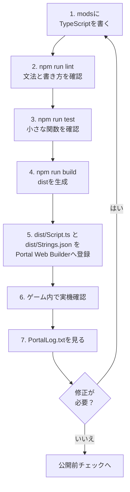

:::message alert

本章中的代码是了解 Portal SDK 的 TypeScript API 的最小示例。在实际发布之前，请务必检查本地主机和真实设备上的操作。

:::

:::message alert
使用 TypeScript 编程从这里开始，但请**不要在程序中包含日语**。
自 2025 年 11 月 1 日起，Portal 的脚本功能不支持日语等多字节字符。请仅使用字母、数字和一些符号。

在本书中，使用代码注释的解释中不包含日语文本。请仔细阅读正文。
:::

# 0 用脚本创建的“你自己的模式”

> --- 将第 4 章（放置）和第 5 章（连接）替换为“写入和移动”

在第4章中，我们在地图上放置了必要的项目并添加了**ID（地址）**。
在第五章中，我们设计了信号→目的地（ID）→反应的流程。

在本章中，我们将在代码（TypeScript）中做同样的事情。有以下三个原因。

1. 规模扩大后难以收支平衡：
  直接写入 Portal Web Builder 可以让您快速创建内容，但是当事情变得复杂时，就很难看出正在做什么。代码很容易按名称和行进行搜索，并且易于修复。

2. 您可以一遍又一遍地使用相同的过程：
  诸如“切换图标显示”、“播放音效”等经常使用的流程都可以命名并制作成组件。

3. 能够预见错误：
  您可以安装一种机制来防止出现数字（ID）输入错误以及从头开始重复发生相同事件等问题。

> 看似困难，但你需要做的仍然与第 5 章相同。
>“按→向前移动地标→到达时发出灯光和声音” - 首先，我们将用代码重现这一点。

# 0 .1 如何阅读代码章节

从第6章到第8章，代码量突然增加。
不要试图从一开始就理解一切，这也没关系。
首先，弄清楚当您触摸哪个文件时会发生什么变化。

|最先触摸的地方 |角色 |你先能做的就足够了 |
| ---- | ---- | ---- |
| `ids.ts` / `OBJECT_ID` | `ids.ts` / `OBJECT_ID` |将Godot中添加的ObjId复制到代码中 |不要留下 `-1` 或重复 |
| `config.ts` | `config.ts` |秒、距离、冷却时间等调整值 |可以更改防御秒数和推荐人数|
| `Strings.json` | `Strings.json` |注册要在屏幕上显示的字符 |提前准备好要显示的文字 |
| `Script.ts` | `Script.ts` |从 Portal 调用的入口 |只知道事件函数的位置 |
| `PortalLog.txt` | `PortalLog.txt` |操作确认日志 |检查事件是否已被触发 |

代码主体起初看起来像一个咒语。
读取顺序为：`ids.ts` 查看地址，`config.ts` 查看数值，`Strings.json` 查看显示文本，最后 `Script.ts` 查看流程。
执行完函数后，返回并阅读其详细含义就足够了。

# 0 .5 将 `index.d.ts` 读取为字典

Portal SDK 的 TypeScript API 组织在 SDK 内的 `code/types/mod/index.d.ts` 处。

此文件中的 `mod` 命名空间是从门户脚本调用的函数和类型的字典。如果您遇到不明白的函数，请先搜索该文件。

|你所看到的|意义|示例 |
| ---- | ---- | ---- |
| `declare namespace mod` | `declare namespace mod` |门户API位置| `mod.Wait(...)` | `mod.Wait(...)` |
|不透明型|不允许直接触摸Portal端实体的类型| `mod.Player`，`mod.WorldIcon` |
| `export function On...` | `export function On...` |活动入口| `OnPlayerInteract` | `OnPlayerInteract` |
| `GetObjId` | `GetObjId` |阅读 Godot 上的 ObjId |检查按下的 InteractPoint | 的 ID
| `RuntimeSpawn_...` | `RuntimeSpawn_...` |可以使用 `SpawnObject` 生成的预制件候选 | `mod.RuntimeSpawn_Common.AreaTrigger` |
| `Message` | `Message` |创建显示字符串 | `mod.Message(mod.stringkeys.hello)` | `mod.Message(mod.stringkeys.hello)` |
| `CreateVector` | `CreateVector` |创建坐标、颜色等三要素 | `mod.CreateVector(1, 2, 3)` | `mod.CreateVector(1, 2, 3)` |

将不透明类型视为指向门户端实体的标签，而不是可以直接操作其内容的框。例如，如果您收到 `mod.Player`，则可以使用 `mod.GetTeam(player)` 或 `mod.GetSoldierState(player, ...)` 等 API 检索信息，而不仅仅是查看属性。

像 `RuntimeSpawn_Common` 和 `RuntimeSpawn_Abbasid` 这样的枚举是可以使用 `mod.SpawnObject(...)` 从 TypeScript 生成的候选者，而不是在 Godot 中手动安装的对象库的解释。
请注意，手动放置的项目是在 `ObjId` 中拾取的，就像 `GetInteractPoint(500)` 一样，而从代码生成的项目是通过将 `SpawnObject` 的返回值保存在变量中来处理的。

# 0.6 TypeScript初学者阅读表

|代码|对初学者的意义 |
| ---- | ---- |
| `export function On...` | `export function On...` |从 Portal 调用的事件入口 |
可以等待的函数如 | `async function` | `async function` | `await mod.Wait(...)` | `await mod.Wait(...)` |
| `mod.Wait(1)` | `mod.Wait(1)` |等待 1 秒 |
| `mod.GetXxx(id)` | `mod.GetXxx(id)` |使用 Godot 获取具有 ObjId 的放置对象 |
| `mod.GetObjId(obj)` | `mod.GetObjId(obj)` |检查收到的展示位置的 ObjId |
| `mod.Message(...)` | `mod.Message(...)` |创建要在屏幕上显示的消息 |
| `mod.CreateVector(x, y, z)` | `mod.CreateVector(x, y, z)` |创建三个数字用于坐标、方向、颜色等。
| `const OBJECT_ID = ...` | `const OBJECT_ID = ...` |代码端的 ObjId 账本副本 |

阅读代码时，不必将其作为英文句子来阅读。区分事件、获取、等待、显示和状态更新就足够了。

# 0 .7 使用模板的开发循环

本章的代码将写入模板存储库的 `mods` 文件夹中。

我没有将其直接粘贴到 Portal Web Builder 中进行编写，而是使用以下流程进行开发。

1. 在 `mods` 下编写 TypeScript。
2. 检查语法和写作风格：`npm run lint`。
3. 在`npm run test`查看可以测试的部分。
4. 将 `npm run build` 合并为 `dist/Script.ts`。
5. 在 Portal Web Builder 中注册 `dist/Script.ts` 和 `dist/Strings.json`。
6.查看游戏内实际设备，查看`PortalLog.txt`。



该循环的入口点是 `mods`，出口点是 Portal Web Builder。
为 `mods` 单独编写的代码合并为一个 `dist/Script.ts`，可以使用 `npm run build` 传递到门户。
如果您想使用屏幕上显示的字符，另请检查 `Strings.json`。

成功屏幕并不是您进入游戏后应该看到的唯一内容。
检查 `PortalLog.txt` 是否触发了预期的事件，是否一遍又一遍地运行相同的进程，以及变量和 ObjId 是否符合预期。
如果出现问题，不要直接在门户上修复，而是回到 `mods` 处的原始代码进行修复，然后依次通过 `lint`、`test`、`build` 注册并再次检查实际设备。

也就是说，默认返回目的地始终为 `mods`。
Portal Web Builder 是最后确认和上传的地方，`mods` 是设计和修改的地方，这样就不会搞混了。

最初，只需 `mods/Script.ts` 就可以了。一旦习惯了，就如第 7 章那样将其分为 `mods/ids.ts`、`mods/ui.ts` 和 `mods/game.ts`。即使将它们分开，`npm run build` 最后也会合并为一个 `dist/Script.ts`。

## 如何使用命令

|时间 |执行命令 |
| ---- | ---- |
|写完代码后立即| `npm run lint` | `npm run lint` |
|我要自动更正| `npm run lint:fix` | `npm run lint:fix` |
|我想检查函数的行为 | `npm run test` | `npm run test` |
|在门户网站上注册之前 | `npm run build` | `npm run build` |

`npm run build` 不是保证其正确性的命令。该命令将多个文件合并为一个。发布之前，请务必按顺序通过 `lint`、`test`、`build`。如果你侧身着地，稍后你会摔得很惨。

## 使用 Vitest 测试 ID 和小函数

没有必要在您自己的测试中重现 Portal 的所有行为。在Vitest中，我们首先看一下**我们写的小函数**。
添加 ID 后、更正条件函数后、注册到门户之前立即执行 `npm run test`。

例如：

* `-1` 是否与 `ids.ts` 混合？
* 同一分类中是否有重复的ID？
* 是否有 `IP_START`、`AREA_TARGET`、`ICON_TARGET` 等必需的 ID？
* `true`只能在允许`isStartInteract()`启动的条件下才能创建吗？
* `ConditionState` 是否充当守卫以防止同一事件传递两次？
* 从 ObjId 分支处理的函数是否按预期分支？
* 消息生成函数是否传递了正确的键和参数？

该模板包含 `vitest` 和 `bfportal-vitest-mock`。 `test/sample.test.ts` 提供了 `setupBfPortalMock` 上的 Portal API 的替代方案，并检查 `DisplayNotificationMessage` 是否被调用。

要检查 ID，请创建一个测试文件（如 `test/ids.test.ts`）并从 `ids.ts` 读取常量进行检查。
你可以用Vitest检查的是“代码端写的ID定义”。不能保证具有相同ID的对象确实被放置在Godot上。
因此，请使用第 4 章中的账本和 ObjIdManager 检查 Godot 端的实际放置情况。Vitest 位于代码端，ObjIdManager 位于 Godot 端。如果单独考虑这一点，就能减少遗漏的数量。

请尽可能将游戏本身的处理分离成函数，以便于测试。如果将所有内容都写在事件函数中，测试很快就会变得复杂。

# 1 第一个准备：命名ID（这个最重要）

如果ID是数字的话，就很难理解了。
例如，即使它写着21，我也无法立即记住它是“入口图标”还是“目的地图标”。因此，为 ID 指定一个名称（常量）。

### 怎么写呢？
```ts
const OBJECT_ID = {
	// Team
	TEAM_A: 1,
	TEAM_B: 2,

	// WorldIcon
	ICON_ENTRANCE: 21,
	ICON_TARGET: 22,

	// InteractPoint
	IP_START: 500, // Start Button

	// AreaTrigger
	AREA_TARGET: 11, // destination

	// VFX
	VFX_GOAL: 901,
	// SFX
	SFX_GOAL: 951,

	// Team SpawnPoint
	SP_TEAM_A: 99,
	SP_TEAM_B: 99,
};
```

### 为什么有必要？
* 只要读一下你就会明白它的意思。
* 打字错误将会减少（交换21和22的事故将会消失）。
* 即使你以后改变了ID，只要修改上面一行就可以解决整个问题。

### 预防绊倒
* 请务必检查**-1（未设置）**在这里没有混淆。
* 检查是否有相同类型的重复项。
* 如果你不确定，请将第 4 章的账本放在你旁边，一一大声检查。

# 2 记住“你现在在哪里？” （状态框）

游戏进程有多个阶段，例如“开始之前”、“开始”和“到达”。
在代码中牢记这一点将防止您一遍又一遍地运行同一事件。

## 怎么写呢？

在本文档中，优先使用 `modlib.ConditionState` 进行进度管理和防止多次触发。

有多种方法可以使用 `type Phase = "Idle" | "Started"` 之类的阶段名称，但在 Portal 中，很多情况下您只想在满足条件时处理某些内容。
`ConditionState` 完全符合要求。

`ConditionState` 记住并比较之前的条件结果和当前的条件结果。
仅当上次时间为 `false` 并且当前时间为 `true` 时才返回 `true`，否则返回 `false`。

|上次 |这次| `update()` 的返回值 |意义|
| ---- | ---- | ---- | ---- |
| `false` | `false` | `false` | `false` | `false` |尚未满足条件|
| `false` | `false` | `true` | `true` | `true` |条件满足的那一刻。仅在此处理 |
| `true` | `true` | `true` | `true` | `false` |条件继续，但没有双重执行 |
| `true` | `true` | `false` | `false` | `false` |条件已被删除。为下次成立做好准备 |

换句话说，`ConditionState`并不是一个只要条件成立就处理的工具，而是一个只在满足条件的时刻才处理的工具。
用于需要多次触发的场合，如开始通知、到达判断、人数聚集时刻、开始计数等。

```ts
import * as modlib from "modlib";

const enoughPlayersState = new modlib.ConditionState();

/**
 * Returns true when the game can start.
 */
function hasEnoughPlayersToStart(): boolean {
	return mod.CountOf(mod.AllPlayers()) >= 2;
}

export function OngoingGlobal(): void {
	if (enoughPlayersState.update(hasEnoughPlayersToStart())) {
		modlib.ShowNotificationMessage(mod.Message(mod.stringkeys.ready));
	}
}
```

关键是不要直接写`state.update(mod.CountOf(mod.AllPlayers()) >= 2)`。
通过将条件表达式划分为 `hasEnoughPlayersToStart()` 等函数，即使您英语不好，也可以更轻松地阅读“您正在查看的条件”。

## 它有什么用？

*“我只想在有 2 名或更多玩家时收到通知” → 仅在 `ConditionState` 传递一次

* “启动按钮按两次就有问题” → 将 `isStartInteract()` 传递给 `ConditionState`

* “如果到达后再次通过‘arrived’就会出现问题” → 将 `isTargetReached()` 传递到 `ConditionState`

## 预防绊倒

* 条件表达式必须分为以 `has...` / `is...` / `can...` 开头的函数。
* 为每种情况准备一个 `ConditionState`。不要使用相同的实例来启动和到达。
* 调试时，将条件函数的返回值发布到`console.log`，更容易追踪原因。

# 3 第一次代码执行（复制“按下→地标→到达→灯光和声音”）

首先，将第 5 章中的最小循环转换为代码。
在这里，我们更看重**“顺序和理由”**，而不是“如何写作”。

## 3 .0 首先...

将以下代码写入文件顶部。
这是一个包（程序组），可以让你轻松使用官方默认提供的SDK。

```ts
import * as modlib from "modlib";
```

在本文档中，在可用的情况下将优先使用 `modlib`。
`modlib` 是一个辅助库，可以更轻松地显示通知、获取团队 ID、转换 Portal 数组、仅一次火灾情况、生成 UI 等。
仅对 `modlib` 中不可用的进程或需要对 Portal API 进行详细直接控制的进程使用 `mod`。
有关详细信息，请参阅附录 C“modlib 说明”。

## 3 .1 游戏开始时的初始化

``显示入口图标'''隐藏目的地图标。''让你的“初始姿势”清晰。

下面的代码显示和隐藏 WorldIcon。

* VisibleWorldIcon函数是可以显示或隐藏图标的函数。
* WorldIcon图标和文字的显示通过调用SDK提供的mod.EnableWorldIconImage和mod.EnableWorldIconText进行切换。
* 挂钩SDK的OnGameModeStarted事件，该事件指示游戏开始，并执行**``游戏模式启动时，``设置当前游戏状态''和``显示/隐藏图标''**

```ts
/**
 * Show/hide icons
 * @param id ObjectId
 * @param visible Show=true
 */
function VisibleWorldIcon(id: number, visible = true) {
	const icon = mod.GetWorldIcon(id);
	mod.EnableWorldIconImage(icon, visible);
	mod.EnableWorldIconText(icon, visible);
}

const startInteractState = new modlib.ConditionState();
const targetReachedState = new modlib.ConditionState();

let gameStarted = false;
let targetReached = false;

/**
 * Reset game progress flags.
 */
function resetGameProgress(): void {
	gameStarted = false;
	targetReached = false;
}

/**
 * Returns true when the start interact point can start the game.
 */
function isStartInteract(objectId: number): boolean {
	return !gameStarted && objectId === OBJECT_ID.IP_START;
}

/**
 * Returns true when the target area can complete the route.
 */
function isTargetReached(objectId: number): boolean {
	return gameStarted && !targetReached && objectId === OBJECT_ID.AREA_TARGET;
}

/**
 * Mark the game as started.
 */
function markGameStarted(): void {
	gameStarted = true;
}

/**
 * Mark the target as reached.
 */
function markTargetReached(): void {
	targetReached = true;
}

/**
 * Event: This will trigger at the start of the gamemode.
 */
export function OnGameModeStarted() {
	resetGameProgress();

	VisibleWorldIcon(OBJECT_ID.ICON_ENTRANCE, true);
	VisibleWorldIcon(OBJECT_ID.ICON_TARGET, false);
}
```


## 3 .2 将开始按钮作为“起点”

按下时，(1)短信→(2)图标切换。
玩家很容易理解“文字→地标→效果”的顺序。

```ts
/**
 * Event: This will trigger when a Player interacts with InteractPoint.
 */
export async function OnPlayerInteract(eventPlayer: mod.Player, eventInteractPoint: mod.InteractPoint) {
	const eventObjectId = mod.GetObjId(eventInteractPoint);

	if (startInteractState.update(isStartInteract(eventObjectId))) {
		markGameStarted();

		// OFF IP
		mod.EnableInteractPoint(eventInteractPoint, false);

		// Message (All Player)
		modlib.ShowEventGameModeMessage(mod.Message(mod.stringkeys.start));

		await mod.Wait(0.5);

		// Change Icon
		VisibleWorldIcon(OBJECT_ID.ICON_ENTRANCE, false);
		VisibleWorldIcon(OBJECT_ID.ICON_TARGET, true);
	}
}
```

## 3 .3 输入目的地后，发出效果

到达信号为AreaTrigger。
当您进入时，**灯光 (FX) 和声音 (SFX)** 将会播放。

```ts
/**
 * Event: This will trigger when a Player enters an AreaTrigger.
 */
export function OnPlayerEnterAreaTrigger(eventPlayer: mod.Player, eventAreaTrigger: mod.AreaTrigger) {
	const eventObjectId = mod.GetObjId(eventAreaTrigger);

	if (targetReachedState.update(isTargetReached(eventObjectId))) {
		markTargetReached();

		// OFF Target
		VisibleWorldIcon(OBJECT_ID.ICON_TARGET, false);

		// RUN Sound
		mod.PlaySound(OBJECT_ID.SFX_GOAL, 1);

		// RUN Effect
		const vfx = mod.GetVFX(OBJECT_ID.VFX_GOAL);
		mod.EnableVFX(vfx, true);
	}
}
```

### 当事情进展不顺利时

* ID输入错误（21/22/11/500/901/951）
* AreaTrigger的**高度(Y)**不足，通过判断
* 使用 `ConditionState` 和 `is...` 函数检查“双击”和“多次到达”是否停止

> 如果你能做到这一点，你就通过了。
> 从这里开始，我们将一点一点地“添加”。

## 3 .4 新增1：收集（按收集）

常见请求：“按下按钮，每个人都会前往集合点。”
有两种方法。

* Respawn：回调到指定的SpawnPoint
* 移动（传送）：移动到坐标

### Respawn：回调到指定的SpawnPoint

下面的程序移动到特定的 SpawnPoint。
**如果您在地图上设置 SpawnPoint，则可以在该位置生成**。

然而，如果位置动态变化，这就很困难。
动态变化的一个例子是“玩家位置”。

```ts
/**
 * Event: This will trigger when a Player interacts with InteractPoint.
 */
export function OnPlayerInteract(eventPlayer: mod.Player, eventInteractPoint: mod.InteractPoint) {
	const eventObjectId = mod.GetObjId(eventInteractPoint);

	if (startInteractState.update(isStartInteract(eventObjectId))) {
		markGameStarted();

		// OFF IP
		mod.EnableInteractPoint(eventInteractPoint, false);

		// Message (All Player)
		modlib.ShowEventGameModeMessage(mod.Message(mod.stringkeys.start));

		// Change Icon
		VisibleWorldIcon(OBJECT_ID.ICON_ENTRANCE, false);
		VisibleWorldIcon(OBJECT_ID.ICON_TARGET, true);

    // Spawn Player
		const eventTeam = mod.GetTeam(eventPlayer);
		const eventTeamId = modlib.getTeamId(eventTeam);
		const players = mod.AllPlayers();
		for (let index = 0; index < mod.CountOf(players); index++) {
			const player = mod.ValueInArray(players, index);
			const team = mod.GetTeam(player);
			const teamId = modlib.getTeamId(team);

			if (eventTeamId === teamId && eventObjectId === OBJECT_ID.TEAM_A) {
				mod.SpawnPlayerFromSpawnPoint(player, OBJECT_ID.SP_TEAM_A);
			}
		}
	}
}
```


### 移动（传送）：移动到坐标（简单）

下面的程序移动到一个特定的对象。
**可以是任何对象并在该对象的位置生成**。
使用“Respawn：回调指定的SpawnPoint”，你只能飞到SpawnPoint对象，但使用此方法，只要提前指定Obj Id，你就可以飞到任何地方。
**例如，即使是位置动态变化的“玩家位置”，或者是没有特征的静态物体“花坛物体的位置”，也可以飞行。**

不过，代码会有点长，所以如果你总是想传送到同一个位置，你应该使用“Respawn：回调到指定的SpawnPoint”。

```ts
/**
 * Event: This will trigger when a Player interacts with InteractPoint.
 */
export function OnPlayerInteract(eventPlayer: mod.Player, eventInteractPoint: mod.InteractPoint) {
	const eventObjectId = mod.GetObjId(eventInteractPoint);

	if (startInteractState.update(isStartInteract(eventObjectId))) {
		markGameStarted();

    // OFF IP
		mod.EnableInteractPoint(eventInteractPoint, false);

		// Message (All Player)
		modlib.ShowEventGameModeMessage(mod.Message(mod.stringkeys.start));

		// Change Icon
		VisibleWorldIcon(OBJECT_ID.ICON_ENTRANCE, false);
		VisibleWorldIcon(OBJECT_ID.ICON_TARGET, true);

		// Teleport
		const eventTeam = mod.GetTeam(eventPlayer);
		const eventTeamId = modlib.getTeamId(eventTeam);

		const spawnPointA = mod.GetSpawnPoint(OBJECT_ID.SP_TEAM_A);
		const teleportPointTeamA = mod.GetObjectPosition(spawnPointA);

		const players = mod.AllPlayers();
		for (let index = 0; index < mod.CountOf(players); index++) {
			const player = mod.ValueInArray(players, index);
			const team = mod.GetTeam(player);
			const teamId = modlib.getTeamId(team);

			if (eventTeamId === teamId && eventObjectId === OBJECT_ID.TEAM_A) {
				mod.Teleport(player, teleportPointTeamA, 0);
			}
		}
	}
}
```

### 提示：

* 如果您觉得移动很突然，那么自然会按照以下顺序进行：消息→短暂等待→移动。
* 有些人可能不知道刚刚发生了什么，所以会面后再次显示**目的地图标（ICON_TARGET）**会很有帮助。

## 3 .5 附加示例：随着时间的推移而收紧（10秒防守）

像“到达→保持10秒→成功”这样的倒计时是非常令人兴奋的。
然而，诀窍是正确处理取消（离开该区域）。

### 示例：到达后 10 秒，成功防御后消息

```ts
let defending = false;
const defenseSec = 10;
async function startDefense(seconds: number) {
	if (defending) return; // Prevent double startup.
	defending = true;

	const team = mod.GetTeam(OBJECT_ID.TEAM_A);

	for (let t = seconds; t > 0; t--) {
		modlib.ShowEventGameModeMessage(mod.Message(mod.stringkeys.countdown), team);
		await mod.Wait(1);

		// Stop when the target state is canceled.
		if (!targetReached) {
			defending = false;
			return;
		}
	}

	defending = true;
	modlib.ShowEventGameModeMessage(mod.Message(mod.stringkeys.success), team);
}

// If you want to "Stop when it comes out"
export function OnPlayerExitAreaTrigger(eventPlayer: mod.Player, eventAreaTrigger: mod.AreaTrigger) {
	if (targetReached) {
		// Allow the target area to trigger again.
		targetReached = false;

		const team = mod.GetTeam(OBJECT_ID.TEAM_A);

		VisibleWorldIcon(OBJECT_ID.ICON_ENTRANCE, true);
		VisibleWorldIcon(OBJECT_ID.ICON_TARGET, false);
		modlib.ShowEventGameModeMessage(mod.Message(mod.stringkeys.failure), team);
  }
}
```

### 提示：

* 准备一个标志（在本例中为防守），指示计数是否正在进行。
* 如果一开始就决定了中断的条件（例如离开该区域），代码就不会丢失。

## 3 .6 防止“突然点火”和“重复点火”（安全装置）

用户可能会犯错误或只是为了好玩而重复按下按钮。
那时，您可以通过添加阻止其在某些条件下运行的锁定功能来防止同一进程反复运行。

下面是一个可以轻松实现的锁定示例。
这只是一个示例，因此如果您发现该示例难以阅读或不适合您的目的，请随时尝试自己的实现。

### 对策：防止同一事件运行多次

**当实现根据模式而变化的处理时**，您可以按如下方式实现。

```ts
import * as modlib from "modlib";

const startInteractState = new modlib.ConditionState();
let gameStarted = false;

/**
 * Returns true when this interact event should start the game.
 */
function isStartInteract(objectId: number): boolean {
	return !gameStarted && objectId === OBJECT_ID.IP_START;
}

/**
 * Mark the game as started.
 */
function markGameStarted(): void {
	gameStarted = true;
}

/**
 * Event: This will trigger when a Player interacts with InteractPoint.
 */
// eslint-disable-next-line @typescript-eslint/no-unused-vars
export function OnPlayerInteract(eventPlayer: mod.Player, eventInteractPoint: mod.InteractPoint) {
	const objectId = mod.GetObjId(eventInteractPoint);

	if (startInteractState.update(isStartInteract(objectId))) {
		markGameStarted();
		modlib.ShowNotificationMessage(mod.Message(mod.stringkeys.hello, eventPlayer), eventPlayer);
	}
}
```

### 对策：防止事件在短时间内重复发生

**如果你想在按下按钮等时播放一些声音，并且不希望声音播放时间很短**，可以如下所示实现。

```ts
import * as modlib from "modlib";

let lock = false;
async function throttle(seconds: number, fn: () => void) {
	if (!lock) {
		lock = true;
		fn();
		await mod.Wait(seconds);
		lock = false;
	}
}

/**
 * Event: This will trigger when a Player interacts with InteractPoint.
 */
// eslint-disable-next-line @typescript-eslint/no-unused-vars
export function OnPlayerInteract(eventPlayer: mod.Player, _eventInteractPoint: mod.InteractPoint) {
	//
	throttle(15, () => {
		modlib.ShowNotificationMessage(mod.Message(mod.stringkeys.hello, eventPlayer), eventPlayer);
	});
}
```

### 提示：

* 只需创建一条只能走一次的路径，70% 的多个错误就会自动消失。
* 此外，如果加上“每n秒一次”防护，即使反复击打也不会破坏。

## 3 .7 可视化（通过调试显示了解“现在”）

**“按下它时不起作用”** 快速解决问题的最佳方法是能够查看当前状态和最近发生的事件。

### 如果想输出为日志并查看

在本地主机上运行体验将生成 `PortalLog.txt`。 Windows 上的标准位置为 `%LOCALAPPDATA%\Temp\Battlefieldâ„¢ 6`。

根据环境和安装状态，位置可能会有所不同。如果找不到，请在 `%LOCALAPPDATA%\Temp` 中搜索 `PortalLog.txt`。

如果您编写下面的代码，则该代码的字符串将被写入并保存在 `PortalLog.txt` 中。
游戏中不会出现任何消息，但与下面描述的 `ShowNotificationMessage` 不同，不需要预先注册字符串，因此您可以轻松检查操作。

```ts
console.log("message!");
```

### 如果你想在屏幕上查看

如果您写下以下内容，游戏屏幕上会出现一条消息。
与 `console.log` 不同，要在屏幕上显示的字符串必须提前写入 `Strings.json` 中。
出现在播放器屏幕上的字符，例如通知、WorldIcon 字符、`AddUIText` / `SetUITextLabel`、`ParseUI`、`textLabel` 等都遵循此规则。

要传递到屏幕的消息是使用 `mod.Message(...)` 函数创建的。
如果将 `{}` 放入 `Strings.json` 中，则可以在此处插入 `mod.Message` 的第二个参数之后传递的值。

```json
{
  "debugPlayer": "player:{}",
  "debugObjId": "obj:{}"
}
```

然后，在代码方面，引用 `mod.stringkeys` 中的密钥并仅传递更改的值作为附加参数。

```ts
const objId = mod.GetObjId(eventInteractPoint);
modlib.ShowNotificationMessage(mod.Message(mod.stringkeys.debugPlayer, eventPlayer), eventPlayer);
modlib.ShowNotificationMessage(mod.Message(mod.stringkeys.debugObjId, objId), eventPlayer);
```

屏幕将显示类似 `player:<プレイヤー名>` 或 `obj:500` 的内容。
除了字符串键之外，`mod.Message` 最多可接受三个附加值。
如果要显示玩家姓名、剩余秒数、得分等，请记住将文本放入 `Strings.json` 中，并仅将更改的值作为参数传递给 `mod.Message` 。

### 提示：

* 如果不行的话，先在`console.log`中写入事件名称、ObjId、`gameStarted`、`targetReached`、玩家人数。
* 异常和意外分支在日志中记录为短字母数字字符。
* 如果不起作用，首先记录 `isStartInteract()` 或 `isTargetReached()` 的返回值。
* 如果出现意外情况，请查看 `ConditionState` 的实例以及判断函数。
* 如果事件一开始没有到达，我怀疑您输入的 ID 不正确。

## 3.8 “整齐划分”可以稍后再做

上半年，我们的首要任务是“先行先动”。
一旦习惯了，通过将显示（UI/效果）、状态（`gameStarted`、`targetReached`等）和SDK调用分成更小的部分来修改它会更容易。

例如，通过将处理收集为如下“3.1 游戏开始时的初始化”中所示的函数，只需编写 `VisibleWorldIcon(**,**)` 即可将三行代码合并为一行。

```ts
/**
 * Show/hide icons
 * @param id ObjectId
 * @param visible Show=true
 */
function VisibleWorldIcon(id: number, visible = true) {
	const icon = mod.GetWorldIcon(id);
	mod.EnableWorldIconImage(icon, visible);
	mod.EnableWorldIconText(icon, visible);
}

```

这次，我们只总结了三行，但是随着您编程的进步，行数可能会增加到 10 行...100 行...对于您想做的一件事情，所以您应该习惯将它们分组在一起。


### 提示：

*排序顺序是“我写得最多的在前”。
* 不要强迫自己以完全分离为目标；只要“如果变得更容易阅读就赢”就可以了。

## 3 .9 常见错误和简单对策

* ID保持-1
  → 在属性字段中重新输入数字。一起更新账本和常量。
* 有两个相同的ID
  → 检查同一类型是否有重复。用○标记分类帐。
* 当我按下它时没有任何反应
  → 检查`OnPlayerInteract`是否是正确的ID，`isStartInteract()`是否变成`true`，是否被`ConditionState`的守卫抓住。
*当我到达时什么也没有发生
  → `AreaTrigger` 的高度（Y）常常不够。
* 持续的声音和灯光
  → 准备一个退出时停止的进程 (`OnPlayerExitAreaTrigger`)。
* 重复点击会变得疯狂
  → 添加处理以应用限制，例如 `throttle`（稀疏）和 `ConditionState`（仅一次）。
* 以后再看你就不会明白
  → 优先考虑“简短的英文消息”和“身份证上的姓名”。

# 结论

* **命名 ID（常量）**
* 现在有某个地方（带有状态标志，如 `gameStarted` 和 `ConditionState`）。
* 按 → 地标 → 到达 → 不要破坏灯光和声音的最小循环。
* 一点点添加（设定/车辆/AI/时间）。
* 一旦习惯了，给经常使用的进程起**名称（小函数）**，以便于阅读。

只要遵循这个流程，即使是初学者也可以**运行自己的模式**。
困难的优化和大规模设计可以稍后进行。首先，“当你按下它的时候它就开始了，当它到达时，它会发出令人愉悦的光和声音”。让我们用自己的双手来创造这个。

# 下一节的指南

📘 **下一章《整齐划分的小设计》** 现在，我们来构建一个程序，思考如何划分程序的处理组，以便在程序开发完成后，可以在未来以最小的改动继续使用。
