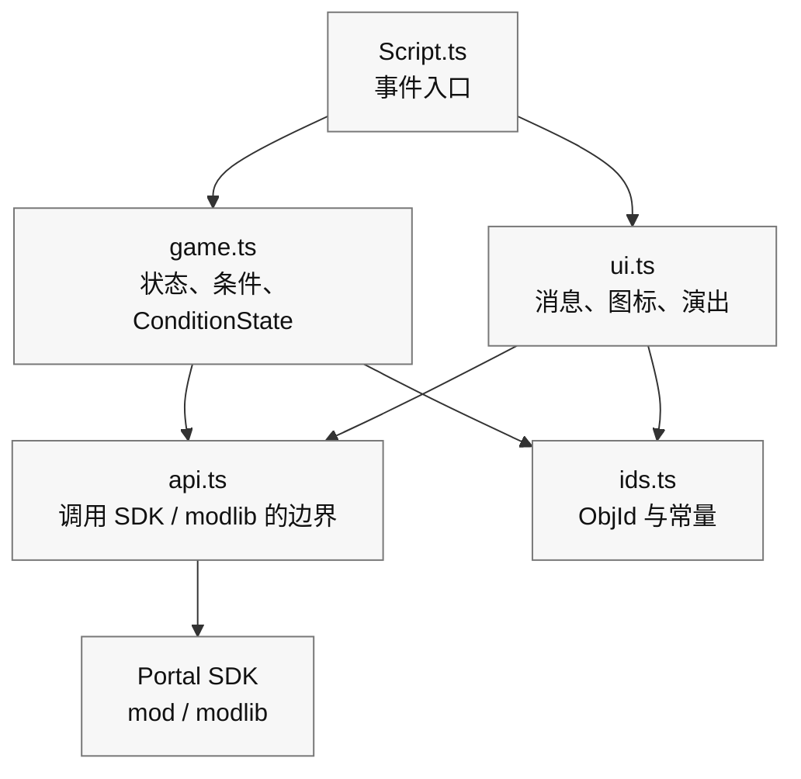

# 0 “整齐拆分”的小设计

> 让代码更不容易坏、更容易改、也更方便以后继续追加功能

在第 6 章里，你已经让 **“按下 -> 标记 -> 到达 -> 光和声音”** 这个最小循环在 TypeScript 中跑起来了。
接下来一旦开始加功能，类似的处理就会慢慢散落到各处，比如消息显示、图标切换、音效播放。结果往往会变成：本来只想改一点点，却把整套流程一起弄坏。

所以这一章要做的事情很简单。
我们不尽量不用太难的术语，只是把代码分进三个盒子里，导入一个 **“小设计”**。
目标也很直接：

* 不容易坏：改一处时，不容易牵连别处
* 好修改：一眼就知道该去哪里动
* 好追加：以后继续加功能时没那么害怕

> 这里做的不是“完整的大型设计”。
>
> 只是把 **第 6 章写出来的代码，温和地整理一下**。

# 1 分成三个盒子（边界 / 状态 / 表现）

先按职责来拆。只要记住这三类就够了：

1. 边界（API）：调用 Portal / SDK 的窗口

这里只放那些真正向游戏外部发出命令的函数，比如“实际把 WorldIcon 打开 / 关闭”“播放 FX”之类。

2. 状态（domain）：游戏进度和规则

这里放的是条件判断和进度控制，比如“现在能不能开始”“能不能算到达”“是否正在防守”“还剩几秒”，以及用 `modlib.ConditionState` 防止重复触发。

3. 表现（UI / 演出）：消息、图标、声音、光效

这里把“文字 -> 标记 -> 效果”的顺序收进一个函数里，只负责看得见的部分。

一开始，只要守住下面这套依赖关系就够了：

| 文件 | 作用 | 允许调用的对象 |
| ---- | ---- | ---- |
| `Script.ts` | 接收 Portal 事件并串起处理的入口 | `game.ts`、`ui.ts` |
| `game.ts` | 进度状态、条件函数、`ConditionState` | `ids.ts`，必要时可用 `api.ts` |
| `ui.ts` | 消息、WorldIcon、FX/SFX 等表现 | `api.ts`、`ids.ts` |
| `api.ts` | 直接调用 Portal SDK 和 `modlib` 的薄边界 | `mod`、`modlib` |
| `ids.ts` | 只放 ObjId 和常量 | 不调用任何东西 |

依赖方向应该是 `Script.ts` -> `game.ts` / `ui.ts` -> `api.ts` -> Portal SDK。
一旦开始反过来调用，就很容易变成“我只是想改个显示，结果连游戏流程都坏了”。
拿不准时，就把直接碰 Portal SDK 的代码都收进 `api.ts`，让事件函数里只保留短小的函数调用。

## 参考骨架

```ts
// 1) API boundary
export const api = {
  showIcon: (id: number, on: boolean) => { /* SDK call */ },
  playFX:  (id: number) => { /* ... */ },
  stopFX:  (id: number) => { /* ... */ },
  playSfx:  (id: number) => { /* ... */ },
  vehicle: {
    enable: (id: number, on: boolean) => { /* ... */ },
    respawn: (id: number) => { /* ... */ },
  },
  time: { wait: async (ms: number) => { /* ... */ } },
};

// 2) Game progress gates and flags
import * as modlib from "modlib";

export const startGate = new modlib.ConditionState();
export const targetGate = new modlib.ConditionState();
export const state = { started: false, reached: false, defending: false };

export function canStart(): boolean { return !state.started; }
export function canReachTarget(): boolean { return state.started && !state.reached; }
export function markStarted(): void { state.started = true; }
export function markReached(): void { state.reached = true; }

// 3) UI and effects
export const ui = {
  say: (message: mod.Message, ms = 2000) => { /* Show to all players */ },
  guide: (hideId?: number, showId?: number) => {
    if (hideId !== undefined) api.showIcon(hideId, false);
    if (showId !== undefined) api.showIcon(showId, true);
  },
  celebrate: (FXId: number, sfxId: number) => {
    api.playFX(FXId); api.playSfx(sfxId);
  },
};
```

### 重点

* 如果 Portal 的规格变了，通常只要改 `api`
* 如果要换文案或演出，通常只要改 `ui`
* 游戏流程则可以用 `state`、`can...`、`mark...`、`ConditionState` 来说明清楚

# 2 拆分文件（基于模板的小文件夹结构）

对初学者来说，先拆成 4 个文件就够用了。

```
/mods
  ├─ ids.ts        // Object ID constants
  ├─ api.ts        // SDK boundary
  ├─ game.ts       // Progress flags, ConditionState, predicates
  ├─ ui.ts         // UI and effects
  └─ Script.ts     // Event wiring
```

* `ids.ts`：只放带名字的 ID，比如 `const ICON_TARGET = 22`
* `api.ts`：把 SDK 调用包成一行函数，外面读起来更干净
* `game.ts`：放 `ConditionState`、状态标志、`can...` / `mark...`
* `ui.ts`：先从 `say` / `guide` / `celebrate` 这三件套开始，不够再加
* `Script.ts`：调用上面这些盒子，把第 5 章的逻辑串起来

> 一旦拆开，“这段该写在哪儿”就固定下来了，人会轻松很多。

模板里的 `npm run build` 会递归收集 `mods` 下的 `.ts` 文件，把它们合并成给 Portal 注册用的 `dist/Script.ts`。
Portal 端虽然只能收一个文件，但开发时完全可以放心拆分。

# 3 依赖方向（只准“往下箭头”）

理想情况是像 `main -> ui -> api` 这样，只朝一个方向流动。
如果变成 `api` 去调用 `ui`，或者 `ui` 再去调用 `main`，读起来很快就会乱。
记一句就够了：可以往下叫，不要往上叫。



# 4 把第 6 章的代码“拆开来放”（一次小搬家）

假设第 5 章的最小循环现在还原样放在 `mods/Script.ts` 里。
那我们就用 3 个步骤把它整理开。

## 步骤 1：把 ID 搬出去（`ids.ts`）

```ts
// ids.ts
export const IP_START = 500;
export const ICON_ENTRANCE = 21;
export const ICON_TARGET   = 22;
export const AREA_TARGET   = 11;
export const FX_GOAL      = 901;
export const SFX_GOAL      = 951;
```

然后把 `mods/Script.ts` 里的裸数字替换成 `import { ... } from "./ids"`。

效果：数字消失，只剩下名字，读起来马上轻松很多。

## 步骤 2：把表现搬出去（`ui.ts`）

```ts
// ui.ts
import { api } from "./api";
export const ui = {
  say: (message: mod.Message, ms = 2000) => { /* Show message */ },
  guide: (hideId?: number, showId?: number) => {
    if (hideId !== undefined) api.showIcon(hideId, false);
    if (showId !== undefined) api.showIcon(showId, true);
  },
  celebrate: (FXId: number, sfxId: number) => {
    api.playFX(FXId); api.playSfx(sfxId);
  },
};
```

把 `mods/Script.ts` 里的 `showMessageAll` / `setIconVisible` / `playFX` / `playSfx`，替换成 `ui.say` / `ui.guide` / `ui.celebrate`。

效果：“文字 -> 标记 -> 效果” 这条线会变得一行就能读懂。

## 步骤 3：把条件和防重复触发搬出去（`game.ts`）

```ts
// game.ts
import * as modlib from "modlib";

export const startGate = new modlib.ConditionState();
export const targetGate = new modlib.ConditionState();

export const state = {
  started: false,
  reached: false,
};

/**
 * Returns true when the game can start.
 */
export function canStart(): boolean {
  return !state.started;
}

/**
 * Returns true when the target area can be accepted.
 */
export function canReachTarget(): boolean {
  return state.started && !state.reached;
}

export function markStarted(): void {
  state.started = true;
}

export function markReached(): void {
  state.reached = true;
}
```

在 `mods/Script.ts` 里，先为每个事件写一个判断函数，再把它交给 `ConditionState`。

```ts
import { startGate, targetGate, canStart, canReachTarget, markStarted, markReached } from "./game";
import { IP_START, AREA_TARGET } from "./ids";

/**
 * Returns true when this interact event should start the game.
 */
function isStartInteract(objectId: number): boolean {
  return canStart() && objectId === IP_START;
}

/**
 * Returns true when this area event should mark the target as reached.
 */
function isTargetArea(objectId: number): boolean {
  return canReachTarget() && objectId === AREA_TARGET;
}

export function OnPlayerInteract(eventPlayer: mod.Player, eventInteractPoint: mod.InteractPoint): void {
  const objectId = mod.GetObjId(eventInteractPoint);

  if (startGate.update(isStartInteract(objectId))) {
    markStarted();
    // Start game
  }
}

export function OnPlayerEnterAreaTrigger(eventPlayer: mod.Player, eventAreaTrigger: mod.AreaTrigger): void {
  const objectId = mod.GetObjId(eventAreaTrigger);

  if (targetGate.update(isTargetArea(objectId))) {
    markReached();
    // Play goal effects
  }
}
```

效果：防重复触发每次都会长成同一种形状，而且 `isStartInteract` / `isTargetArea` 这些名字本身也能告诉你“现在到底在判断什么”。
另外，给 Portal 用的注释请尽量短小并保持英文。日文注释容易踩到多字节字符的问题。

# 5 “命名”的规则（让以后再看也能读懂）

* 函数名尽量是“动词 + 对象 / 目的”
  `guide` 比 `guideIcon` 更简洁，因为它已经放在表现盒子里，图标这一层意思是隐含的。
  `celebrate` 也比 `playGoalEffect` 更像“这是为了什么”。
* 条件函数统一用 `is...` / `has...` / `can...` 开头
  比如 `isStartInteract`、`canReachTarget`
* ID 常量统一用大写蛇形
  `ICON_TARGET` 这种名字一眼就能看出它是“不会变的数字”
* 文件名尽量短且直白
  `ids` / `api` / `game` / `ui` 就够了，不要把人带进命名迷宫

# 6 把设置集中到一个盒子里（以后改数字更轻松）

像“防守 10 秒改成 15 秒”这种平衡调整，最好不要碰到主逻辑代码。
准备一个 `config.ts`，让这些设置都集中在那里。

```ts
// config.ts
export const config = {
  balance: { defenseSeconds: 10, startThrottleMs: 1000 },
  messages: {
    start: mod.stringkeys.start,
    defendSeconds: mod.stringkeys.defendSeconds,
    success: mod.stringkeys.success,
  },
};
```

真正显示出来的文字放在 `Strings.json`，代码侧的设置里只保留 `mod.stringkeys...` 的键。
要显示时，再用 `mod.Message` 组装，比如 `ui.say(mod.Message(config.messages.defendSeconds, t))`。

> 这样一来，“我只想改数字”或者“我只想改文案键”时，就能立刻动手。

# 7 自检（先用 Vitest 把 ID 事故找出来）

像 `-1`（未设置）或者重复 ID，这类问题与其在游戏跑起来之后才发现，不如先在 `npm run test` 阶段抓出来。
像 `assertIds()` 这样的检查函数，建议放在 Vitest 的 `test/ids.test.ts` 里，而不是放在 `mods/Script.ts` 的正式启动流程中。

```ts
// test/ids.test.ts
import { describe, expect, test } from "vitest";
import * as ids from "../mods/ids";

function assertIds() {
  const entries = Object.entries(ids) as [string, number][];
  const seen = new Map<number, string[]>();
  const errors: string[] = [];

  for (const [name, id] of entries) {
    if (id === -1) errors.push(`[ID unset] ${name}`);
    const arr = seen.get(id) || [];
    arr.push(name); seen.set(id, arr);
  }
  for (const [id, names] of seen) {
    if (names.length > 1) errors.push(`[ID duplicate] ${id}: ${names.join(", ")}`);
  }
  if (errors.length) throw new Error(errors.join("\n"));
}

describe("ids", () => {
  test("does not contain unset or duplicate ids", () => {
    expect(() => assertIds()).not.toThrow();
  });

  test("contains required ids", () => {
    expect(ids.IP_START).toBeGreaterThan(-1);
    expect(ids.AREA_TARGET).toBeGreaterThan(-1);
    expect(ids.ICON_TARGET).toBeGreaterThan(-1);
  });
});
```

这样一来，执行 `npm run test` 时，就能先检查 `ids.ts` 里有没有未设置或重复的 ID。
不过 Vitest 看不到 Godot 里真实放了什么。所以实际场景里是否摆了同样的 ObjId，还是要回到第 4 章的台账和 ObjIdManager 去确认。

# 8 把事件“汇总后再分发”（小型 dispatch）

事件一多，代码最好能在上面先写出一张小表，明确“什么事件来了、要看什么条件、通过后做什么”。
这样代码本身就会更像一份能读的规格说明。

这里同样建议把 `ConditionState` 和判断函数成对放着，而不是一直扩张阶段名 `type`。

```ts
// flow.ts
import * as modlib from "modlib";
import { ui } from "./ui";
import { IP_START, AREA_TARGET, ICON_ENTRANCE, ICON_TARGET, FX_GOAL, SFX_GOAL } from "./ids";
import { startDefense } from "./defense";
import { canStart, canReachTarget, markStarted, markReached } from "./game";

type When = "interact"|"enter"|"leave";
type Row = {
  when: When;
  id: number;
  gate: modlib.ConditionState;
  test: () => boolean;
  do: () => void;
};

const startGate = new modlib.ConditionState();
const targetGate = new modlib.ConditionState();

export const flow: Row[] = [
  {
    when: "interact",
    id: IP_START,
    gate: startGate,
    test: canStart,
    do: () => {
      markStarted();
      ui.say(mod.Message(mod.stringkeys.start));
      ui.guide(ICON_ENTRANCE, ICON_TARGET);
    },
  },
  {
    when: "enter",
    id: AREA_TARGET,
    gate: targetGate,
    test: canReachTarget,
    do: () => {
      markReached();
      ui.celebrate(FX_GOAL, SFX_GOAL);
      startDefense(10);
    },
  },
];

export function dispatch(when: When, id: number) {
  const row = flow.find(r => r.when === when && r.id === id);
  if (!row) return;
  if (row.gate.update(row.test())) row.do();
}
```

这样在 `mods/Script.ts` 里，SDK 的事件回调就只要写成 `dispatch("interact", IP_START)` 这种形式即可。

效果：行为能从上面的表里直接读出来，尤其对初学者更安心。
`gate` 负责挡住重复触发，`test` 则用有名字的函数说明“现在是否允许通过”。

# 9 把拆开的代码重新合成一个文件

使用模板时，开发阶段可以把文件拆在 `mods` 下；等到要注册到 Portal 时，再把它们合并成一个文件。

执行的命令是：

```bash
npm run build
```

这个命令会收集 `mods` 下的 `.ts` 文件，整理 `import`，然后生成 `dist/Script.ts`。

要注册到 Portal Web Builder 的，不是开发中的 `mods/Script.ts`，而是 **`dist/Script.ts`**。
如果还用了字符串定义，那么 **`dist/Strings.json`** 也要一起注册。

## 注册前的确认顺序

带进 Portal 之前，建议按这个顺序确认：

```bash
npm run lint
npm run test
npm run build
```

* `lint`：先找出语法或写法上的危险点
* `test`：确认状态变化和小函数按预期动作
* `build`：生成给 Portal 注册的单文件

不要因为 `build` 通过就完全放心。构建成功只代表“文件合并成功了”，不代表“游戏逻辑一定正确”。

# 10 拆开之后，应该去哪里改

想改外观？
去 `ui.ts`，看文案、演出、顺序。

想改向外发出的命令？
去 `api.ts`，处理 SDK 侧的变更。

想给游戏多加一个阶段？
去 `game.ts` 增加状态标志、`ConditionState`、`can...` / `mark...`，再去 `flow.ts` 加一行。

ID 增加了？
去 `ids.ts` 加常量，再用 Vitest 和 ObjIdManager 检查。

想调整数字和文案？
去 `config.ts` 改值。

拆分最大的好处，就是你很快能知道“这次该去哪里动”。

# 11 常见 NG 和对策

NG：到处直接调用 API
-> 对策：一定通过 `ui` 或 `api`。不要从 `main` 里直接打 `setIconVisible`。

NG：把数字写死在现场，比如 `setIconVisible(22, true)`
-> 对策：全部搬进 `ids.ts` 常量里，过上不用追裸数字的生活。

NG：防重复触发的标志到处复制粘贴
-> 对策：把 `ConditionState` 和判断函数集中到 `game.ts`。

NG：文案散落在代码里
-> 对策：把文字放进 `Strings.json`，通过 `mod.Message` 使用，比如 `ui.say(mod.Message(mod.stringkeys.start))`。

# 12 渐进式重构（按不吓人的顺序）

没必要一次做完。安全顺序如下：

1. 先把 ID 变成常量
2. 抽出 UI 的三件套：`say` / `guide` / `celebrate`
3. 建立 `ConditionState` 和判断函数
4. 建立 API 边界
5. 有需要时，再上过渡表 `flow`

每做完一步，就 build 一次、test 一次，确认游戏还能像平常一样跑，再继续下一步。

# 结论

* 只要把代码拆成 `api` / `game` / `ui` 这三个盒子，就会明显更不容易坏，也更容易改。
* 停止写裸数字，改用 `ids.ts` 里的名字，是可读性的核心。
* 用 `ConditionState` 压住重复触发，用 `config` 集中文案和数字，用 Vitest + ObjIdManager 降低 ID 事故。
* 安全的拆分顺序是：ID -> UI -> 状态 -> API -> 过渡表。一步一步来，就没那么可怕。

# 下一章预告

在 **第 8 章《视觉与演出：掌握 UI、SFX、FX》** 里，我们会继续打磨这一章做出来的 `ui` 盒子：

* 消息怎么发：个人、全体、重要度
* WorldIcon 该在什么时机切换
* 调试 UI 放在哪里，以及怎样不让玩家看见它
