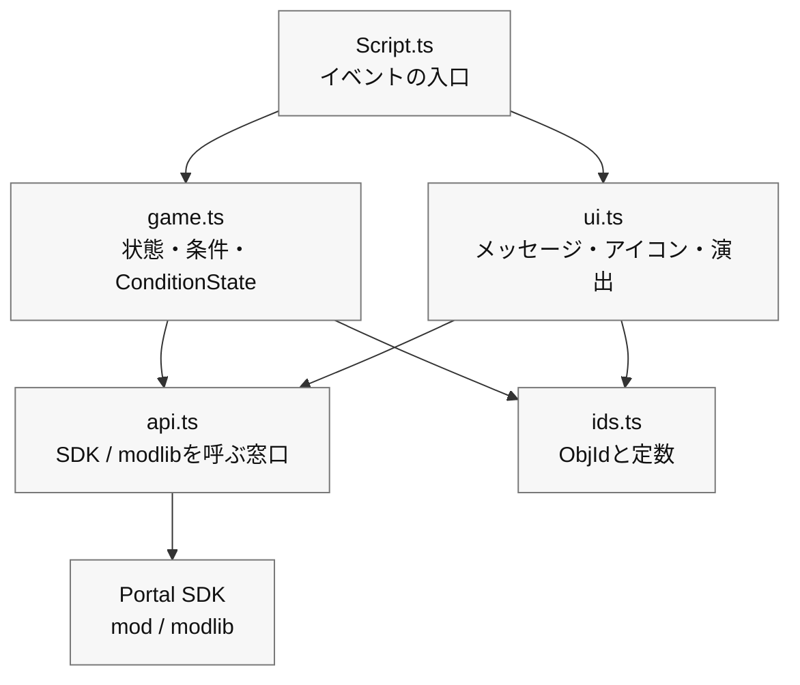

# 0 “整齐分开”的小设计

> --- 难以破坏、易于修复且可以稍后添加的代码。

在第 6 章中，您能够在 TypeScript 中运行“Press → Landmark → Arrival → Light and Sound”的最小循环。
当你从这里添加更多的功能时，类似的过程（消息显示、图标切换、音效播放）分散在各处，即使你只想修复一些东西，最终也会破坏整个事情。

因此，在本章中，我们将介绍“小设计”，它将代码简单地分为三个框，尽可能不使用困难的技术术语。
目的很简单。

* 难以破解（一个地方的变化很难扩散到其他部分）
* 易于修复（您立即知道该触摸哪里）
* 易于添加（不要害怕添加新功能）

> 我们在这里所做的并不是“完整的全尺寸设计”。
>
> **“轻松清理第 6 章中创建的代码”** 就是您所需要做的一切。

# 1 分为三个盒子（边界/状态/如何呈现）

首先，让我们按角色来划分它们。只需记住三件事：

1. 边界（API）：调用Portal/SDK的窗口。

只放置向游戏外部世界发出命令的函数的地方，例如“实际打开/关闭 WorldIcon”和“玩 FX”。

2. 状态（域）：游戏进度和规则。

表达诸如“我们可以开始吗？”“我们可以到达目的地吗？”“我们在防守吗？”“数了多少秒？”等条件的小函数，以及使用 `modlib.ConditionState` 进行多重射击预防。

3. 如何呈现（UI/方向）：消息、图标、声音和灯光。

  一个盒子，将“文字→地标→效果”的顺序组合成一个功能，并照顾“仅外观”。

最初，仅保护以下依赖项就足够了：

|文件 |角色 |你可以称呼什么 |
| ---- | ---- | ---- |
| `Script.ts` | `Script.ts` |接收Portal事件并连接处理的入口 | `game.ts`，`ui.ts` | `game.ts`
| `game.ts` | `game.ts` |进度状态，条件函数，`ConditionState` | `ids.ts`，如有必要 `api.ts` |
| `ui.ts` | `ui.ts` |如何显示消息、WorldIcon、FX/SFX 等 | `api.ts`，`ids.ts` | `api.ts`
| `api.ts` | `api.ts` |直接调用Portal SDK和modlib的薄窗口 | `mod`，`modlib` | `mod`
| `ids.ts` | `ids.ts` |仅放置 ObjId 和常量 |不要打电话 |

依赖方向为 `Script.ts` → `game.ts` / `ui.ts` → `api.ts` → Portal SDK。
如果你开始朝相反的方向调用，你最终会陷入只想改变显示但游戏进度被破坏的情况。
如有疑问，请将直接与Portal SDK交互的代码提交到`api.ts`，并且仅在事件中调用短函数。

## 文具（感受气氛）

```ts
// 1) API boundary
export const api = {
  showIcon: (id: number, on: boolean) => { /* SDK call */ },
  playFX:  (id: number) => { /* ... */ },
  stopFX:  (id: number) => { /* ... */ },
  playSfx:  (id: number) => { /* ... */ },
  vehicle: {
    enable: (id: number, on: boolean) => { /* ... */ },
    respawn: (id: number) => { /* ... */ },
  },
  time: { wait: async (ms: number) => { /* ... */ } },
};

// 2) Game progress gates and flags
import * as modlib from "modlib";

export const startGate = new modlib.ConditionState();
export const targetGate = new modlib.ConditionState();
export const state = { started: false, reached: false, defending: false };

export function canStart(): boolean { return !state.started; }
export function canReachTarget(): boolean { return state.started && !state.reached; }
export function markStarted(): void { state.started = true; }
export function markReached(): void { state.reached = true; }

// 3) UI and effects
export const ui = {
  say: (message: mod.Message, ms = 2000) => { /* Show to all players */ },
  guide: (hideId?: number, showId?: number) => {
    if (hideId !== undefined) api.showIcon(hideId, false);
    if (showId !== undefined) api.showIcon(showId, true);
  },
  celebrate: (FXId: number, sfxId: number) => {
    api.playFX(FXId); api.playSfx(sfxId);
  },
};
```

### 积分

* 如果Portal规格发生变化，只需修复API即可。
*如果你想替换UI文本或方向，只需修复UI即可。
* 游戏进度规范可在 `state`、`can...`、`mark...`、`ConditionState` 进行解释。

# 2 个单独的文件（基于模板的小文件夹结构）

对于初学者来说 4 个文件就足够了。

```
/mods
  ├─ ids.ts        // Object ID constants
  ├─ api.ts        // SDK boundary
  ├─ game.ts       // Progress flags, ConditionState, predicates
  ├─ ui.ts         // UI and effects
  └─ Script.ts     // Event wiring
```

* ids.ts：仅列出命名 ID，例如 const ICON_TARGET = 22。
* api.ts：将SDK调用包装成一行函数（即使内容很复杂，从外部看也可以看作一行）。
* game.ts：`ConditionState`，声明，放入`can...` / `mark...`。
* ui.ts：从 say/guide/celebrate 3 件套开始，并根据需要增加。
* Script.ts：在调用上面的框的同时，编写第五章的逻辑（推送→引导→到达→灯光和声音）。

> 通过分离信息，“我应该在哪里写”变得固定并减少混乱。

模板 `npm run build` 递归收集 `mods` 下的 `.ts` 文件，并将其编译为 `dist/Script.ts` 以在门户中注册。 Portal端只能接收一个文件，开发时可以随意分割。

# 3 依赖方向（仅限“向下箭头”）

理想情况下，箭头应该只朝一个方向流动，例如 main → ui → api。
反向流程（例如 `api` 调用 `ui` 和 `ui` 调用 `main` ）会导致混乱。
如果你坚持“我叫你下来，但我不叫你起来”这句口头禅，你就会停止像滚雪球一样越滚越大的依赖。



# 4 第六章代码“分离”演示（小动作）

假设第 5 章中的最小循环已按原样放置在 `mods/Script.ts` 中。
以下是如何通过 3 个步骤完成此操作。

## 步骤 1：移动 ID (ids.ts)

```ts
// ids.ts
export const IP_START = 500;
export const ICON_ENTRANCE = 21;
export const ICON_TARGET   = 22;
export const AREA_TARGET   = 11;
export const FX_GOAL      = 901;
export const SFX_GOAL      = 951;
```

将 `mods/Script.ts` 替换为 `import { ... } from "./ids"`。
效果：数字消失，仅保留名称（易于阅读）。

## 步骤 2：移动演示文稿 (ui.ts)

```ts
// ui.ts
import { api } from "./api";
export const ui = {
  say: (message: mod.Message, ms = 2000) => { /* Show message */ },
  guide: (hideId?: number, showId?: number) => {
    if (hideId !== undefined) api.showIcon(hideId, false);
    if (showId !== undefined) api.showIcon(showId, true);
  },
  celebrate: (FXId: number, sfxId: number) => {
    api.playFX(FXId); api.playSfx(sfxId);
  },
};
```

`showMessageAll` / `setIconVisible` / `playFX` / `playSfx` 在 `mods/Script.ts` 一侧，
替换为 `ui.say` / `ui.guide` / `ui.celebrate`。
效果：文字→地标→效果的顺序可以一行读完。

## 步骤 3：移动条件和多重射击预防 (game.ts)

```ts
// game.ts
import * as modlib from "modlib";

export const startGate = new modlib.ConditionState();
export const targetGate = new modlib.ConditionState();

export const state = {
  started: false,
  reached: false,
};

/**
 * Returns true when the game can start.
 */
export function canStart(): boolean {
  return !state.started;
}

/**
 * Returns true when the target area can be accepted.
 */
export function canReachTarget(): boolean {
  return state.started && !state.reached;
}

export function markStarted(): void {
  state.started = true;
}

export function markReached(): void {
  state.reached = true;
}
```

在`mods/Script.ts`中，为每个事件创建一个判断函数，然后传递给`ConditionState`。

```ts
import { startGate, targetGate, canStart, canReachTarget, markStarted, markReached } from "./game";
import { IP_START, AREA_TARGET } from "./ids";

/**
 * Returns true when this interact event should start the game.
 */
function isStartInteract(objectId: number): boolean {
  return canStart() && objectId === IP_START;
}

/**
 * Returns true when this area event should mark the target as reached.
 */
function isTargetArea(objectId: number): boolean {
  return canReachTarget() && objectId === AREA_TARGET;
}

export function OnPlayerInteract(eventPlayer: mod.Player, eventInteractPoint: mod.InteractPoint): void {
  const objectId = mod.GetObjId(eventInteractPoint);

  if (startGate.update(isStartInteract(objectId))) {
    markStarted();
    // Start game
  }
}

export function OnPlayerEnterAreaTrigger(eventPlayer: mod.Player, eventAreaTrigger: mod.AreaTrigger): void {
  const objectId = mod.GetObjId(eventAreaTrigger);

  if (targetGate.update(isTargetArea(objectId))) {
    markReached();
    // Play goal effects
  }
}
```

效果：多次预防每次都会以相同的形式，并且您还可以使用名称 `isStartInteract` / `isTargetArea` 来读取“正在确定的内容”。
门户网站的评论将以英文简短撰写。请避免日语注释，因为它们很容易导致多字节字符出现问题。

# 5 “命名”规则（初学者可以稍后阅读的名称）

* 函数名称是动词+宾语：`guide` from `guideIcon`（“icon”是隐式的，因为它位于演示框中），`celebrate` from `playGoalEffect`（减少宾语以表达“for What”）。
* 条件函数以 `is...` / `has...` / `can...` 开头：阅读 `isStartInteract`、`canReachTarget` 等。
* ID常量是一个大写的蛇：`ICON_TARGET`是**只要你看到它，你就知道它是一个“不变的数字”**。
* 文件名简短明了：`ids` / `api` / `game` / `ui`。正义不是让人们误入歧途。

# 6 个设置集中在一个框中（以便稍后编辑数字）

我想在不重写代码的情况下进行平衡调整（例如防御10秒→15秒）。
准备一份 `config.ts` 并仅在游戏过程中查看。

```ts
// config.ts
export const config = {
  balance: { defenseSeconds: 10, startThrottleMs: 1000 },
  messages: {
    start: mod.stringkeys.start,
    defendSeconds: mod.stringkeys.defendSeconds,
    success: mod.stringkeys.success,
  },
};
```

将文本本身放入 `Strings.json`，并将密钥放入 `mod.stringkeys...` 以进行代码端设置。
显示时，像`ui.say(mod.Message(config.messages.defendSeconds, t))`一样组装`mod.Message`。

> 现在您可以立即回复“我只想更改数字”或“我只想更改文字键”。

# 7 ：自诊断（先用Vitest发现ID事故）

-1（未设置）和重复 ID 在 `npm run test` 上找到比在游戏开始后发现它们更容易。
像 `assertIds()` 这样的确认函数应该放在 Vitest 的 `test/ids.test.ts` 端，而不是在 `mods/Script.ts` 的生产启动期间调用。

```ts
// test/ids.test.ts
import { describe, expect, test } from "vitest";
import * as ids from "../mods/ids";

function assertIds() {
  const entries = Object.entries(ids) as [string, number][];
  const seen = new Map<number, string[]>();
  const errors: string[] = [];

  for (const [name, id] of entries) {
    if (id === -1) errors.push(`[ID unset] ${name}`);
    const arr = seen.get(id) || [];
    arr.push(name); seen.set(id, arr);
  }
  for (const [id, names] of seen) {
    if (names.length > 1) errors.push(`[ID duplicate] ${id}: ${names.join(", ")}`);
  }
  if (errors.length) throw new Error(errors.join("\n"));
}

describe("ids", () => {
  test("does not contain unset or duplicate ids", () => {
    expect(() => assertIds()).not.toThrow();
  });

  test("contains required ids", () => {
    expect(ids.IP_START).toBeGreaterThan(-1);
    expect(ids.AREA_TARGET).toBeGreaterThan(-1);
    expect(ids.ICON_TARGET).toBeGreaterThan(-1);
  });
});
```

现在，当您运行 `npm run test` 时，您可以检查代码端的 `ids.ts` 是否未设置或重复。
然而，直到在 Godot 上实际部署后才能看到 Vitest。请检查第四章中的账本或ObjIdManager，看看实际场景中是否放置了相同的ObjId。

# 8 “聚合和分发”事件（小型调度）

当事件数量增加时，你可以将规范写在表格顶部的表格中，上面写着：“当事件到来时我应该做什么，我应该看什么条件，我应该做什么？”代码就变成了可读的规范。
这里同样将 `ConditionState` 与判断函数配对，而不是增加阶段名称 `type` ，这样更容易理解。

```ts
// flow.ts
import * as modlib from "modlib";
import { ui } from "./ui";
import { IP_START, AREA_TARGET, ICON_ENTRANCE, ICON_TARGET, FX_GOAL, SFX_GOAL } from "./ids";
import { startDefense } from "./defense";
import { canStart, canReachTarget, markStarted, markReached } from "./game";

type When = "interact"|"enter"|"leave";
type Row = {
  when: When;
  id: number;
  gate: modlib.ConditionState;
  test: () => boolean;
  do: () => void;
};

const startGate = new modlib.ConditionState();
const targetGate = new modlib.ConditionState();

export const flow: Row[] = [
  {
    when: "interact",
    id: IP_START,
    gate: startGate,
    test: canStart,
    do: () => {
      markStarted();
      ui.say(mod.Message(mod.stringkeys.start));
      ui.guide(ICON_ENTRANCE, ICON_TARGET);
    },
  },
  {
    when: "enter",
    id: AREA_TARGET,
    gate: targetGate,
    test: canReachTarget,
    do: () => {
      markReached();
      ui.celebrate(FX_GOAL, SFX_GOAL);
      startDefense(10);
    },
  },
];

export function dispatch(when: When, id: number) {
  const row = flow.find(r => r.when === when && r.id === id);
  if (!row) return;
  if (row.gate.update(row.test())) row.do();
}
```

对于 `mods/Script.ts`，只需从 SDK 事件回调中调用dispatch("interact", IP_START) 即可。
效果：你可以阅读上表中的行为（对于初学者来说更安全）。
`gate` 停止多次触发，`test` 使用命名函数来解释现在是否可以继续该过程。

# 9 将单独的代码合并为一个

使用模板时，开发时将 `mods` 下的文件分开，仅在注册到门户时将它们合并为一个文件。

这是要运行的命令：

```bash
npm run build
```

此命令收集 `mods` 下的 `.ts` 文件，组织 `import` 行，并创建 `dist/Script.ts`。

开发时在Portal Web Builder中注册的不是`mods/Script.ts`。 **`dist/Script.ts`**。如果您使用字符串定义，还需注册 **`dist/Strings.json`**。

## 注册前检查订单

在将其带到门户之前，请按以下顺序检查以下内容。

```bash
npm run lint
npm run test
npm run build
```

* `lint`：首先查找语法或写作风格中的危险点。
* `test`：检查状态转换和小函数是否按预期工作。
* `build`: 生成1个要在Portal中注册的文件。

请不要仅仅通过 `build` 就感到安全。构建是一个组合，而不是游戏正确性的证明。

# 1 0 如何修复“分离后”（实用流程）

我想改变外观→打开`ui.ts`（措辞、方向、顺序）。

导出的命令已更改 → 打开 `api.ts`（SDK 替换）。

我想增加游戏的阶段 → 将状态标志添加到 `game.ts`、`ConditionState`、`can...` / `mark...` 函数，并将该行添加到 `flow.ts`。

ID 增加了 → 添加一个常量到 `ids.ts` 并使用 Vitest 和 ObjIdManager 检查。

调整数字和措辞 → 更改 `config.ts` 的值。

分离最大的作用就是你接触的地方是唯一确定的。

# 1 1 常见NG及对策

NG：直接从各个地方调用API
→ 对策：始终访问 `ui` 或 `api`。不要直接从 `main` 访问 `setIconVisible`。

NG：当场写下数字（例如 `setIconVisible(22, true)`）
→ 对策：将所有内容更改为常量 `ids.ts`。走向不追寻数字的生活。

NG：复制并粘贴该标志以防止每次多次触发。
→ 对策：将判断函数`ConditionState`发布到`game.ts`。

NG：代码中的措辞分散
→ 对策：将文本放入 `Strings.json` 中，然后像 `ui.say(mod.Message(mod.stringkeys.start))` 一样通过 `mod.Message` 。

# 1 2 渐进重构（按最不可怕的顺序排列）

没有必要“一次性完成所有事情”。这是安全的顺序。

1. **将 ID 转换为常数**（最大效果/最小风险）
2. 剪出3点UI集（`say` / `guide` / `celebrate`）
3.创建**ConditionState和判断函数**
4. 创建 API 联系点
5. 转到**转换表（流程）**（如有必要）

构建并测试每个步骤，确保可以正常播放，然后继续下一步。

# 结论

* 只需将其分为三个框（api / game / ui）即可使其不太可能损坏且更易于修复。
* **停止号码和使用名称（ids.ts）**是可读性的核心。
* 使用 `ConditionState` 减少多次触发，使用配置减少文本和数字，并使用 Vitest 和 ObjIdManager 减少 ID 事故。
* 划分顺序为ID→UI→状态→API→转换表。把它切成小块就不可怕了。

# 下一节的指南

**第 8 章“视觉和制作：掌握 UI、SFX 和 FX”** 在本章中，我们将进一步完善本章中创建的 UI 框，

* 如何发送消息（个别/整体/重要性）
* WorldIcon切换时序设计
* 调试 UI 位置以及对玩家隐藏它的方法
