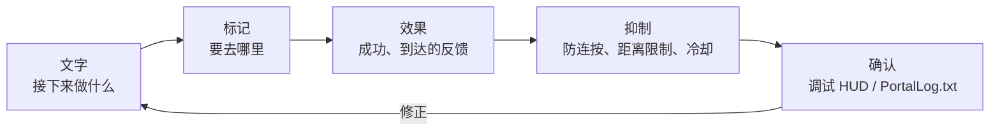

第 7 章中，我们把处理拆成几个小盒子，让消息显示和标记更新都能更容易地被调用。不过，代码能运行还不够。玩家还需要知道“接下来要做什么”“是否成功了”“现在该往哪里走”。
本章会把这些反应整理成 **能传达给玩家的演出**。我们会把短消息、WorldIcon、SFX、FX 按 **文字 -> 标记 -> 效果** 的顺序连接起来，让规则变化能在画面上被清楚地追踪。

这里的目标不是单纯增加华丽效果，而是以之后可以直接写进 TypeScript 实现的形式，决定通知、引导、音效、特效、防连按和调试显示之间的关系。

# 0 视觉与演出：掌握 UI、SFX、FX

* 传达：短消息 / WorldIcon 切换
* 引导：让玩家一眼看懂“去这里”的摆放和更新
* 有手感：用 SFX / FX 增加反馈，但不要播放过头
* 不失控：防连按、距离 / 次数限制、冷却时间
* 可回看：用调试 HUD 看见“刚刚发生了什么”

> 口诀是“文字 -> 标记 -> 效果”。
> 先用短句给出要求，再用 WorldIcon 指方向，最后用 SFX / FX 叠加反馈。



# 1 消息：用短句只给出“下一步”
## 为什么

玩家会在几秒内判断。长文不会被认真读。只把“接下来要做什么”用短句显示出来，迷路感就会少很多。

## 怎么写

* 使用“命令 + 对象”：

例：“go entrance”“start terminal A”“defend 10s”

* 加上时间 / 距离也很有效：

例：“defend 10s”“120m left”

## 实现模板

画面上显示的文字不要直接写进代码。请先注册到 `Strings.json` 再使用。
通知、WorldIcon、UI Text 的 `textLabel` 等玩家能看到的文字，都按同样的方式处理。

流程分三步：

1. 在 `Strings.json` 中注册要显示的文字键和正文。
2. 在 TypeScript 侧创建 `mod.Message(mod.stringkeys.keyName, extraValues...)`。
3. 把 `Message` 传给 `modlib.ShowNotificationMessage()` 等显示函数。

`Strings.json` 是画面文字的字典。
TypeScript 侧指定这个字典里的键，必要时只把要填进 `{}` 的值追加传入。
这样分开后，可以避免显示文案增加时，把直接写在代码里的文字弄坏在 Portal 里。

```json
{
  "goEntrance": "go entrance",
  "defendSeconds": "defend:{}s",
  "testName": "test name:{}"
}
```

代码侧用 `mod.Message` 创建显示用的 `Message`。
第二个参数之后传入的值，会放进 `{}` 的位置。

```ts
modlib.ShowEventGameModeMessage(mod.Message(mod.stringkeys.goEntrance));
modlib.ShowEventGameModeMessage(mod.Message(mod.stringkeys.defendSeconds, 10));
modlib.ShowNotificationMessage(mod.Message(mod.stringkeys.testName, "player1"));
```

最后一个例子在画面上会显示为 `test name:player1`。
`mod.Message` 最多可以使用 3 个追加参数，所以代码里只传剩余秒数、分数、玩家名这类会变化的值。

```ts
// Important message
ui.say(mod.Message(mod.stringkeys.goEntrance));

// Updating message
ui.say(mod.Message(mod.stringkeys.defendSeconds, t));
```

## 防踩坑

* 追加画面文字后，确认 `Strings.json` 里有对应的键。
* 不要同时显示多条消息。设计成最后一条覆盖前一条。
* 降低通知频率。每秒新通知会很累，尽量覆盖更新。
* 个人和全体要先分清。个人提醒只发给触发者，合图则发给所有人。

# 2 WorldIcon：引导标记放在“稍微靠前”的位置，并按阶段切换
## 为什么

如果把标记直接放在目的地上，玩家靠近时很容易被墙或转角挡住。
放在入口或转角的**稍微前方**，转弯时也不容易迷路。

## 怎么放 / 怎么切

* 分阶段：入口（`ICON_ENTRANCE`）-> 目的地（`ICON_TARGET`）-> 下一个目标（`ICON_NEXT...`）
* 到达后把当前标记 OFF，再把下一个 ON。不要让两个目标同时发光，这是不迷路的关键。

## 实现模板

```ts
// Basic guide flow using guide from chapter 6
ui.guide(ICON_ENTRANCE, ICON_TARGET);  // Entrance off, target on

// When reached
ui.guide(ICON_TARGET, undefined);      // Target off; enable the next icon here if needed
```

## 防踩坑

* 只增加 ON，忘记 OFF：到达时一定关闭前一个图标。
* 如果需要按队伍显示，可以分出 `ui.guideForTeam(teamId, hide, show)` 这类函数，避免显示范围出错。

# 3 SFX：声音太多会变成疲劳，所以一定要加冷却
## 为什么

达成音很爽，但连续播放会让人疲劳。
冷却时间，也就是“一段时间内不要再播放”，可以控制密度。

## 实现模板：SFX 冷却

```ts
const sfxCooldownMs = 1500;
let lastSfxAt = 0;

function playSfxCooled(id: number) {
  const now = Date.now();
  if (now - lastSfxAt < sfxCooldownMs) return;
  lastSfxAt = now;
  api.playSfx(id);
}
```

## 防踩坑

* 如果和事件重复触发叠在一起，声音会立刻变吵。请和第 6 章的一次性守卫一起用。
* 如果 API 能按距离调整音量，就让远处事件不播放。没有这种 API 时，就先决定远距离事件不播放 SFX。

# 4 FX：远处是“灯塔”，近处是“奖励”
## 为什么

FX 的理想状态是：远处能注意到，近处能理解。
远距离重视可见性，比如闪烁、光柱、箭头。近距离重视手感，比如爆炸、火花、火柱。

## 实现模板：一次性 FX / 循环 FX

```ts
function celebrate() {
  api.playFX(FX_GOAL);   // One-shot FX
  playSfxCooled(SFX_GOAL); // Cooldown version from 7.3
}

// Always stop looped FX
onEnterArea(AREA_TARGET, () => api.playFX(FX_GOAL));
onLeaveArea(AREA_TARGET, () => api.stopFX(FX_GOAL));
```

## 防踩坑

* 烟雾停不下来：退出事件里一定写停止处理。
* 室内看不见：把放置位置稍微往前移。向上加一点偏移也常常有效。

# 5 距离和方向：用“还剩 XXm”把引导变成实感
## 为什么

看到距离后，玩家会感觉“我正在前进”。
每隔几秒更新一次就够了，不需要每帧更新。

## 实现模板：覆盖更新距离 UI

```ts
const updateDistance = debounce(500, (playerPos: Vector3, targetPos: Vector3) => {
  const d = Math.round(distance(playerPos, targetPos));
  ui.say(mod.Message(mod.stringkeys.distanceLeft, d));
});
```

这种情况下，请在 `Strings.json` 中准备 `"distanceLeft": "{}m left"` 这样的文案。

## 防踩坑

* 更新太频繁导致通知吵：用 debounce 间隔更新。
* 距离不到 0m：目标点和 WorldIcon 一样，放在稍微靠前的位置。

# 6 优先级：重要的声音、光效、文字先播放 / 先显示
## 为什么

多个演出同时叠在一起时，弱的那个会被盖掉。
请设定优先级，按高 -> 中 -> 低处理，必要时抑制低优先级演出。

## 实现模板：优先级队列的思路

```ts
type Prio = "high"|"mid"|"low";
function playSfxPrio(id: number, prio: Prio) {
  if (prio === "low" && Date.now() - lastSfxAt < 2000) return; // Suppress recent low-priority SFX
  playSfxCooled(id);
}
```

## 小技巧

* 胜利和失败的提示音一定是 `high`。
* 脚步声、环境音这类底层声音交给游戏本身。自定义 SFX 只放在关键节点。

# 7 防止“做太多”的设计：一个场景一个效果，一个时刻一条消息

* 一个场景一个效果：同一事件里不要叠两三个 FX。先决定一个主角。
* 一个时刻一条消息：不要同时显示目的、注意、提示。只聚焦目的。
* 一定要写结束处理：停止循环 FX/SFX、覆盖消息、关闭 WorldIcon。

# 8 调试 HUD：准备只有自己能看到的“眼睛和耳朵”
## 为什么

演出是靠感觉体验的，但设计靠的是数值和状态。
给自己准备一个小 HUD，只显示 phase、剩余秒数、最近事件，修起来会快很多。

## 实现模板
```
const debug = { on: true };
function dbg(line: string) { if (!debug.on) return; /* Small text at the screen edge */ }

function dump() { dbg(`phase=${Phase[state.phase]} time=${remainSec}`); }

onInteract(IP_START, () => dbg("Interact:Start"));
onEnterArea(AREA_TARGET, () => dbg("Enter:Target"));
onLeaveArea(AREA_TARGET, () => dbg("Leave:Target"));
```

## 小技巧

* 正式发布时设为 `debug.on = false`。
* HUD 也和通知一样做 debounce，保持可读性。

# 9 性能和稳定性：不做也是勇气

* 避免每帧判定。距离和方向每 0.5 到 1 秒检查一次就够了。
* 避免无限循环加短等待。用事件和计时器等待。
* 限制同时播放数量，比如同时最多 3 个 SFX。
* 演出只给能感知到的人。API 支持的话，检查可听范围 / 可视范围。

官方 SDK 的 Tips 也把车辆数量、Player 扫描、UI Widget 管理列为和负载直接相关的点。
增加演出前，请先守住下面三点：

* 同时存在的载具不要超过 40 台。常驻载具和事件载具要合在一起看。
* 不要每帧扫描所有玩家。用 `OnPlayerEnterCapturePoint`、`OnPlayerExitCapturePoint` 等事件记录状态，需要时再读取。
* UI Widget 不要每次重新创建。把创建好的 Widget 保存在变量里，只更新显示内容。

演出越华丽，越要在变重之前先定好上限。
判断标准不是“能显示多少”，而是“玩家能理解多少”。

# 10 配方集：可以直接复用的小部件
## A）到达时让镜头晃一下，并只播放一次短欢呼

```ts
let cheered = false;
function celebrateOnce() {
  if (cheered) return; cheered = true;
  ui.celebrate(FX_GOAL, SFX_GOAL);    // Light and sound
  api.shakeCameraAll?.(0.4, 600);      // If available: strength 0.4 for 600 ms
  setTimeout(()=> cheered = false, 3000); // Prevent repeats for 3 seconds
}
```

## B）阶段消息：用 3 个短句串成一条故事线

```ts
ui.say(mod.Message(mod.stringkeys.start));
ui.guide(ICON_ENTRANCE, ICON_TARGET);
ui.say(mod.Message(mod.stringkeys.goTerminalA));
// On reached
ui.say(mod.Message(mod.stringkeys.goodJob));
```

## C）伪“闪烁图标”：交替 ON / OFF

```ts
let blinkOn = false, blinkH: any;
function startBlinkIcon(id: number, ms = 600) {
  stopBlinkIcon();
  blinkH = setInterval(()=> { blinkOn = !blinkOn; api.showIcon(id, blinkOn); }, ms);
}
function stopBlinkIcon() { if (blinkH) clearInterval(blinkH); api.showIcon(ICON_TARGET, true); }
```

> 注意不要用太多。比较自然的做法是：第一次吸引注意时闪烁，到快到达时改为常亮。

# 结论

* 只要守住“文字 -> 标记 -> 效果”的顺序，体验的传达方式就会明显改变。
* WorldIcon 放在稍微靠前的位置，SFX / FX 加冷却，UI 用覆盖更新，能防止演出变吵。
* 用调试 HUD 可视化“现在”。修正会更快，演出质量也会更稳。

# 下一章预告

接下来的第 8.5 章《把 Checkpoint Rush 做到发布前》会把第4章到第8章中讲过的配置、ID、TypeScript、UI、SFX、FX，连接成一个小型制作流程。

* 把开始按钮、WorldIcon、AreaTrigger、FX/SFX 整理到一张设计表中
* 落到 `ids.ts`、`config.ts`、`ui.ts`、`game.ts`、`Script.ts` 的最小结构
* 通过 `lint`、`test`、`build` 和注册前检查
* 准备好交给第9章继续处理发布、托管和运营
