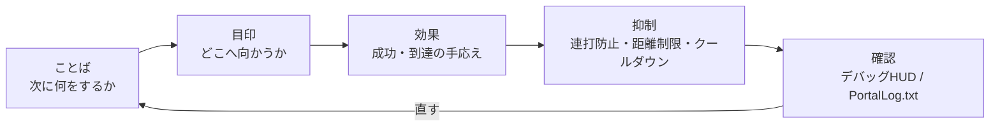

# 0 视觉效果和制作：掌握 UI、SFX 和 FX

> ―― 按照以下顺序：理解→不要犹豫→感觉良好

* 发送（短信/切换WorldIcon）
* 指南（让您一眼就知道“去这里”的放置和更新）
* 营造感觉（用 SFX/FX 添加感觉。但是，不要让它“太大声”）
* 不受干扰（防止垃圾邮件、距离/次数限制、冷却时间）
* 可以查看（查看调试 HUD 上的“刚刚发生了什么”）

> 密码是“文字→符号→效果”。
> 首先用简短的句子陈述要求，然后用 WorldIcon 指示方向，最后用 SFX/FX 重复响应。



#1​信息：用简短的句子给出“下一步”
## 为什么

玩家在几秒钟内做出决定。长文本将不会被阅读。如果你只用 5 到 12 个字符说“接下来你想让我做什么”，你的犹豫就会消失。

## 如何写（类型）

* 命令式+宾语：

例）“前往入口”“启动A航站楼”“防御10秒”

* 建议包含时间/距离：

例）“防守10秒”“还剩120m”

## 实现类型

屏幕上要显示的字符并不是直接写在代码中，而是在使用前注册到`Strings.json`中。
所有对玩家可见的角色，例如通知、WorldIcon 和 UI Text `textLabel`，都有相同的想法。

该流程由以下三个阶段组成。

1. 在 `Strings.json` 中注册要显示的句子的键和正文。
2. 在 TypeScript 端创建 `mod.Message(mod.stringkeys.キー名, 追加値...)`。
3. 将 `Message` 传递给显示函数，例如 `modlib.ShowNotificationMessage()`。

`Strings.json` 是要在屏幕上显示的句子的字典。
在 TypeScript 端，指定字典的键，并在必要时仅传递要放置在 `{}` 中的附加值。
通过使用这种划分方法，可以避免当您增加显示的句子数量时，直接在代码中编写的字符在门户中被损坏的事故。

```json
{
  "goEntrance": "go entrance",
  "defendSeconds": "defend:{}s",
  "testName": "test name:{}"
}
```

在代码方面，`mod.Message` 创建 `Message` 进行显示。
第二个参数之后传递的值将被放置在 `{}` 的位置。

```ts
modlib.ShowEventGameModeMessage(mod.Message(mod.stringkeys.goEntrance));
modlib.ShowEventGameModeMessage(mod.Message(mod.stringkeys.defendSeconds, 10));
modlib.ShowNotificationMessage(mod.Message(mod.stringkeys.testName, "player1"));
```

最后一个示例将在屏幕上显示为 `test name:player1`。
您最多可以为 `mod.Message` 使用三个附加参数，因此您的代码应该只传递发生变化的值，例如剩余秒数、得分和玩家姓名。

```ts
// Important message
ui.say(mod.Message(mod.stringkeys.goEntrance));

// Updating message
ui.say(mod.Message(mod.stringkeys.defendSeconds, t));
```

## 预防绊倒

* 添加要在屏幕上显示的字符后，检查 `Strings.json` 中是否存在该密钥。
* 不要同时释放多个项目（设计为仅保留最后一个项目）。
* 降低通知频率（每秒都有新通知很累人。让我们覆盖它们吧）。
* 个人与整体：个人注意力“仅针对按下按钮的人”，而信号“针对所有人”。先决定，再统一。

#2​WorldIcon：将导体置于“稍靠前”并分阶段切换
## 为什么

如果你把它放在目的地本身，当你接近它时，你就会在墙壁或角落里丢失它。 **如果将其放置在入口或拐角的“稍前方”**，即使转弯时您也不会迷路。

## 如何放置/切换

* 阶段划分：入口(ICON_ENTRANCE)→目的地(ICON_TARGET)→下一个目标(ICON_NEXT…)
*到达时关闭，然后打开：**“不要让它发光两次”** 这是不迷路的秘诀。

## 实现类型

```ts
// 案内の基本（6章の guide を利用）
ui.guide(ICON_ENTRANCE, ICON_TARGET);  // 入口OFF → 目的地ON

// 到達時
ui.guide(ICON_TARGET, undefined);      // 目的地OFF（次があるならここでON）
```

## 预防绊倒
* 增加ON的事故：到达目的地时始终关闭前一个ICON。
* 如果需要按团队显示，单独使用 ui.guideForTeam(teamId, hide, show) 等函数可以防止显示范围错误。

#3【SFX：铃声过多会导致“累”（一定要放冷却时间）
## 为什么

* 成就的声音是一种享受，但连续播放会导致疲劳。冷却（在一定时间内不玩）会降低密度。

## 实现类型：SFX 冷却

```ts
const sfxCooldownMs = 1500;
let lastSfxAt = 0;

function playSfxCooled(id: number) {
  const now = Date.now();
  if (now - lastSfxAt < sfxCooldownMs) return;
  lastSfxAt = now;
  api.playSfx(id);
}
```

## 预防绊倒

* 结合多个事件触发，它就变成了地狱。与第 6 章中的 OnceIn 结合使用。
* 如果有根据距离改变音量的 API，请将其设置为不会在远距离播放。如果没有，我们决定一开始就不在长距离比赛中使用它。

#4：FX：远处的“灯塔”，近处的“奖励”
## 为什么

理想情况下，您应该从远处观察外汇并近距离了解它。在远距离时，重点关注可见性，例如闪烁的灯光、柱子和箭头；在短距离时，重点关注响应性，例如爆炸、火花和火柱。

## 实现类型：FX 单次/循环

```ts
function celebrate() {
  api.playFX(FX_GOAL);   // ワンショット想定
  playSfxCooled(SFX_GOAL); // 7.3のクールダウン版
}

// ループ物は必ず停止側も
onEnterArea(AREA_TARGET, () => api.playFX(FX_GOAL));
onLeaveArea(AREA_TARGET, () => api.stopFX(FX_GOAL));
```

## 预防绊倒

* 不间断烟雾：在退出事件上可靠地写入停止。
* 室内看不到：将安装位置稍微向您的方向移动。插入向上偏移通常可以解决问题。

#5【距离与方向：“只需◯◯m”将指导变为现实
## 为什么

当你能看到距离的时候，你就会觉得自己正在进步。每隔几秒更新一次就足够了（不需要每一帧都更新）。

## 实现类型（覆盖距离UI）

```ts
const updateDistance = debounce(500, (playerPos: Vector3, targetPos: Vector3) => {
  const d = Math.round(distance(playerPos, targetPos));
  ui.say(mod.Message(mod.stringkeys.distanceLeft, d));
});
```

在这种情况下，请为 `Strings.json` 准备一个类似 `"distanceLeft": "{}m left"` 的短语。

## 预防绊倒
* 由于更新过多，通知变得嘈杂 → 通过去抖功能进行稀疏化。
* 距离不会变成0米 → 目标位置会像WorldIcon一样离你更近一些。

# 6 优先级：首先播放/释放重要的声音、灯光和文字
## 为什么

如果同时叠加多个效果，较弱的效果就会消失。按照高→中→低的顺序分配优先级和进程，并抑制低优先级。

## 实现类型（优先级队列图像）

```ts
type Prio = "high"|"mid"|"low";
function playSfxPrio(id: number, prio: Prio) {
  if (prio === "low" && Date.now() - lastSfxAt < 2000) return; // 直近に鳴ってたら抑制
  playSfxCooled(id);
}
```

## 提示

* 胜利和失败的旋律总是高亢。
* 脚步声和环境声音等地面声音留给游戏，唯一的原创 SFX 已达到里程碑。

#7 防止“过度”的设计：1个场景、1个效果、1个段落、1条消息

* 1 个场景 1 效果：同一事件中不要重叠两个或三个 FX。决定一个主角。
*一段，一条信息：不要同时给出“目的”、“警告”和“提示”。只专注于目的。
* 一定要写终止处理：停止循环FX/SFX、覆盖消息、关闭WorldIcon。

# 8 调试 HUD：拥有只有你能看到的“耳朵和眼睛”
## 为什么

方向是你可以感觉到的东西，但设计是关于数字和条件的。只有您可以看到的小型 HUD 显示阶段、剩余秒数和最近发生的事件，从而可以快速修复。

## 实现类型（示例）
```
const debug = { on: true };
function dbg(line: string) { if (!debug.on) return; /* 画面端に小さく */ }

function dump() { dbg(`phase=${Phase[state.phase]} time=${remainSec}`); }

onInteract(IP_START, () => dbg("Interact:Start"));
onEnterArea(AREA_TARGET, () => dbg("Enter:Target"));
onLeaveArea(AREA_TARGET, () => dbg("Leave:Target"));
```

## 提示

* 在生产发布期间设置 debug.on=false。
* 与通知的垃圾邮件预防类似，HUD 也被反跳（保持可见性）。

#9：性能与稳定性：不做事的勇气
* 避免检查每一帧（距离/方向每 0.5 到 1 秒检查一次就足够了）。
* 无限循环+短暂等待被密封。等待事件和计时器。
* 限制同时播放的数量（最多同时播放3个SFX等，具体取决于您自己的规则）。
* 使演示文稿“仅针对那些可以看到的人”：如果您有 API，请选中听觉范围/视觉范围复选框。

官方SDK的提示中也提到了车辆数量、玩家扫描、UI小部件管理等与负载直接相关的东西。在增加产量之前，请记住以下三件事。

* 一次不超过 40 辆车。查看永久车辆和活动车辆的总数。
* 不要每帧扫描所有玩家。使用 `OnPlayerEnterCapturePoint` 和 `OnPlayerExitCapturePoint` 等事件记录状态，并仅在需要时读取。
* UI 小部件不会每次都重新创建。将创建的小部件保存在变量中并更新显示内容。

制作越华丽，你就越要在它变得太重之前决定上限。不要看它看起来有多少，而要看玩家能理解多少。

#10 配方集（可以直接使用的小部件）
## A) 到达后摇动相机并短暂欢呼

```ts
let cheered = false;
function celebrateOnce() {
  if (cheered) return; cheered = true;
  ui.celebrate(FX_GOAL, SFX_GOAL);    // 光と音
  api.shakeCameraAll?.(0.4, 600);      // APIがあれば：強さ0.4/600ms
  setTimeout(()=> cheered = false, 3000); // 3秒は再発しない
}
```

## B) 分步信息（一个故事中的 3 个短句）

```ts
ui.say(mod.Message(mod.stringkeys.start));
ui.guide(ICON_ENTRANCE, ICON_TARGET);
ui.say(mod.Message(mod.stringkeys.goTerminalA));
// On reached
ui.say(mod.Message(mod.stringkeys.goodJob));
```

## C) 伪“闪烁图标”（交替开/关）

```ts
let blinkOn = false, blinkH: any;
function startBlinkIcon(id: number, ms = 600) {
  stopBlinkIcon();
  blinkH = setInterval(()=> { blinkOn = !blinkOn; api.showIcon(id, blinkOn); }, ms);
}
function stopBlinkIcon() { if (blinkH) clearInterval(blinkH); api.showIcon(ICON_TARGET, true); }
```

> 注意不要过度使用它。仅在第一次“呼叫”时眨眼→在即将到达时保持点亮状态是优雅的。

# 结论

* 只需遵循文字→地标→效果的顺序，您就可以改变信息的传达方式。
* WorldIcon“稍微接近”，SFX/FX 冷却，UI 被覆盖以防止“噪音”。
* 使用调试 HUD 可视化“现在”。维修速度更快，生产质量也得到提高。

# 下一节的指南

在接下来的第 9 章“发布、托管和管理”中，我们将继续讨论将迄今为止获得的经验转化为可以发挥的状态的实践方面。

* 如何编写共享代码、256个字符以内的说明文字和缩略图（简洁地传达目的/建议人数/所需时间）
* 服务器运行（常驻/活动）及公告模板
* 更新频率和“不中断改进”程序
* 适度操作的提示，前提是XP视情况可能存在限制
