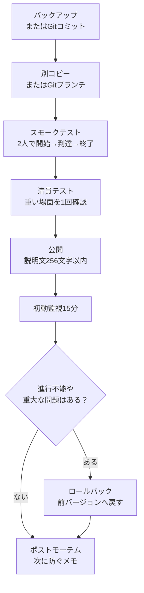

# 0 发布/托管/运营

> ―― 可玩的设计、可传达的说明、不破坏任何内容的更新

* 毫不犹豫地发布创建的模式，创建一条即使少数人也能轻松玩的路径。
* 规范标题、256字符以内的描述、缩略图、外部公告，防止解释遗漏。
* 拥有允许更新而不破坏任何内容的操作程序（备份/验证/发行说明/回滚）。

在Portal中，单纯以匿名个人模式自然流动是很难聚集人的。
请阅读本章，不是为了吸引大规模客户的方法，而是作为管理备忘录，帮助游客毫不犹豫地开始，并在玩完后知道在哪里解决问题。

# 1 发布前清单（30 秒版本）

* 标题：简短的专有名词 + 要做的事（示例：Checkpoint Rush — 终端启动 → 10 秒防御）
*描述：256 个字符或更少。如果可以的话，用英文短句只写出目的、人数和时间。
* 建议人数/时间：例如“8-16 人 / 10-15 分钟”
* 区域/车辆：指定是否退出
* 缩略图：在不塞满信息的情况下展示气氛和首先要去的地方的剪辑。
* 测试：开始 → 到达 → 完成有 2 种模式：2 人和满员
* 日志：记录版本号、更改以及发布日期和时间。

> 如果您不确定，请缩小范围为“目的”、“建议人数”、“所需时间”和“首先要按的内容”。说明最多可达 256 个字符，因此详细的常见问题解答和更新历史记录将发布到外部公告中。

## 发表前检查（实用版）

一旦通过了 30 秒的版本，请在发布前检查以下项目。

|检查项目|景点 |
| ---- | ---- |
|单人测试|自己开始、移动、到达并完成 |
|两人测试|如果只有一个人按下按钮，则双方都会出现所需的显示 |
|迟来的参与 |迟到的参与者可以毫不犹豫地重生并看到必要的 UI |
|离开|即使参与者离开，也并非无法继续|
|调动| UI 和 WorldIcon 在死亡或重生后不会崩溃 |
| UI 重新显示 |菜单和通知消失后，它们会在必要时重新出现 |
|长时间运行 |运行超过15分钟，SFX/FX和UI不再继续增加 |
|车辆数量 |同时不超过40辆车。结合永久车辆和活动车辆 |
|检查日志 | `PortalLog.txt` | 中没有错误或意外点击

“我自己可以工作，但是当我发布它时就崩溃了”这种情况往往发生在中途加入、离开或重新部署时。请不要在这里满足任何事情。现在检查 5 分钟比稍后哭泣要便宜。

# 2 说明模板（最多 256 个字符）

体验描述屏幕上没有创作者可以自由添加的标签。
此外，描述最多可达 256 个字符。
因此，Portal中的解释基本上都是“简短的英语”，而详细的日语解释则分为对外公告。

## 门户描述示例

```text
Checkpoint Rush. Press the center terminal, follow the objective icons, then defend the final zone for 10 seconds. Recommended 8-16 players. 10-15 min. Transport vehicles only.
```

此示例大约有 180 个字符。
即使它不超过 256 个字符，它也不是放置您希望人们阅读的所有信息的地方。
在门户中，仅传达目的、人数、时间和首次行动。

## 积分

*写“要做的事情”而不是“优势”。
* 消除玩家**最初的担忧（在哪里？按什么？多少分钟？）**。
* 对于社区来说，最好避免仅用日语进行解释。门户内提供了简短的英文文本，而详细的日文解释则发布在 X、Discord、Blog 和 Note 等外部公告中。
* 不要假设它会补充标签。假设没有创建者可以自由添加的标签，我们将通过标题、描述和缩略图来传达这一点。

# 3 主办运营：两大支柱：常设和活动
## 永久（随时播放）
* 目的：让游客有一种可以立即尝试的安全感。
*设置：短（10-15分钟），等待时间短，1-2张地图，即使在晚上也能轻松匹配。

## 活动（及时公布）

* 目的：与X/Discord等链接，让少数人更容易同时聚集。
* 设置：在预启动大厅中加入教程/演示（入口图标 → 开始按钮 → 1 分钟试用）。
* 模板公告：

“今天21:00~闯关点首次上线，8-16人/约12分钟，大厅按开始键→按照指示牌激活终端→目的地防守10秒，欢迎首次观看！”

# 4 缩略图和导体的“有效放置”

* 缩略图：不要包含信息，以便即使在小显示屏上也能看到。
* 指南：不要仅仅依赖 256 个字符的描述，而是在游戏开始时或第一个 InteractPoint 处通过 `OnGameStart` 提供简短指南。要在屏幕上显示的文本在 `Strings.json` 注册并在 `mod.Message(mod.stringkeys.xxx)` 调用。

缩略图不是“说明”。
如果图像尺寸很小，即使包含文本或详细地图，也不会被读取。
详细说明将发布在外部公告或游戏内简短展示中，并使用缩略图作为介绍。

# 5 “非破坏性更新”的基本流程（操作手册）

1. 备份：复制 ids.ts / config.ts / Script.ts / ui.ts / game.ts 和日期（例如 2025-10-28_v1.2/）。如果您使用 Git 进行管理，请在更新之前进行提交。
2. 验证分支：始终在单独的副本或 Git 分支中进行新的调整。
3.冒烟测试：2人开始→到达→结束。
4. 拥挤测试：创建一个AI/车辆/FX重叠的场景。
5. 发布：确保描述在256个字符以内，并将版本和摘要保持在必要的最低限度。
6. 15 分钟初步监控：是否存在提款率、滞后或无法进展的情况？
7. 回滚：如果发生错误，立即恢复到以前的版本（同时返回缩略图和描述中的版本符号）。
8.事后分析（5分钟即可）：记下发生了什么以及下次如何预防。



> 提示：优先考虑并仔细验证涉及 ID 的更新。 ID 错误往往会导致“无法工作”。

如果你能使用Git，历史管理会比手动复制更容易。
如果您将发布前状态保留为标记或像 `v1.2` 那样提交，您将不会对要恢复哪些文件感到困惑。
但是，请确保您还可以查看 Portal Web Builder 中注册的源代码 `dist/Script.ts` 和 `dist/Strings.json` 是根据哪个源代码创建的。

# 6 变革的“安全区”：从哪里开始修复它才不会崩溃？

* 安全第一：config.ts数字（防御秒数、冷却时间、推荐人数显示）
* 相对安全：ui.ts措辞/顺序（框架内的文字→地标→效果）
* 需要注意：添加/修改 ids.ts（使用 Vitest 检查 → 还使用 ObjIdManager 和 ledger 检查 Godot 端）
* 容易破解：在Script.ts/flow.ts中添加分支（需要回顾onceIn和Phase转变）

# 7 玩家常见问题解答（单独显示目的地）

并不总是可以在门户中放置很长的日语常见问题解答。
FAQ分为“外部公告中所写的内容”和“游戏中简要显示的内容”。

|显示位置 |适合的内容 |如何写|
| ---- | ---- | ---- |
| X / Discord / 博客 / 注释 |详细常见问题解答、更新原因、已知问题 |日语很好|
|门户说明|目的、所需时间、推荐人数 |最多256个字符，以英文为主 |
|游戏内用户界面 |下一步做什么 |将 `Strings.json` 中的密钥显示为 `mod.Message` |

如果您想在游戏中显示它，则现实的做法是仅在 `OnGameStart` 上显示一次初始指导，或者在按下启动 InteractPoint 后立即短暂显示它。
例如，一次只说一件事，例如“按中心终端”、“前往地标”或“在目的地防守”。

* 问：我如何开始？
  * A: 按大厅中央的 **终端 (E)** 开始。

* 问：地标消失了。
  * A：在关闭前一个地标的同时继续进行。如果没有标志，请检查附近的标志牌。

* 问：多少分钟？
  * A: 完成一圈需要10到15分钟。

# 8 如何收集反馈（最少集）

虽然人数很少，但玩完后立即在聊天中提问比准备表格或记分表更实用。
你付出的努力越多，你得到的答案就越少。

首先要问以下三件事就足够了。

*你在哪里迷路了？
* 哪些场景太长或太短？
* 你想再玩一次吗？

随着人数的增加，我使用“何时”、“何处”、“做什么”和“发生了什么”作为错误报告模板。
无需从一开始就假设表单操作。

# 9 防止错误和滥用的迷你指南

* 反复按启动按钮：始终按第 6 章中的油门（每秒一次）。
* 重复命中到达效果：单次通过+onceIn中的SFX冷却时间。
* 无法进行：紧急停止（禁用启动→大厅标志上显示“正在调整”→回滚到旧版本）。
* 破坏行为：在 Portal 标准功能范围内进行澄清，例如踢球、投票、团队锁定等（描述中的 1 行）。

# 10 外部发行说明（示例）

Portal 中没有地方可以编写足够的发行说明。
更改历史记录将保留在外部，例如 X、Discord、博客、Note、GitHub README 等中。
在 Portal 方面，我只在必要时编写版本和简短摘要。但是，描述最多可以有 256 个字符，因此不要使更新历史记录过于拥挤。

> v1.3 (2025-10-28)
> * 将目的地世界图标重新定位到更靠近入口的位置（以防止丢失视线）
> * 防御计数从 10 秒调整为 12 秒，SFX 现在有冷却时间
> * 门户描述更新为 8-16 名玩家
> 已知问题：运输车装满后可能会卡住（计划下个版本改进）

#11 出版后的“如何读数字”（简单版）

* 启动前退出率：大厅内是否有退出者？ → 查看解释并开始指导。
*达成率：进入→目的地到达率→图标位置及消息顺序。
* 完成率：你完成了吗？ → 使用 config.ts 微调防御秒数和敌人密度。
* 平均游戏时间：避免太长/太短（10-15 分钟是一个很好的指导）。

# 结论

*发表是体验的完成过程。设计、解释、指导、公告和更新都是**作品**。
* 最多 256 个字符的英文短句 + 30 秒检查，以防止发生无法传达信息的事故。
* 无损更新可以通过五个步骤修复：备份->验证->发布->监控->回滚。
*我们的目标不是假设大量的顾客，而是创造一种少数人可以毫不犹豫地玩的情况。
* 对于XP，根据情况可能会有限制，我会尽量用柔和的方式来表达。
