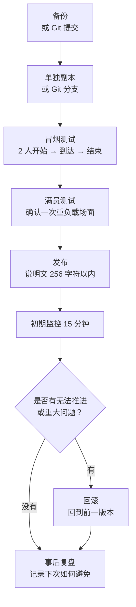

# 0 发布、托管与运营

> 能被游玩的设计、能被理解的说明、不会破坏模式的更新

* 让做好的模式可以安心发布，并整理出一条即使人数很少也容易开玩的导线。
* 将标题、256 字符以内的说明、缩略图和外部公告模板化，避免说明遗漏。
* 准备一套不会把模式更新坏的运营流程：备份、验证、发布说明、回滚。

在 Portal 里，默默发布一个无名的个人模式，然后只靠自然流量聚集玩家，是相当困难的。
本章不是讲大规模引流的方法，而是作为一份运营备忘录来阅读：让来到服务器的人能不迷路地开始，也让你在玩家游玩后知道该修哪里。

# 1 发布前检查清单（30 秒版）

* 标题：简短的专有名称 + 要做的事，例如：Checkpoint Rush — 启动终端 → 防守 10 秒
* 说明：256 字符以内。尽量用简短英文，只写目标、人数和时间。
* 推荐人数 / 时间：例如“8-16 players / 10-15 min”
* 区域 / 载具：明确写出是否出现
* 缩略图：不要塞满信息，选择能看出氛围和一开始该去哪里的画面
* 测试：用 2 人和满员两种情况跑通开始 → 到达 → 结束
* 日志：记录版本号、修改点和发布时间

> 犹豫时，只保留“目标”“推荐人数”“所需时间”“最先要按的东西”。说明最多只有 256 字符，详细 FAQ 和更新历史应放到外部公告里。

## 发布前检查（实务版）

通过 30 秒版后，发布前还要确认以下项目。

| 检查项目 | 要看的内容 |
| ---- | ---- |
| 单人测试 | 1 人可以从开始、移动、到达一路跑到结束 |
| 双人测试 | 只有一方按下按钮时，双方都能看到必要显示 |
| 中途加入 | 中途加入者能顺利生成，并看到必要 UI |
| 离开 | 参与者离开后，流程不会变成无法继续 |
| 重新部署 | 死亡或重新部署后，UI 和 WorldIcon 不会坏掉 |
| UI 再显示 | 菜单或通知消失后，会在必要场景再次显示 |
| 长时间运行 | 运行 15 分钟以上，确认 SFX/FX 和 UI 不会持续堆积 |
| 载具数量 | 同时不超过 40 台。常设载具和事件载具要合并计算 |
| 日志确认 | `PortalLog.txt` 中没有错误或意外的连按记录 |

“一个人测试时能跑，发布后却坏了”通常会发生在中途加入、离开、重新部署这些场景。这里不要偷懒。现在花 5 分钟确认，比之后哭着修便宜得多。

# 2 说明文模板（256 字符以内）

在体验说明画面中，创作者不能自由添加自定义标签。
另外，说明文最多只有 256 字符。
因此，Portal 内的说明以“简短英文”为基本原则，详细的中文或日文说明则放到外部公告里。

## Portal 内说明示例

```text
Checkpoint Rush. Press the center terminal, follow the objective icons, then defend the final zone for 10 seconds. Recommended 8-16 players. 10-15 min. Transport vehicles only.
```

这个示例大约 180 个字符。
即使还能塞进 256 字符，也不代表这里适合放下所有想让玩家阅读的信息。
在 Portal 内，只传达目标、人数、时间和最初行动即可。

## 要点

* 不写“优点”，而是写“要做什么”。
* 先消除玩家最初的不安：在哪里？按什么？要几分钟？
* 面向社区时，最好避免只写日语说明。Portal 内放简短英文，详细说明再分到 X、Discord、Blog、Note 等外部公告。
* 不要以为可以靠标签补充。先当作创作者没有可自由添加的标签，用标题、说明和缩略图来传达。

# 3 托管运营：常设与活动两根支柱
## 常设（随时可玩）
* 目标：让来到服务器的人能马上尝试，产生安心感。
* 设置：时间短一些（10-15 分钟）、缩短等待、地图 1-2 张、即使深夜也容易匹配的配置。

## 活动（限定时间并提前公告）

* 目标：配合 X / Discord 等平台，让少数玩家也能在同一时间聚在一起。
* 设置：在开始前大厅中加入教程或演示：入口图标 → 开始按钮 → 1 分钟体验。
* 公告模板：

“今晚 21:00，Checkpoint Rush 首次公开。8-16 人 / 约 12 分钟。大厅按开始按钮 → 跟随标记启动终端 → 在目标地点防守 10 秒。欢迎初次游玩！”

# 4 缩略图与导线的有效摆法

* 缩略图：为了在小尺寸显示时也能看清，不要塞入太多信息。
* 导线：不要只依赖 256 字符的说明文。可以在游戏开始时的 `OnGameStart`，或第一个 InteractPoint 处显示简短指引。画面上显示的文本注册到 `Strings.json`，再用 `mod.Message(mod.stringkeys.xxx)` 调用。

缩略图不是说明书。
在显示尺寸很小的地方，文字和详细地图即使放进去也没人看得清。
详细说明交给外部公告或游戏内的短提示，缩略图则当作入口来使用。

# 5 “不会破坏模式的更新”基本流程（运营手册）

1. 备份：按日期复制 ids.ts / config.ts / Script.ts / ui.ts / game.ts，例如 `2025-10-28_v1.2/`。如果使用 Git 管理，更新前先提交一次。
2. 验证分支：新的调整一定在单独副本或 Git 的单独分支上进行。
3. 冒烟测试：2 人跑通开始 → 到达 → 结束。
4. 满员测试：至少制造一次 AI / 载具 / FX 重叠的重负载场面。
5. 发布：确认说明文在 256 字符以内，版本和摘要保持最低限度。
6. 初期监控 15 分钟：确认是否有离开率过高、延迟、无法推进。
7. 回滚：出现异常时立刻回到前一版本，缩略图和说明里的版本标记也一起还原。
8. 事后复盘，5 分钟也可以：记录发生了什么，以及下次如何避免。



> 诀窍：涉及 ID 的更新要最优先、最仔细地验证。ID 错误很容易造成“完全不动”的问题。

如果能使用 Git，历史管理会比手动复制轻松得多。
把发布前状态保留为 `v1.2` 这样的标签或提交后，之后就不容易迷失“该还原哪些文件”。
不过，注册到 Portal Web Builder 的 `dist/Script.ts` 和 `dist/Strings.json` 也要能追溯到它们是由哪份源代码生成的。

# 6 修改的安全区：从哪里开始改比较不容易崩

* 最安全：config.ts 中的数值，例如防守秒数、冷却时间、推荐人数显示
* 相对安全：ui.ts 中的文案和顺序，只要仍在文字 → 标记 → 效果的框架内
* 需要小心：ids.ts 的新增和修改，要用 Vitest 检查，并在 Godot 侧用 ObjIdManager 和台账确认
* 容易出问题：Script.ts / flow.ts 的分支追加，必须重新检查 onceIn 和 Phase 转换

# 7 面向玩家的 FAQ（区分显示位置）

Portal 内不一定能直接放很长的日语 FAQ。
FAQ 要分成“写在外部公告里的内容”和“游戏内短暂显示的内容”。

| 显示位置 | 适合的内容 | 写法 |
| ---- | ---- | ---- |
| X / Discord / Blog / Note | 详细 FAQ、更新理由、已知问题 | 可以用日语 |
| Portal 内说明 | 目标、所需时间、推荐人数 | 以英文为主，256 字符以内 |
| 游戏内 UI | 下一步要做什么 | 用 `mod.Message` 显示 `Strings.json` 的键 |

如果要在游戏内显示，比较现实的做法是在 `OnGameStart` 只显示一次最初指引，或在按下开始用 InteractPoint 后立刻显示短提示。
例如“按下中央终端”“前往标记”“在目标地点防守”，一次只说一件事。

* Q：怎么开始？
  * A：按下大厅中央的 **终端（E）** 即可开始。

* Q：标记消失了。
  * A：前一个标记会在推进时关闭。没有显示时，请查看附近的看板。

* Q：大概要几分钟？
  * A：一轮大约 10-15 分钟。

# 8 收集反馈的方法（最小配置）

人数还少的时候，与其准备表单或统计表，不如在游玩后的闲聊中直接询问，这更现实。
回答越麻烦，愿意回答的人就越少。

一开始问下面三点就够了。

* 哪里迷路了？
* 哪个场面太长，或太短？
* 还想再玩一次吗？

人数增加后，可以把“什么时候”“在哪里”“做了什么”“发生了什么”作为 bug 报告模板。
不需要一开始就以表单运营为前提。

# 9 问题与滥用对策迷你指南

* 开始按钮连按：务必使用第 6 章的 throttle，限制为每秒 1 次。
* 到达演出连发：用 onceIn 做单向通过，并给 SFX 加冷却。
* 无法推进：紧急停止，禁用开始 → 在大厅看板显示“调整中” → 回滚到旧版本。
* 捣乱行为：在 Portal 标准功能范围内明确说明，例如踢出、投票、队伍锁定等，并在说明中写 1 行。

# 10 外部发布说明（示例）

Portal 内没有足够的位置写详细发布说明。
修改历史应放在 X、Discord、Blog、Note、GitHub README 等外部位置。
Portal 侧如有需要，只写版本或简短摘要即可。不过说明文最多 256 字符，不要硬塞更新历史。

> v1.3（2025-10-28）
> * 将目标地点的 WorldIcon 移到更靠近入口的位置，防止玩家看丢
> * 防守计数从 10 秒调整为 12 秒，并给 SFX 加上冷却
> * Portal description updated to 8-16 players
> 已知问题：满员时运输载具可能会卡住，计划在下一版改善

# 11 发布后数字的看法（简单版）

* 开始前离开率：玩家是否在大厅离开？→ 重新检查说明和开始导线。
* 到达率：入口 → 目标地点的到达比例 → 检查图标位置和消息顺序。
* 完成率：是否能跑到最后？→ 用 config.ts 微调防守秒数和敌人密度。
* 平均游玩时间：避免过长或过短，10-15 分钟是大致标准。

# 结论

* 发布是体验的完成工序。设计、说明、导线、公告和更新都属于作品的一部分。
* 256 字符以内的英文短句 + 30 秒检查，可以减少“没有传达到”的事故。
* 不破坏模式的更新流程固定为五步：备份 → 验证 → 发布 → 监控 → 回滚。
* 不要一开始就假设大规模引流，先把少数玩家也能不迷路地游玩的状态做好。
* XP 可能会因情况受到限制，因此相关表达要保持柔和。
