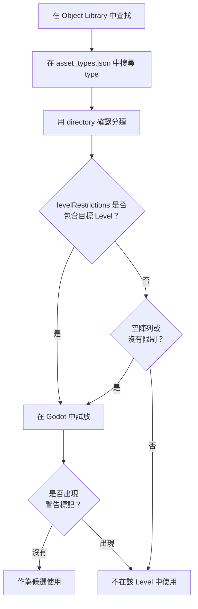

本章會整理「可以放置的東西來自哪裡」「哪些地圖可以放哪些東西」「哪些物件會影響遊戲行為」等問題，並把 Godot 中的實際實體（`.tscn`）和 Portal 側的名稱對應起來。最終目標是準備到這樣一種狀態：後續的規則設計和 TypeScript 實作可以引用和控制這些物件，也就是已經賦予 ID，並整理成台帳。

:::message
查找可放置物件時，也可以搭配使用 [BF6 Object Guide](https://bf6-book.orizika.com/)。
這是一個可放置物件列表網站，可以依地圖、標籤和關鍵字搜尋來篩選候選物件。
在 Godot 或 `asset_types.json` 中做最終確認之前，先用它來尋找候選物件，可以減少手動翻找 Object Library 的時間。
:::

# 1「可以放置的東西」的本質：`res://objects` 與地圖依賴

**地圖上可以放置的物件，僅限於 Godot 檔案系統 `res://objects` 內的物件。** 此外，**根據以哪張地圖為基礎進行編輯，可放置物件的範圍也會受到限制。** **截至 2026 年 7 月 1 日，手頭的 Portal SDK（版本：1.3.3.0）結構如下。**

SDK 可能會隨著更新而改變結構。開始作業前，請確認 SDK 根目錄下的 `sdk.version.json`。如果與本書不同，請優先參考 SDK 內的 `docs/pages/spatial_editor.html` 和 `code/types/mod/index.d.ts`。

Godot 的實際資料夾範例：
`res://objects/entities`、`res://objects/gameplay`、`res://objects/fx`、`res://objects/props`、`res://objects/nature`、`res://objects/architecture`、`res://objects/roads` 等。

另外，`asset_types.json` 的 `directory` 中可能會出現 `Gameplay/Common` 這樣混有大寫字母的分類名。
請把它理解為資產分類。實際在 Godot 中查找檔案時，要按照實際資料夾名確認，例如 `res://objects/gameplay/common`。

這裡最重要的是，不要只根據資料夾名判斷能不能使用。
某個資產最終能不能放置，要透過 SDK 內的 `asset_types.json` 和編輯器上的警告來確認。
如果放置瞬間出現如下警告標記，就應認為它不能在目前基礎地圖中使用。


## 用 `asset_types.json` 確認 Level 限制

資產的地圖限制可以從 SDK 內的 `FbExportData/asset_types.json` 確認。
不要只根據 Object Library 中是否看得到來判斷。拿不準時，請搜尋這個檔案。

需要看的，是各資產定義中的以下 3 項。

| 項目 | 含義 |
| ---- | ---- |
| `type` | 物件名。在 Godot 或 Object Library 中查找時使用的名稱 |
| `directory` | 該資產所在的資料夾 |
| `levelRestrictions` | 可以設定的 Level 名稱列表 |

例如，`AAGun_01` 的定義如下。

```json
{
  "type": "AAGun_01",
  "directory": "Props",
  "levelRestrictions": [
    "MP_Battery"
  ]
}
```

這種情況下，可以理解為 `AAGun_01` 是 `Props` 下的資產，並且被限制為面向 `MP_Battery`。
另一方面，`AI_Spawner`、`AreaTrigger`、`WorldIcon`、`VehicleSpawner` 等遊戲規則用資產，在手頭 SDK 中是 `levelRestrictions: []`。
SDK 1.3.1.0 中，`VehicleSpawner` 相關屬性名從 `DisableRespawn` 變為 `EnableRespawn`，預設值也變為 `true`。從舊筆記或範本移植時，請把它理解為「啟用重生」的標誌，而不是「停用重生」的標誌。
空陣列或沒有限制項的物件，可以作為通用候選，但仍以 SDK 更新後的內容和編輯器側警告為準。

實務中，按下面順序確認比較安全。

1. 在 Object Library 中查找目標資產名。
2. 在 `asset_types.json` 中搜尋 `type`。
3. 用 `directory` 確認放置位置。
4. 確認 `levelRestrictions` 中是否包含正在編輯的 Level 名稱。
5. 放到 Godot 中試放，確認是否出現警告標記。



資料夾名、官方 Level Name、Map ID 可能並不一致。
SDK 的 `docs/pages/spatial_editor.html` 和 `FbExportData/level_info.json` 中，可用 Level 整理如下（截至 2026 年 7 月 1 日，SDK 1.3.3.0）。

| 官方 Level Name | Map ID |
| ---- | ---- |
| Siege of Cairo | MP_Abbasid |
| Empire State | MP_Aftermath |
| Bellum1988's Operation Metro | MP_Aftermath_Portal |
| Blackwell Fields | MP_Badlands |
| Iberian Offensive | MP_Battery |
| Liberation Peak | MP_Capstone |
| Contaminated | MP_Contaminated |
| Manhattan Bridge | MP_Dumbo |
| Eastwood | MP_Eastwood |
| Operation Firestorm | MP_Firestorm |
| Golf Course | MP_Granite_ClubHouse_Portal |
| Downtown | MP_Granite_MainStreet_Portal |
| Marina | MP_Granite_Marina_Portal |
| Area 22B | MP_Granite_MilitaryRnD_Portal |
| Redline Storage | MP_Granite_MilitaryStorage_Portal |
| Defense Nexus | MP_Granite_TechCampus_Portal |
| Complex 3 | MP_Granite_Underground_Portal |
| Saint's Quarter | MP_Limestone |
| New Sobek City | MP_Outskirts |
| Cairo Bazaar | MP_Plaza |
| Portal Sandbox | MP_Portal_Sand |
| Hagental Base | MP_Subsurface |
| Railway to Golmud | MP_GolmudRailway |
| Mirak Valley | MP_Tungsten |

註：官方 docs 的 Available Levels 表中寫作 `MP_Firestorm`，但手頭 SDK 的 `asset_types.json` 和 Godot 的 level 檔案中也使用 `MP_FireStorm`。搜尋 `levelRestrictions` 時，請優先使用 SDK 實際資料中的寫法。
註：`MP_Granite_ClubHouse_Portal` 的官方 Level Name 是 `Golf Course`。實際使用時，請確認 `asset_types.json` 的 `levelRestrictions` 和 Godot 上的警告顯示。
註：SDK 1.3.3.0 新增了社群地圖 `MP_Aftermath_Portal` 和 Spatial Editor 用的 `MP_Plaza`。來自 `MP_Plaza` 的執行時生成候選，也以 `RuntimeSpawn_Plaza` 的形式加入了型別定義。

例如，以 `MP_Aftermath`（Empire State）為基礎進行編輯時，可以把 `asset_types.json` 中 `levelRestrictions` 為空，或包含 `MP_Aftermath` 的資產作為候選。
即使在 Object Library 或 Godot 上看得到，如果 `levelRestrictions` 中沒有目標 Level，也無法在實際遊戲內使用或顯示。

## `RuntimeSpawn_...` 是可以從程式碼生成的候選

查看 `code/types/mod/index.d.ts`，會看到 `RuntimeSpawn_Common`、`RuntimeSpawn_Abbasid`、`RuntimeSpawn_Aftermath` 等 enum。
這些不是在 Godot 的 Object Library 中手動放置的列表，而是可以透過 TypeScript 的 `mod.SpawnObject(...)` 在執行時生成的 Prefab 候選。

```ts
const obj = mod.SpawnObject(
  mod.RuntimeSpawn_Common.AreaTrigger,
  mod.CreateVector(0, 0, 0),
  mod.CreateVector(0, 0, 0),
  mod.CreateVector(1, 1, 1)
);
```

`RuntimeSpawn_Common` 是較容易在多個 Map 中使用的通用類，`RuntimeSpawn_Abbasid`、`RuntimeSpawn_Plaza` 等帶有 Map 名稱的內容，則理解為來自該 Map 的候選。
不過，如果目標物件不支援，`SpawnObject` 的回傳值可能會變成 `-1`。
另外，由程式碼生成的物件和 Godot 中手動放置的 `ObjId` 台帳是分開管理的。使用時，請分別記錄「手動 ID」和「執行時生成」。
SDK 1.3.3.0 已刪除 `EnableSpatialObject`。如果想在遊玩中途新增或移除物件，請以 `SpawnObject` 和 `UnspawnObject` 為前提來設計。

## 實務上的判斷標準

* 與遊戲規則相關的物件，優先在 `res://objects/gameplay` 和 `res://objects/entities` 中查找。
* 外觀和小道具類資產，要先確認 `asset_types.json` 的 `levelRestrictions`，再試放，確認警告標記，只保留可用的物件。
* 在 Object Library 中找到的資產，要和 `asset_types.json` 的 `type` 對照。`levelRestrictions` 中沒有正在編輯的 Level 名稱時，即使在 Godot 中可見，也無法在實際遊戲內使用或顯示。
* `Static` layer 中包含的地形和烘焙好的資產，目前不是編輯對象。
* 縮放只使用統一縮放。分別拉伸 X/Y/Z 的非統一縮放並不被官方推薦。

# 2 會影響行為的「機關類」物件總覽

不同於只影響外觀的小道具，參與遊戲行為、事件、範圍、UI 等的重要物件，主要集中在 `res://objects/entities` 和 `res://objects/gameplay` 中。下面按 Godot 路徑、作用和常見組合整理代表性物件。

## SpawnPoint（玩家出生點的關鍵）

* 實體：`res://objects/entities/SpawnPoint.tscn`
* 作用：定義玩家的出生位置。
* 常用組合：
  `res://objects/gameplay/common/HQ_PlayerSpawner.tscn`（各隊的 HQ 出擊）
  `res://objects/gameplay/common/PlayerSpawner.tscn`（從腳本直接出擊）
* 重要：`SpawnPoint` 單獨不會形成範圍。它需要被 1 個以上的 `HQ_PlayerSpawner` / `PlayerSpawner` 關聯，才會決定玩家實際可以出生的位置。
* `PolygonVolume` 不是給 SpawnPoint 用的，而是用於指定 `CombatArea` 或 `AreaTrigger` 的範圍。
* 實務要點：根據是隊伍專用，還是從腳本直接出擊，選擇 `HQ_PlayerSpawner` / `PlayerSpawner`。ID 在屬性中手動設定（初始值 -1）。把 SpawnPoint 本體和配套物件（HQ/PlayerSpawner）的 ID 系列分開，規則側會更容易閱讀。

## AI 生成與路徑

* AI 生成：`res://objects/gameplay/ai/AI_Spawner.tscn`
* AI 路徑：`res://objects/gameplay/ai/AI_WaypointPath.tscn`

## AreaTrigger（進入與退出偵測）

* 實體：`res://objects/gameplay/common/AreaTrigger.tscn`
* 作用：把進入 / 離開事件化。
* 組合：用 Godot `PolygonVolume` 定義範圍。
* 實務要點：高度（Y）不足是禁忌。玩家能跳出厚度的範圍不合格。把 ID 與演出（FX/SFX）或得分加算一對一關聯，並在台帳中寫上「AreaTrigger ID -> 呼叫物件」，規則實作時就不會迷路。

## CapturePoint（可以佔領的目標點）

* 實體：`res://objects/gameplay/conquest/CapturePoint.tscn`
* 作用：隊伍爭奪的據點。可以處理擁有隊伍、佔領進度、佔領開始 / 完成 / 丟失事件。
* 組合：把 Godot `PolygonVolume` 設定為 `CaptureArea`。需要時也可以使用 `AdditionalCaptureArea`。
* 實務要點：如果只是單純進入判定，`AreaTrigger` 就足夠。需要處理擁有隊伍、佔領時間、佔領進度、從據點出擊時，使用 `CapturePoint`。

`CapturePoint` 不是範圍感測器，而是「遊戲模式上的目標」。
TypeScript 側可以用 `mod.GetCapturePoint(id)`、`mod.GetCaptureProgress(...)`、`mod.GetCurrentOwnerTeam(...)`、`mod.SetCapturePointOwner(...)` 等讀取或修改狀態。

## Bomb / MCOM（Obliteration 系炸彈目標）

SDK 1.3.3.0 為 Obliteration 新增了 `Bomb` 型別，以及和 Bomb 連動的 M-COM 設定。
Bomb 可以放在 Spatial Editor 中，也可以用 `mod.SpawnObject(mod.RuntimeSpawn_Common.Bomb, ...)` 生成。

TypeScript 側用 `mod.GetBomb(id)` 取得，並透過 `mod.GiveBombToPlayer(...)`、`mod.ForceBombDrop(...)`、`mod.ForceBombReset(...)`、`mod.SetBombTeam(...)`、`mod.SetBombDropFuseTime(...)` 等函數控制。
M-COM 側使用 `mod.SetMCOMArmType(mod.GetMCOM(id), mod.MCOMArmType.Bomb)` 後，就可以把目標設為只有 Bomb 攜帶者才能安裝。

## MovingPlatform（移動平台）

SDK 1.3.3.0 新增了面向移動平台的 `MovingPlatform` 資產。
範例中會用 `SpawnObject` 生成 `BarrierStoneBlock_01_H_PortalPlatform`，或在 Godot 中手動放置並賦予 ObjId，再透過 `MoveObjectOverTime` 或 `OrbitObjectOverTime` 移動。

玩家會站上去的平台，不只是外觀在動，接觸和同步也很重要。
與其強行移動普通裝飾物，不如選擇支援 MovingPlatform 的資產，並把移動距離、週期、反轉、停止時機寫進台帳。

## VL7Cloud（毒氣雲 / 特殊效果區域）

* 實體：`res://objects/gameplay/common/VL7Cloud.tscn`
* 作用：類似毒氣雲的特殊效果區域。可以統一切換畫面效果、士兵效果、VFX。
* 組合：它不像 `AreaTrigger` 或 `CapturePoint` 那樣另行關聯 `PolygonVolume`，而是放置 VL7Cloud 本身來使用。
* 實務要點：用於毒氣、煙霧、視野妨礙、特殊區域等「地點本身帶有效果」的表現。不要用於單純的目標判定或開關範圍。

TypeScript 側用 `mod.GetVL7Cloud(id)` 取得，並用 `mod.SetVL7CloudEffects(cloud, screenEffect, soldierEffect, visualEffect)` 切換效果。
進入 / 離開可以用 `OnPlayerEnterVL7Cloud` / `OnPlayerExitVL7Cloud` 接收。

## 範圍類物件的區分

`AreaTrigger`、`CapturePoint`、`VL7Cloud` 都與「進入範圍的玩家」有關。
不過，它們的用途相當不同。

| 目的 | 使用物件 | 理由 |
| ---- | ---- | ---- |
| 終點判定、商店範圍、陷阱、事件開始地點 | `AreaTrigger` | 只需要把進入 / 離開連接到自己的邏輯 |
| A 據點、B 據點、佔地、按擁有隊伍改變處理 | `CapturePoint` | 可以使用佔領進度、擁有隊伍、佔領事件 |
| 毒氣、特殊煙霧、帶有畫面效果或士兵效果的區域 | `VL7Cloud` | 範圍本身可以帶專用效果 |

拿不準時，先從 `AreaTrigger` 考慮。
如果需要「佔領」或「擁有隊伍」這些概念，就用 `CapturePoint`；如果想放置毒氣雲或特殊效果本身，就用 `VL7Cloud`。

## CombatArea（可遊玩區域）

* 實體：`res://objects/gameplay/common/CombatArea.tscn`
* 作用：指定可遊玩範圍，離開範圍時套用警告、傷害等。
* 組合：用 Godot `PolygonVolume` 定義範圍。
* 實務要點：外圍要稍微放寬，例外區域局部處理。測試時重點檢查「無法返回而卡住」的情況。

## DeployCam（部署畫面的俯瞰）

* 實體：`res://objects/gameplay/common/DeployCam.tscn`
* 作用：調整整張地圖俯瞰顯示的位置和角度。
* 實務要點：不設定它的話，出擊前後的地圖顯示會不正常，所以一定要設定。

## HQ / Player Spawner（出生規則的差異）

* HQ 專用：`res://objects/gameplay/common/HQ_PlayerSpawner.tscn`
  分配給隊伍使用的標準 HQ 出擊用 Spawner。想為各隊建立出擊位置時使用它。
* 直接出擊用：`res://objects/gameplay/common/PlayerSpawner.tscn`
  不帶 HQ 的替代 Spawner。不分配給隊伍，適合從腳本讓任意玩家出擊。
* 兩種 Spawner 都必須關聯 1 個以上 `SpawnPoint` 後，才會作為出生位置發揮作用。
* 實務要點：想避免誤出生就採用 HQ 用。想用腳本控制任意出擊就採用 PlayerSpawner。混用時要明確分開 ID 段。

## InteractPoint（操作起點）

* 實體：`res://objects/gameplay/common/InteractPoint.tscn`
* 作用：靠近時顯示，按下按鈕時觸發事件。
* 實務要點：為了讓 **「按下 -> 發生什麼」** 直接連接到規則，請使用有意義的 ID，例如 Start=500 / Shop=501。

## Sector（突破類玩法的核心）

* 實體：`res://objects/gameplay/common/Sector.tscn`
* 作用：追加扇區概念。像突破模式那樣構成「推進與後退的階段」。
* 包含概念：`Advance Area` / `Retreat Area` / `Capture Points` / `Sector Area`
* 實務要點：多個區域要無矛盾地重疊。按概念整理 ID，規則側的階段控制會更容易寫。

## StationaryEmplacementSpawner（固定武器）

* 實體：`res://objects/gameplay/common/StationaryEmplacementSpawner.tscn`
* 作用：定義固定武器的出現位置和內容。
* 實務要點：注意視野、受擊路線、掩體的物理干涉。用 ID 保留「撤去 / 重新配置」的控制空間。

## CombatArea 的 SurroundingVolume（HQ 的防線）

* 實體：`res://objects/gameplay/common/CombatArea.tscn`
* 作用：透過 `CombatArea` 的 `SurroundingVolume`，在征服類玩法中設定 HQ 周圍的周邊區域，限制敵人進入。
* 補充：這不是名為 `SurroundingCombatArea.tscn` 的獨立可放置物件。請設定 `CombatArea` 的 `CombatVolume` / `ExclusionVolume` / `SurroundingVolume` 使用。
* 實務要點：只在 HQ 附近加強。擴得太大，進攻方會失去行動空間。

## VehicleSpawner（載具生成）

* 實體：`res://objects/gameplay/common/VehicleSpawner.tscn`
* 作用：定義載具的出現位置和種類。
* 實務要點：出現後不要立刻接觸物體，要朝向前進方向，並按常設與事件分開 ID 段（例：2001=常設，2090 段=事件）。

## VehicleResupplyStation（載具補給）

SDK 1.3.3.0 也新增了面向載具的 `VehicleResupplyStation` 資產。
把它作為配置候選時，請同時確認載具進入路線、補給中不會堵住的餘白，以及周邊的戰鬥壓力。

## WorldIcon（目標路標）

* 實體：`res://objects/gameplay/common/WorldIcon.tscn`
* 作用：隔牆也能看到的標記。說明文字、擁有隊伍、顯示 / 隱藏都可以由規則控制。
* 實務要點：放在 **目的地的稍前方**，就會和動線一致。ID 要盡早確定（例：21、22……）。

## FX（視覺效果）

* 實體：以 `FX_****.tscn` 的形式存在於多個資料夾中
* 作用：顯示煙火、爆炸等效果表現
* 實作要點：使用強光或閃爍類效果時，要注意避免造成強烈的光敏刺激。

## SFX（聲音效果）

* 實體：以 `SFX_****.tscn` 的形式存在於多個資料夾中
* 作用：播放煙火聲、爆炸聲等聲音表現
* 實作要點：放太多會很吵。

# 3 放置的實務流程（ID、台帳、相容檢查）

實際作業如果落到下面流程，失誤會大幅減少。

1. 決定基礎 Level
  如下圖所示，存在 Level 列表。複製符合目的的基礎 Level，然後雙擊複製後的 Level 展開它。


*Level 列表*


*複製後，建立了名為「MP_Test_Granite_ClubHouse_Portal.tscn」的 Level*


*雙擊開啟 Level*

2. 提取可放置候選
  首先，從 `res://objects/gameplay` / `res://objects/entities` 中選擇與遊戲規則相關的物件。
  如果有在意的資產，請在 `FbExportData/asset_types.json` 中搜尋 `type`，確認 `directory` 和 `levelRestrictions`。
  外觀和小道具類資產，要先確認 `levelRestrictions`，再試放，透過警告標記確認相容性後再保留。

3. 放置的同時賦予 ID
  像圖中一樣，在 **Obj Id 欄** 中手動輸入。ID 不要重複。遵守系列劃分（例：Spawn=1000 段 / Vehicle=2000 段……）。
  TypeScript 實作不會引用或控制的物件（椅子等環境物件），保持初始值 -1 即可。


*在 Obj ID 欄中設定物件 ID*

## ObjId 台帳模板

ID 如果只在 Godot 上管理，之後一定會迷路。至少請準備如下台帳。

台帳可以是 Excel、Google Sheets、Markdown 表、CSV，哪種都可以。
重要的不是工具，而是把 `ObjId`、用途、Godot 物件、TypeScript 取得函數、測試結果放在同一個地方管理。

:::message
如果手動管理台帳變得辛苦，也可以考慮使用 [hekaron/ObjIdManager](https://github.com/hekaron/ObjIdManager)。
這是面向 Battlefield Portal SDK 的 Godot 環境製作的 ObjId 管理外掛，可以顯示 Node3D 的 `ObjId` 列表、高亮重複值、自動連續編號、匯出為 TypeScript 格式等。
本書先用台帳掌握思路，但當放置物件增加時，使用這類工具會更容易減少確認遺漏和重複 ID。
程式碼側的 `ids.ts` 用 Vitest 確認，Godot 側的實際放置用 ObjIdManager 或台帳確認，這樣分工會更安全。
:::

| 用途 | ObjId | Godot 物件 | TypeScript 取得函數 | 測試結果 | 備註 |
| ---- | ---- | ---- | ---- | ---- | ---- |
| 開始按鈕 | 500 | InteractPoint | `mod.GetInteractPoint(500)` | 未確認 | 大廳中央 |
| 入口引導 | 21 | WorldIcon | `mod.GetWorldIcon(21)` | 未確認 | 初始顯示 |
| 目的地引導 | 22 | WorldIcon | `mod.GetWorldIcon(22)` | 未確認 | 開始後顯示 |
| 目的地判定 | 11 | AreaTrigger | `mod.GetAreaTrigger(11)` | 未確認 | 高度要足夠 |
| 成功 FX | 901 | VFX | `mod.GetVFX(901)` | 未確認 | 到達時播放 |
| 成功 SFX | 951 | SFX | `mod.GetSFX(951)` | 未確認 | 注意不要播放過多 |

台帳中的「測試結果」在剛放置後先寫「未確認」。測試能執行就改成「OK」，壞了就改成「需修正」。只做這件事，也能減少遺漏。

4. 最終確認相容性和碰撞
  有 `levelRestrictions` 的物件，要再次確認是否出現警告。
  測試高度（Y）是否導致空中出生或陷入地面，Spawn / Vehicle 周圍是否有足夠餘地。

:::message
實務 Tips：這不是官方 docs 明確寫出的必需步驟，但在物件放置前後確認地形、地板碰撞、碰撞狀態，可以減少放置物陷入地面、略微浮起、載具卡住等事故。
:::

5. 建立地圖資料
  右下角有 BFPortal 欄，點擊其中的「Portal Setup」按鈕。稍等後，會顯示「Completed setup」。
  接著點擊「Export Current Level」按鈕。這樣會生成名為 `Level名.spatial.json` 的檔案。生成位置是從 Portal 專案儲存資料夾層級來看，位於 `*Portal儲存位置*\export\levels`。
  註：點擊「Open Exports...」按鈕，會開啟檔案總管並顯示位置。


*BFPortal 欄*


*點擊「Portal Setup」按鈕後的顯示*


*點擊「Export Current Level」按鈕後的顯示*


6. 將地圖資料註冊到 Portal
  將製作好的地圖資料註冊到 Portal。
  如下圖所示，移動到 Portal 建立畫面的地圖輪換欄，選擇與準備好的 Level 相同的地圖。然後註冊製作好的資料檔案。


*Portal 建立畫面（地圖輪換）*


*地圖資料設定*


*確認是否附加地圖資料*


到這裡完成後，下一章的規則設計和後續 TypeScript 實作就能立刻引用、立刻控制。**「放了但不動」的 9 成原因，是 ID 仍為 -1、ID 重複，或台帳遺漏。**


# 4 最小設定範例（到動作確認為止）

下面用實務步驟，給出最短「放置並讓它動起來」的極小構成。
這裡先只準備 Team1 / Team2 的出生、開始按鈕、標記、簡單演出的核心。

* 出生點：設定 `HQ_PlayerSpawner` 或 `PlayerSpawner`，並關聯 1 個以上 `SpawnPoint`。
* 開始按鈕：把 `InteractPoint`（ID:500）放在大廳中。高度要便於從正面按下。
* 標記：放置 2 個 `WorldIcon`（ID:21 / 22）。分別放在入口稍前方和目的地稍前方。
* 演出：把 `FX`（ID:901）和 `SFX`（ID:951）放在目的地。
* 偵測：用 `AreaTrigger`（ID:11）偵測進入目的地。`PolygonVolume` 要給足高度。
* 台帳：1001/1002=各陣營出生，500=開始，21/22=標記，11=進入偵測 -> 啟動 901/951

以這個狀態儲存，啟動測試，目視確認出生 -> 按下按鈕 -> 進入範圍 -> 演出這一串流程。
下一章會嘗試組合下面這樣的流程。

1. 以按下 `InteractPoint`（ID:500）為觸發。
2. 將引導從 `WorldIcon`（ID:21）切換到 `WorldIcon`（ID:22）。
3. 用 `AreaTrigger`（ID:11）讓 `FX`（ID:901）和 `SFX`（ID:951）動作。

在自己的專案中，請務必把 Godot 中編輯的 `.tscn` 和註冊到 Portal Web Builder 的 `.spatial.json` 成套管理。
只有 `.tscn` 無法反映到 Portal 側，只有 `.spatial.json` 又很難追蹤之後的編輯內容。
檔名中加入基礎 Map ID、用途、日期或版本號，可以防止重新部署時拿錯。

# 結論：要做的只有三件事

地圖編輯器中要做的事，歸根結底就是下面三點。

(1) 正確選擇可以放置的「實體」（基礎 Level + 相容的通用物件）
(2) 放置後立刻手動賦予不是 -1 的 ID（系列劃分並整理成台帳）
(3) 按規定步驟組合使用 Godot 關聯（`PolygonVolume` 等）的機關類物件。

只要這三點做好，後續規則設計和 TypeScript 實作中的引用、控制就會比較順利地動作。

---

📘 **下一章「規則設計入門（讓配置『動起來』之前先思考）」** 會把剛才賦予 ID 的 `SpawnPoint` / `AI_Spawner` / `AI_WaypointPath` / `AreaTrigger` / `CombatArea` / `DeployCam` / `HQ` / `PlayerSpawner` / `InteractPoint` / `Sector` / `StationaryEmplacementSpawner` / `VehicleSpawner` / `WorldIcon` / `FX` / `SFX`，用事件和條件連接起來。一開始會從 **「開始按鈕（InteractPoint 500）-> 更新標記（WorldIcon 21 -> 22）-> 進入目的地（AreaTrigger 11）時啟動 FX/SFX（901/951）」** 這個最小循環開始，再逐步發展成複合事件。
