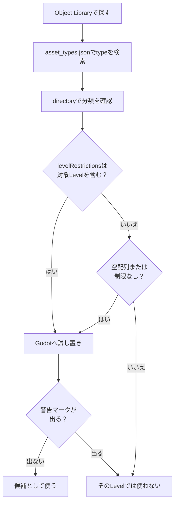

在本章中，我們將透過匹配 Godot 實體（`.tscn`）和 Portal 的名稱來組織「可以放置的東西從哪裡來？」「什麼地圖可以放置什麼？」和「與操作相關的重要物體有哪些？」等問題。最後，我們將準備一個可以從後續規則設計和TypeScript實作中引用和控制的表單（=指派的ID和帳本狀態）。

# 1 「可以放置的東西」的真正本質：「res://objects」和地圖依賴

**可以放置在地圖上的物件必須位於 Godot 的檔案系統 `res://objects`** 中。此外，根據您編輯的地圖，可放置的物件範圍也有限制。 ** **截至2026年4月21日，現有的Portal SDK（版本：1.2.3.0）配置如下**。

SDK的配置可能會因更新而改變。在開始工作前，先查看SDK下的`sdk.version.json`，如果與本文檔不同，請優先考慮SDK中的`docs/pages/spatial_editor.html`和`code/types/mod/index.d.ts`。

Godot真實資料夾範例：
`res://objects/entities`、`res://objects/gameplay`、`res://objects/fx`、`res://objects/props`、`res://objects/nature`、`res://objects/architecture`、`res://objects/roads`、`res://objects/architecture`、`res://objects/roads` 等。

另外，`Gameplay/Common`等大寫字母混合的分類名稱可能會出現在`asset_types.json`的`directory`中。
將其視為資產分類，並在 Godot 中找到實際文件時，根據實際資料夾名稱進行檢查，例如 `res://objects/gameplay/common`。

這裡重要的一點是“資料夾名稱本身並不能決定它是否可以使用。”
檢查 SDK 中的 `asset_types.json` 以及編輯器上的警告，看看是否最終可以放置資源。
如果在放置時出現如下所示的警告標記，請考慮它不能與該底圖一起使用。


## 檢查等級限制 `asset_types.json`

您可以在 SDK 中的 `FbExportData/asset_types.json` 查看資產的地圖限制。
不要僅根據物件庫中是否可見來判斷；如果有疑問，請搜尋該文件。

每個資產定義需要考慮三個面向：

|項目 |意義|
| ---- | ---- |
| `type` | `type` |物件名稱。在 Godot 或物件庫中搜尋時的名稱 |
| `directory` | `directory` |包含資產的資料夾 |
| `levelRestrictions` | `levelRestrictions` |可安裝的關卡名稱清單 |

例如，`AAGun_01` 定義為：

```json
{
  "type": "AAGun_01",
  "directory": "Props",
  "levelRestrictions": [
    "MP_Battery"
  ]
}
```

在這種情況下，`AAGun_01` 可以讀取為 `Props` 下的資產，該資產僅限於 `MP_Battery`。
另一方面，遊戲規則資源（例如 `AI_Spawner`、`AreaTrigger`、`WorldIcon` 和 `VehicleSpawner`）在 SDK 中被重新命名為 `levelRestrictions: []`。
空數組和沒有限制項的數組是通常可用的候選數組，但優先考慮 SDK 更新和編輯器端警告顯示。

實際上，按以下順序檢查是安全的。

1. 在物件庫中搜尋所需的資源名稱。
2. 在 `asset_types.json` 中搜尋 `type`。
3. 檢查 `directory` 的位置。
4. 檢查 `levelRestrictions` 是否包含正在編輯的 Level 名稱。
5. 將其放在Godot 上，檢查是否出現警告標記。



資料夾名稱、官方關卡名稱和地圖 ID 可能不符。
在 SDK `docs/pages/spatial_editor.html` 中，可用等級的組織如下（截至 2026 年 4 月 21 日，SDK 1.2.3.0）。

|官方等級名稱 |地圖ID |
| ---- | ---- |
|開羅圍城| MP_阿拔斯 |
|帝國大廈 | 國會議員_後果|
|布萊克威爾場| MP_荒地 |
|伊比利亞攻勢 | MP_電池|
|解放峰| MP_Capstone |
|污染| MP_污染 |
|曼哈頓大橋| MP_小飛象 |
|伊斯特伍德 | MP_伊斯特伍德 |
|火焰風暴行動 | MP_Firestorm |
|高爾夫球場 | MP_Granite_ClubHouse_Portal |
|市中心 | MP_Granite_MainStreet_Portal |
|碼頭 | MP_Granite_Marina_Portal | MP_Granite_Marina_Portal |
| 22B區| MP_Granite_MilitaryRnD_Portal | MP_Granite_MilitaryRnD_Portal |
|紅線儲存| MP_Granite_MilitaryStorage_Portal | MP_Granite_MilitaryStorage_Portal |
|國防關係| MP_Granite_TechCampus_Portal |
|綜合大樓 3 | MP_Granite_Underground_Portal | MP_Granite_Underground_Portal |
|聖區 | MP_石灰石 |
|新索貝克市| MP_郊區 |
|門戶沙盒 | MP_Portal_Sand | MP_傳送門_沙子
|哈根塔爾基地 | MP_地下 |
|米拉克谷| MP_鎢 |

* 在官方文件的Available Levels表格中，寫為`MP_Firestorm`，但在本地SDK中`asset_types.json`和Godot的level檔案中，也使用`MP_FireStorm`。搜尋`levelRestrictions`時，優先考慮SDK中的實際資料表示法。
*`MP_Granite_ClubHouse_Portal` 是官方等級名稱 `Golf Course`。實際使用時請查看`asset_types.json`、`levelRestrictions`以及Godot上的警告顯示。

例如，當基於「`MP_Aftermath` (Empire State)」進行編輯時，包含 `asset_types.json`（其中 `levelRestrictions` 為空）或 `MP_Aftermath` 的資源將被視為候選資源。
即使它在物件庫或Godot中可見，也無法在實際遊戲中使用或顯示，除非`levelRestrictions`中有目標等級。

## `RuntimeSpawn_...` 是可以從程式碼產生的候選者

如果您查看 `code/types/mod/index.d.ts`，您將看到類似 `RuntimeSpawn_Common`、`RuntimeSpawn_Abbasid` 和 `RuntimeSpawn_Aftermath` 的列舉。
這是一個預製候選，可以在運行時從 TypeScript 的 `mod.SpawnObject(...)` 生成，而不是手動放置在 Godot 物件庫中的清單。

```ts
const obj = mod.SpawnObject(
  mod.RuntimeSpawn_Common.AreaTrigger,
  mod.CreateVector(0, 0, 0),
  mod.CreateVector(0, 0, 0),
  mod.CreateVector(1, 1, 1)
);
```

`RuntimeSpawn_Common` 是一個通用系統，易於與多個 Map 一起使用，任何具有 Map 名稱（例如 `RuntimeSpawn_Abbasid`）的內容都會被讀取為從該 Map 派生的候選。
但是，如果目標物件不支持，`SpawnObject`的回傳值可能會變成`-1`。
另外，程式碼產生的帳本與 Godot 上手動儲存的 `ObjId` 帳本是分開管理的，所以如果您使用它們，請分別記下「手動 ID」和「執行時間產生」。

## 實用指南：

* 首先，主要在`res://objects/gameplay`和`res://objects/entities`中搜尋遊戲規則相關的物件。
* 對於外觀和配件資產，請檢查 `asset_types.json` 上的 `levelRestrictions` → 嘗試一下 → 檢查警告標記 → 僅保留可用的物品。
* 在物件庫中找到的資源與 `asset_types.json` 中的 `type` 相符。如果 `levelRestrictions` 中沒有正在編輯的關卡名稱，則即使在 Godot 中可見，也無法在實際遊戲中使用或顯示。
* `Static` 圖層中包含的地形和燒毀資產目前無法編輯。
* 僅將比例更改為統一比例。官方不鼓勵使用單獨拉伸 X/Y/Z 的非均勻比例。

#2 對移動有效的「噱頭」物體列表

與「僅用於外觀的配件」不同，涉及遊戲行為、事件、範圍、UI 等的重要物件主要組織在 `res://objects/entities` 和 `res://objects/gameplay` 中。我們將介紹典型的戈多路徑、角色和常見組合。

## SpawnPoint（玩家外觀的關鍵點）

*現實：`res://objects/entities/SpawnPoint.tscn`
* 角色：定義玩家的重生位置。
* 常用組合：
  `res://objects/gameplay/common/HQ_PlayerSpawner.tscn`（每個團隊的總部都出擊）
  `res://objects/gameplay/common/PlayerSpawner.tscn`（直接從腳本出擊）
* 重要提示：`SpawnPoint` 本身不會建立範圍。 `HQ_PlayerSpawner` / `PlayerSpawner` 的一個或多個連結決定了玩家可以產生的實際位置。
* `PolygonVolume` 不用於 SpawnPoint，而是用來指定 `CombatArea` 或 `AreaTrigger` 的範圍。
* 實用關鍵：根據是否是團隊特定的或是否可以直接從腳本調度來選擇 `HQ_PlayerSpawner` / `PlayerSpawner`。 ID是在屬性中手動設定的（初始-1）。將 SpawnPoint 本身和所使用的物件（HQ/PlayerSpawner）的 ID 系列分開將使規則更易於閱讀。

## AI 生成/路徑

* AI外觀：`res://objects/gameplay/ai/AI_Spawner.tscn`
* AI路線：`res://objects/gameplay/ai/AI_WaypointPath.tscn`

## AreaTrigger（入侵/退出偵測）

*現實：`res://objects/gameplay/common/AreaTrigger.tscn`
* 作用：將進入/退出變成事件。
* 組合：使用 Godot `PolygonVolume` 定義範圍。
* 實踐要點：高度（Y）不足是禁忌。能跳過去的厚度不太好。透過將ID與製作（FX/SFX）和分數加算以1:1的方式鏈接，並在帳本中寫入“AreaTrigger ID → 呼叫人員”，您將不必擔心執行規則。

## CapturePoint（可擷取的目標點）

*現實：`res://objects/gameplay/conquest/CapturePoint.tscn`
* 角色：隊伍爭奪的基地。您可以處理所有權團隊、佔領進度以及佔領開始/完成/損失事件。
* 組合：Godot `PolygonVolume` 到 `CaptureArea`。如有必要，也可以使用 `AdditionalCaptureArea`。
* 實用點：`AreaTrigger` 對於簡單的入侵偵測來說已經足夠了。如果你想處理歸屬團隊、佔領時間、佔領進度和基地出動架次，請使用`CapturePoint`。

`CapturePoint` 是「遊戲模式目標」而不是距離感測器。
在 TypeScript 端，您可以在 `mod.GetCapturePoint(id)`、`mod.GetCaptureProgress(...)`、`mod.GetCurrentOwnerTeam(...)`、`mod.SetCapturePointOwner(...)` 等讀取和變更狀態。

## VL7Cloud（氣雲/特效區）

*現實：`res://objects/gameplay/common/VL7Cloud.tscn`
* 作用：氣雲等特效區。您可以同時切換螢幕效果、士兵效果和視覺特效。
* 組合：VL7Cloud本身被放置和使用，而不是像`AreaTrigger`或`CapturePoint`那樣單獨綁定`PolygonVolume`的類型。
*實用點：用於對地點本身有影響的表達方式，例如毒氣、煙霧、視線障礙和特殊區域。不用於簡單的目標判斷或切換範圍。

在 TypeScript 端，使用 `mod.GetVL7Cloud(id)` 檢索它並使用 `mod.SetVL7CloudEffects(cloud, screenEffect, soldierEffect, visualEffect)` 切換效果。
入侵/退出資訊可以在 `OnPlayerEnterVL7Cloud` / `OnPlayerExitVL7Cloud` 找到。

## 如何使用範圍對象

`AreaTrigger`、`CapturePoint`、`VL7Cloud` 都與「範圍內的玩家」有關。
然而，它們的使用目的卻截然不同。

|目的|使用什麼 |原因 |
| ---- | ---- | ---- |
|目標確定、店面範圍、陷阱、活動起點 | `AreaTrigger` | `AreaTrigger` |只需將入口/出口連接到您自己的邏輯 |
|處理方式的變化取決於基地 A、基地 B、位置和所屬球隊 | `CapturePoint` | `CapturePoint` |職業進度、歸屬團隊、職業事件均可使用|
|有毒氣、特殊煙霧、螢幕效果和士兵效果的區域 | `VL7Cloud` | `VL7Cloud` |該區域本身可以有特殊效果|

如果有疑問，請先考慮 `AreaTrigger`。
如果您需要「職業」或「擁有團隊」一詞，請造訪 `CapturePoint`，如果您想新增氣體雲或特效本身，請造訪 `VL7Cloud`。

## CombatArea（可玩區域）

*現實：`res://objects/gameplay/common/CombatArea.tscn`
* 作用：指定可玩範圍，若外出則施加警告、傷害等。
* 組合：使用 Godot `PolygonVolume` 定義範圍。
* 實務重點：拓展外圍，局部化異常。在測試過程中，我們重點檢查了人們無法返回並上癮的情況。

## DeployCam（部署畫面概述）

*現實：`res://objects/gameplay/common/DeployCam.tscn`
* 作用：調整整張地圖的鳥瞰位置和角度。
* 實用鍵：如果不設置，出擊前後的地圖顯示會不正確，所以一定要設定。

## HQ / 玩家產生器（產生規則的差異）

* 僅限總部：`res://objects/gameplay/common/HQ_PlayerSpawner.tscn`
  可以分配給團隊的標準總部生成器。如果您想為每個團隊建立出擊位置，請使用此選項。
* 直接出擊：`res://objects/gameplay/common/PlayerSpawner.tscn`
  沒有總部的替代刷怪籠。當您想要從腳本中派遣任何玩家而不將其分配給團隊時，它適合使用。
* 兩個生成器僅在連結到一個或多個 `SpawnPoint` 時充當生成位置。
*實用點：如果你想避免假象，請使用HQ版本。如果您想使用腳本控制任意出擊次數，請使用 PlayerSpawner。混合操作時，分離並澄清ID帶。

## InteractPoint（操作起點）

*現實：`res://objects/gameplay/common/InteractPoint.tscn`
* 作用：接近時顯示，按下按鈕時觸發事件。
* 實用鍵：**「按 → 會發生什麼事」** 為了將其直接連接到規則，請使用有意義的 ID（例如 Start=500 / Shop=501）。

## 扇區（突破核心）

*現實：`res://objects/gameplay/common/Sector.tscn`
* 作用：新增扇區概念。就像突破一樣，它由“推階段和拉階段”組成。
* 包含的概念：`Advance Area` / `Retreat Area` / `Capture Points` / `Sector Area`
* 實際工作的關鍵：多個領域重疊且不矛盾。按概念組織 ID 可以更輕鬆地在規則端編寫階段控制。

## StationaryEmplacementSpawner（固定武器）

*現實：`res://objects/gameplay/common/StationaryEmplacementSpawner.tscn`
* 作用：定義固定武器的位置和內容。
*實用重點：注意可見性、命中路徑、屏蔽等方面的物理幹擾。帶有 ID 的安全控制室，用於「搬遷/搬遷」。

## 周圍戰鬥區域（總部防波堤）

*現實：`res://objects/gameplay/common/SurroundingCombatArea.tscn`
* 作用：在征服遊戲中，在總部周圍設置禁區，防止敵人進入總部。
* 實用重點：只強化總部附近的區域。如果你把它分散得太多，你的攻擊者就會窒息。

## 車輛產生器

*現實：`res://objects/gameplay/common/VehicleSpawner.tscn`
* 作用：定義武器的位置和車輛種類。
*實用重點：出現後不要立即接觸物體/指向行進方向/按永久物和事件分開ID帶（例如2001 =永久，2090 =事件）。

## WorldIcon（目標指南）

*現實：`res://objects/gameplay/common/WorldIcon.tscn`
* 作用：透過牆壁可見的地標。按規則控制說明文字、所有權團隊、顯示/隱藏。
*實用關鍵：**將其放置在目的地「稍前」**，它將與引導線相匹配。儘早決定 ID（例如 21、22...）。

## FX（視覺效果）

* 實體：存在於各種資料夾中，如 `FX_****.tscn`
* 作用：煙火、爆炸等展示效果
* 實現重點：使用強烈閃光或閃爍燈光等效果時，請注意不要造成「神奇寶貝休克」現象。

## SFX（聲音表達）

* 實體：存在於各種資料夾中，如 `SFX_****.tscn`
* 作用：顯示煙火聲、爆炸聲等聲音表現
* 實現關鍵：放多了會很吵。

# 3 實際放置流程（ID、帳本、相容性檢查）

在實際工作中，如果按照以下步驟操作，錯誤將會大大減少。

1.確定基礎水平
如下所示，有一個列表，因此複製適合您目的的基本級別，然後雙擊複製的級別以展開該級別。


*等級清單*


*經過多次創建，創建了一個名為“MP_Test_Granite_ClubHouse_Portal.tscn”的關卡*


*雙擊打開關卡*

2. 提取可能的安置候選人
  首先，從 `res://objects/gameplay` / `res://objects/entities` 中選擇與遊戲規則相關的規則。
  如果您看到感興趣的資產，請在 `FbExportData/asset_types.json` 中搜尋 `type` 並檢查 `directory` 和 `levelRestrictions`。
  外觀及配件資產請查看 `levelRestrictions` 檢查 → 試用 → 警告標記以確認相容性後再離開。

3. 投放的同時新增ID
  如圖所示，在 **Obj Id 欄位** 中手動輸入。請勿重複 ID。遵守系列分類（例如 Spawn = 1000 單位/車輛 = 2000 單位...）。
  對於不被 TypeScript 實作引用或控制的對象（環境對象，例如椅子），初始值 -1 就可以了。


*在 Obj ID 欄位中設定物件 ID*

## ObjId 帳本模板

如果你只在Godot上管理你的ID，以後你一定會感到困惑。請至少準備以下帳本。

帳本可以是 Excel、Google Sheets、Markdown 表或 CSV。
重點不在於工具，而是將 `ObjId`、用法、Godot 物件、TypeScript 擷取函數和測試結果保留在相同位置。

:::留言
如果手動帳本管理變得困難，您也可以使用 [hekaron/ObjIdManager](https://github.com/hekaron/ObjIdManager)。
這是一個為 Battlefield Portal SDK 的 Godot 環境製作的 ObjId 管理插件，可讓您列出 Node3D 的 `ObjId`、突出顯示重複值、自動編號、匯出為 TypeScript 格式等等。
在本書中，我們將首先使用分類帳來解釋這個概念，但隨著排列物件數量的增加，使用這些工具將更容易減少確認錯誤和重複ID。
透過使用 Vitest 在程式碼端檢查 `ids.ts` 並使用 ObjIdManager 或分類帳檢查 Godot 端的實際位置，可以安全地分離角色。
:::

|用途 |物件 ID |戈多物件| TypeScript 取得函數 |測試結果 |筆記|
| ---- | ---- | ---- | ---- | ---- | ---- |
|開始按鈕| 500 | 500互動點 | `mod.GetInteractPoint(500)` | `mod.GetInteractPoint(500)` |未經證實 |大廳中心|
|入學資訊| 21 | 21世界圖示 | `mod.GetWorldIcon(21)` | `mod.GetWorldIcon(21)` |未經證實 |初始顯示|
|目的地指南 | 22 | 22世界圖示 | `mod.GetWorldIcon(22)` | `mod.GetWorldIcon(22)` |未經證實 |啟動後顯示|
|目的地確定 | 11 | 11區域觸發 | `mod.GetAreaTrigger(11)` | `mod.GetAreaTrigger(11)` |未經證實 |保證足夠的高度|
|成功外匯 | 901 | 901視覺特效 | `mod.GetVFX(901)` | `mod.GetVFX(901)` |未經證實 |到達時播放 |
|成功的特效 | 951 | 951音效 | `mod.GetSFX(951)` | `mod.GetSFX(951)` |未經證實 |注意不要發出太大的噪音 |

帳本中的「測試結果」從放置後立即從「未確認」開始。如果它在測試中有效，你可以只寫“OK”，如果它壞了，“需要修復”，這將減少疏忽。

4.最終確認相容性並成功
  對於 `levelRestrictions` 的對象，請再次檢查是否有警告。
  測試高度 (Y) 是否會導致氣泡或沉入地面，以及 Spawn/Vehicle 周圍是否有足夠的空間。

:::留言
實用提示：雖然不是官方文件中規定的必填程序，但在放置物體之前和之後檢查地形、地面碰撞檢測和碰撞狀態，可以減少物體沉入地面、輕微漂浮、車輛被夾住等事故。
:::

5. 創建地圖數據
  右下角有一個 BFPortal 字段，因此點擊那裡的「門戶設定」按鈕。稍等片刻後，它會顯示「設定完成」。
  接下來，按一下“匯出目前等級”按鈕。執行此操作時，將從儲存入口網站專案的資料夾層次結構中的 `*Portal保存場所*\export\levels` 建立名為 `レベル名.spatial.json` 的檔案。
  *當您按下「開啟匯出...」按鈕時，資源管理器將會開啟並引導您到達該位置。


*BF門戶專欄*


*點選「門戶設定」按鈕後顯示*


*點擊「匯出目前等級」按鈕後顯示*


6. 將地圖資料註冊到Portal
  將創建的地圖資料註冊到入口網站。
  如下圖所示，請前往入口網站建立畫面上的地圖旋轉字段，然後選擇與您準備的關卡相同的地圖。註冊您建立的資料檔案。


*門戶建立畫面（地圖旋轉）*


*地圖資料設定*


*檢查是否包含地圖資料*


完成此操作後，您可以立即參考並控制下一章的規則設計和後續 TypeScript 實作中的規則。 **90%的「我放置了它但不起作用」的情況是由於ID為-1，或重複/遺失帳本造成的。 **


# 4 最小設定範例（直到操作確認）

我們將向您展示創建最小配置的實際步驟，使您可以在最短的時間內進行設定和移動。
（這裡，我們只準備Team1/Team2外觀的“核心”，開始按鈕，地標，以及簡單的製作）

* 出現點：設定`HQ_PlayerSpawner`或`PlayerSpawner`並連結一個或多個`SpawnPoint`。
* 開始按鈕：將 `InteractPoint` (ID:500) 放在大廳。高度便於從前面推動。
* 地標：2 `WorldIcon` (ID:21 / 22)。入口前和目的地前。
* 生產：將 `FX` (ID:901) 和 `SFX` (ID:951) 放置在目的地。
* 偵測：在 `AreaTrigger` (ID:11) 處擷取目標入侵。完整高度位於 `PolygonVolume`。
* Ledger：1001/1002=每個派系的生成，500=開始，21/22=地標，11=入侵偵測→啟動901/951

在此狀態儲存，啟動測試，目視檢查產生→按鈕按下→入侵→生產。
在下一章中，我想建立一個類似下面的流程。

1. 觸發按下`InteractPoint`(ID:500)。
2. 將指南從 `WorldIcon`(ID:21) 切換到 `WorldIcon`(ID:22)。
3. 使用 `AreaTrigger`(ID:11) 操作 `FX`(ID:901) 和 `SFX`(ID:951)。

在您的專案中，請確保將要使用 Godot 編輯的 `.tscn` 和要註冊到 Portal Web Builder 的 `.spatial.json` 作為一組進行管理。
如果只使用`.tscn`，則不會反映在Portal端，如果只使用`.spatial.json`，則後面編輯的內容將很難跟上。
透過在檔案名稱中包含基本地圖 ID、用途、日期和版本號，可以避免重新部署時出現混亂。

# 結論：只有 3 件事要做！

您可以使用地圖編輯器執行三件事：

（1）正確選擇可以放置的「實體」（基礎等級+相容的普通群體）
(2) 放置後立即手動分配除-1之外的ID（系列劃分和分類帳）
（3）依照規定的流程組裝使用Godot整合的設備物件（`PolygonVolume`等）。

一旦這三點到位，後續的規則設計和TypeScript實作參考和控制就會順利進行。

---

📘 **下一章「規則設計入門（在讓配置“動起來”之前先思考）」** 會把剛才設定 ID 的 `SpawnPoint`／`AI_Spawner`／`AI_WaypointPath`／`AreaTrigger`／`CombatArea`／`DeployCam`／`HQ`／`PlayerSpawner`／`InteractPoint`／`Sector`／`StationaryEmplacementSpawner`／`VehicleSpawner`／`WorldIcon`／`FX`／`SFX`，透過事件與條件連結起來。首先會從 **「開始按鈕（InteractPoint 500）→ 更新標記（WorldIcon 21→22）→ 進入目的地（AreaTrigger 11）時啟動 FX/SFX（901/951）」** 這個最小循環開始，逐步發展為複合事件。
