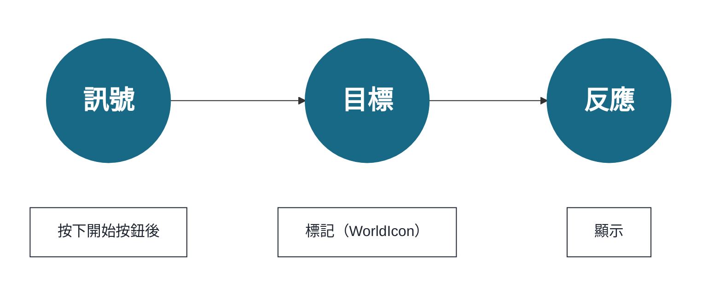
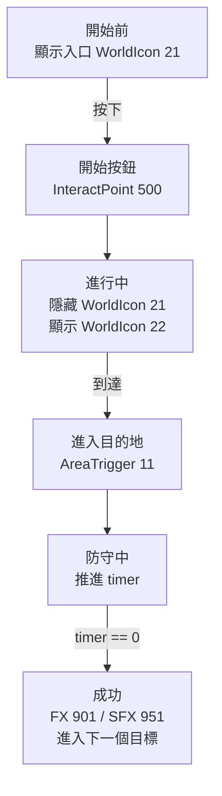

第 4 章中放在地圖上的物件，已經有了 **放置位置** 和 **用於呼叫的地址（ID）**。但是，**誰發出訊號、發到哪個地址、傳達什麼事情，還沒有決定。**
本章會在轉向 TypeScript 之前，整理 **把訊號 -> 目標（ID）-> 反應設計成一條路徑** 的思路。只要這條路徑打通，你的地圖就會從「只是擺好的模型」，變成「會對玩家產生反應的玩法」。

這裡不會詳細講解區塊式視覺化程式設計或編輯器操作，而是會以之後能直接轉寫到 TypeScript 實作中的形式，決定事件、ID、反應之間的關係。

## 訊號 -> 目標 -> 反應（換一種說法）

* 訊號：按下 / 進入 / 到時間
* 目標：InteractPoint 500、WorldIcon 21、AreaTrigger 11……（用 ID 指定）
* 反應：顯示 / 隱藏 / 發光 / 播放聲音 / 生成

訊號指的是「接收到事件」。例如「進入了 A 空間」「達到了 100 分」。
目標指的是，針對這個訊號要讓什麼東西動作。
反應指的是，要讓目標做什麼。

第 5 章就是為了給第 4 章的 ID 接上「行為」的設計工作。

## 先用表格整理

寫程式碼之前，至少先把這張表填好，就不容易迷路。
這裡要決定的不是複雜邏輯。
只是「發生了什麼」「以什麼為物件」「要做什麼」。

| 訊號 | 目標 | 反應 | 確認方法 |
| ---- | ---- | ---- | ---- |
| 按下 InteractPoint 500 | WorldIcon 21 / 22 | 隱藏入口，顯示目的地 | 按下後標記立即變化 |
| 進入 AreaTrigger 11 | FX 901 / SFX 951 | 發出光和聲音 | 只在到達時播放 |
| 防守時間變為 0 | Score / 下一個 WorldIcon | 判定為成功並進入下一步 | 不會觸發兩次 |

只看流程的話，會是這樣。

如果能說明這張表和流程，第 6 章以後的程式碼就是「把這個設計轉寫成 TypeScript」的工作。
反過來，如果這裡還很模糊就開始寫程式碼，ID 和條件一增加，馬上就會迷路。

# 1 5 分鐘做出「第一次成功體驗」

目標很簡單。
**做成「按下開始按鈕（InteractPoint 500）-> 標記（WorldIcon 21 -> 22）向前推進 -> 進入目的地（AreaTrigger 11）後，光（FX 901）和聲音（SFX 951）播放」的形態。**

## 步驟

### 1. 決定初始狀態（遊戲開始時）

* 初始位置的 WorldIcon（ID:21）-> 顯示
* 目的位置的 WorldIcon（ID:22）-> 隱藏

這樣設定，是因為最開始想讓玩家前往的是「入口前方（21）」。

### 2. 以開始按鈕為起點

選擇「按下 InteractPoint」這個事件，並把目標 ID 設為 500。

反應按下面排列。

* 在畫面上顯示幾秒「作戰開始」
* 初始位置的 WorldIcon（ID:21）-> 隱藏
* 目的位置的 WorldIcon（ID:22）-> 顯示

**這樣就能看出「按下後開始」。**
WorldIcon 切換為目的地標記後，玩家一眼就能知道接下來該去哪裡。

### 3. 在目的地播放演出

當發生「進入 AreaTrigger（ID:11）」這個事件時，連接下面的反應。

* 播放 FX 901
* 播放 SFX 951

如果是循環型效果，也可以同時製作「離開 AreaTrigger 時停止」，會更方便。

## 不動時該看哪裡

* ID 是否打錯（500/21/22/11/901/951）
* WorldIcon 的「顯示 / 隱藏」順序（隱藏 21，再顯示 22）
* 物件高度（Y）不足，是否導致判定被穿過去

結論：按下 -> 標記前進 -> 到達後有光和聲音，能做到這裡就合格。
接下來，在不破壞這個核心的前提下，繼續追加「集合」「出載具」「移動 AI」「用時間收尾」。

# 2 按目的整理：常用擴展按這個順序

## A. 集合玩家（開始按鈕之後立刻執行）

> 「按下後，把所有人送到集合點。」

方法有兩種。

* 使用重生：把玩家送回各隊的 SpawnPoint（例：1001/1002）
* 使用傳送：移動到座標（演出很突然，但實作很快）

兩者都放在 InteractPoint ID:500 之後，最容易理解。

## B. 出載具（補給或演出的節點）

假設 VehicleSpawner 的 ID 已經分成 **常設（2001）** 和 **事件用（2090 段）**：

* 按下 500 時啟用 / 再生成運輸車（ID:2001）
* 到達目的地（AreaTrigger ID:11）時再生成坦克（ID:2090）

只要這樣連接，就能產生玩法節奏。

## C. 生成 AI 並讓它前進

* 以按下（InteractPoint ID:500）或進入（AreaTrigger ID:11）為訊號，啟動 AI_Spawner。

## D. 用時間收尾（防守 10 秒 -> 成功後進入下一步）

到達之後放一個倒數計時，會產生戲劇感。

* 進入 AreaTrigger（ID:11）後，從「10」開始顯示倒數
* 每 1 秒更新 UI
* 計數到 0 時，**切換 FX** / **切到下一個 WorldIcon** / **加分** / **打開階段標誌**

為了防止重複觸發，訣竅是一開始先立起「防守中」標誌，結束後再放下。

擴展只是「增加訊號」「增加目標」「增加一個反應」。只要不破壞核心（按下 -> 引導 -> 到達 -> 演出），設計就不會崩。

**接下來整理顯示和演出的順序，做出「看得懂 -> 感覺舒服」的流程。**

# 3 顯示與演出：只要遵守順序就能傳達

玩家在 **文字 -> 標記 -> 聲音和光** 的順序下理解最快。

1. 先用簡短文字告訴玩家「接下來希望你做什麼」。
2. 接著切換 WorldIcon，把引導往前推進。
3. 成功時疊加 FX（效果）/ SFX（聲音）。

**如果順序反過來，一上來就光和聲音，雖然會讓人驚訝，但理由傳達不出去。** 記住 UI 基本是「個別顯示」，演出是「整體共享」，也比較不容易搞錯作用範圍。

**結論：文字 -> 標記 -> 效果。只靠這一點，就能減少玩家迷路。**
接下來，最後整理停止時的修法和完成檢查。

# 4 停住時：修正方式的模板（3 步定位）

1. 簡化：退回到「按下 -> 只顯示訊息」。能動再繼續。
2. 分步恢復：恢復 WorldIcon 切換 -> 通過後再恢復 FX / SFX。
3. 視覺化：把標誌或計數用小 UI 顯示。用眼睛確認是否通過了分支。

最後再確認一次 ID 不是 -1，且同類物件沒有重複。九成問題都在這裡。

**結論：簡化 -> 分步恢復 -> 視覺化，一定能追到原因。**
接下來，用短檢查確認最小循環能穩定動作。

# 5 完成檢查（最小循環）

* 按下後開始（InteractPoint ID:500 是起點）
* 標記向前推進（WorldIcon ID:21 -> ID:22 按順序切換）
* 到達後有光和聲音（AreaTrigger ID:11 觸發 FX ID:901 / SFX ID:951）

到這裡穩定之後，第 5 章的目的就完成了。下一章會把同樣的思路轉寫到 TypeScript 中，並進入可重用的部件化。

結論：第 5 章是為了保證「第一次成功體驗」的章節。這裡的核心通了，之後就是在上面繼續加東西。

---

📘 **下一章「用腳本建立『只屬於自己的模式』」** 會把文字寫出的「訊號 -> 目標 -> 反應」替換成程式碼中的事件 / 函數 / 狀態，並沿著 Portal SDK 的 `index.d.ts`，把 `WorldIcon`、`FX` / `SFX`、`Spawner`、計數實作為部件。
