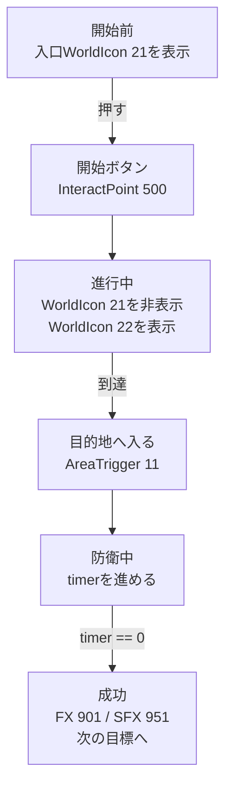

在第 4 章中放置在地圖上的物體都被賦予了**安裝位置**和**調用位址（ID）**。不過，**誰來發出訊號，發送什麼地址，發送什麼業務，目前還沒決定。 **
在本章中，我們將在轉向 TypeScript 之前組織一下**設計訊號→目的地（ID）→反應作為一條路徑**的想法。如果你能做到這一點，你的地圖將從「只是放置在那裡的模型」變成「玩家可以做出反應的遊戲」。

在這裡，我們不會詳細處理區塊式視覺化程式設計和編輯器操作，而是以一種可以直接轉移到後續 TypeScript 實作的方式來確定事件、ID 和反應之間的關係。

## 訊號→收件者→反應（釋義）

* 訊號：按下/輸入/時間已到
* 目的地：InteractPoint 500、WorldIcon 21、AreaTrigger 11…（按 ID 提名）
* 反應：顯示/隱藏/點亮/聲音/火花

訊號是指「事件的接收」。例如，有「我進入了A空間」和「我達到了100分」之類的內容。
目的地是決定回應「訊號」而「應該移動什麼」的訊息。
這種反應會導致「收件人」做什麼？決定。

第5章是第4章將「行為」傳遞給ID的設計工作。

## 首先整理成表格

至少在編寫程式碼之前填寫此表將更容易迷失方向。
這裡沒有複雜的邏輯需要決定。
“應該發生什麼？”“我們應該瞄準什麼？”和“我們應該做什麼？”

|訊號|位址 |反應|確認方法 |
| ---- | ---- | ---- | ---- |
|按 InteractPoint 500 |世界圖示 21 / 22 |刪除入口並顯示目的地 |按 | 後地標立即發生變化
|輸入區域觸發器 11 | FX 901 / SFX 951 | FX 901 / SFX 951發出光和聲音|僅在到達時發出聲音 |
|防禦時間變為0 |分數/下一個世界圖示 |將其視為成功並繼續下一步 |請勿開火兩次 |

如果你只看流程，它會是這樣的：

如果你能解釋這個表格和流程，從第 6 章開始的程式碼將是「將此設計複製到 TypeScript」。
另一方面，如果你寫的程式碼沒有含糊不清，那麼當 ID 和條件的數量增加時，你就會迷失方向。

#1 5 分鐘內的“第一次成功經歷”

目標很簡單。
**建立以下格式：``按下開始按鈕（InteractPoint 500）→地標（WorldIcon 21→22）向前移動→當您輸入目的地（AreaTrigger 11）時，將發出燈光（FX 901）和聲音（SFX 951）。 ''**

## 程式

### 1.確定初始狀態（遊戲開始時）

* 初始位置 WorldIcon (ID:21) → 顯示
* 目標位置的世界圖示 (ID:22) → 隱藏

我將其保留為。第一個想去的地方是「入口前（21）」。

### 2.從開始按鈕開始

選擇事件「InteractPoint Pressed」並在目標 ID 中輸入 500。

作為反應，

* 在螢幕上顯示「操作開始」訊息幾秒鐘
* 初始位置 WorldIcon (ID:21) → 隱藏
* 目標位置的世界圖示 (ID:22) → 顯示

安排他們。 **您現在將看到「按開始」。 **
透過改變世界圖示來顯示目的地，玩家一眼就知道要去哪裡。

### 3. 在目的地表演

當事件「進入AreaTrigger(ID:11)」發生時，作為反應，

* 播放 FX 901
* 播放 SFX 951

連接。如果是循環類型的效果，使用「從 AreaTrigger 發出」創建停止也很方便。

## 不動時的亮點

* ID 拼字錯誤 (500/21/22/11/901/951)
* WorldIcon「顯示/隱藏」順序（刪除21並顯示22）
* 物體是否會因高度（Y）不足而導致漏判？

結論：如果你按→標記向前移動→當你到達時有光和聲音，你就通過了。
接下來，在不破壞這個核心的情況下，我們將添加「組裝」、「發送車輛」、「移動人工智慧」和「隨著時間的推移而收緊」。

# 2 依用途分類：依此順序常用的擴展
## A. 聚集（緊接在開始按鈕之後）

> “按下它可以將所有人送到集合點。”

有兩種方法。

* 使用respawn：回調每個隊伍的SpawnPoint（例如1001/1002）
* 使用瞬移：移動到座標（突然表現，快速實作）

如果將兩者都緊接在 InteractPoint ID:500 之後插入，則很容易理解。

## B. 取出車輛（在供應或性能的轉折點）

假設VehicleSpawner ID分為**永久（2001）/事件（2090個）**，

* 依500時啟動/重新出現運輸車輛（ID：2001）
* 坦克車（ID：2090）到達目的地後重新出現（AreaTrigger ID：11）

只需將其係緊即可創造遊戲節奏。

## C. 讓AI蓬勃發展

* 當按下（InteractPoint ID：500）或入侵（AreaTrigger ID：11）時啟動 AI_Spawner。

## D. 隨著時間的推移收緊（防禦10秒→成功則繼續）

抵達後倒數計時會產生戲劇性效果。

* 進入AreaTrigger(ID:11)時，從計數「10」開始顯示
* UI每1秒更新一次
* 在計數 0 時，**FX 切換** / **下一個世界圖示** / **分數相加** / **相位標誌開啟**

為了防止多次火災，訣竅是先設定「防禦」標誌，然後在完成後將其取下。

要擴展，只需「增加訊號」、「增加目的地」和「新增一個反應」。除非你打破核心（推動→指導→達到→績效），你就不會破產。

**接下來，我們會安排展示和呈現的順序，營造「理解→感覺良好」的流程。 **

# 3 顯示與示範：只需按照順序即可傳達訊息

如果順序是**文字→地標→聲音和燈光**，玩家會更快理解。

1. 首先用簡短的話表達：“接下來你想讓我做什麼？”
2.接下來，切換WorldIcon並將箭頭向前移動。
3.成功後分層FX（效果）/SFX（聲音）。

**如果順序顛倒（突然的光和聲音），會有驚喜，但不會傳達原因。 ** 如果您還記得 UI 基本上是“單獨顯示”，而簡報是“整個共享”，那麼您就不太可能混淆範圍。

**結論：文字→地標→效果。僅此一點就可以減少玩家迷路的機會。 **
接下來，最後總結一下停止時如何修復並檢查完成情況。

# 4 如果停止：如何修復（指定 3 步）

1. 簡化：按 並僅返回訊息。如果你移動，就繼續前進。
2. 向後：返回WorldIcon切換→如果通過，則返回FX/SFX。
3. 視覺化：小型 UI 顯示標誌和計數。目視檢查您是否已通過分支。

最後再檢查ID是否為-1或是否為相同類型且不重複。 90%都在這裡。

**結論：透過簡化→退一步→形象化，總能找到原因。 **
接下來，透過短暫檢查擰緊以確保最小環路正常工作。

# 5 完成檢查（最小循環）

* 按下時啟動（InteractPoint ID:500 為起點）
* 地標向前移動（依照WorldIcon ID:21→ID:22的順序切換）
* 當你到達時，會有燈光和聲音（FX ID：901 / SFX ID：951將出現，AreaTrigger ID：11）

一旦事情穩定到這個地步，第五章的目的就達到了。在下一章中，我們將把相同的想法轉移到 TypeScript 中，並繼續討論可重複使用的元件。

結論：第五章是保證你「第一次成功體驗」的章節。如果核心經過這裡，剩下的就是加法了。

---

📘 **在下一章「用腳本創建你自己的模式」**中，我們將把程式碼中寫的「訊號→目的地→反應」替換為事件/函數/狀態，並遵循Portal SDK的`index.d.ts`。實作 `WorldIcon`、`FX`/`SFX`、`Spawner`，並計算為元件。
