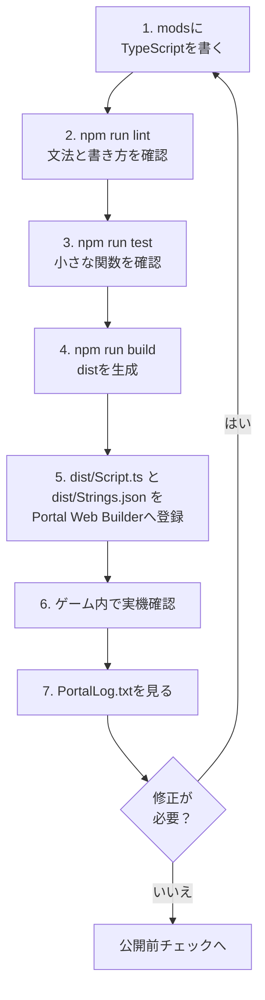

:::訊息提醒

本章中的程式碼是了解 Portal SDK 的 TypeScript API 的最小範例。在實際發布之前，請務必檢查本機主機和真實設備上的操作。

:::

:::訊息提醒
使用 TypeScript 程式設計從這裡開始，但請**不要在程式中包含日文**。
自 2025 年 11 月 1 日起，Portal 的腳本功能不支援日文等多位元組字元。請僅使用字母、數字和一些符號。

在本書中，使用代碼註釋的解釋中不包含日文文本。請仔細閱讀正文。
:::

# 0 用腳本創建的“你自己的模式”

> --- 將第 4 章（放置）和第 5 章（連接）替換為“寫入和移動”

在第4章中，我們在地圖上放置了必要的項目並添加了**ID（地址）**。
在第五章中，我們設計了訊號→目的地（ID）→反應的流程。

在本章中，我們將在程式碼（TypeScript）中做同樣的事情。有以下三個原因。

1. 規模擴大後難以收支平衡：
  直接寫入 Portal Web Builder 可以讓您快速建立內容，但是當事情變得複雜時，就很難看出正在做什麼。程式碼很容易按名稱和行進行搜索，並且易於修復。

2. 您可以一遍又一遍地使用相同的過程：
  諸如「切換圖示顯示」、「播放音效」等經常使用的流程都可以命名並製作成元件。

3. 能夠預見錯誤：
  您可以安裝一種機制來防止數字（ID）輸入錯誤以及從頭開始重複發生相同事件等問題。

> 看似困難，但你需要做的仍然與第 5 章相同。
>「按下→向前移動地標→到達時發出燈光和聲音」 - 首先，我們將用代碼重現這一點。

# 0.1 如何閱讀程式碼章節

從第6章到第8章，代碼量突然增加。
不要試圖從一開始就理解一切，這也沒關係。
首先，弄清楚當您觸摸哪個文件時會發生什麼變化。

|最先觸摸的地方 |角色 |你先能做的就夠了 |
| ---- | ---- | ---- |
| `ids.ts` / `OBJECT_ID` | `ids.ts` / `OBJECT_ID` |將Godot中新增的ObjId複製到程式碼中 |不要留下 `-1` 或重複 |
| `config.ts` | `config.ts` |秒、距離、冷卻時間等調整值 |可以更改防禦秒數和建議人數|
| `Strings.json` | `Strings.json` |註冊螢幕上要顯示的字元 |事先準備好要顯示的文字 |
| `Script.ts` | `Script.ts` |從 Portal 呼叫的入口 |只知道事件函數的位置 |
| `PortalLog.txt` | `PortalLog.txt` |操作確認日誌 |檢查事件是否已觸發 |

程式碼主體起初看起來像一個咒語。
讀取順序為：`ids.ts` 查看位址，`config.ts` 查看數值，`Strings.json` 查看顯示文本，最後 `Script.ts` 查看流程。
執行完函數後，返回並閱讀其詳細含義就足夠了。

# 0.5 將 `index.d.ts` 讀為字典

Portal SDK 的 TypeScript API 組織在 SDK 內的 `code/types/mod/index.d.ts` 處。

此檔案中的 `mod` 命名空間是從入口網站腳本呼叫的函數和類型的字典。如果您遇到不明白的函數，請先搜尋該檔案。

|你所看到的|意義|例 |
| ---- | ---- | ---- |
| `declare namespace mod` | `declare namespace mod` |入口網站API位置| `mod.Wait(...)` | `mod.Wait(...)` |
|不透明型|不允許直接觸摸Portal端實體的類型| `mod.Player`，`mod.WorldIcon` |
| `export function On...` | `export function On...` |活動入口| `OnPlayerInteract` | `OnPlayerInteract` |
| `GetObjId` | `GetObjId` |閱讀 Godot 上的 ObjId |檢查按下的 InteractPoint | 的 ID
| `RuntimeSpawn_...` | `RuntimeSpawn_...` |可以使用 `SpawnObject` 產生的預製件候選 | `mod.RuntimeSpawn_Common.AreaTrigger` |
| `Message` | `Message` |建立顯示字串 | `mod.Message(mod.stringkeys.hello)` | `mod.Message(mod.stringkeys.hello)` |
| `CreateVector` | `CreateVector` |建立座標、顏色等三要素 | `mod.CreateVector(1, 2, 3)` | `mod.CreateVector(1, 2, 3)` |

將不透明類型視為指向門戶端實體的標籤，而不是可以直接操作其內容的方塊。例如，如果您收到 `mod.Player`，則可以使用 `mod.GetTeam(player)` 或 `mod.GetSoldierState(player, ...)` 等 API 檢索訊息，而不僅僅是查看屬性。

像 `RuntimeSpawn_Common` 和 `RuntimeSpawn_Abbasid` 這樣的枚舉是可以使用 `mod.SpawnObject(...)` 從 TypeScript 產生的候選者，而不是在 Godot 中手動安裝的物件庫的解釋。
请注意，手动放置的项目是在 `ObjId` 中拾取的，就像 `GetInteractPoint(500)` 一样，而从代码生成的项目是通过将 `SpawnObject` 的返回值保存在变量中来处理的。

# 0.6TypeScript初學者閱讀表

|程式碼|對初學者的意義 |
| ---- | ---- |
| `export function On...` | `export function On...` |從 Portal 呼叫的事件入口 |
可以等待的函數如 | `async function` | `async function` | `await mod.Wait(...)` | `await mod.Wait(...)` |
| `mod.Wait(1)` | `mod.Wait(1)` |等待 1 秒 |
| `mod.GetXxx(id)` | `mod.GetXxx(id)` |使用 Godot 取得具有 ObjId 的放置物件 |
| `mod.GetObjId(obj)` | `mod.GetObjId(obj)` |檢查收到的展示位置的 ObjId |
| `mod.Message(...)` | `mod.Message(...)` |建立要在螢幕上顯示的訊息 |
| `mod.CreateVector(x, y, z)` | `mod.CreateVector(x, y, z)` |建立三個數字用於座標、方向、顏色等。
| `const OBJECT_ID = ...` | `const OBJECT_ID = ...` |代碼端的 ObjId 帳本副本 |

閱讀代碼時，不必將其作為英文句子來閱讀。區分事件、獲取、等待、顯示和狀態更新就足夠了。

# 0.7 使用範本的開發循環

本章的程式碼將寫入模板儲存庫的 `mods` 資料夾中。

我沒有將其直接貼到 Portal Web Builder 中進行編寫，而是使用以下流程進行開發。

1. 在 `mods` 下編寫 TypeScript。
2. 檢查文法和寫作風格：`npm run lint`。
3. 在`npm run test`查看可以測試的部分。
4. 將 `npm run build` 合併為 `dist/Script.ts`。
5. 在 Portal Web Builder 中註冊 `dist/Script.ts` 和 `dist/Strings.json`。
6.查看遊戲內實際設備，查看`PortalLog.txt`。



這個循環的入口點是 `mods`，出口點是 Portal Web Builder。
为 `mods` 单独编写的代码合并为一个 `dist/Script.ts`，可以使用 `npm run build` 传递到门户。
如果您想使用螢幕上顯示的字符，請另檢查 `Strings.json`。

成功畫面並不是您進入遊戲後應該看到的唯一內容。
檢查 `PortalLog.txt` 是否觸發了預期的事件，是否一遍又一遍地運行相同的進程，以及變數和 ObjId 是否符合預期。
如果出現問題，不要直接在入口網站上修復，而是回到 `mods` 處的原始程式碼進行修復，然後依序透過 `lint`、`test`、`build` 註冊並再次檢查實際裝置。

也就是說，預設回傳目的地始終為 `mods`。
Portal Web Builder 是最後確認和上傳的地方，`mods` 是設計和修改的地方，這樣就不會搞混了。

最初，只需 `mods/Script.ts` 就可以了。一旦習慣了，就如第 7 章將其分為 `mods/ids.ts`、`mods/ui.ts` 和 `mods/game.ts`。即使將它們分開，`npm run build` 最後也會合併為一個 `dist/Script.ts`。

## 如何使用指令

|時間 |執行指令 |
| ---- | ---- |
|寫完程式碼後立即| `npm run lint` | `npm run lint` |
|我要自動修正| `npm run lint:fix` | `npm run lint:fix` |
|我想檢查函數的行為 | `npm run test` | `npm run test` |
|在入口網站註冊前 | `npm run build` | `npm run build` |

`npm run build` 不是保證其正確性的命令。該命令將多個文件合併為一個。在發布前，請務必依序通過 `lint`、`test`、`build`。如果你側身著地，稍後你會摔得很慘。

## 使用 Vitest 測試 ID 和小函數

沒有必要在您自己的測試中重現 Portal 的所有行為。在Vitest中，我們先來看看**我們寫的小函數**。
新增 ID 後、修正條件函數後、註冊到入口網站之前立即執行 `npm run test`。

例如：

* `-1` 是否與 `ids.ts` 混合？
* 同一分類中是否有重複的ID？
* 有沒有 `IP_START`、`AREA_TARGET`、`ICON_TARGET` 等必要的 ID？
* `true`只能在允許`isStartInteract()`啟動的條件下才能建立嗎？
* `ConditionState` 是否充當守衛以防止同一事件傳遞兩次？
* 從 ObjId 分支處理的函數是否如預期分支？
* 訊息產生函數是否傳遞了正確的鍵和參數？

此範本包含 `vitest` 和 `bfportal-vitest-mock`。 `test/sample.test.ts` 提供了 `setupBfPortalMock` 上的 Portal API 的替代方案，並檢查 `DisplayNotificationMessage` 是否被呼叫。

若要檢查 ID，請建立一個測試檔案（如 `test/ids.test.ts`）並從 `ids.ts` 讀取常數進行檢查。
你可以用Vitest檢查的是「程式碼端寫的ID定義」。不能保證具有相同ID的物件確實被放置在Godot上。
因此，請使用第 4 章中的帳本和 ObjIdManager 檢查 Godot 端的實際放置情況。 Vitest 位於程式碼端，ObjIdManager 位於 Godot 端。如果單獨考慮這一點，就能減少遺漏的數量。

請盡可能將遊戲本身的處理分開成函數，以便於測試。如果將所有內容都寫在事件函數中，測試很快就會變得複雜。

#1 第一個準備：命名ID（這最重要）

如果ID是數字的話，就很難理解了。
例如，即使它寫著21，我也無法立即記住它是「入口圖示」還是「目的地圖示」。因此，為 ID 指定一個名稱（常數）。

### 怎麼寫呢？
```ts
const OBJECT_ID = {
	// Team
	TEAM_A: 1,
	TEAM_B: 2,

	// WorldIcon
	ICON_ENTRANCE: 21,
	ICON_TARGET: 22,

	// InteractPoint
	IP_START: 500, // Start Button

	// AreaTrigger
	AREA_TARGET: 11, // destination

	// VFX
	VFX_GOAL: 901,
	// SFX
	SFX_GOAL: 951,

	// Team SpawnPoint
	SP_TEAM_A: 99,
	SP_TEAM_B: 99,
};
```

### 為什麼有必要？
* 只要讀一下你就會明白它的意思。
* 打字錯誤將會減少（交換21和22的事故將會消失）。
* 即使你以後改變了ID，只要修改上面一行就可以解決整個問題。

### 預防絆倒
* 請務必檢查**-1（未設定）**在這裡沒有混淆。
* 檢查是否有相同類型的重複項。
* 如果你不確定，請將第 4 章的帳本放在你旁邊，一一大聲檢查。

#2 記住「你現在在哪裡？」（狀態框）

遊戲進程有多個階段，例如「開始之前」、「開始」和「到達」。
在程式碼中牢記這一點將防止您一遍又一遍地運行同一事件。

## 怎麼寫呢？

在本文檔中，優先使用 `modlib.ConditionState` 進行進度管理並防止多次觸發。

有幾種方法可以使用 `type Phase = "Idle" | "Started"` 之類的階段名稱，但在 Portal 中，許多情況下您只想在滿足條件時處理某些內容。
`ConditionState` 完全符合要求。

`ConditionState` 記住並比較先前的條件結果和目前的條件結果。
僅在上次時間為 `false` 且當前時間為 `true` 時才返回 `true`，否則返回 `false`。

|上次 |這次| `update()` 的回傳值 |意義|
| ---- | ---- | ---- | ---- |
| `false` | `false` | `false` | `false` | `false` |尚未符合條件|
| `false` | `false` | `true` | `true` | `true` |條件滿足的那一刻。僅在此處理 |
| `true` | `true` | `true` | `true` | `false` |條件繼續，但沒有雙重執行 |
| `true` | `true` | `false` | `false` | `false` |條件已被刪除。為下次成立做好準備 |

換句話說，`ConditionState`並不是只要條件成立就處理的工具，而是只在滿足條件的時刻才會處理的工具。
用於需要多次觸發的場合，如開始通知、到達判斷、人數聚集時刻、開始計數等。

```ts
import * as modlib from "modlib";

const enoughPlayersState = new modlib.ConditionState();

/**
 * Returns true when the game can start.
 */
function hasEnoughPlayersToStart(): boolean {
	return mod.CountOf(mod.AllPlayers()) >= 2;
}

export function OngoingGlobal(): void {
	if (enoughPlayersState.update(hasEnoughPlayersToStart())) {
		modlib.ShowNotificationMessage(mod.Message(mod.stringkeys.ready));
	}
}
```

關鍵是不要直接寫`state.update(mod.CountOf(mod.AllPlayers()) >= 2)`。
透過將條件表達式劃分為 `hasEnoughPlayersToStart()` 等函數，即使您英文不好，也可以更輕鬆地閱讀「您正在查看的條件」。

## 它有什麼用？

*「我只想在有 2 名或更多玩家時收到通知」 → 僅在 `ConditionState` 傳遞一次

* 「啟動按鈕按兩次就有問題」 → 將 `isStartInteract()` 傳給 `ConditionState`

* 「如果到達後再次透過『arrived』就會出現問題」 → 將 `isTargetReached()` 傳遞到 `ConditionState`

## 預防絆倒

* 條件式必須分為以 `has...` / `is...` / `can...` 開頭的函數。
* 為每種情況準備一個 `ConditionState`。不要使用相同的實例來啟動和到達。
* 偵錯時，將條件函數的回傳值發佈到`console.log`，更容易追蹤原因。

# 3 第一次程式碼執行（複製「按下→地標→到達→燈光和聲音」）

首先，將第 5 章中的最小循環轉換為程式碼。
在這裡，我們更重視**「順序和理由」**，而不是「如何寫作」。

## 3.0 首先...

將以下程式碼寫入文件頂部。
這是一個套件（程式組），可以讓你輕鬆使用官方預設提供的SDK。

```ts
import * as modlib from "modlib";
```

在本文檔中，在可用的情況下將優先使用 `modlib`。
`modlib` 是一個輔助庫，可以更輕鬆地顯示通知、獲取團隊 ID、轉換 Portal 數組、僅一次火災情況、生成 UI 等。
僅對 `modlib` 中不可用的進程或需要對 Portal API 進行詳細直接控制的進程使用 `mod`。
有關詳細信息，請參閱附錄 C“modlib 說明”。

## 3.1 遊戲開始時的初始化

``顯示入口圖示'''隱藏目的地圖示。 ''讓你的「初始姿勢」清晰。

下面的程式碼顯示和隱藏 WorldIcon。

* VisibleWorldIcon函數是可以顯示或隱藏圖示的函數。
* WorldIcon圖示和文字的顯示透過呼叫SDK提供的mod.EnableWorldIconImage和mod.EnableWorldIconText進行切換。
* 掛鉤SDK的OnGameModeStarted事件，該事件指示遊戲開始，並執行**``遊戲模式啟動時，``設定當前遊戲狀態''和``顯示/隱藏圖標''**

```ts
/**
 * Show/hide icons
 * @param id ObjectId
 * @param visible Show=true
 */
function VisibleWorldIcon(id: number, visible = true) {
	const icon = mod.GetWorldIcon(id);
	mod.EnableWorldIconImage(icon, visible);
	mod.EnableWorldIconText(icon, visible);
}

const startInteractState = new modlib.ConditionState();
const targetReachedState = new modlib.ConditionState();

let gameStarted = false;
let targetReached = false;

/**
 * Reset game progress flags.
 */
function resetGameProgress(): void {
	gameStarted = false;
	targetReached = false;
}

/**
 * Returns true when the start interact point can start the game.
 */
function isStartInteract(objectId: number): boolean {
	return !gameStarted && objectId === OBJECT_ID.IP_START;
}

/**
 * Returns true when the target area can complete the route.
 */
function isTargetReached(objectId: number): boolean {
	return gameStarted && !targetReached && objectId === OBJECT_ID.AREA_TARGET;
}

/**
 * Mark the game as started.
 */
function markGameStarted(): void {
	gameStarted = true;
}

/**
 * Mark the target as reached.
 */
function markTargetReached(): void {
	targetReached = true;
}

/**
 * Event: This will trigger at the start of the gamemode.
 */
export function OnGameModeStarted() {
	resetGameProgress();

	VisibleWorldIcon(OBJECT_ID.ICON_ENTRANCE, true);
	VisibleWorldIcon(OBJECT_ID.ICON_TARGET, false);
}
```


## 3.2 將開始按鈕作為“起點”

按下時，(1)簡訊→(2)圖示切換。
玩家很容易理解「文字→地標→效果」的順序。

```ts
/**
 * Event: This will trigger when a Player interacts with InteractPoint.
 */
export async function OnPlayerInteract(eventPlayer: mod.Player, eventInteractPoint: mod.InteractPoint) {
	const eventObjectId = mod.GetObjId(eventInteractPoint);

	if (startInteractState.update(isStartInteract(eventObjectId))) {
		markGameStarted();

		// OFF IP
		mod.EnableInteractPoint(eventInteractPoint, false);

		// Message (All Player)
		modlib.ShowEventGameModeMessage(mod.Message(mod.stringkeys.start));

		await mod.Wait(0.5);

		// Change Icon
		VisibleWorldIcon(OBJECT_ID.ICON_ENTRANCE, false);
		VisibleWorldIcon(OBJECT_ID.ICON_TARGET, true);
	}
}
```

## 3.3 輸入目的地後，發出效果

到達訊號為AreaTrigger。
當您進入時，**燈光 (FX) 和聲音 (SFX)** 將會播放。

```ts
/**
 * Event: This will trigger when a Player enters an AreaTrigger.
 */
export function OnPlayerEnterAreaTrigger(eventPlayer: mod.Player, eventAreaTrigger: mod.AreaTrigger) {
	const eventObjectId = mod.GetObjId(eventAreaTrigger);

	if (targetReachedState.update(isTargetReached(eventObjectId))) {
		markTargetReached();

		// OFF Target
		VisibleWorldIcon(OBJECT_ID.ICON_TARGET, false);

		// RUN Sound
		mod.PlaySound(OBJECT_ID.SFX_GOAL, 1);

		// RUN Effect
		const vfx = mod.GetVFX(OBJECT_ID.VFX_GOAL);
		mod.EnableVFX(vfx, true);
	}
}
```

### 當事情進展不順利時

* ID輸入錯誤（21/22/11/500/901/951）
* AreaTrigger的**高度(Y)**不足，透過判斷
* 使用 `ConditionState` 和 `is...` 函數檢查「雙擊」和「多次到達」是否停止

> 如果你能做到這一點，你就通過了。
> 從這裡開始，我們將一點一點地「添加」。

## 3.4 新增1：收集（按收集）

常見請求：“按下按鈕，每個人都會前往集合點。”
有兩種方法。

* Respawn：回調到指定的SpawnPoint
* 移動（傳送）：移動到座標

### Respawn：回呼到指定的SpawnPoint

下面的程式移到特定的 SpawnPoint。
**如果您在地圖上設定 SpawnPoint，則可以在該位置產生**。

然而，如果位置動態變化，這就很困難。
動態變化的一個例子是「玩家位置」。

```ts
/**
 * Event: This will trigger when a Player interacts with InteractPoint.
 */
export function OnPlayerInteract(eventPlayer: mod.Player, eventInteractPoint: mod.InteractPoint) {
	const eventObjectId = mod.GetObjId(eventInteractPoint);

	if (startInteractState.update(isStartInteract(eventObjectId))) {
		markGameStarted();

		// OFF IP
		mod.EnableInteractPoint(eventInteractPoint, false);

		// Message (All Player)
		modlib.ShowEventGameModeMessage(mod.Message(mod.stringkeys.start));

		// Change Icon
		VisibleWorldIcon(OBJECT_ID.ICON_ENTRANCE, false);
		VisibleWorldIcon(OBJECT_ID.ICON_TARGET, true);

    // Spawn Player
		const eventTeam = mod.GetTeam(eventPlayer);
		const eventTeamId = modlib.getTeamId(eventTeam);
		const players = mod.AllPlayers();
		for (let index = 0; index < mod.CountOf(players); index++) {
			const player = mod.ValueInArray(players, index);
			const team = mod.GetTeam(player);
			const teamId = modlib.getTeamId(team);

			if (eventTeamId === teamId && eventObjectId === OBJECT_ID.TEAM_A) {
				mod.SpawnPlayerFromSpawnPoint(player, OBJECT_ID.SP_TEAM_A);
			}
		}
	}
}
```


### 移動（傳送）：移動到座標（簡單）

下面的程式移動到一個特定的物件。
**可以是任何物件並在該物件的位置產生**。
使用“Respawn：回呼指定的SpawnPoint”，你只能飛到SpawnPoint對象，但使用此方法，只要提前指定Obj Id，你就可以飛到任何地方。
**例如，即使是位置動態變化的“玩家位置”，或者是沒有特徵的靜態物體“花壇物體的位置”，也可以飛行。 **

不過，程式碼會有點長，所以如果你總是想傳送到同一個位置，你應該使用「Respawn：回呼到指定的SpawnPoint」。

```ts
/**
 * Event: This will trigger when a Player interacts with InteractPoint.
 */
export function OnPlayerInteract(eventPlayer: mod.Player, eventInteractPoint: mod.InteractPoint) {
	const eventObjectId = mod.GetObjId(eventInteractPoint);

	if (startInteractState.update(isStartInteract(eventObjectId))) {
		markGameStarted();

    // OFF IP
		mod.EnableInteractPoint(eventInteractPoint, false);

		// Message (All Player)
		modlib.ShowEventGameModeMessage(mod.Message(mod.stringkeys.start));

		// Change Icon
		VisibleWorldIcon(OBJECT_ID.ICON_ENTRANCE, false);
		VisibleWorldIcon(OBJECT_ID.ICON_TARGET, true);

		// Teleport
		const eventTeam = mod.GetTeam(eventPlayer);
		const eventTeamId = modlib.getTeamId(eventTeam);

		const spawnPointA = mod.GetSpawnPoint(OBJECT_ID.SP_TEAM_A);
		const teleportPointTeamA = mod.GetObjectPosition(spawnPointA);

		const players = mod.AllPlayers();
		for (let index = 0; index < mod.CountOf(players); index++) {
			const player = mod.ValueInArray(players, index);
			const team = mod.GetTeam(player);
			const teamId = modlib.getTeamId(team);

			if (eventTeamId === teamId && eventObjectId === OBJECT_ID.TEAM_A) {
				mod.Teleport(player, teleportPointTeamA, 0);
			}
		}
	}
}
```

### 提示：

* 如果您覺得移動很突然，那麼自然會按照以下順序進行：訊息→短暫等待→移動。
* 有些人可能不知道剛剛發生了什麼，所以會面後再次顯示**目的地圖示（ICON_TARGET）**會很有幫助。

## 3.5 附加範例：隨著時間的推移而收緊（10秒防守）

像「到達→保持10秒→成功」這樣的倒數計時是非常令人興奮的。
然而，訣竅是正確處理取消（離開該區域）。

### 範例：到達後 10 秒，成功防禦後訊息

```ts
let defending = false;
const defenseSec = 10;
async function startDefense(seconds: number) {
	if (defending) return; // Prevent double startup.
	defending = true;

	const team = mod.GetTeam(OBJECT_ID.TEAM_A);

	for (let t = seconds; t > 0; t--) {
		modlib.ShowEventGameModeMessage(mod.Message(mod.stringkeys.countdown), team);
		await mod.Wait(1);

		// Stop when the target state is canceled.
		if (!targetReached) {
			defending = false;
			return;
		}
	}

	defending = true;
	modlib.ShowEventGameModeMessage(mod.Message(mod.stringkeys.success), team);
}

// If you want to "Stop when it comes out"
export function OnPlayerExitAreaTrigger(eventPlayer: mod.Player, eventAreaTrigger: mod.AreaTrigger) {
	if (targetReached) {
		// Allow the target area to trigger again.
		targetReached = false;

		const team = mod.GetTeam(OBJECT_ID.TEAM_A);

		VisibleWorldIcon(OBJECT_ID.ICON_ENTRANCE, true);
		VisibleWorldIcon(OBJECT_ID.ICON_TARGET, false);
		modlib.ShowEventGameModeMessage(mod.Message(mod.stringkeys.failure), team);
  }
}
```

### 提示：

* 準備一個標誌（在本例中為防守），指示計數是否正在進行。
* 如果一開始就決定了中斷的條件（例如離開該區域），程式碼就不會遺失。

## 3.6 防止「突然點火」和「重複點火」（安全裝置）

用戶可能會犯錯或只是為了好玩而重複按下按鈕。
那時，您可以透過新增阻止其在某些條件下運行的鎖定功能來防止相同進程重複運行。

下面是一個可以輕鬆實現的鎖定範例。
這只是一個示例，因此如果您發現該示例難以閱讀或不適合您的目的，請隨時嘗試自己的實現。

### 對策：防止相同事件運行多次

**當實現根據模式而變化的處理時**，您可以如下實現。

```ts
import * as modlib from "modlib";

const startInteractState = new modlib.ConditionState();
let gameStarted = false;

/**
 * Returns true when this interact event should start the game.
 */
function isStartInteract(objectId: number): boolean {
	return !gameStarted && objectId === OBJECT_ID.IP_START;
}

/**
 * Mark the game as started.
 */
function markGameStarted(): void {
	gameStarted = true;
}

/**
 * Event: This will trigger when a Player interacts with InteractPoint.
 */
// eslint-disable-next-line @typescript-eslint/no-unused-vars
export function OnPlayerInteract(eventPlayer: mod.Player, eventInteractPoint: mod.InteractPoint) {
	const objectId = mod.GetObjId(eventInteractPoint);

	if (startInteractState.update(isStartInteract(objectId))) {
		markGameStarted();
		modlib.ShowNotificationMessage(mod.Message(mod.stringkeys.hello, eventPlayer), eventPlayer);
	}
}
```

###對策：防止事件在短時間內重複發生

**如果你想在按下按鈕等時播放一些聲音，並且不希望聲音播放時間很短**，可以如下所示實現。

```ts
import * as modlib from "modlib";

let lock = false;
async function throttle(seconds: number, fn: () => void) {
	if (!lock) {
		lock = true;
		fn();
		await mod.Wait(seconds);
		lock = false;
	}
}

/**
 * Event: This will trigger when a Player interacts with InteractPoint.
 */
// eslint-disable-next-line @typescript-eslint/no-unused-vars
export function OnPlayerInteract(eventPlayer: mod.Player, _eventInteractPoint: mod.InteractPoint) {
	//
	throttle(15, () => {
		modlib.ShowNotificationMessage(mod.Message(mod.stringkeys.hello, eventPlayer), eventPlayer);
	});
}
```

### 提示：

* 只需建立一條只能走一次的路徑，70% 的多個錯誤就會自動消失。
* 此外，如果加上「每n秒一次」防護，即使重複擊打也不會破壞。

## 3.7 視覺化（透過偵錯顯示了解「現在」）

**「按下它時不起作用」** 快速解決問題的最佳方法是能夠查看當前狀態和最近發生的事件。

### 如果想輸出為日誌並查看

在本機上運行體驗將產生 `PortalLog.txt`。 Windows 上的標準位置為 `%LOCALAPPDATA%\Temp\Battlefieldâ„¢ 6`。

根據環境和安裝狀態，位置可能會有所不同。如果找不到，請在 `%LOCALAPPDATA%\Temp` 中搜尋 `PortalLog.txt`。

如果您編寫下面的程式碼，則程式碼的字串將被寫入並保存在 `PortalLog.txt` 中。
遊戲中不會出現任何訊息，但與下面描述的 `ShowNotificationMessage` 不同，不需要預先註冊字串，因此您可以輕鬆檢查操作。

```ts
console.log("message!");
```

### 如果你想在螢幕上查看

如果您寫下以下內容，遊戲畫面上會出現一則訊息。
與 `console.log` 不同，要在螢幕上顯示的字串必須提前寫入 `Strings.json` 中。
出現在播放器畫面上的字符，例如通知、WorldIcon 字符、`AddUIText` / `SetUITextLabel`、`ParseUI`、`textLabel` 等都遵循此規則。

要傳遞到螢幕的訊息是使用 `mod.Message(...)` 函數建立的。
如果將 `{}` 放入 `Strings.json` 中，則可以在此處插入 `mod.Message` 的第二個參數之後傳遞的值。

```json
{
  "debugPlayer": "player:{}",
  "debugObjId": "obj:{}"
}
```

然後，在程式碼方面，引用 `mod.stringkeys` 中的金鑰並僅傳遞更改的值作為附加參數。

```ts
const objId = mod.GetObjId(eventInteractPoint);
modlib.ShowNotificationMessage(mod.Message(mod.stringkeys.debugPlayer, eventPlayer), eventPlayer);
modlib.ShowNotificationMessage(mod.Message(mod.stringkeys.debugObjId, objId), eventPlayer);
```

畫面將顯示類似 `player:<プレイヤー名>` 或 `obj:500` 的內容。
除了字串鍵之外，`mod.Message` 最多可以接受三個附加價值。
如果要顯示玩家姓名、剩餘秒數、得分等，請記住將文字放入 `Strings.json` 中，並僅將更改的值作為參數傳遞給 `mod.Message` 。

### 提示：

* 如果不行的話，先在`console.log`中寫入事件名稱、ObjId、`gameStarted`、`targetReached`、玩家人數。
* 異常和意外分支在日誌中記錄為短字母數字字元。
* 如果不起作用，請先記錄 `isStartInteract()` 或 `isTargetReached()` 的回傳值。
* 如果發生意外情況，請查看 `ConditionState` 的實例以及判斷函數。
* 如果事件一開始沒有到達，我懷疑您輸入的 ID 不正確。

## 3.8「整齊劃分」可以稍後再做

上半年，我們的首要任務是「先行先動」。
一旦習慣了，透過將顯示（UI/效果）、狀態（`gameStarted`、`targetReached`等）和SDK呼叫分成更小的部分來修改它會更容易。

例如，透過將處理收集為如下「3.1 遊戲開始時的初始化」中所示的函數，只需編寫 `VisibleWorldIcon(**,**)` 即可將三行程式碼合併為一行。

```ts
/**
 * Show/hide icons
 * @param id ObjectId
 * @param visible Show=true
 */
function VisibleWorldIcon(id: number, visible = true) {
	const icon = mod.GetWorldIcon(id);
	mod.EnableWorldIconImage(icon, visible);
	mod.EnableWorldIconText(icon, visible);
}

```

這次，我們只總結了三行，但是隨著您編程的進步，行數可能會增加到 10 行...100 行...對於您想做的一件事情，所以您應該習慣將它們分組在一起。


### 提示：

*排序順序是「我寫得最多的在前」。
* 不要強迫自己以完全分離為目標；只要「如果變得更容易閱讀就贏」就可以了。

## 3.9 常見錯誤與簡單對策

* ID保持-1
  → 在屬性欄位中重新輸入數字。一起更新帳本和常數。
* 有兩個相同的ID
  → 檢查相同類型是否有重複。用○標記分類帳。
* 當我按下它時沒有任何反應
  → 檢查`OnPlayerInteract`是否是正確的ID，`isStartInteract()`是否變成`true`，是否被`ConditionState`的守衛抓住。
*當我到達時什麼也沒有發生
  → `AreaTrigger` 的高度（Y）常常不夠。
* 持續的聲音和燈光
  → 準備一個退出時停止的進程 (`OnPlayerExitAreaTrigger`)。
* 重複點擊會變得瘋狂
  → 新增處理以套用限制，例如 `throttle`（稀疏）和 `ConditionState`（僅一次）。
* 以後再看你就不會明白
  → 優先考慮「簡短的英文訊息」和「身分證上的姓名」。

# 結論

* **命名 ID（常數）**
* 現在有某個地方（有狀態標誌，如 `gameStarted` 和 `ConditionState`）。
* 按 → 地標 → 到達 → 不要破壞燈光和聲音的最小循環。
* 一點點添加（設定/車輛/AI/時間）。
* 一旦習慣了，就給經常使用的進程起**名稱（小函數）**，以便於閱讀。

只要遵循這個流程，即使是初學者也可以**運行自己的模式**。
困難的優化和大規模設計可以稍後進行。首先，「當你按下它的時候它就開始了，當它到達時，它會發出令人愉悅的光和聲音」。讓我們用自己的雙手來創造這個。

# 下一節的指南

📘 **下一章《整齊劃分的小設計》** 現在，我們來建立一個程序，思考如何劃分程序的處理組，以便在程序開發完成後，可以在未來以最小的改動繼續使用。
