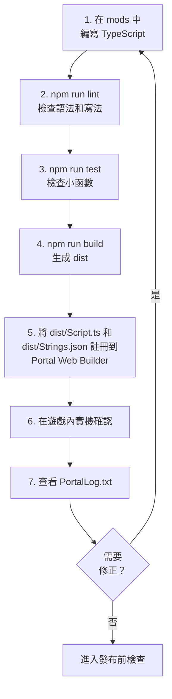

:::message alert

本章中的程式碼，是用來理解 Portal SDK TypeScript API 的最小範例。實際發布之前，請務必在 localhost 和實際遊戲中確認動作。

:::

:::message alert
從這裡開始會進入使用 TypeScript 的程式設計，但請**絕對不要在程式中寫入日文等多位元組字元**。
截至 2025 年 11 月 1 日，Portal 的 Script 功能不支援日文等多位元組字元。請只使用字母、數字和一部分符號。
讓 ChatGPT 等 AI 撰寫程式碼時，可能會混入一些特殊 Unicode 字元，例如看起來像連字號的破折號（`—`、`–`），或看起來像普通引號的智慧引號（`“`、`”`、`‘`、`’`）。這些字元在 Portal 側也會造成問題，所以貼上之前請替換為 ASCII 的 `-`、`"`、`'`，或改寫成不使用這些字元的形式。

本書不會在程式碼註解中放入日文說明。請閱讀正文中的解釋。
:::

# 0 用腳本建立「自己的模式」

> 把第 4 章（放置）和第 5 章（連接）轉寫成「寫出來並讓它動作」

在第 4 章中，我們把必要物件放到地圖上，並賦予了 **ID（地址）**。
在第 5 章中，我們設計了訊號 -> 目標（ID）-> 反應的流程。

本章會用 **程式碼（TypeScript）** 做同樣的事。理由有 3 個。

1. 規模變大後也不容易壞：
  直接寫進 Portal Web Builder 可以很快做出東西，但複雜後就很難看清「哪裡在做什麼」。程式碼可以按名稱和行數搜尋，也更容易修改。

2. 同樣的處理可以重複使用：
  「切換圖示顯示」「播放音效」等常用處理，可以命名並部件化。

3. 可以提前防止錯誤：
  可以從一開始就加入機制，避免數字（ID）打錯、同一事件重複發生等問題。

> 看起來可能有點難，但要做的事仍然和第 5 章一樣。
> 「按下 -> 標記向前 -> 到達後播放光和聲音」。先用程式碼重現這個流程。

# 0.1 程式碼章節的閱讀方式

從第 6 章到第 8 章，程式碼量會一下子增加。
不要試圖從一開始就理解全部，這樣也沒關係。
首先，弄清楚碰哪個檔案會發生什麼變化。

| 最先查看的位置 | 作用 | 一開始做到這樣就夠了 |
| ---- | ---- | ---- |
| `ids.ts` / `OBJECT_ID` | 把 Godot 中設定的 ObjId 轉寫到程式碼中 | 不留下 `-1` 或重複 |
| `config.ts` | 秒數、距離、冷卻時間等調整值 | 可以修改防守秒數和推薦人數 |
| `Strings.json` | 註冊顯示在畫面上的文字 | 預先準備要顯示的文案 |
| `Script.ts` | Portal 呼叫的入口 | 知道事件函數的位置 |
| `PortalLog.txt` | 動作確認日誌 | 確認事件是否觸發 |

程式碼正文一開始看起來像看不懂的符號也沒關係。
閱讀順序是：先在 `ids.ts` 看地址，在 `config.ts` 看數值，在 `Strings.json` 看顯示文字，最後在 `Script.ts` 看流程。
函數的詳細含義，可以等跑起來之後再回來讀。

# 0.5 把 `index.d.ts` 當作字典閱讀

Portal SDK 的 TypeScript API 組織在 SDK 內的 `code/types/mod/index.d.ts` 處。

這個檔案裡的 `mod` namespace，就是 Portal 腳本中呼叫的函數和型別的字典。遇到不懂的函數時，請先搜尋這個檔案。

| 查看內容 | 含義 | 範例 |
| ---- | ---- | ---- |
| `declare namespace mod` | Portal API 的放置位置 | `mod.Wait(...)` |
| opaque 型別 | 不讓你直接碰 Portal 側實體的型別 | `mod.Player`、`mod.WorldIcon` |
| `export function On...` | 事件入口 | `OnPlayerInteract` |
| `GetObjId` | 讀取 Godot 上的 ObjId | 確認被按下的 InteractPoint 的 ID |
| `RuntimeSpawn_...` | 可用 `SpawnObject` 生成的 Prefab 候選 | `mod.RuntimeSpawn_Common.AreaTrigger` |
| `Message` | 建立顯示用字串 | `mod.Message(mod.stringkeys.hello)` |
| `CreateVector` | 建立座標、顏色等三要素 | `mod.CreateVector(1, 2, 3)` |

請把 opaque 型別理解為「指向 Portal 側實體的標籤」，而不是可以直接修改內部內容的盒子。例如拿到 `mod.Player` 時，不是直接查看屬性，而是用 `mod.GetTeam(player)` 或 `mod.GetSoldierState(player, ...)` 這樣的 API 取出資訊。

像 `RuntimeSpawn_Common` 和 `RuntimeSpawn_Abbasid` 這樣的列舉，是可用 `mod.SpawnObject(...)` 從 TypeScript 生成的候選，而不是在 Godot 中手動放置的物件庫說明。
請注意，手動放置的物件要像 `GetInteractPoint(500)` 一樣透過 `ObjId` 取得；從程式碼生成的物件，則要把 `SpawnObject` 的回傳值保存在變數中再處理。

# 0.6 面向 TypeScript 初學者的讀法表

| 程式碼 | 面向初學者的含義 |
| ---- | ---- |
| `export function On...` | Portal 呼叫的事件入口 |
| `async function` | 可以像 `await mod.Wait(...)` 那樣等待的函數 |
| `mod.Wait(1)` | 等待 1 秒 |
| `mod.GetXxx(id)` | 取得在 Godot 中設定了 ObjId 的放置物件 |
| `mod.GetObjId(obj)` | 確認收到的物件的 ObjId |
| `mod.Message(...)` | 建立畫面顯示用訊息 |
| `mod.CreateVector(x, y, z)` | 建立用於座標、朝向、顏色等的 3 個數值 |
| `const OBJECT_ID = ...` | 把 ObjId 台帳轉寫到程式碼側的東西 |

閱讀程式碼時，不必把它當成英文句子來讀。能區分事件、取得、等待、顯示和狀態更新就足夠了。

# 0.7 使用範本的開發循環

本章的程式碼將寫入模板儲存庫的 `mods` 資料夾中。

不要直接貼到 Portal Web Builder 中編寫，而是按照下面的流程開發。

1. 在 `mods` 下編寫 TypeScript。
2. 用 `npm run lint` 檢查語法和寫法。
3. 用 `npm run test` 確認可測試的小部分。
4. 用 `npm run build` 合併為 `dist/Script.ts`。
5. 在 Portal Web Builder 中註冊 `dist/Script.ts` 和 `dist/Strings.json`。
6. 在遊戲內實機確認，並查看 `PortalLog.txt`。



這個循環的入口是 `mods`，出口是 Portal Web Builder。
寫在 `mods` 中的分散程式碼，會透過 `npm run build` 合併為一個 `dist/Script.ts`，再交給 Portal。
如果要使用畫面上顯示的文字，也要一起檢查 `Strings.json`。

進入遊戲後，不是只看「畫面有沒有成功顯示」就結束。
還要檢查 `PortalLog.txt`，確認預期事件是否觸發、同一處理是否反覆執行、變數和 ObjId 是否符合預期。
如果發現問題，不要直接在 Portal 上修，而是回到 `mods` 的原始程式碼修正，再依序執行 `lint`、`test`、`build`，重新註冊並實機確認。

也就是說，預設回傳目的地始終為 `mods`。
Portal Web Builder 是最後確認和上傳的地方，`mods` 是設計和修改的地方，這樣就不會搞混了。

最初，只需 `mods/Script.ts` 就可以了。一旦習慣了，就如第 7 章將其分為 `mods/ids.ts`、`mods/ui.ts` 和 `mods/game.ts`。即使將它們分開，`npm run build` 最後也會合併為一個 `dist/Script.ts`。

## 如何使用指令

| 時機 | 執行指令 |
| ---- | ---- |
| 寫完程式碼後立刻 | `npm run lint` |
| 想自動修正 | `npm run lint:fix` |
| 想確認函數行為 | `npm run test` |
| 註冊到 Portal 前 | `npm run build` |

`npm run build` 不是保證內容正確的命令。它只是把多個檔案合併成一個檔案。發布前，請務必依序通過 `lint`、`test`、`build`。偷懶的話，之後一定會踩坑。

## 使用 Vitest 測試 ID 和小函數

沒有必要在自己的測試中重現 Portal 的所有行為。在 Vitest 中，我們先檢查**自己寫的小函數**。
新增 ID 後、修正條件函數後、註冊到 Portal 之前立即執行 `npm run test`。

例如：

* `-1` 是否與 `ids.ts` 混合？
* 同一分類中是否有重複的ID？
* 有沒有 `IP_START`、`AREA_TARGET`、`ICON_TARGET` 等必要的 ID？
* `true`只能在允許`isStartInteract()`啟動的條件下才能建立嗎？
* `ConditionState` 是否充當守衛以防止同一事件傳遞兩次？
* 從 ObjId 分支處理的函數是否如預期分支？
* 訊息產生函數是否傳遞了正確的鍵和參數？

此範本包含 `vitest` 和 `bfportal-vitest-mock`。`test/sample.test.ts` 會用 `setupBfPortalMock` 準備 Portal API 的替身，並檢查 `DisplayNotificationMessage` 是否被呼叫。

若要檢查 ID，請建立一個測試檔案（如 `test/ids.test.ts`）並從 `ids.ts` 讀取常數進行檢查。
你可以用Vitest檢查的是「程式碼端寫的ID定義」。不能保證具有相同ID的物件確實被放置在Godot上。
因此，請使用第 4 章中的帳本和 ObjIdManager 檢查 Godot 端的實際放置情況。 Vitest 位於程式碼端，ObjIdManager 位於 Godot 端。如果單獨考慮這一點，就能減少遺漏的數量。

請盡可能將遊戲本身的處理分開成函數，以便於測試。如果將所有內容都寫在事件函數中，測試很快就會變得複雜。

# 1 第一個準備：給 ID 命名（這最重要）

如果ID是數字的話，就很難理解了。
例如，即使它寫著21，我也無法立即記住它是「入口圖示」還是「目的地圖示」。因此，為 ID 指定一個名稱（常數）。

### 怎麼寫呢？
```ts
const OBJECT_ID = {
	// Team
	TEAM_A: 1,
	TEAM_B: 2,

	// WorldIcon
	ICON_ENTRANCE: 21,
	ICON_TARGET: 22,

	// InteractPoint
	IP_START: 500, // Start Button

	// AreaTrigger
	AREA_TARGET: 11, // destination

	// VFX
	VFX_GOAL: 901,
	// SFX
	SFX_GOAL: 951,

	// Team SpawnPoint
	SP_TEAM_A: 99,
	SP_TEAM_B: 99,
};
```

### 為什麼有必要？
* 只要讀一下你就會明白它的意思。
* 打字錯誤將會減少（交換21和22的事故將會消失）。
* 即使你以後改變了ID，只要修改上面一行就可以解決整個問題。

### 預防絆倒
* 請務必檢查**-1（未設定）**在這裡沒有混淆。
* 檢查是否有相同類型的重複項。
* 如果你不確定，請將第 4 章的帳本放在你旁邊，一一大聲檢查。

# 2 記住「你現在在哪裡？」（狀態框）

遊戲流程有多個階段，例如「開始之前」、「開始」和「到達」。
在程式碼中記住目前階段，可以防止同一事件反覆執行。

## 怎麼寫呢？

在本文檔中，優先使用 `modlib.ConditionState` 進行進度管理並防止多次觸發。

有幾種方法可以使用 `type Phase = "Idle" | "Started"` 之類的階段名稱，但在 Portal 中，很多時候只需要在條件符合的瞬間處理某些內容。
`ConditionState` 完全符合要求。

`ConditionState` 記住並比較上一次的條件結果和這一次的條件結果。
只有上一次為 `false`、這一次為 `true` 時才回傳 `true`，其他情況都回傳 `false`。

| 上次 | 這次 | `update()` 的回傳值 | 含義 |
| ---- | ---- | ---- | ---- |
| `false` | `false` | `false` | 還沒有符合條件 |
| `false` | `true` | `true` | 條件剛剛符合。只在這裡處理 |
| `true` | `true` | `false` | 條件仍在持續，但不重複執行 |
| `true` | `false` | `false` | 條件解除。準備下一次成立 |

換句話說，`ConditionState`並不是只要條件成立就處理的工具，而是只在滿足條件的時刻才會處理的工具。
用於需要多次觸發的場合，如開始通知、到達判斷、人數聚集時刻、開始計數等。

```ts
import * as modlib from "modlib";

const enoughPlayersState = new modlib.ConditionState();

/**
 * Returns true when the game can start.
 */
function hasEnoughPlayersToStart(): boolean {
	return mod.CountOf(mod.AllPlayers()) >= 2;
}

export function OngoingGlobal(): void {
	if (enoughPlayersState.update(hasEnoughPlayersToStart())) {
		modlib.ShowNotificationMessage(mod.Message(mod.stringkeys.ready));
	}
}
```

關鍵是不要直接寫 `state.update(mod.CountOf(mod.AllPlayers()) >= 2)`。
透過將條件式拆成 `hasEnoughPlayersToStart()` 等函數，即使不擅長英文，也更容易讀懂「現在正在檢查什麼條件」。

## 它有什麼用？

*「我只想在有 2 名或更多玩家時收到通知」 → 僅在 `ConditionState` 傳遞一次

* 「啟動按鈕按兩次就有問題」 → 將 `isStartInteract()` 傳給 `ConditionState`

* 「如果到達後再次透過『arrived』就會出現問題」 → 將 `isTargetReached()` 傳遞到 `ConditionState`

## 預防絆倒

* 條件式必須分為以 `has...` / `is...` / `can...` 開頭的函數。
* 為每種情況準備一個 `ConditionState`。不要使用相同的實例來啟動和到達。
* 偵錯時，把條件函數的回傳值輸出到 `console.log`，更容易追蹤原因。

# 3 第一次程式碼執行（複製「按下→地標→到達→燈光和聲音」）

首先，將第 5 章中的最小循環轉換為程式碼。
在這裡，我們更重視**「順序和理由」**，而不是「如何寫作」。

## 3.0 首先...

將以下程式碼寫入檔案頂部。
這是一個套件（程式組），可以讓你輕鬆使用官方預設提供的 SDK。

```ts
import * as modlib from "modlib";
```

在本文檔中，在可用的情況下將優先使用 `modlib`。
`modlib` 是一個輔助函式庫，可以更輕鬆地顯示通知、取得隊伍 ID、轉換 Portal 陣列、只在條件成立瞬間處理一次、生成 UI 等。
只有 `modlib` 沒有提供，或需要直接細緻控制 Portal API 的處理，才使用 `mod`。
詳細資訊請參閱附錄 C「modlib 說明」。

## 3.1 遊戲開始時的初始化

先「顯示入口圖示」「隱藏目的地圖示」。也就是把遊戲的初始狀態擺清楚。

下面的程式碼顯示和隱藏 WorldIcon。

* `VisibleWorldIcon` 是用來顯示或隱藏圖示的函數。
* WorldIcon 的圖示和文字顯示，會透過 SDK 提供的 `mod.EnableWorldIconImage` 和 `mod.EnableWorldIconText` 切換。
* 連接到表示遊戲模式開始的 SDK 事件 `OnGameModeStarted`，在「遊戲模式開始時」重置目前遊戲狀態，並顯示/隱藏圖示。

```ts
/**
 * Show/hide icons
 * @param id ObjectId
 * @param visible Show=true
 */
function VisibleWorldIcon(id: number, visible = true) {
	const icon = mod.GetWorldIcon(id);
	mod.EnableWorldIconImage(icon, visible);
	mod.EnableWorldIconText(icon, visible);
}

const startInteractState = new modlib.ConditionState();
const targetReachedState = new modlib.ConditionState();

let gameStarted = false;
let targetReached = false;

/**
 * Reset game progress flags.
 */
function resetGameProgress(): void {
	gameStarted = false;
	targetReached = false;
}

/**
 * Returns true when the start interact point can start the game.
 */
function isStartInteract(objectId: number): boolean {
	return !gameStarted && objectId === OBJECT_ID.IP_START;
}

/**
 * Returns true when the target area can complete the route.
 */
function isTargetReached(objectId: number): boolean {
	return gameStarted && !targetReached && objectId === OBJECT_ID.AREA_TARGET;
}

/**
 * Mark the game as started.
 */
function markGameStarted(): void {
	gameStarted = true;
}

/**
 * Mark the target as reached.
 */
function markTargetReached(): void {
	targetReached = true;
}

/**
 * Event: This will trigger at the start of the gamemode.
 */
export function OnGameModeStarted() {
	resetGameProgress();

	VisibleWorldIcon(OBJECT_ID.ICON_ENTRANCE, true);
	VisibleWorldIcon(OBJECT_ID.ICON_TARGET, false);
}
```


## 3.2 將開始按鈕作為「起點」

按下時，執行 (1) 訊息 -> (2) 圖示切換。
玩家很容易理解「文字→地標→效果」的順序。

```ts
/**
 * Event: This will trigger when a Player interacts with InteractPoint.
 */
export async function OnPlayerInteract(eventPlayer: mod.Player, eventInteractPoint: mod.InteractPoint) {
	const eventObjectId = mod.GetObjId(eventInteractPoint);

	if (startInteractState.update(isStartInteract(eventObjectId))) {
		markGameStarted();

		// OFF IP
		mod.EnableInteractPoint(eventInteractPoint, false);

		// Message (All Player)
		modlib.ShowEventGameModeMessage(mod.Message(mod.stringkeys.start));

		await mod.Wait(0.5);

		// Change Icon
		VisibleWorldIcon(OBJECT_ID.ICON_ENTRANCE, false);
		VisibleWorldIcon(OBJECT_ID.ICON_TARGET, true);
	}
}
```

## 3.3 進入目的地後，發出效果

到達的訊號來自 AreaTrigger。
進入區域時，會播放 **光效 (FX) 和音效 (SFX)**。

```ts
/**
 * Event: This will trigger when a Player enters an AreaTrigger.
 */
export function OnPlayerEnterAreaTrigger(eventPlayer: mod.Player, eventAreaTrigger: mod.AreaTrigger) {
	const eventObjectId = mod.GetObjId(eventAreaTrigger);

	if (targetReachedState.update(isTargetReached(eventObjectId))) {
		markTargetReached();

		// OFF Target
		VisibleWorldIcon(OBJECT_ID.ICON_TARGET, false);

		// RUN Sound
		mod.PlaySound(OBJECT_ID.SFX_GOAL, 1);

		// RUN Effect
		const vfx = mod.GetVFX(OBJECT_ID.VFX_GOAL);
		mod.EnableVFX(vfx, true);
	}
}
```

### 當事情進展不順利時

* ID 輸入錯誤（21/22/11/500/901/951）
* AreaTrigger 的 **高度 (Y)** 不足，玩家從判定範圍外穿過去
* 使用 `ConditionState` 和 `is...` 函數檢查「雙擊」和「多次到達」是否停止

> 如果你能做到這一點，你就通過了。
> 從這裡開始，我們將一點一點地「添加」。

## 3.4 新增 1：集合（按下後集合）

常見需求：「按下按鈕後，所有人都前往集合點。」
有兩種方法。

* Respawn：重生到指定的 SpawnPoint
* 移動（傳送）：移動到座標

### Respawn：重生到指定的 SpawnPoint

下面的程式移到特定的 SpawnPoint。
**如果在地圖上設定了 SpawnPoint，就可以讓玩家在那裡生成**。

然而，如果位置動態變化，這就很困難。
動態變化的一個例子是「玩家位置」。

```ts
/**
 * Event: This will trigger when a Player interacts with InteractPoint.
 */
export function OnPlayerInteract(eventPlayer: mod.Player, eventInteractPoint: mod.InteractPoint) {
	const eventObjectId = mod.GetObjId(eventInteractPoint);

	if (startInteractState.update(isStartInteract(eventObjectId))) {
		markGameStarted();

		// OFF IP
		mod.EnableInteractPoint(eventInteractPoint, false);

		// Message (All Player)
		modlib.ShowEventGameModeMessage(mod.Message(mod.stringkeys.start));

		// Change Icon
		VisibleWorldIcon(OBJECT_ID.ICON_ENTRANCE, false);
		VisibleWorldIcon(OBJECT_ID.ICON_TARGET, true);

    // Spawn Player
		const eventTeam = mod.GetTeam(eventPlayer);
		const eventTeamId = modlib.getTeamId(eventTeam);
		const players = mod.AllPlayers();
		for (let index = 0; index < mod.CountOf(players); index++) {
			const player = mod.ValueInArray(players, index);
			const team = mod.GetTeam(player);
			const teamId = modlib.getTeamId(team);

			if (eventTeamId === teamId && eventObjectId === OBJECT_ID.TEAM_A) {
				mod.SpawnPlayerFromSpawnPoint(player, OBJECT_ID.SP_TEAM_A);
			}
		}
	}
}
```


### 移動（傳送）：移動到座標（簡單）

下面的程式移動到一個特定的物件。
**可以是任何物件並在該物件的位置產生**。
使用「Respawn：重生到指定的 SpawnPoint」時，只能移動到 SpawnPoint 物件。
而使用這種方法，只要事先指定 ObjId，就可以移動到任意物件的位置。
**例如，位置會動態變化的「玩家位置」，或者沒有特殊功能的靜態物件「花壇物件的位置」，也可以作為移動目標。**

不過，程式碼會稍微變長。如果你總是想移動到同一個位置，使用「Respawn：重生到指定的 SpawnPoint」會更簡單。

```ts
/**
 * Event: This will trigger when a Player interacts with InteractPoint.
 */
export function OnPlayerInteract(eventPlayer: mod.Player, eventInteractPoint: mod.InteractPoint) {
	const eventObjectId = mod.GetObjId(eventInteractPoint);

	if (startInteractState.update(isStartInteract(eventObjectId))) {
		markGameStarted();

    // OFF IP
		mod.EnableInteractPoint(eventInteractPoint, false);

		// Message (All Player)
		modlib.ShowEventGameModeMessage(mod.Message(mod.stringkeys.start));

		// Change Icon
		VisibleWorldIcon(OBJECT_ID.ICON_ENTRANCE, false);
		VisibleWorldIcon(OBJECT_ID.ICON_TARGET, true);

		// Teleport
		const eventTeam = mod.GetTeam(eventPlayer);
		const eventTeamId = modlib.getTeamId(eventTeam);

		const spawnPointA = mod.GetSpawnPoint(OBJECT_ID.SP_TEAM_A);
		const teleportPointTeamA = mod.GetObjectPosition(spawnPointA);

		const players = mod.AllPlayers();
		for (let index = 0; index < mod.CountOf(players); index++) {
			const player = mod.ValueInArray(players, index);
			const team = mod.GetTeam(player);
			const teamId = modlib.getTeamId(team);

			if (eventTeamId === teamId && eventObjectId === OBJECT_ID.TEAM_A) {
				mod.Teleport(player, teleportPointTeamA, 0);
			}
		}
	}
}
```

### 提示：

* 如果你覺得移動太突兀，可以按照「訊息 -> 短暫等待 -> 移動」的順序，讓流程更自然。
* 有些人可能不知道剛剛發生了什麼，所以會面後再次顯示**目的地圖示（ICON_TARGET）**會很有幫助。

## 3.5 附加範例：隨著時間推進來收緊規則（防守 10 秒）

像「到達→保持10秒→成功」這樣的倒數計時是非常令人興奮的。
然而，訣竅是正確處理取消（離開該區域）。

### 範例：到達後堅持 10 秒，防守成功後顯示訊息

```ts
let defending = false;
const defenseSec = 10;
async function startDefense(seconds: number) {
	if (defending) return; // Prevent double startup.
	defending = true;

	const team = mod.GetTeam(OBJECT_ID.TEAM_A);

	for (let t = seconds; t > 0; t--) {
		modlib.ShowEventGameModeMessage(mod.Message(mod.stringkeys.countdown), team);
		await mod.Wait(1);

		// Stop when the target state is canceled.
		if (!targetReached) {
			defending = false;
			return;
		}
	}

	defending = true;
	modlib.ShowEventGameModeMessage(mod.Message(mod.stringkeys.success), team);
}

// If you want to "Stop when it comes out"
export function OnPlayerExitAreaTrigger(eventPlayer: mod.Player, eventAreaTrigger: mod.AreaTrigger) {
	if (targetReached) {
		// Allow the target area to trigger again.
		targetReached = false;

		const team = mod.GetTeam(OBJECT_ID.TEAM_A);

		VisibleWorldIcon(OBJECT_ID.ICON_ENTRANCE, true);
		VisibleWorldIcon(OBJECT_ID.ICON_TARGET, false);
		modlib.ShowEventGameModeMessage(mod.Message(mod.stringkeys.failure), team);
  }
}
```

### 提示：

* 準備一個表示計數是否正在進行的標誌（本例中是 `defending`）。
* 如果一開始就決定了中斷的條件（例如離開該區域），程式碼就不會遺失。

## 3.6 防止「誤觸發」和「重複觸發」（安全裝置）

玩家可能會誤操作，也可能只是覺得好玩而反覆按下按鈕。
這時，可以加上「在某些條件下不執行」的鎖，避免同一處理反覆執行。

下面是一個容易實作的鎖定範例。
這只是範例，如果覺得不好讀或不符合目的，也可以改成自己的實作。

### 對策：防止相同事件執行多次

**當實作根據模式而變化的處理時**，可以如下實作。

```ts
import * as modlib from "modlib";

const startInteractState = new modlib.ConditionState();
let gameStarted = false;

/**
 * Returns true when this interact event should start the game.
 */
function isStartInteract(objectId: number): boolean {
	return !gameStarted && objectId === OBJECT_ID.IP_START;
}

/**
 * Mark the game as started.
 */
function markGameStarted(): void {
	gameStarted = true;
}

/**
 * Event: This will trigger when a Player interacts with InteractPoint.
 */
// eslint-disable-next-line @typescript-eslint/no-unused-vars
export function OnPlayerInteract(eventPlayer: mod.Player, eventInteractPoint: mod.InteractPoint) {
	const objectId = mod.GetObjId(eventInteractPoint);

	if (startInteractState.update(isStartInteract(objectId))) {
		markGameStarted();
		modlib.ShowNotificationMessage(mod.Message(mod.stringkeys.hello, eventPlayer), eventPlayer);
	}
}
```

### 對策：防止事件在短時間內重複發生

**如果按下按鈕時要播放聲音，但不希望短時間內連續播放**，可以如下實作。

```ts
import * as modlib from "modlib";

let lock = false;
async function throttle(seconds: number, fn: () => void) {
	if (!lock) {
		lock = true;
		fn();
		await mod.Wait(seconds);
		lock = false;
	}
}

/**
 * Event: This will trigger when a Player interacts with InteractPoint.
 */
// eslint-disable-next-line @typescript-eslint/no-unused-vars
export function OnPlayerInteract(eventPlayer: mod.Player, _eventInteractPoint: mod.InteractPoint) {
	//
	throttle(15, () => {
		modlib.ShowNotificationMessage(mod.Message(mod.stringkeys.hello, eventPlayer), eventPlayer);
	});
}
```

### 提示：

* 只要建立一條「只能通過一次」的路徑，很多重複執行問題就會自動消失。
* 再加上「每 n 秒最多一次」的保護，即使被反覆按下也不容易壞。

## 3.7 視覺化（透過偵錯顯示了解「現在」）

**「按下它時不起作用」** 快速解決問題的最佳方法是能夠查看當前狀態和最近發生的事件。

### 如果想輸出為日誌並查看

在 localhost 上執行體驗時，會生成 `PortalLog.txt`。Windows 上的標準位置為 `%LOCALAPPDATA%\Temp\Battlefield™ 6`。

根據環境和安裝狀態，位置可能會有所不同。如果找不到，請在 `%LOCALAPPDATA%\Temp` 中搜尋 `PortalLog.txt`。

寫下下面的程式碼後，該字串會被寫入並保存在 `PortalLog.txt` 中。
遊戲中不會出現任何訊息，但與下面描述的 `ShowNotificationMessage` 不同，不需要預先註冊字串，因此可以輕鬆檢查動作。

```ts
console.log("message!");
```

### 如果你想在螢幕上查看

寫下以下內容後，遊戲畫面上會出現一則訊息。
與 `console.log` 不同，要在螢幕上顯示的字串必須提前寫入 `Strings.json` 中。
出現在玩家畫面上的文字，例如通知、WorldIcon 文字、`AddUIText` / `SetUITextLabel`、`ParseUI`、`textLabel` 等都遵循此規則。

要傳遞到螢幕的訊息是使用 `mod.Message(...)` 函數建立的。
如果將 `{}` 放入 `Strings.json` 中，則可以在此處插入 `mod.Message` 的第二個參數之後傳遞的值。

```json
{
  "debugPlayer": "player:{}",
  "debugObjId": "obj:{}"
}
```

然後，在程式碼側引用 `mod.stringkeys` 中的鍵，並只把會變化的值作為追加參數傳入。

```ts
const objId = mod.GetObjId(eventInteractPoint);
modlib.ShowNotificationMessage(mod.Message(mod.stringkeys.debugPlayer, eventPlayer), eventPlayer);
modlib.ShowNotificationMessage(mod.Message(mod.stringkeys.debugObjId, objId), eventPlayer);
```

畫面將顯示類似 `player:<玩家名>` 或 `obj:500` 的內容。
除了字串鍵之外，`mod.Message` 最多可以接收三個追加值。
如果要顯示玩家姓名、剩餘秒數、得分等，請記住將文字放入 `Strings.json` 中，並僅將更改的值作為參數傳遞給 `mod.Message` 。

### 提示：

* 如果不行的話，先在`console.log`中寫入事件名稱、ObjId、`gameStarted`、`targetReached`、玩家人數。
* 異常和意外分支在日誌中記錄為短字母數字字元。
* 如果不起作用，請先記錄 `isStartInteract()` 或 `isTargetReached()` 的回傳值。
* 如果發生意外情況，請查看 `ConditionState` 的實例以及判斷函數。
* 如果事件一開始就沒有進來，請懷疑 ID 輸入錯誤。

## 3.8 「整齊拆分」可以稍後再做

前半部分，我們的首要任務是「先讓它動起來」。
一旦習慣了，透過將顯示（UI/效果）、狀態（`gameStarted`、`targetReached`等）和SDK呼叫分成更小的部分來修改它會更容易。

例如，透過將處理收集為如下「3.1 遊戲開始時的初始化」中所示的函數，只需編寫 `VisibleWorldIcon(**,**)` 即可將三行程式碼合併為一行。

```ts
/**
 * Show/hide icons
 * @param id ObjectId
 * @param visible Show=true
 */
function VisibleWorldIcon(id: number, visible = true) {
	const icon = mod.GetWorldIcon(id);
	mod.EnableWorldIconImage(icon, visible);
	mod.EnableWorldIconText(icon, visible);
}

```

這次只是把三行整理到一起，但隨著程式變大，「想做的一件事」可能會膨脹到 10 行、100 行。請慢慢習慣把相關處理歸在一起。


### 提示：

* 排序順序是「最常寫的放前面」。
* 不要強迫自己以完全分離為目標；只要「如果變得更容易閱讀就贏」就可以了。

## 3.9 常見錯誤與簡單對策

* ID保持-1
  → 在屬性欄位中重新輸入數字。一起更新帳本和常數。
* 有兩個相同的ID
  → 檢查相同類型是否有重複。用○標記台帳。
* 當我按下它時沒有任何反應
  → 檢查`OnPlayerInteract`是否是正確的ID，`isStartInteract()`是否變成`true`，是否被`ConditionState`的守衛抓住。
*當我到達時什麼也沒有發生
  → `AreaTrigger` 的高度（Y）常常不夠。
* 持續的聲音和燈光
  → 準備一個退出時停止的處理 (`OnPlayerExitAreaTrigger`)。
* 重複點擊會讓處理失控
  → 新增限制處理，例如 `throttle`（間隔限制）和 `ConditionState`（僅一次）。
* 以後再看你就不會明白
  → 優先使用「簡短的英文訊息」和「給 ID 命名」。

# 結論

* **給 ID 命名（常數化）**
* 記錄目前階段（用 `gameStarted` 等狀態標誌和 `ConditionState` 管理階段）。
* 不破壞「按下 -> 標記 -> 到達 -> 光和聲音」的最小循環。
* 一點點追加（集合 / 載具 / AI / 時間）。
* 習慣後，給常用處理命名（小函數），讓程式碼更容易讀。

只要遵循這個流程，即使是初學者也可以**讓自己的模式跑起來**。
困難的最佳化和大規模設計可以之後再做。首先，先讓「按下後開始，到達後發出漂亮的光和聲音」這個流程，用自己的手跑起來。

# 下一節的指南

📘 **下一章《「整齊拆分」的小設計》** 會思考在組裝程式時，如何劃分處理群，讓開發後的程式將來能用最小改動繼續維護。
