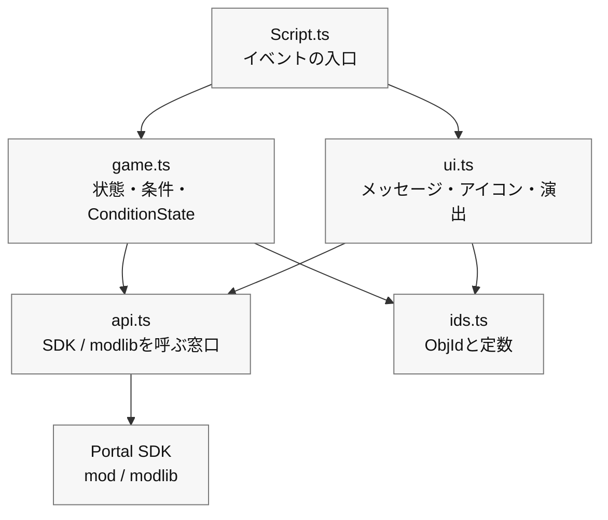

#0 “整齊分開”的小設計

> --- 難以破壞、易於修復且可以稍後添加的程式碼。

在第 6 章中，您能夠在 TypeScript 中執行「Press → Landmark → Arrival → Light and Sound」的最小循環。
當你從這裡添加更多的功能時，類似的過程（訊息顯示、圖示切換、音效播放）分散在各處，即使你只想修復一些東西，最終也會破壞整個事情。

因此，在本章中，我們將介紹“小設計”，它將程式碼簡單地分為三個框，盡可能不使用困難的技術術語。
目的很簡單。

* 難以破解（一個地方的變化很難擴散到其他部分）
* 易於修復（您立即知道該觸摸哪裡）
* 易於添加（不要害怕添加新功能）

> 我們在這裡所做的並不是「完整的全尺寸設計」。
>
> **「輕鬆清理第 6 章中建立的程式碼」** 就是您所需要做的一切。

# 1 分為三個盒子（邊界/狀態/如何呈現）

首先，讓我們按角色來劃分它們。只要記住三件事：

1. 邊界（API）：呼叫Portal/SDK的視窗。

只放置向遊戲外部世界發出命令的函數的地方，例如“實際打開/關閉 WorldIcon”和“玩 FX”。

2. 狀態（域）：遊戲進度和規則。

表達諸如“我們可以開始嗎？”“我們可以到達目的地嗎？”“我們在防守嗎？”“數了多少秒？”等條件的小函數，以及使用 `modlib.ConditionState` 進行多重射擊預防。

3. 如何呈現（UI/方向）：訊息、圖示、聲音和燈光。

  一個盒子，將“文字→地標→效果”的順序組合成一個功能，並照顧“僅外觀”。

最初，僅保護以下依賴項就足夠了：

|文件 |角色 |你可以稱呼什麼 |
| ---- | ---- | ---- |
| `Script.ts` | `Script.ts` |接收Portal事件並連接處理的入口 | `game.ts`，`ui.ts` | `game.ts`
| `game.ts` | `game.ts` |進度狀態，條件函數，`ConditionState` | `ids.ts`，如有必要 `api.ts` |
| `ui.ts` | `ui.ts` |如何顯示訊息、WorldIcon、FX/SFX 等 | `api.ts`，`ids.ts` | `api.ts`
| `api.ts` | `api.ts` |直接呼叫Portal SDK和modlib的薄視窗 | `mod`，`modlib` | `mod`
| `ids.ts` | `ids.ts` |只放置 ObjId 和常數 |不要打電話 |

依賴方向為 `Script.ts` → `game.ts` / `ui.ts` → `api.ts` → Portal SDK。
如果你開始朝相反的方向調用，你最終會陷入只想改變顯示但遊戲進度被破壞的情況。
如有疑問，請將直接與Portal SDK互動的程式碼提交至`api.ts`，並且僅在事件中呼叫短函數。

## 文具（感受氣氛）

```ts
// 1) API boundary
export const api = {
  showIcon: (id: number, on: boolean) => { /* SDK call */ },
  playFX:  (id: number) => { /* ... */ },
  stopFX:  (id: number) => { /* ... */ },
  playSfx:  (id: number) => { /* ... */ },
  vehicle: {
    enable: (id: number, on: boolean) => { /* ... */ },
    respawn: (id: number) => { /* ... */ },
  },
  time: { wait: async (ms: number) => { /* ... */ } },
};

// 2) Game progress gates and flags
import * as modlib from "modlib";

export const startGate = new modlib.ConditionState();
export const targetGate = new modlib.ConditionState();
export const state = { started: false, reached: false, defending: false };

export function canStart(): boolean { return !state.started; }
export function canReachTarget(): boolean { return state.started && !state.reached; }
export function markStarted(): void { state.started = true; }
export function markReached(): void { state.reached = true; }

// 3) UI and effects
export const ui = {
  say: (message: mod.Message, ms = 2000) => { /* Show to all players */ },
  guide: (hideId?: number, showId?: number) => {
    if (hideId !== undefined) api.showIcon(hideId, false);
    if (showId !== undefined) api.showIcon(showId, true);
  },
  celebrate: (FXId: number, sfxId: number) => {
    api.playFX(FXId); api.playSfx(sfxId);
  },
};
```

### 積分

* 如果Portal規格發生變化，只需修復API即可。
*如果你想替換UI文字或方向，只需修復UI即可。
* 遊戲進度規格可在 `state`、`can...`、`mark...`、`ConditionState` 進行解釋。

# 2 個單獨的檔案（基於範本的小資料夾結構）

對於初學者來說 4 個文件就足夠了。

```
/mods
  ├─ ids.ts        // Object ID constants
  ├─ api.ts        // SDK boundary
  ├─ game.ts       // Progress flags, ConditionState, predicates
  ├─ ui.ts         // UI and effects
  └─ Script.ts     // Event wiring
```

* ids.ts：僅列出命名 ID，例如 const ICON_TARGET = 22。
* api.ts：將SDK呼叫包裝成一行函數（即使內容很複雜，從外部看也可以看作一行）。
* game.ts：`ConditionState`，聲明，放入`can...` / `mark...`。
* ui.ts：從 say/guide/celebrate 3 件組開始，並視需要增加。
* Script.ts：在呼叫上面的框框的同時，寫第五章的邏輯（推送→引導→到達→燈光和聲音）。

> 透過分離訊息，「我應該在哪裡寫」變得固定並減少混亂。

範本 `npm run build` 遞歸收集 `mods` 下的 `.ts` 文件，並將其編譯為 `dist/Script.ts` 以在入口網站中註冊。 Portal端只能接收一個文件，開發時可以隨意分割。

# 3 依賴方向（僅限「向下箭頭」）

理想情況下，箭頭應該只朝一個方向流動，例如 main → ui → api。
反向流程（例如 `api` 呼叫 `ui` 和 `ui` 呼叫 `main` ）會造成混亂。
如果你堅持「我叫你下來，但我不叫你起來」這句口頭禪，你就會停止像滾雪球一樣越滾越大的依賴。



#4 第六章程式碼「分離」示範（小動作）

假設第 5 章中的最小循環已按原樣放置在 `mods/Script.ts` 中。
以下是如何透過 3 個步驟完成此操作。

## 步驟 1：移動 ID (ids.ts)

```ts
// ids.ts
export const IP_START = 500;
export const ICON_ENTRANCE = 21;
export const ICON_TARGET   = 22;
export const AREA_TARGET   = 11;
export const FX_GOAL      = 901;
export const SFX_GOAL      = 951;
```

將 `mods/Script.ts` 替換為 `import { ... } from "./ids"`。
效果：數字消失，僅保留名稱（易於閱讀）。

## 步驟 2：行動簡報 (ui.ts)

```ts
// ui.ts
import { api } from "./api";
export const ui = {
  say: (message: mod.Message, ms = 2000) => { /* Show message */ },
  guide: (hideId?: number, showId?: number) => {
    if (hideId !== undefined) api.showIcon(hideId, false);
    if (showId !== undefined) api.showIcon(showId, true);
  },
  celebrate: (FXId: number, sfxId: number) => {
    api.playFX(FXId); api.playSfx(sfxId);
  },
};
```

`showMessageAll` / `setIconVisible` / `playFX` / `playSfx` 在 `mods/Script.ts` 一側，
替換為 `ui.say` / `ui.guide` / `ui.celebrate`。
效果：文字→地標→效果的順序可以一行人讀完。

## 步驟 3：移動條件與多重射擊預防 (game.ts)

```ts
// game.ts
import * as modlib from "modlib";

export const startGate = new modlib.ConditionState();
export const targetGate = new modlib.ConditionState();

export const state = {
  started: false,
  reached: false,
};

/**
 * Returns true when the game can start.
 */
export function canStart(): boolean {
  return !state.started;
}

/**
 * Returns true when the target area can be accepted.
 */
export function canReachTarget(): boolean {
  return state.started && !state.reached;
}

export function markStarted(): void {
  state.started = true;
}

export function markReached(): void {
  state.reached = true;
}
```

在`mods/Script.ts`中，為每個事件建立一個判斷函數，然後傳遞給`ConditionState`。

```ts
import { startGate, targetGate, canStart, canReachTarget, markStarted, markReached } from "./game";
import { IP_START, AREA_TARGET } from "./ids";

/**
 * Returns true when this interact event should start the game.
 */
function isStartInteract(objectId: number): boolean {
  return canStart() && objectId === IP_START;
}

/**
 * Returns true when this area event should mark the target as reached.
 */
function isTargetArea(objectId: number): boolean {
  return canReachTarget() && objectId === AREA_TARGET;
}

export function OnPlayerInteract(eventPlayer: mod.Player, eventInteractPoint: mod.InteractPoint): void {
  const objectId = mod.GetObjId(eventInteractPoint);

  if (startGate.update(isStartInteract(objectId))) {
    markStarted();
    // Start game
  }
}

export function OnPlayerEnterAreaTrigger(eventPlayer: mod.Player, eventAreaTrigger: mod.AreaTrigger): void {
  const objectId = mod.GetObjId(eventAreaTrigger);

  if (targetGate.update(isTargetArea(objectId))) {
    markReached();
    // Play goal effects
  }
}
```

效果：多次預防每次都會以相同的形式，您也可以使用名稱 `isStartInteract` / `isTargetArea` 來讀取「正在確定的內容」。
門戶網站的評論將以英文簡短撰寫。請避免日文註釋，因為它們很容易導致多位元組字元出現問題。

# 5 「命名」規則（初學者可以稍後閱讀的名稱）

* 函數名稱是動詞+賓語：`guide` from `guideIcon`（「icon」是隱式的，因為它位於演示框中），`celebrate` from `playGoalEffect`（減少賓語以表達「for What」）。
* 條件函數以 `is...` / `has...` / `can...` 開頭：閱讀 `isStartInteract`、`canReachTarget` 等。
* ID常數是一個大寫的蛇：`ICON_TARGET`是**只要你看到它，你就知道它是一個「不變的數字」**。
* 檔案名稱簡短明了：`ids` / `api` / `game` / `ui`。正義不是讓人們誤入歧途。

# 6 個設定集中在一個方塊中（以便稍後編輯數字）

我想在不重寫程式碼的情況下進行平衡調整（例如防禦10秒→15秒）。
準備一份 `config.ts` 並僅在遊戲過程中查看。

```ts
// config.ts
export const config = {
  balance: { defenseSeconds: 10, startThrottleMs: 1000 },
  messages: {
    start: mod.stringkeys.start,
    defendSeconds: mod.stringkeys.defendSeconds,
    success: mod.stringkeys.success,
  },
};
```

將文字本身放入 `Strings.json`，並將金鑰放入 `mod.stringkeys...` 以進行程式碼端設定。
顯示時，像`ui.say(mod.Message(config.messages.defendSeconds, t))`一樣組裝`mod.Message`。

> 現在您可以立即回覆「我只想更改數字」或「我只想更改文字鍵」。

#7：自診斷（先用Vitest發現ID事故）

-1（未設定）和重複 ID 在 `npm run test` 上找到比在遊戲開始後發現它們更容易。
像 `assertIds()` 這樣的確認函數應該放在 Vitest 的 `test/ids.test.ts` 端，而不是在 `mods/Script.ts` 的生產啟動期間呼叫。

```ts
// test/ids.test.ts
import { describe, expect, test } from "vitest";
import * as ids from "../mods/ids";

function assertIds() {
  const entries = Object.entries(ids) as [string, number][];
  const seen = new Map<number, string[]>();
  const errors: string[] = [];

  for (const [name, id] of entries) {
    if (id === -1) errors.push(`[ID unset] ${name}`);
    const arr = seen.get(id) || [];
    arr.push(name); seen.set(id, arr);
  }
  for (const [id, names] of seen) {
    if (names.length > 1) errors.push(`[ID duplicate] ${id}: ${names.join(", ")}`);
  }
  if (errors.length) throw new Error(errors.join("\n"));
}

describe("ids", () => {
  test("does not contain unset or duplicate ids", () => {
    expect(() => assertIds()).not.toThrow();
  });

  test("contains required ids", () => {
    expect(ids.IP_START).toBeGreaterThan(-1);
    expect(ids.AREA_TARGET).toBeGreaterThan(-1);
    expect(ids.ICON_TARGET).toBeGreaterThan(-1);
  });
});
```

現在，當您執行 `npm run test` 時，您可以檢查程式碼端的 `ids.ts` 是否未設定或重複。
然而，直到在 Godot 上實際部署後才能看到 Vitest。請檢查第四章中的帳本或ObjIdManager，看看實際場景中是否放置了相同的ObjId。

# 8 「聚合與分發」事件（小型調度）

當事件數量增加時，你可以將規範寫在表格頂部的表格中，上面寫著：「當事件到來時我應該做什麼，我應該看什麼條件，我應該做什麼？」程式碼就變成了可讀的規範。
這裡同樣將 `ConditionState` 與判斷函數配對，而不是增加階段名稱 `type` ，這樣比較容易理解。

```ts
// flow.ts
import * as modlib from "modlib";
import { ui } from "./ui";
import { IP_START, AREA_TARGET, ICON_ENTRANCE, ICON_TARGET, FX_GOAL, SFX_GOAL } from "./ids";
import { startDefense } from "./defense";
import { canStart, canReachTarget, markStarted, markReached } from "./game";

type When = "interact"|"enter"|"leave";
type Row = {
  when: When;
  id: number;
  gate: modlib.ConditionState;
  test: () => boolean;
  do: () => void;
};

const startGate = new modlib.ConditionState();
const targetGate = new modlib.ConditionState();

export const flow: Row[] = [
  {
    when: "interact",
    id: IP_START,
    gate: startGate,
    test: canStart,
    do: () => {
      markStarted();
      ui.say(mod.Message(mod.stringkeys.start));
      ui.guide(ICON_ENTRANCE, ICON_TARGET);
    },
  },
  {
    when: "enter",
    id: AREA_TARGET,
    gate: targetGate,
    test: canReachTarget,
    do: () => {
      markReached();
      ui.celebrate(FX_GOAL, SFX_GOAL);
      startDefense(10);
    },
  },
];

export function dispatch(when: When, id: number) {
  const row = flow.find(r => r.when === when && r.id === id);
  if (!row) return;
  if (row.gate.update(row.test())) row.do();
}
```

對於 `mods/Script.ts`，只需從 SDK 事件回呼中呼叫dispatch("interact", IP_START) 即可。
效果：你可以閱讀上表中的行為（對於初學者來說更安全）。
`gate` 停止多次觸發，`test` 使用命名函數來解釋現在是否可以繼續這個過程。

# 9 將單獨的程式碼合併為一個

使用範本時，開發時將 `mods` 下的檔案分開，僅在註冊到入口網站時將它們合併為一個檔案。

這是要運行的命令：

```bash
npm run build
```

此指令收集 `mods` 下的 `.ts` 文件，組織 `import` 行，並建立 `dist/Script.ts`。

開發時在Portal Web Builder註冊的不是`mods/Script.ts`。 **`dist/Script.ts`**。如果您使用字串定義，您也需註冊 **`dist/Strings.json`**。

## 註冊前檢查訂單

在將其帶到入口網站之前，請按以下順序檢查以下內容。

```bash
npm run lint
npm run test
npm run build
```

* `lint`：先找出文法或寫作風格中的危險點。
* `test`：檢查狀態轉換和小函數是否如預期運作。
* `build`: 產生1個要在Portal中註冊的檔案。

請不要僅僅透過 `build` 就感到安全。構建是一個組合，而不是遊戲正確性的證明。

#10 如何修復「分離後」（實用流程）

我想改變外觀→開啟`ui.ts`（措詞、方向、順序）。

匯出的命令已更改→開啟`api.ts`（替換SDK）。

我想增加遊戲的階段 → 將狀態標誌新增至 `game.ts`、`ConditionState`、`can...` / `mark...` 函數，並將該行新增至 `flow.ts`。

ID 增加了 → 新增一個常數到 `ids.ts` 並使用 Vitest 和 ObjIdManager 檢查。

調整數字和措詞 → 更改 `config.ts` 的值。

分離最大的功能就是你接觸的地方是唯一確定的。

#11 常見NG及對策

NG：直接從各個地方呼叫API
→ 對策：始終造訪 `ui` 或 `api`。不要直接從 `main` 存取 `setIconVisible`。

NG：當場寫下數字（例如 `setIconVisible(22, true)`）
→ 對策：將所有內容改為常數 `ids.ts`。走向不追尋數字的生活。

NG：複製並貼上該標誌以防止每次多次觸發。
→ 對策：將判斷函數`ConditionState`發佈到`game.ts`。

NG：程式碼中的措詞分散
→ 對策：將文字放入 `Strings.json` 中，然後像 `ui.say(mod.Message(mod.stringkeys.start))` 一樣透過 `mod.Message` 。

# 12 漸進重構（以最不可怕的順序排列）

沒有必要「一次完成所有事情」。這是安全的順序。

1. **將 ID 轉換為常數**（最大效果/最小風險）
2. 剪下3點UI集（`say` / `guide` / `celebrate`）
3.建立**ConditionState和判斷函數**
4. 建立 API 聯繫點
5. 前往**轉換表（流程）**（如有必要）

建置並測試每個步驟，確保可以正常播放，然後繼續下一步。

# 結論

* 只需將其分為三個框（api / game / ui）即可使其不太可能損壞且更易於修復。
* **停止號碼和使用名稱（ids.ts）**是可讀性的核心。
* 使用 `ConditionState` 減少多次觸發，使用配置減少文字和數字，並使用 Vitest 和 ObjIdManager 減少 ID 事故。
* 劃分順序為ID→UI→狀態→API→轉換錶。把它切成小塊就不可怕了。

# 下一節的指南

**第 8 章「視覺與製作：掌握 UI、SFX 和 FX」** 在本章中，我們將進一步完善本章中所建立的 UI 框，

* 如何發送訊息（個別/整體/重要性）
* WorldIcon切換時序設計
* 調試 UI 位置以及對玩家隱藏它的方法
