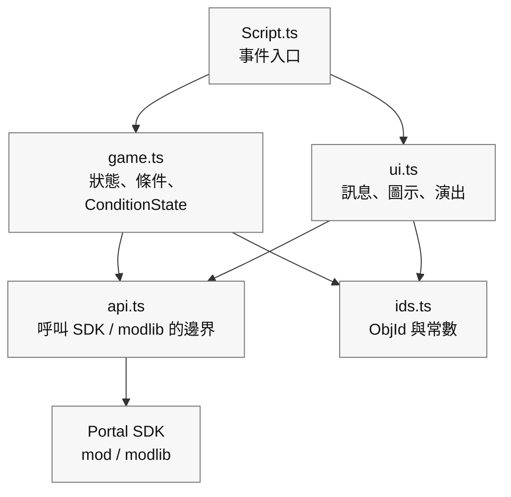

# 0 「整齊拆分」的小設計

> 讓程式碼更不容易壞、更容易改，也更方便以後繼續追加功能

在第 6 章裡，你已經讓 **「按下 -> 標記 -> 到達 -> 光和聲音」** 這個最小循環在 TypeScript 中跑起來了。
接下來一旦開始加功能，像訊息顯示、圖示切換、音效播放這些類似的處理，就會慢慢散落到各處。結果常常會變成：本來只想改一小塊，卻把整條流程一起弄壞。

所以這一章要做的事情很單純。
我們盡量不用太難的術語，只是把程式碼分進三個盒子裡，導入一個 **「小設計」**。
目標也很直接：

* 不容易壞：改一處時，不容易牽連別處
* 好修改：一眼就知道該去哪裡動
* 好追加：以後繼續加功能時沒那麼可怕

> 這裡做的不是「完整的大型設計」。
>
> 只是把 **第 6 章寫出來的程式碼，溫和地整理一下**。

# 1 分成三個盒子（邊界 / 狀態 / 表現）

先照職責來拆。只要記住這三類就夠了：

1. 邊界（API）：呼叫 Portal / SDK 的窗口

這裡只放那些真正向遊戲外部發出命令的函數，例如「實際把 WorldIcon 打開 / 關閉」「播放 FX」之類。

2. 狀態（domain）：遊戲進度和規則

這裡放的是條件判斷和進度控制，例如「現在能不能開始」「能不能算到達」「是否正在防守」「還剩幾秒」，以及用 `modlib.ConditionState` 防止重複觸發。

3. 表現（UI / 演出）：訊息、圖示、聲音、光效

這裡把「文字 -> 標記 -> 效果」的順序收進一個函數裡，只負責看得見的部分。

一開始，只要守住下面這套依賴關係就夠了：

| 檔案 | 作用 | 允許呼叫的對象 |
| ---- | ---- | ---- |
| `Script.ts` | 接收 Portal 事件並串起處理的入口 | `game.ts`、`ui.ts` |
| `game.ts` | 進度狀態、條件函數、`ConditionState` | `ids.ts`，必要時可用 `api.ts` |
| `ui.ts` | 訊息、WorldIcon、FX/SFX 等表現 | `api.ts`、`ids.ts` |
| `api.ts` | 直接呼叫 Portal SDK 和 `modlib` 的薄邊界 | `mod`、`modlib` |
| `ids.ts` | 只放 ObjId 和常數 | 不呼叫任何東西 |

依賴方向應該是 `Script.ts` -> `game.ts` / `ui.ts` -> `api.ts` -> Portal SDK。
一旦開始反過來呼叫，就很容易變成「我只是想改個顯示，結果連遊戲流程都壞了」。
拿不準時，就把直接碰 Portal SDK 的程式碼都收進 `api.ts`，讓事件函數裡只保留短小的函數呼叫。

## 參考骨架

```ts
// 1) API boundary
export const api = {
  showIcon: (id: number, on: boolean) => { /* SDK call */ },
  playFX:  (id: number) => { /* ... */ },
  stopFX:  (id: number) => { /* ... */ },
  playSfx:  (id: number) => { /* ... */ },
  vehicle: {
    enable: (id: number, on: boolean) => { /* ... */ },
    respawn: (id: number) => { /* ... */ },
  },
  time: { wait: async (ms: number) => { /* ... */ } },
};

// 2) Game progress gates and flags
import * as modlib from "modlib";

export const startGate = new modlib.ConditionState();
export const targetGate = new modlib.ConditionState();
export const state = { started: false, reached: false, defending: false };

export function canStart(): boolean { return !state.started; }
export function canReachTarget(): boolean { return state.started && !state.reached; }
export function markStarted(): void { state.started = true; }
export function markReached(): void { state.reached = true; }

// 3) UI and effects
export const ui = {
  say: (message: mod.Message, ms = 2000) => { /* Show to all players */ },
  guide: (hideId?: number, showId?: number) => {
    if (hideId !== undefined) api.showIcon(hideId, false);
    if (showId !== undefined) api.showIcon(showId, true);
  },
  celebrate: (FXId: number, sfxId: number) => {
    api.playFX(FXId); api.playSfx(sfxId);
  },
};
```

### 重點

* 如果 Portal 規格變了，通常只要改 `api`
* 如果要換文案或演出，通常只要改 `ui`
* 遊戲流程則可以用 `state`、`can...`、`mark...`、`ConditionState` 說清楚

# 2 拆分檔案（基於範本的小資料夾結構）

對初學者來說，先拆成 4 個檔案就夠用了。

```
/mods
  ├─ ids.ts        // Object ID constants
  ├─ api.ts        // SDK boundary
  ├─ game.ts       // Progress flags, ConditionState, predicates
  ├─ ui.ts         // UI and effects
  └─ Script.ts     // Event wiring
```

* `ids.ts`：只放有名字的 ID，例如 `const ICON_TARGET = 22`
* `api.ts`：把 SDK 呼叫包成一行函數，外面讀起來更乾淨
* `game.ts`：放 `ConditionState`、狀態旗標、`can...` / `mark...`
* `ui.ts`：先從 `say` / `guide` / `celebrate` 這三件套開始，不夠再加
* `Script.ts`：呼叫上面這些盒子，把第 5 章的邏輯串起來

> 一旦拆開，「這段該寫在哪裡」就固定下來了，人會輕鬆很多。

範本裡的 `npm run build` 會遞迴收集 `mods` 下的 `.ts` 檔案，把它們合併成給 Portal 註冊用的 `dist/Script.ts`。
Portal 端雖然只能收一個檔案，但開發時完全可以放心拆分。

# 3 依賴方向（只准「往下箭頭」）

理想情況是像 `main -> ui -> api` 這樣，只朝一個方向流動。
如果變成 `api` 去呼叫 `ui`，或者 `ui` 再去呼叫 `main`，讀起來很快就會亂。
記一句就夠了：可以往下叫，不要往上叫。



# 4 把第 6 章的程式碼「拆開來放」（一次小搬家）

假設第 5 章的最小循環現在還原樣放在 `mods/Script.ts` 裡。
那我們就用 3 個步驟把它整理開。

## 步驟 1：把 ID 搬出去（`ids.ts`）

```ts
// ids.ts
export const IP_START = 500;
export const ICON_ENTRANCE = 21;
export const ICON_TARGET   = 22;
export const AREA_TARGET   = 11;
export const FX_GOAL      = 901;
export const SFX_GOAL      = 951;
```

然後把 `mods/Script.ts` 裡的裸數字替換成 `import { ... } from "./ids"`。

效果：數字消失，只剩下名字，讀起來馬上輕鬆很多。

## 步驟 2：把表現搬出去（`ui.ts`）

```ts
// ui.ts
import { api } from "./api";
export const ui = {
  say: (message: mod.Message, ms = 2000) => { /* Show message */ },
  guide: (hideId?: number, showId?: number) => {
    if (hideId !== undefined) api.showIcon(hideId, false);
    if (showId !== undefined) api.showIcon(showId, true);
  },
  celebrate: (FXId: number, sfxId: number) => {
    api.playFX(FXId); api.playSfx(sfxId);
  },
};
```

把 `mods/Script.ts` 裡的 `showMessageAll` / `setIconVisible` / `playFX` / `playSfx`，替換成 `ui.say` / `ui.guide` / `ui.celebrate`。

效果：「文字 -> 標記 -> 效果」這條線會變得一行就能讀懂。

## 步驟 3：把條件和防重複觸發搬出去（`game.ts`）

```ts
// game.ts
import * as modlib from "modlib";

export const startGate = new modlib.ConditionState();
export const targetGate = new modlib.ConditionState();

export const state = {
  started: false,
  reached: false,
};

/**
 * Returns true when the game can start.
 */
export function canStart(): boolean {
  return !state.started;
}

/**
 * Returns true when the target area can be accepted.
 */
export function canReachTarget(): boolean {
  return state.started && !state.reached;
}

export function markStarted(): void {
  state.started = true;
}

export function markReached(): void {
  state.reached = true;
}
```

在 `mods/Script.ts` 裡，先為每個事件寫一個判斷函數，再把它交給 `ConditionState`。

```ts
import { startGate, targetGate, canStart, canReachTarget, markStarted, markReached } from "./game";
import { IP_START, AREA_TARGET } from "./ids";

/**
 * Returns true when this interact event should start the game.
 */
function isStartInteract(objectId: number): boolean {
  return canStart() && objectId === IP_START;
}

/**
 * Returns true when this area event should mark the target as reached.
 */
function isTargetArea(objectId: number): boolean {
  return canReachTarget() && objectId === AREA_TARGET;
}

export function OnPlayerInteract(eventPlayer: mod.Player, eventInteractPoint: mod.InteractPoint): void {
  const objectId = mod.GetObjId(eventInteractPoint);

  if (startGate.update(isStartInteract(objectId))) {
    markStarted();
    // Start game
  }
}

export function OnPlayerEnterAreaTrigger(eventPlayer: mod.Player, eventAreaTrigger: mod.AreaTrigger): void {
  const objectId = mod.GetObjId(eventAreaTrigger);

  if (targetGate.update(isTargetArea(objectId))) {
    markReached();
    // Play goal effects
  }
}
```

效果：防重複觸發每次都會長成同一種形狀，而且 `isStartInteract` / `isTargetArea` 這些名字本身也能告訴你「現在到底在判斷什麼」。
另外，給 Portal 用的註解請盡量短小並保持英文。日文註解很容易踩到多位元組字元的問題。

# 5 「命名」的規則（讓以後再看也能讀懂）

* 函數名盡量是「動詞 + 對象 / 目的」
  `guide` 比 `guideIcon` 更精簡，因為它已經放在表現盒子裡，圖示這層意思是隱含的。
  `celebrate` 也比 `playGoalEffect` 更像「這是為了什麼」。
* 條件函數統一用 `is...` / `has...` / `can...` 開頭
  例如 `isStartInteract`、`canReachTarget`
* ID 常數統一用大寫蛇形
  `ICON_TARGET` 這種名字一眼就能看出它是「不會變的數字」
* 檔案名盡量短且直白
  `ids` / `api` / `game` / `ui` 就夠了，不要把人帶進命名迷宮

# 6 把設定集中到一個盒子裡（以後改數字更輕鬆）

像「防守 10 秒改成 15 秒」這種平衡調整，最好不要碰到主邏輯程式碼。
準備一個 `config.ts`，讓這些設定都集中在那裡。

```ts
// config.ts
export const config = {
  balance: { defenseSeconds: 10, startThrottleMs: 1000 },
  messages: {
    start: mod.stringkeys.start,
    defendSeconds: mod.stringkeys.defendSeconds,
    success: mod.stringkeys.success,
  },
};
```

真正顯示出來的文字放在 `Strings.json`，程式碼側的設定裡只保留 `mod.stringkeys...` 的鍵。
要顯示時，再用 `mod.Message` 組裝，例如 `ui.say(mod.Message(config.messages.defendSeconds, t))`。

> 這樣一來，「我只想改數字」或「我只想改文案鍵」時，就能立刻動手。

# 7 自我檢查（先用 Vitest 把 ID 事故找出來）

像 `-1`（未設定）或重複 ID，與其等到遊戲跑起來之後才發現，不如先在 `npm run test` 階段抓出來。
像 `assertIds()` 這類檢查函數，建議放在 Vitest 的 `test/ids.test.ts` 裡，而不是放在 `mods/Script.ts` 的正式啟動流程中。

```ts
// test/ids.test.ts
import { describe, expect, test } from "vitest";
import * as ids from "../mods/ids";

function assertIds() {
  const entries = Object.entries(ids) as [string, number][];
  const seen = new Map<number, string[]>();
  const errors: string[] = [];

  for (const [name, id] of entries) {
    if (id === -1) errors.push(`[ID unset] ${name}`);
    const arr = seen.get(id) || [];
    arr.push(name); seen.set(id, arr);
  }
  for (const [id, names] of seen) {
    if (names.length > 1) errors.push(`[ID duplicate] ${id}: ${names.join(", ")}`);
  }
  if (errors.length) throw new Error(errors.join("\n"));
}

describe("ids", () => {
  test("does not contain unset or duplicate ids", () => {
    expect(() => assertIds()).not.toThrow();
  });

  test("contains required ids", () => {
    expect(ids.IP_START).toBeGreaterThan(-1);
    expect(ids.AREA_TARGET).toBeGreaterThan(-1);
    expect(ids.ICON_TARGET).toBeGreaterThan(-1);
  });
});
```

這樣一來，執行 `npm run test` 時，就能先檢查 `ids.ts` 裡有沒有未設定或重複的 ID。
不過 Vitest 看不到 Godot 裡真實擺了什麼。所以實際場景裡是否放了同樣的 ObjId，還是要回到第 4 章的台帳和 ObjIdManager 去確認。

# 8 把事件「彙總後再分發」（小型 dispatch）

事件一多，程式碼最好能先在上面寫出一張小表，明確「什麼事件來了、要看什麼條件、通過後做什麼」。
這樣程式碼本身就會更像一份能讀的規格說明。

這裡同樣建議把 `ConditionState` 和判斷函數成對放著，而不是一直擴張階段名 `type`。

```ts
// flow.ts
import * as modlib from "modlib";
import { ui } from "./ui";
import { IP_START, AREA_TARGET, ICON_ENTRANCE, ICON_TARGET, FX_GOAL, SFX_GOAL } from "./ids";
import { startDefense } from "./defense";
import { canStart, canReachTarget, markStarted, markReached } from "./game";

type When = "interact"|"enter"|"leave";
type Row = {
  when: When;
  id: number;
  gate: modlib.ConditionState;
  test: () => boolean;
  do: () => void;
};

const startGate = new modlib.ConditionState();
const targetGate = new modlib.ConditionState();

export const flow: Row[] = [
  {
    when: "interact",
    id: IP_START,
    gate: startGate,
    test: canStart,
    do: () => {
      markStarted();
      ui.say(mod.Message(mod.stringkeys.start));
      ui.guide(ICON_ENTRANCE, ICON_TARGET);
    },
  },
  {
    when: "enter",
    id: AREA_TARGET,
    gate: targetGate,
    test: canReachTarget,
    do: () => {
      markReached();
      ui.celebrate(FX_GOAL, SFX_GOAL);
      startDefense(10);
    },
  },
];

export function dispatch(when: When, id: number) {
  const row = flow.find(r => r.when === when && r.id === id);
  if (!row) return;
  if (row.gate.update(row.test())) row.do();
}
```

這樣在 `mods/Script.ts` 裡，SDK 的事件回呼就只要寫成 `dispatch("interact", IP_START)` 這種形式即可。

效果：行為能從上面的表裡直接讀出來，尤其對初學者更安心。
`gate` 負責擋住重複觸發，`test` 則用有名字的函數說明「現在是否允許通過」。

# 9 把拆開的程式碼重新合成一個檔案

使用範本時，開發階段可以把檔案拆在 `mods` 下；等到要註冊到 Portal 時，再把它們合併成一個檔案。

執行的命令是：

```bash
npm run build
```

這個命令會收集 `mods` 下的 `.ts` 檔案，整理 `import`，然後生成 `dist/Script.ts`。

要註冊到 Portal Web Builder 的，不是開發中的 `mods/Script.ts`，而是 **`dist/Script.ts`**。
如果還用了字串定義，那麼 **`dist/Strings.json`** 也要一起註冊。

## 註冊前的確認順序

帶進 Portal 之前，建議按這個順序確認：

```bash
npm run lint
npm run test
npm run build
```

* `lint`：先找出語法或寫法上的危險點
* `test`：確認狀態變化和小函數按預期動作
* `build`：生成給 Portal 註冊的單一檔案

不要因為 `build` 通過就完全放心。建置成功只代表「檔案合併成功了」，不代表「遊戲邏輯一定正確」。

# 10 拆開之後，應該去哪裡改

想改外觀？
去 `ui.ts`，看文案、演出、順序。

想改向外發出的命令？
去 `api.ts`，處理 SDK 側的變更。

想給遊戲多加一個階段？
去 `game.ts` 增加狀態旗標、`ConditionState`、`can...` / `mark...`，再去 `flow.ts` 加一行。

ID 增加了？
去 `ids.ts` 加常數，再用 Vitest 和 ObjIdManager 檢查。

想調整數字和文案？
去 `config.ts` 改值。

拆分最大的好處，就是你很快能知道「這次該去哪裡動」。

# 11 常見 NG 和對策

NG：到處直接呼叫 API
-> 對策：一定透過 `ui` 或 `api`。不要從 `main` 裡直接打 `setIconVisible`。

NG：把數字寫死在現場，例如 `setIconVisible(22, true)`
-> 對策：全部搬進 `ids.ts` 常數裡，過上不用追裸數字的生活。

NG：防重複觸發的旗標到處複製貼上
-> 對策：把 `ConditionState` 和判斷函數集中到 `game.ts`。

NG：文案散落在程式碼裡
-> 對策：把文字放進 `Strings.json`，透過 `mod.Message` 使用，例如 `ui.say(mod.Message(mod.stringkeys.start))`。

# 12 漸進式重構（照不嚇人的順序）

沒必要一次做完。安全順序如下：

1. 先把 ID 變成常數
2. 抽出 UI 的三件套：`say` / `guide` / `celebrate`
3. 建立 `ConditionState` 和判斷函數
4. 建立 API 邊界
5. 有需要時，再上過渡表 `flow`

每做完一步，就 build 一次、test 一次，確認遊戲還能像平常一樣跑，再繼續下一步。

# 結論

* 只要把程式碼拆成 `api` / `game` / `ui` 這三個盒子，就會明顯更不容易壞，也更容易改。
* 停止寫裸數字，改用 `ids.ts` 裡的名字，是可讀性的核心。
* 用 `ConditionState` 壓住重複觸發，用 `config` 集中文案和數字，用 Vitest + ObjIdManager 降低 ID 事故。
* 安全的拆分順序是：ID -> UI -> 狀態 -> API -> 過渡表。一步一步來，就沒那麼可怕。

# 下一章預告

在 **第 8 章《視覺與演出：掌握 UI、SFX、FX》** 裡，我們會繼續打磨這一章做出來的 `ui` 盒子：

* 訊息怎麼發：個人、全體、重要度
* WorldIcon 該在什麼時機切換
* 偵錯 UI 放在哪裡，以及怎樣不讓玩家看見它
