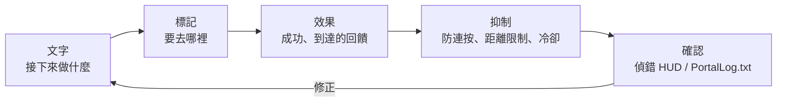

# 0 視覺與演出：掌握 UI、SFX、FX

> 照「傳達 -> 引導 -> 有手感」的順序來做

* 傳達：短訊息 / WorldIcon 切換
* 引導：讓玩家一眼看懂「去這裡」的擺放和更新
* 有手感：用 SFX / FX 增加回饋，但不要播放過頭
* 不失控：防連按、距離 / 次數限制、冷卻時間
* 可回看：用偵錯 HUD 看見「剛剛發生了什麼」

> 口訣是「文字 -> 標記 -> 效果」。
> 先用短句給出要求，再用 WorldIcon 指方向，最後用 SFX / FX 疊加回饋。



# 1 訊息：用短句只給出「下一步」
## 為什麼

玩家會在幾秒內判斷。長文不會被認真讀。只把「接下來要做什麼」用短句顯示出來，迷路感就會少很多。

## 怎麼寫

* 使用「命令 + 對象」：

例：「go entrance」「start terminal A」「defend 10s」

* 加上時間 / 距離也很有效：

例：「defend 10s」「120m left」

## 實作模板

畫面上顯示的文字不要直接寫進程式碼。請先註冊到 `Strings.json` 再使用。
通知、WorldIcon、UI Text 的 `textLabel` 等玩家能看到的文字，都照同樣的方式處理。

流程分三步：

1. 在 `Strings.json` 中註冊要顯示的文字鍵和正文。
2. 在 TypeScript 側建立 `mod.Message(mod.stringkeys.keyName, extraValues...)`。
3. 把 `Message` 傳給 `modlib.ShowNotificationMessage()` 等顯示函數。

`Strings.json` 是畫面文字的字典。
TypeScript 側指定這個字典裡的鍵，必要時只把要填進 `{}` 的值追加傳入。
這樣分開後，可以避免顯示文案增加時，把直接寫在程式碼裡的文字弄壞在 Portal 裡。

```json
{
  "goEntrance": "go entrance",
  "defendSeconds": "defend:{}s",
  "testName": "test name:{}"
}
```

程式碼側用 `mod.Message` 建立顯示用的 `Message`。
第二個參數之後傳入的值，會放進 `{}` 的位置。

```ts
modlib.ShowEventGameModeMessage(mod.Message(mod.stringkeys.goEntrance));
modlib.ShowEventGameModeMessage(mod.Message(mod.stringkeys.defendSeconds, 10));
modlib.ShowNotificationMessage(mod.Message(mod.stringkeys.testName, "player1"));
```

最後一個例子在畫面上會顯示為 `test name:player1`。
`mod.Message` 最多可以使用 3 個追加參數，所以程式碼裡只傳剩餘秒數、分數、玩家名這類會變化的值。

```ts
// Important message
ui.say(mod.Message(mod.stringkeys.goEntrance));

// Updating message
ui.say(mod.Message(mod.stringkeys.defendSeconds, t));
```

## 防踩坑

* 追加畫面文字後，確認 `Strings.json` 裡有對應的鍵。
* 不要同時顯示多條訊息。設計成最後一條覆蓋前一條。
* 降低通知頻率。每秒新通知會很累，盡量覆蓋更新。
* 個人和全體要先分清。個人提醒只發給觸發者，合圖則發給所有人。

# 2 WorldIcon：引導標記放在「稍微靠前」的位置，並按階段切換
## 為什麼

如果把標記直接放在目的地上，玩家靠近時很容易被牆或轉角擋住。
放在入口或轉角的**稍微前方**，轉彎時也不容易迷路。

## 怎麼放 / 怎麼切

* 分階段：入口（`ICON_ENTRANCE`）-> 目的地（`ICON_TARGET`）-> 下一個目標（`ICON_NEXT...`）
* 到達後把目前標記 OFF，再把下一個 ON。不要讓兩個目標同時發光，這是不迷路的關鍵。

## 實作模板

```ts
// Basic guide flow using guide from chapter 6
ui.guide(ICON_ENTRANCE, ICON_TARGET);  // Entrance off, target on

// When reached
ui.guide(ICON_TARGET, undefined);      // Target off; enable the next icon here if needed
```

## 防踩坑

* 只增加 ON，忘記 OFF：到達時一定關閉前一個圖示。
* 如果需要按隊伍顯示，可以分出 `ui.guideForTeam(teamId, hide, show)` 這類函數，避免顯示範圍出錯。

# 3 SFX：聲音太多會變成疲勞，所以一定要加冷卻
## 為什麼

達成音很爽，但連續播放會讓人疲勞。
冷卻時間，也就是「一段時間內不要再播放」，可以控制密度。

## 實作模板：SFX 冷卻

```ts
const sfxCooldownMs = 1500;
let lastSfxAt = 0;

function playSfxCooled(id: number) {
  const now = Date.now();
  if (now - lastSfxAt < sfxCooldownMs) return;
  lastSfxAt = now;
  api.playSfx(id);
}
```

## 防踩坑

* 如果和事件重複觸發疊在一起，聲音會立刻變吵。請和第 6 章的一次性守衛一起用。
* 如果 API 能按距離調整音量，就讓遠處事件不播放。沒有這種 API 時，就先決定遠距離事件不播放 SFX。

# 4 FX：遠處是「燈塔」，近處是「獎勵」
## 為什麼

FX 的理想狀態是：遠處能注意到，近處能理解。
遠距離重視可見性，例如閃爍、光柱、箭頭。近距離重視手感，例如爆炸、火花、火柱。

## 實作模板：一次性 FX / 循環 FX

```ts
function celebrate() {
  api.playFX(FX_GOAL);   // One-shot FX
  playSfxCooled(SFX_GOAL); // Cooldown version from 7.3
}

// Always stop looped FX
onEnterArea(AREA_TARGET, () => api.playFX(FX_GOAL));
onLeaveArea(AREA_TARGET, () => api.stopFX(FX_GOAL));
```

## 防踩坑

* 煙霧停不下來：退出事件裡一定寫停止處理。
* 室內看不見：把放置位置稍微往前移。向上加一點偏移也常常有效。

# 5 距離和方向：用「還剩 XXm」把引導變成實感
## 為什麼

看到距離後，玩家會感覺「我正在前進」。
每隔幾秒更新一次就夠了，不需要每幀更新。

## 實作模板：覆蓋更新距離 UI

```ts
const updateDistance = debounce(500, (playerPos: Vector3, targetPos: Vector3) => {
  const d = Math.round(distance(playerPos, targetPos));
  ui.say(mod.Message(mod.stringkeys.distanceLeft, d));
});
```

這種情況下，請在 `Strings.json` 中準備 `"distanceLeft": "{}m left"` 這樣的文案。

## 防踩坑

* 更新太頻繁導致通知吵：用 debounce 間隔更新。
* 距離不到 0m：目標點和 WorldIcon 一樣，放在稍微靠前的位置。

# 6 優先順序：重要的聲音、光效、文字先播放 / 先顯示
## 為什麼

多個演出同時疊在一起時，弱的那個會被蓋掉。
請設定優先順序，按高 -> 中 -> 低處理，必要時抑制低優先順序演出。

## 實作模板：優先順序佇列的想法

```ts
type Prio = "high"|"mid"|"low";
function playSfxPrio(id: number, prio: Prio) {
  if (prio === "low" && Date.now() - lastSfxAt < 2000) return; // Suppress recent low-priority SFX
  playSfxCooled(id);
}
```

## 小技巧

* 勝利和失敗的提示音一定是 `high`。
* 腳步聲、環境音這類底層聲音交給遊戲本身。自訂 SFX 只放在關鍵節點。

# 7 防止「做太多」的設計：一個場景一個效果，一個時刻一條訊息

* 一個場景一個效果：同一事件裡不要疊兩三個 FX。先決定一個主角。
* 一個時刻一條訊息：不要同時顯示目的、注意、提示。只聚焦目的。
* 一定要寫結束處理：停止循環 FX/SFX、覆蓋訊息、關閉 WorldIcon。

# 8 偵錯 HUD：準備只有自己能看到的「眼睛和耳朵」
## 為什麼

演出是靠感覺體驗的，但設計靠的是數值和狀態。
給自己準備一個小 HUD，只顯示 phase、剩餘秒數、最近事件，修起來會快很多。

## 實作模板
```
const debug = { on: true };
function dbg(line: string) { if (!debug.on) return; /* Small text at the screen edge */ }

function dump() { dbg(`phase=${Phase[state.phase]} time=${remainSec}`); }

onInteract(IP_START, () => dbg("Interact:Start"));
onEnterArea(AREA_TARGET, () => dbg("Enter:Target"));
onLeaveArea(AREA_TARGET, () => dbg("Leave:Target"));
```

## 小技巧

* 正式發布時設為 `debug.on = false`。
* HUD 也和通知一樣做 debounce，保持可讀性。

# 9 效能和穩定性：不做也是勇氣

* 避免每幀判定。距離和方向每 0.5 到 1 秒檢查一次就夠了。
* 避免無限循環加短等待。用事件和計時器等待。
* 限制同時播放數量，例如同時最多 3 個 SFX。
* 演出只給能感知到的人。API 支援的話，檢查可聽範圍 / 可視範圍。

官方 SDK 的 Tips 也把載具數量、Player 掃描、UI Widget 管理列為和負載直接相關的點。
增加演出前，請先守住下面三點：

* 同時存在的載具不要超過 40 台。常駐載具和事件載具要合在一起看。
* 不要每幀掃描所有玩家。用 `OnPlayerEnterCapturePoint`、`OnPlayerExitCapturePoint` 等事件記錄狀態，需要時再讀取。
* UI Widget 不要每次重新建立。把建立好的 Widget 保存在變數裡，只更新顯示內容。

演出越華麗，越要在變重之前先定好上限。
判斷標準不是「能顯示多少」，而是「玩家能理解多少」。

# 10 配方集：可以直接複用的小部件
## A）到達時讓鏡頭晃一下，並只播放一次短歡呼

```ts
let cheered = false;
function celebrateOnce() {
  if (cheered) return; cheered = true;
  ui.celebrate(FX_GOAL, SFX_GOAL);    // Light and sound
  api.shakeCameraAll?.(0.4, 600);      // If available: strength 0.4 for 600 ms
  setTimeout(()=> cheered = false, 3000); // Prevent repeats for 3 seconds
}
```

## B）階段訊息：用 3 個短句串成一條故事線

```ts
ui.say(mod.Message(mod.stringkeys.start));
ui.guide(ICON_ENTRANCE, ICON_TARGET);
ui.say(mod.Message(mod.stringkeys.goTerminalA));
// On reached
ui.say(mod.Message(mod.stringkeys.goodJob));
```

## C）偽「閃爍圖示」：交替 ON / OFF

```ts
let blinkOn = false, blinkH: any;
function startBlinkIcon(id: number, ms = 600) {
  stopBlinkIcon();
  blinkH = setInterval(()=> { blinkOn = !blinkOn; api.showIcon(id, blinkOn); }, ms);
}
function stopBlinkIcon() { if (blinkH) clearInterval(blinkH); api.showIcon(ICON_TARGET, true); }
```

> 注意不要用太多。比較自然的做法是：第一次吸引注意時閃爍，到快到達時改為常亮。

# 結論

* 只要守住「文字 -> 標記 -> 效果」的順序，體驗的傳達方式就會明顯改變。
* WorldIcon 放在稍微靠前的位置，SFX / FX 加冷卻，UI 用覆蓋更新，能防止演出變吵。
* 用偵錯 HUD 視覺化「現在」。修正會更快，演出品質也會更穩。

# 下一章預告

接下來的第 9 章《發布、託管、營運》會進入實務，把到目前為止做出的體驗變成「能被別人遊玩」的狀態。

* 共享代碼、256 字以內說明文、縮圖的寫法：短短說明目的 / 推薦人數 / 所需時間
* 伺服器營運：常駐 / 活動，以及公告模板
* 更新頻率和「不弄壞地改進」的流程
* 以 XP 相關內容可能因情況受限為前提，進行穩妥營運的技巧
