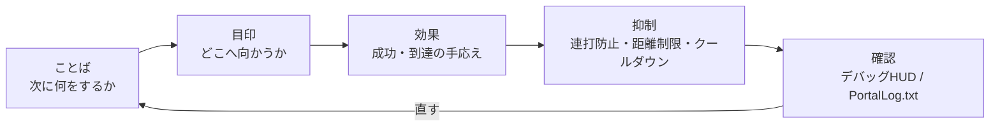

# 0 視覺效果與製作：掌握 UI、SFX 和 FX

> ―― 依照以下順序：理解→不要猶豫→感覺良好

* 發送（短信/切換WorldIcon）
* 指南（讓您一眼就知道「去這裡」的放置和更新）
* 營造感覺（用 SFX/FX 添加感覺。但是，不要讓它「太大聲」）
* 不受干擾（防止垃圾郵件、距離/次數限制、冷卻時間）
* 可以查看（查看調試 HUD 上的“剛剛發生了什麼”）

> 密碼是「文字→符號→效果」。
> 先用簡短的句子陳述要求，然後用 WorldIcon 指示方向，最後用 SFX/FX 重複回應。



#1訊息：用簡短的句子給出“下一步”
## 為什麼

玩家在幾秒鐘內做出決定。長文本將不會被閱讀。如果你只用 5 到 12 個字元說“接下來你想讓我做什麼”，你的猶豫就會消失。

## 如何寫（類型）

* 命令式+受詞：

例）“前往入口”“啟動A航站樓”“防禦10秒”

* 建議包含時間/距離：

例）“防守10秒”“還剩120m”

## 實作類型

螢幕上要顯示的字元並不是直接寫在程式碼中，而是在使用前註冊到`Strings.json`中。
所有對玩家可見的角色，例如通知、WorldIcon 和 UI Text `textLabel`，都有相同的想法。

此流程由以下三個階段組成。

1. 在 `Strings.json` 中註冊要顯示的句子的鍵和正文。
2. 在 TypeScript 端建立 `mod.Message(mod.stringkeys.キー名, 追加値...)`。
3. 將 `Message` 傳遞給顯示函數，例如 `modlib.ShowNotificationMessage()`。

`Strings.json` 是要在螢幕上顯示的句子的字典。
在 TypeScript 端，指定字典的鍵，並在必要時僅傳遞要放置在 `{}` 中的附加值。
透過使用這種劃分方法，可以避免當您增加顯示的句子數量時，直接在程式碼中編寫的字元在門戶中被損壞的事故。

```json
{
  "goEntrance": "go entrance",
  "defendSeconds": "defend:{}s",
  "testName": "test name:{}"
}
```

在程式碼方面，`mod.Message` 建立 `Message` 進行顯示。
第二個參數之後傳遞的值將會被放置在 `{}` 的位置。

```ts
modlib.ShowEventGameModeMessage(mod.Message(mod.stringkeys.goEntrance));
modlib.ShowEventGameModeMessage(mod.Message(mod.stringkeys.defendSeconds, 10));
modlib.ShowNotificationMessage(mod.Message(mod.stringkeys.testName, "player1"));
```

最後一個範例將在螢幕上顯示為 `test name:player1`。
您最多可以為 `mod.Message` 使用三個附加參數，因此您的程式碼應該只傳遞發生變化的值，例如剩餘秒數、得分和玩家姓名。

```ts
// Important message
ui.say(mod.Message(mod.stringkeys.goEntrance));

// Updating message
ui.say(mod.Message(mod.stringkeys.defendSeconds, t));
```

## 預防絆倒

* 新增要在螢幕上顯示的字元後，檢查 `Strings.json` 中是否存在該金鑰。
* 不要同時釋放多個項目（設計為僅保留最後一個項目）。
* 降低通知頻率（每秒都有新通知很累人。讓我們覆蓋它們）。
* 個人與整體：個人注意力“僅針對按下按鈕的人”，而信號“針對所有人”。先決定，再統一。

#2WorldIcon：將導體置於「稍靠前」並分階段切換
## 為什麼

如果你把它放在目的地本身，當你接近它時，你就會在牆壁或角落裡失去它。 **如果將其放置在入口或角落的「稍前方」**，即使轉彎時您也不會迷路。

## 如何放置/切換

* 階段劃分：入口(ICON_ENTRANCE)→目的地(ICON_TARGET)→下一個目標(ICON_NEXT…)
*到達時關閉，然後打開：**“不要讓它發光兩次”** 這是不迷路的秘訣。

## 實作類型

```ts
// 案内の基本（6章の guide を利用）
ui.guide(ICON_ENTRANCE, ICON_TARGET);  // 入口OFF → 目的地ON

// 到達時
ui.guide(ICON_TARGET, undefined);      // 目的地OFF（次があるならここでON）
```

## 預防絆倒
* 增加ON的事故：到達目的地時始終關閉前一個ICON。
* 如果需要按團隊顯示，單獨使用 ui.guideForTeam(teamId, hide, show) 等函數可以防止顯示範圍錯誤。

#3【SFX：鈴聲過多會導致「累」（一定要放冷卻時間）
## 為什麼

* 成就的聲音是一種享受，但連續播放會導致疲勞。冷卻（在一定時間內不玩）會降低密度。

## 實作類型：SFX 冷卻

```ts
const sfxCooldownMs = 1500;
let lastSfxAt = 0;

function playSfxCooled(id: number) {
  const now = Date.now();
  if (now - lastSfxAt < sfxCooldownMs) return;
  lastSfxAt = now;
  api.playSfx(id);
}
```

## 預防絆倒

* 結合多個事件觸發，它就變成了地獄。與第 6 章中的 OnceIn 結合使用。
* 如果有根據距離改變音量的 API，請將其設定為不會在遠距離播放。如果沒有，我們決定一開始就不在長距離比賽中使用它。

#4：FX：遠處的“燈塔”，近處的“獎勵”
## 為什麼

理想情況下，您應該從遠處觀察外匯並近距離了解它。在遠距離時，重點關注可見性，例如閃爍的燈光、柱子和箭頭；在短距離時，重點關注響應性，例如爆炸、火花和火柱。

## 實作類型：FX 單次/循環

```ts
function celebrate() {
  api.playFX(FX_GOAL);   // ワンショット想定
  playSfxCooled(SFX_GOAL); // 7.3のクールダウン版
}

// ループ物は必ず停止側も
onEnterArea(AREA_TARGET, () => api.playFX(FX_GOAL));
onLeaveArea(AREA_TARGET, () => api.stopFX(FX_GOAL));
```

## 預防絆倒

* 不間斷煙霧：在退出事件上可靠地寫入停止。
* 室內看不到：將安裝位置稍微往您的方向移動。插入向上偏移通常可以解決問題。

#5【距離與方向：「只需◯◯m」將指引變為現實
## 為什麼

當你能看到距離的時候，你會覺得自己正在進步。每隔幾秒鐘更新一次就足夠了（不需要每一幀都更新）。

## 實作類型（覆蓋距離UI）

```ts
const updateDistance = debounce(500, (playerPos: Vector3, targetPos: Vector3) => {
  const d = Math.round(distance(playerPos, targetPos));
  ui.say(mod.Message(mod.stringkeys.distanceLeft, d));
});
```

在這種情況下，請為 `Strings.json` 準備一個類似 `"distanceLeft": "{}m left"` 的短語。

## 預防絆倒
* 由於更新過多，通知變得吵雜 → 透過去抖動功能進行稀疏化。
* 距離不會變成0公尺 → 目標位置會像WorldIcon一樣離你更近。

# 6 優先：先播放/釋放重要的聲音、燈光和文字
## 為什麼

如果同時疊加多個效果，較弱的效果就會消失。依照高→中→低的順序分配優先權和進程，並抑制低優先權。

## 實作類型（優先權佇列映像）

```ts
type Prio = "high"|"mid"|"low";
function playSfxPrio(id: number, prio: Prio) {
  if (prio === "low" && Date.now() - lastSfxAt < 2000) return; // 直近に鳴ってたら抑制
  playSfxCooled(id);
}
```

## 提示

* 勝利和失敗的旋律總是高亢。
* 腳步聲和環境聲音等地面聲音留給遊戲，唯一的原創 SFX 已達到里程碑。

#7 防止「過度」的設計：1個場景、1個效果、1個段落、1個訊息

* 1 個場景 1 效果：同一事件不要重疊兩個或三個 FX。決定一個主角。
*一段，一則訊息：不要同時給予「目的」、「警告」和「提示」。只專注於目的。
* 一定要寫終止處理：停止循環FX/SFX、覆蓋訊息、關閉WorldIcon。

# 8 調試 HUD：擁有隻有你能看到的“耳朵和眼睛”
## 為什麼

方向是你可以感覺到的東西，但設計是關於數字和條件的。只有您可以看到的小型 HUD 顯示階段、剩餘秒數和最近發生的事件，從而可以快速修復。

## 實作類型（範例）
```
const debug = { on: true };
function dbg(line: string) { if (!debug.on) return; /* 画面端に小さく */ }

function dump() { dbg(`phase=${Phase[state.phase]} time=${remainSec}`); }

onInteract(IP_START, () => dbg("Interact:Start"));
onEnterArea(AREA_TARGET, () => dbg("Enter:Target"));
onLeaveArea(AREA_TARGET, () => dbg("Leave:Target"));
```

## 提示

* 在生產發布期間設定 debug.on=false。
* 與通知的垃圾郵件預防類似，HUD 也被反跳（保持可見性）。

#9：表現與穩定：不做事的勇氣
* 避免檢查每一幀（距離/方向每 0.5 到 1 秒檢查一次就足夠了）。
* 無限循環+短暫等待被封印。等待事件和計時器。
* 限制同時播放的數量（最多同時播放3個SFX等，取決於您自己的規則）。
* 使簡報「僅針對那些可以看到的人」：如果您有 API，請選取聽覺範圍/視覺範圍複選框。

官方SDK的提示中也提到了車輛數量、玩家掃描、UI小部件管理等與負載直接相關的東西。在增加產量之前，請記住以下三件事。

* 一次不超過 40 輛車。查看永久車輛和活動車輛的總數。
* 不要每幀掃描所有玩家。使用 `OnPlayerEnterCapturePoint` 和 `OnPlayerExitCapturePoint` 等事件記錄狀態，並只在需要時讀取。
* UI 小部件不會每次都重新建立。將創建的小部件保存在變數中並更新顯示內容。

製作越華麗，你就越要在它變得太重之前決定上限。不要看它看起來有多少，要看玩家能理解多少。

#10 配方集（可以直接使用的小工具）
## A) 到達後搖晃相機並短暫歡呼

```ts
let cheered = false;
function celebrateOnce() {
  if (cheered) return; cheered = true;
  ui.celebrate(FX_GOAL, SFX_GOAL);    // 光と音
  api.shakeCameraAll?.(0.4, 600);      // APIがあれば：強さ0.4/600ms
  setTimeout(()=> cheered = false, 3000); // 3秒は再発しない
}
```

## B) 逐步資訊（一個故事中的 3 個短句）

```ts
ui.say(mod.Message(mod.stringkeys.start));
ui.guide(ICON_ENTRANCE, ICON_TARGET);
ui.say(mod.Message(mod.stringkeys.goTerminalA));
// On reached
ui.say(mod.Message(mod.stringkeys.goodJob));
```

## C) 偽「閃爍圖示」（交替開/關）

```ts
let blinkOn = false, blinkH: any;
function startBlinkIcon(id: number, ms = 600) {
  stopBlinkIcon();
  blinkH = setInterval(()=> { blinkOn = !blinkOn; api.showIcon(id, blinkOn); }, ms);
}
function stopBlinkIcon() { if (blinkH) clearInterval(blinkH); api.showIcon(ICON_TARGET, true); }
```

> 注意不要過度使用它。僅在第一次「呼叫」時眨眼→在即將到達時保持點亮狀態是優雅的。

# 結論

* 只要遵循文字→地標→效果的順序，就可以改變訊息的傳達方式。
* WorldIcon“稍微接近”，SFX/FX 冷卻，UI 被覆蓋以防止“噪音”。
* 使用偵錯 HUD 視覺化「現在」。維修速度更快，生產品質也提高。

# 下一節的指南

在接下來的第 9 章「發布、託管和管理」中，我們將繼續討論將迄今為止獲得的經驗轉化為可以發揮的狀態的實踐方面。

* 如何編寫共享程式碼、256個字元以內的說明文字和縮圖（簡潔地傳達目的/建議人數/所需時間）
* 伺服器運作（常駐/活動）及公告模板
* 更新頻率和「不中斷改進」程序
* 適度操作的提示，前提是XP視情況可能有限制
