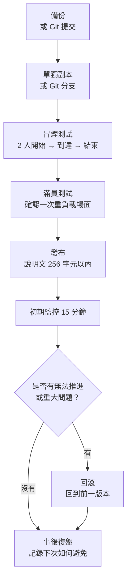

第 8 章中，我們整理了如何使用訊息、WorldIcon、SFX 和 FX，讓玩家理解下一步行動，並感受到成功回饋。不過，體驗在遊戲內能傳達清楚，並不代表它已經可以在發布後被順利遊玩。
本章會整理如何 **把 Portal 體驗以可遊玩的狀態發布，並在不破壞它的前提下營運**。標題、說明文、縮圖、公告、測試、更新流程會被當作一條連續的流程來處理，讓「做完之後」需要做的事變得清楚。

這裡不會討論大規模引流技巧，而是為了讓來到伺服器的人能不迷路地開始遊玩，並且讓你在遊玩後知道該修哪裡，來決定發布前檢查、說明文、小規模營運、更新和回滾之間的關係。

# 0 發布、託管與營運

* 讓做好的模式可以安心發布，並整理出一條即使人數很少也容易開玩的導線。
* 將標題、256 字元以內的說明、縮圖和外部公告範本化，避免說明遺漏。
* 準備一套不會把模式更新壞的營運流程：備份、驗證、發布說明、回滾。

在 Portal 裡，默默發布一個無名的個人模式，然後只靠自然流量聚集玩家，是相當困難的。
本章不是講大規模引流的方法，而是作為一份營運備忘錄來閱讀：讓來到伺服器的人能不迷路地開始，也讓你在玩家遊玩後知道該修哪裡。

# 1 發布前檢查清單（30 秒版）

* 標題：簡短的專有名稱 + 要做的事，例如：Checkpoint Rush — 啟動終端 → 防守 10 秒
* 說明：256 字元以內。盡量用簡短英文，只寫目標、人數和時間。
* 推薦人數 / 時間：例如「8-16 players / 10-15 min」
* 區域 / 載具：明確寫出是否出現
* 縮圖：不要塞滿資訊，選擇能看出氛圍和一開始該去哪裡的畫面
* 測試：用 2 人和滿員兩種情況跑通開始 → 到達 → 結束
* 日誌：記錄版本號、修改點和發布時間

> 猶豫時，只保留「目標」「推薦人數」「所需時間」「最先要按的東西」。說明最多只有 256 字元，詳細 FAQ 和更新歷史應放到外部公告裡。

## 發布前檢查（實務版）

通過 30 秒版後，發布前還要確認以下項目。

| 檢查項目 | 要看的內容 |
| ---- | ---- |
| 單人測試 | 1 人可以從開始、移動、到達一路跑到結束 |
| 雙人測試 | 只有一方按下按鈕時，雙方都能看到必要顯示 |
| 中途加入 | 中途加入者能順利生成，並看到必要 UI |
| 離開 | 參與者離開後，流程不會變成無法繼續 |
| 重新部署 | 死亡或重新部署後，UI 和 WorldIcon 不會壞掉 |
| UI 再顯示 | 選單或通知消失後，會在必要場景再次顯示 |
| 長時間運行 | 運行 15 分鐘以上，確認 SFX/FX 和 UI 不會持續堆積 |
| 載具數量 | 同時不超過 40 台。常設載具和事件載具要合併計算 |
| 日誌確認 | `PortalLog.txt` 中沒有錯誤或意外的連按記錄 |

「一個人測試時能跑，發布後卻壞了」通常會發生在中途加入、離開、重新部署這些場景。這裡不要偷懶。現在花 5 分鐘確認，比之後哭著修便宜得多。

# 2 說明文範本（256 字元以內）

在體驗說明畫面中，創作者不能自由新增自訂標籤。
另外，說明文最多只有 256 字元。
因此，Portal 內的說明以「簡短英文」為基本原則，詳細的中文或日文說明則放到外部公告裡。

## Portal 內說明範例

```text
Checkpoint Rush. Press the center terminal, follow the objective icons, then defend the final zone for 10 seconds. Recommended 8-16 players. 10-15 min. Transport vehicles only.
```

這個範例大約 180 個字元。
即使還能塞進 256 字元，也不代表這裡適合放下所有想讓玩家閱讀的資訊。
在 Portal 內，只傳達目標、人數、時間和最初行動即可。

## 要點

* 不寫「優點」，而是寫「要做什麼」。
* 先消除玩家最初的不安：在哪裡？按什麼？要幾分鐘？
* 面向社群時，最好避免只寫日語說明。Portal 內放簡短英文，詳細說明再分到 X、Discord、Blog、Note 等外部公告。
* 不要以為可以靠標籤補充。先當作創作者沒有可自由新增的標籤，用標題、說明和縮圖來傳達。

# 3 託管營運：常設與活動兩根支柱
## 常設（隨時可玩）
* 目標：讓來到伺服器的人能馬上嘗試，產生安心感。
* 設定：時間短一些（10-15 分鐘）、縮短等待、地圖 1-2 張、即使深夜也容易配對的配置。

## 活動（限定時間並提前公告）

* 目標：配合 X / Discord 等平台，讓少數玩家也能在同一時間聚在一起。
* 設定：在開始前大廳中加入教學或示範：入口圖示 → 開始按鈕 → 1 分鐘體驗。
* 公告範本：

「今晚 21:00，Checkpoint Rush 首次公開。8-16 人 / 約 12 分鐘。大廳按開始按鈕 → 跟隨標記啟動終端 → 在目標地點防守 10 秒。歡迎初次遊玩！」

# 4 縮圖與導線的有效擺法

* 縮圖：為了在小尺寸顯示時也能看清，不要塞入太多資訊。
* 導線：不要只依賴 256 字元的說明文。可以在遊戲開始時的 `OnGameStart`，或第一個 InteractPoint 處顯示簡短指引。畫面上顯示的文字註冊到 `Strings.json`，再用 `mod.Message(mod.stringkeys.xxx)` 呼叫。

縮圖不是說明書。
在顯示尺寸很小的地方，文字和詳細地圖即使放進去也沒人看得清。
詳細說明交給外部公告或遊戲內的短提示，縮圖則當作入口來使用。

# 5 「不會破壞模式的更新」基本流程（營運手冊）

1. 備份：按日期複製 ids.ts / config.ts / Script.ts / ui.ts / game.ts，例如 `2025-10-28_v1.2/`。如果使用 Git 管理，更新前先提交一次。
2. 驗證分支：新的調整一定在單獨副本或 Git 的單獨分支上進行。
3. 冒煙測試：2 人跑通開始 → 到達 → 結束。
4. 滿員測試：至少製造一次 AI / 載具 / FX 重疊的重負載場面。
5. 發布：確認說明文在 256 字元以內，版本和摘要保持最低限度。
6. 初期監控 15 分鐘：確認是否有離開率過高、延遲、無法推進。
7. 回滾：出現異常時立刻回到前一版本，縮圖和說明裡的版本標記也一起還原。
8. 事後復盤，5 分鐘也可以：記錄發生了什麼，以及下次如何避免。



> 訣竅：涉及 ID 的更新要最優先、最仔細地驗證。ID 錯誤很容易造成「完全不動」的問題。

如果能使用 Git，歷史管理會比手動複製輕鬆得多。
把發布前狀態保留為 `v1.2` 這樣的標籤或提交後，之後就不容易迷失「該還原哪些檔案」。
不過，註冊到 Portal Web Builder 的 `dist/Script.ts` 和 `dist/Strings.json` 也要能追溯到它們是由哪份原始碼產生的。

# 6 修改的安全區：從哪裡開始改比較不容易崩

* 最安全：config.ts 中的數值，例如防守秒數、冷卻時間、推薦人數顯示
* 相對安全：ui.ts 中的文案和順序，只要仍在文字 → 標記 → 效果的框架內
* 需要小心：ids.ts 的新增和修改，要用 Vitest 檢查，並在 Godot 側用 ObjIdManager 和台帳確認
* 容易出問題：Script.ts / flow.ts 的分支追加，必須重新檢查 onceIn 和 Phase 轉換

# 7 面向玩家的 FAQ（區分顯示位置）

Portal 內不一定能直接放很長的日語 FAQ。
FAQ 要分成「寫在外部公告裡的內容」和「遊戲內短暫顯示的內容」。

| 顯示位置 | 適合的內容 | 寫法 |
| ---- | ---- | ---- |
| X / Discord / Blog / Note | 詳細 FAQ、更新理由、已知問題 | 可以用日語 |
| Portal 內說明 | 目標、所需時間、推薦人數 | 以英文為主，256 字元以內 |
| 遊戲內 UI | 下一步要做什麼 | 用 `mod.Message` 顯示 `Strings.json` 的鍵 |

如果要在遊戲內顯示，比較現實的做法是在 `OnGameStart` 只顯示一次最初指引，或在按下開始用 InteractPoint 後立刻顯示短提示。
例如「按下中央終端」「前往標記」「在目標地點防守」，一次只說一件事。

* Q：怎麼開始？
  * A：按下大廳中央的 **終端（E）** 即可開始。

* Q：標記消失了。
  * A：前一個標記會在推進時關閉。沒有顯示時，請查看附近的看板。

* Q：大概要幾分鐘？
  * A：一輪大約 10-15 分鐘。

# 8 收集回饋的方法（最小配置）

人數還少的時候，與其準備表單或統計表，不如在遊玩後的閒聊中直接詢問，這更現實。
回答越麻煩，願意回答的人就越少。

一開始問下面三點就夠了。

* 哪裡迷路了？
* 哪個場面太長，或太短？
* 還想再玩一次嗎？

人數增加後，可以把「什麼時候」「在哪裡」「做了什麼」「發生了什麼」作為 bug 回報範本。
不需要一開始就以表單營運為前提。

# 9 問題與濫用對策迷你指南

* 開始按鈕連按：務必使用第 6 章的 throttle，限制為每秒 1 次。
* 到達演出連發：用 onceIn 做單向通過，並給 SFX 加冷卻。
* 無法推進：緊急停止，停用開始 → 在大廳看板顯示「調整中」 → 回滾到舊版本。
* 搗亂行為：在 Portal 標準功能範圍內明確說明，例如踢出、投票、隊伍鎖定等，並在說明中寫 1 行。

# 10 外部發布說明（範例）

Portal 內沒有足夠的位置寫詳細發布說明。
修改歷史應放在 X、Discord、Blog、Note、GitHub README 等外部位置。
Portal 側如有需要，只寫版本或簡短摘要即可。不過說明文最多 256 字元，不要硬塞更新歷史。

> v1.3（2025-10-28）
> * 將目標地點的 WorldIcon 移到更靠近入口的位置，防止玩家看丟
> * 防守計數從 10 秒調整為 12 秒，並給 SFX 加上冷卻
> * Portal description updated to 8-16 players
> 已知問題：滿員時運輸載具可能會卡住，計畫在下一版改善

# 11 發布後數字的看法（簡單版）

* 開始前離開率：玩家是否在大廳離開？→ 重新檢查說明和開始導線。
* 到達率：入口 → 目標地點的到達比例 → 檢查圖示位置和訊息順序。
* 完成率：是否能跑到最後？→ 用 config.ts 微調防守秒數和敵人密度。
* 平均遊玩時間：避免過長或過短，10-15 分鐘是大致標準。

# 結論

* 發布是體驗的完成工序。設計、說明、導線、公告和更新都屬於作品的一部分。
* 256 字元以內的英文短句 + 30 秒檢查，可以減少「沒有傳達到」的事故。
* 不破壞模式的更新流程固定為五步：備份 → 驗證 → 發布 → 監控 → 回滾。
* 不要一開始就假設大規模引流，先把少數玩家也能不迷路地遊玩的狀態做好。
* XP 可能會因情況受到限制，因此相關表達要保持柔和。
