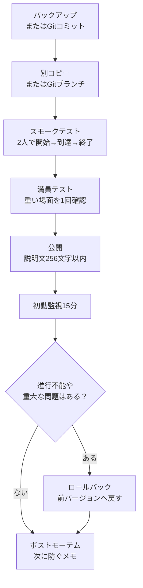

# 0 發布/託管/運營

> ―― 可玩的設計、可傳達的說明、不破壞任何內容的更新

* 毫不猶豫地發布創建的模式，創建一條即使少數人也能輕鬆玩的路徑。
* 規範標題、256字以內的描述、縮圖、外部公告，防止解釋遺漏。
* 擁有允許更新而不破壞任何內容的操作程序（備份/驗證/發行說明/回滾）。

在Portal中，單純以匿名個人模式自然流動是很難聚集人的。
請閱讀本章，不是為了吸引大規模客戶的方法，而是作為管理備忘錄，幫助遊客毫不猶豫地開始，並在玩完後知道在哪裡解決問題。

# 1 發布前清單（30 秒版本）

* 標題：簡短的專有名詞 + 要做的事（例：Checkpoint Rush — 終端機啟動 → 10 秒防禦）
*描述：256 個字元或更少。如果可以的話，用英文短句只寫出目的、人數和時間。
* 建議人數/時間：例如“8-16 人 / 10-15 分鐘”
* 區域/車輛：指定是否退出
* 縮圖：在不塞滿訊息的情況下展示氣氛和首先要去的地方的剪輯。
* 測試：開始 → 到達 → 完成有 2 種模式：2 人和滿員
* 日誌：記錄版本號碼、變更以及發布日期和時間。

> 如果您不確定，請縮小範圍為「目的」、「建議人數」、「所需時間」和「首先要按的內容」。說明最多可達 256 個字符，因此詳細的常見問題和更新歷史記錄將發佈到外部公告中。

## 發表前檢查（實用版）

一旦通過了 30 秒的版本，請在發布前檢查以下項目。

|檢查項目|景點 |
| ---- | ---- |
|單人測試|自己開始、移動、到達並完成 |
|兩人測驗|如果只有一個人按下按鈕，則雙方都會出現所需的顯示 |
|遲來的參與 |遲到的參與者可以毫不猶豫地重生並看到必要的 UI |
|離開|即使參與者離開，也並非無法繼續|
|調動| UI 和 WorldIcon 在死亡或重生後不會崩潰 |
| UI 重新顯示 |選單和通知消失後，它們會在必要時重新出現 |
|長時間運行 |運行超過15分鐘，SFX/FX和UI不再繼續增加 |
|車輛數量 |同時不超過40輛車。結合永久車輛和活動車輛 |
|檢查日誌 | `PortalLog.txt` | 中沒有錯誤或意外點擊

「我自己可以工作，但是當我發布它時就崩潰了」這種情況往往發生在中途加入、離開或重新部署時。請不要在這裡滿足任何事物。現在檢查 5 分鐘比稍後哭泣便宜。

# 2 說明模板（最多 256 個字元）

體驗描述畫面上沒有創作者可以自由添加的標籤。
此外，描述最多可達 256 個字元。
因此，Portal中的解釋基本上都是“簡短的英語”，而詳細的日語解釋則分為對外公告。

## 門戶描述範例

```text
Checkpoint Rush. Press the center terminal, follow the objective icons, then defend the final zone for 10 seconds. Recommended 8-16 players. 10-15 min. Transport vehicles only.
```

此範例大約有 180 個字元。
即使它不超過 256 個字符，它也不是放置您希望人們閱讀的所有資訊的地方。
在門戶中，僅傳達目的、人數、時間和首次行動。

## 積分

*寫下“要做的事情”而不是“優勢”。
* 消除玩家**最初的擔憂（在哪裡？按什麼？幾分鐘？）**。
* 對於社區來說，最好避免僅用日語進行解釋。入口網站內提供了簡短的英文文本，而詳細的日文解釋則發佈在 X、Discord、Blog 和 Note 等外部公告中。
* 不要假設它會補充標籤。假設沒有創建者可以自由添加的標籤，我們將透過標題、描述和縮圖來傳達這一點。

# 3 主辦營運：兩大支柱：常設與活動
## 永久（隨時播放）
* 目的：讓遊客有一種可以立即嘗試的安全感。
*設定：短（10-15分鐘），等待時間短，1-2張地圖，即使在晚上也能輕鬆匹配。

## 活動（及時公佈）

* 目的：與X/Discord等鏈接，讓少數人更容易同時聚集。
* 設定：在預啟動大廳中加入教學/示範（入口圖示 → 開始按鈕 → 1 分鐘試用）。
* 範本公告：

「今天21:00~闖關點首次上線，8-16人/約12分鐘，大廳按開始鍵→按照指示牌激活終端→目的地防守10秒，歡迎首次觀看！”

# 4 縮圖和導體的“有效放置”

* 縮圖：不要包含訊息，以便即使在小顯示幕上也能看到。
* 指南：不要只依賴 256 個字元的描述，而是在遊戲開始時或第一個 InteractPoint 處透過 `OnGameStart` 提供簡短指南。要在螢幕上顯示的文字在 `Strings.json` 註冊並在 `mod.Message(mod.stringkeys.xxx)` 呼叫。

縮圖不是“說明”。
如果圖像尺寸很小，即使包含文字或詳細地圖，也不會被讀取。
詳細說明將發佈在外部公告或遊戲內簡短展示中，並使用縮圖作為介紹。

# 5 「非破壞性更新」的基本流程（操作手冊）

1. 備份：複製 ids.ts / config.ts / Script.ts / ui.ts / game.ts 和日期（例如 2025-10-28_v1.2/）。如果您使用 Git 進行管理，請在更新之前提交。
2. 驗證分支：始終在單獨的副本或 Git 分支中進行新的調整。
3.冒煙測試：2人開始→到達→結束。
4. 擁擠測試：創造一個AI/車輛/FX重疊的場景。
5. 發布：確保描述在256個字元以內，並將版本和摘要保持在必要的最低限度。
6. 15 分鐘初步監測：是否有提款率、延遲或無法進展的情況？
7. 回溯：如果發生錯誤，立即恢復到先前的版本（同時傳回縮圖和描述中的版本符號）。
8.事後分析（5分鐘即可）：記下發生了什麼事以及下次如何預防。



> 提示：優先考慮並仔細驗證涉及 ID 的更新。 ID 錯誤往往會導致「無法工作」。

如果你能使用Git，歷史管理會比手動複製更容易。
如果您將發布前狀態保留為標記或像 `v1.2` 那樣提交，您將不會對要恢復哪些檔案感到困惑。
但是，請確保您也可以查看 Portal Web Builder 中註冊的原始程式碼 `dist/Script.ts` 和 `dist/Strings.json` 是根據哪個原始程式碼建立的。

# 6 變革的「安全區」：從哪裡開始修復它才不會崩潰？

* 安全第一：config.ts數字（防禦秒數、冷卻時間、建議人數顯示）
* 相對安全：ui.ts措詞/順序（框架內的文字→地標→效果）
* 需要注意：新增/修改 ids.ts（使用 Vitest 檢查 → 也使用 ObjIdManager 和 ledger 檢查 Godot 端）
* 容易破解：在Script.ts/flow.ts中加入分支（需要回顧onceIn和Phase轉變）

# 7 玩家常見問題（單獨顯示目的地）

並不總是可以在入口網站中放置很長的日語常見問題。
FAQ分為「外部公告中所寫的內容」和「遊戲中簡單顯示的內容」。

|顯示位置 |適合的內容 |如何寫|
| ---- | ---- | ---- |
| X / Discord / 部落格 / 註 |詳細常見問題、更新原因、已知問題 |日文很好|
|門戶說明|目的、所需時間、推薦人數 |最多256個字符，以英文為主 |
|遊戲內使用者介面 |下一步做什麼 |將 `Strings.json` 中的金鑰顯示為 `mod.Message` |

如果您想在遊戲中顯示它，現實的做法是僅在 `OnGameStart` 上顯示一次初始指導，或在按下啟動 InteractPoint 後立即短暫顯示它。
例如，一次只說一件事，例如「按中心終端」、「前往地標」或「在目的地防守」。

* 問：我如何開始？
  * A: 按大廳中央的 **終端機 (E)** 開始。

* 問：地標消失了。
  * A：在關閉前一個地標的同時繼續進行。如果沒有標誌，請檢查附近的標誌牌。

* 問：幾分鐘？
  * A: 完成一圈需要10到15分鐘。

# 8 如何收集回饋（最少集）

雖然人數很少，但玩完後立即在聊天中提問比準備表格或記分錶更實用。
你付出的努力越多，你得到的答案就越少。

首先要問以下三件事就夠了。

*你在哪裡迷路了？
* 哪些場景太長或太短？
* 你想再玩一次嗎？

隨著人數的增加，我使用「何時」、「何處」、「做什麼」和「發生了什麼」作為錯誤報告範本。
無需從一開始就假設表單操作。

# 9 防止錯誤和濫用的迷你指南

* 重複按下啟動按鈕：請務必按第 6 章中的油門（每秒一次）。
* 重複命中到達效果：單次通過+onceIn中的SFX冷卻時間。
* 無法進行：緊急停止（停用啟動→大廳標誌上顯示「正在調整」→回滾到舊版）。
* 破壞行為：在 Portal 標準功能範圍內進行澄清，例如踢球、投票、團隊鎖定等（描述中的 1 行）。

# 10 外部發行說明（範例）

Portal 中沒有地方可以寫出足夠的發行說明。
更改歷史記錄將保留在外部，例如 X、Discord、部落格、Note、GitHub README 等。
在 Portal 方面，我只在必要時編寫版本和簡短摘要。但是，描述最多可以有 256 個字符，因此不要使更新歷史記錄過於擁擠。

> v1.3 (2025-10-28)
> * 將目的地世界圖示重新定位到更靠近入口的位置（以防止失去視線）
> * 防禦計數從 10 秒調整為 12 秒，SFX 現在有冷卻時間
> * 入口網站描述更新為 8-16 名玩家
> 已知問題：運輸車加滿後可能會卡住（計畫下一個版本改進）

#11 出版後的「如何讀數字」（簡單版）

* 啟動前退出率：大廳內是否有退出者？ → 查看解釋並開始指導。
*達成率：進入→目的地到達率→圖示位置及訊息順序。
* 完成率：你完成了嗎？ → 使用 config.ts 微調防禦秒數和敵人密度。
* 平均遊戲時間：避免太長/太短（10-15 分鐘是一個很好的指導）。

# 結論

*發表是體驗的完成過程。設計、解釋、指導、公告和更新都是**作品**。
* 最多 256 個字元的英文短句 + 30 秒檢查，以防止無法傳達訊息的事故。
* 無損更新可以透過五個步驟修復：備份->驗證->發布->監控->回滾。
*我們的目標不是假設大量的顧客，而是創造一種少數人可以毫不猶豫地玩的情況。
* 對於XP，根據情況可能會有限制，我會盡量用柔和的方式來表達。
